# 慢查询优化经验

## 执行计划

```sql
CREATE TABLE single_table (
 id INT NOT NULL AUTO_INCREMENT,
 key1 VARCHAR(100),
 key2 INT,
 key3 VARCHAR(100),
 key_part1 VARCHAR(100),
 key_part2 VARCHAR(100),
 key_part3 VARCHAR(100),
 common_field VARCHAR(100),
 PRIMARY KEY (id),
 KEY idx_key1 (key1),
 UNIQUE KEY idx_key2 (key2),
 KEY idx_key3 (key3),
 KEY idx_key_part(key_part1, key_part2, key_part3)
) Engine=InnoDB CHARSET=utf8;
```

### 参数解读

#### id 序列化标识

给每个查询分配一个唯一标识符，连接查询的标识符一致。

#### select_type select查询对应的类型

* SIMPLE：简单查询，不包含 UNION 或者子查询。
* PRIMARY：查询中如果包含子查询、union、union all，最左边的 SELECT 将被标记为 PRIMARY。
    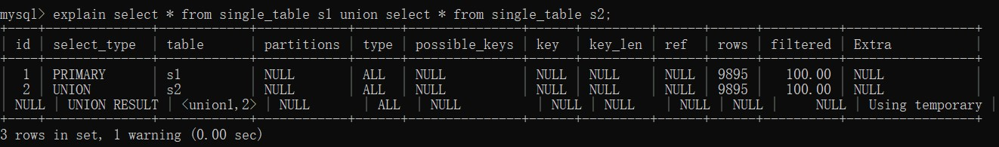
* UNION：在 UNION 或者 UNION ALL 语句中，除了最左边出现的SELECT。
* UNION RESULT：择使用临时表来完成 UNION 查询的去重工作，针对该临时表的查询的 select_type 就是 UNION RESULT。
* DEPENDENT UNION：在包含 UNION 或者 UNION ALL 的大查询中，如果各个小查询都依赖于外层查询的话，那除了最左边的那个小查询之外，其余的小查询的 select_type 的值就是 DEPENDENT UNION 。
  * 和外层有关联
        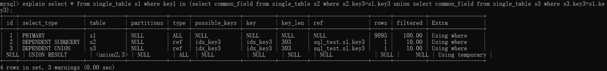
        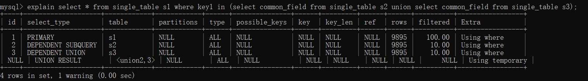
  * 和外层无关联
        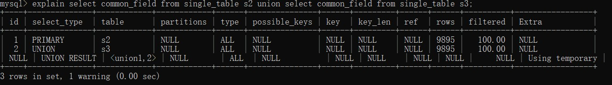
* SUBQUERY：包含子查询的查询语句不能够转为对应的 semi-join 的形式，并且该子查询是不相关子查询，并且查询优化器决定采用将该子查询物化的方案来执行该子查询时，该子查询的第一个 SELECT 关键字代表的那个查
询的 select_type 就是 SUBQUERY。
    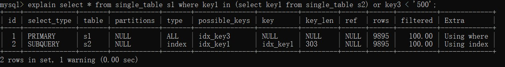
* DEPENDENT SUBQUERY：包含子查询的查询语句不能够转为对应的 semi-join 的形式，并且该子查询是相关子查询，则该子查询的第一个 SELECT 关键字代表的那个查询的 select_type 就是 DEPENDENT SUBQUERY。
    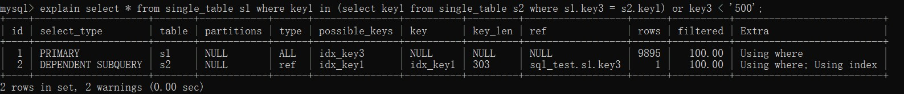
* DERIVED：查询的表使用物化的方式生成的。
    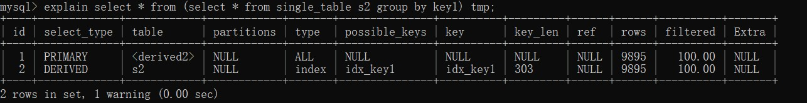
* MATERIALIZED：包含有子查询，采用物化表的形式执行后在进行连接。
    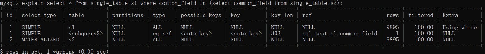

#### table 表名

#### type 描述数据匹配的类型  

* system：如果表使用的引擎对于表行数统计是精确的(如：MyISAM和MEMORY)
* const：表中最多只有一行匹配的记录，一次查询就可以找到，常用于使用主键或唯一索引的所有字段作为查询条件(唯一索引不限制NULL，对于字段NULL的查询不是const)。
* eq_ref：当连表查询时，使用主键或唯一索引的所有字段作为等值查询，匹配记录数量最多一条。
* ref：使用普通索引作为查询条件，查询结果可能找到多个符合条件的行。
* ref_or_null：使用二级索引作为连接条件且允许字段为null(index = '' or index = null)
* index_merge：当查询条件使用了多个索引时，表示开启了 Index Merge 优化，此时执行计划中的 key 列列出了使用到的索引。
* unique_subquery：子查询优化为exists，且子查询可以使用到主键进行等值匹配。
    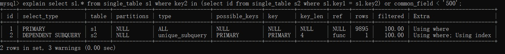
    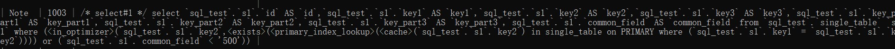
* index_subquery：子查询优化为exists，且子查询可以使用到二级索引进行等值匹配。
    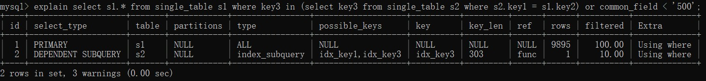
    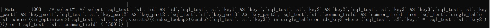
* range：对索引列进行范围查询，执行计划中的 key 列表示哪个索引被使用了。
* index：查询遍历了整棵索引树，与 ALL 类似，只不过扫描的是索引，而索引一般在内存中，速度更快(通常是条件无法命中索引，但是索引列中含有该值，可以通过遍历索引树得到结果，比遍历主索引树代价小)。

    ```sql
    -- 无法使用idx_key_part(key_part1, key_part2, key_part3) 索引 但是遍历二级索引树的代价比聚簇索引小
    select key_part2 from single_table where key_part3 = '1';
    ```

* ALL：全表扫描

#### possible_keys

可能用到的索引

#### key

实际用到的索引

#### key_len

用到的索引的最大长度，由以下决定：

* 固定长度索引列，长度是固定
* 变长类型来说，取决于使用的字符集，utf-8一个字符占用3字节，还需要2字节的变长字符长度记录。
* 允许存放NULL，需要额外1字节标记
例如：varchar(100) 使用utf-8编码时，需要 100*3+1(NULL)+2=303

#### rows

预计需要扫描的行数

* 全表：表的行数
* 索引：索引需要扫描的行数

#### filtered rows

经过条件过滤的百分比
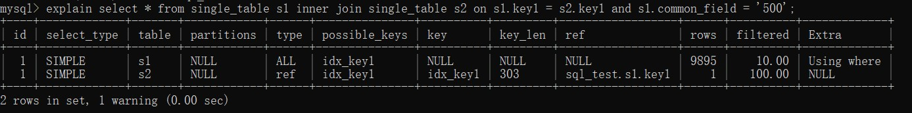
查询优化器打算把 s1 当作驱动表， s2 当作被驱动表。可以看出驱动表 s1 表的执行计划的 rows 列为 9688 ， filtered 列为 10.00 ，这意味着驱动表 s1 满足common_field = '500' 的扇出值就是 9688 × 10.00% = 968.8 ，这说明还要对被驱动表执行大约 968 次查询。

#### Extra 额外信息  

1. Using filesort
在排序时使用了外部的排序(不代表文件排序)，没有用到表内索引进行排序。filesort使用的算法是QuickSort，即对需要排序的记录生成元数据进行分块排序，然后再使用mergesort方法合并块。

* order by使用索引的前提是 使用索引的代价<全表扫描

    ```sql
    index(col1,col2)
    select * from table_name order by col1,col2; -- 因为 * ,可能不使用索引
    select id,col1,clo2 from table_name order by col1,col2; -- 使用索引
    ```

2. Using temporary
MySQL 需要创建临时表来存储查询的结果，临时表可能是内存上的临时表，也有可能是硬盘上的临时表,常见于以下情况:

* union(一定条件下不使用 union all)
* 视图+聚合操作
* order by/group by字段来自多个表  
* distinct + order by  
* insert + select
* 函数操作 group_concat()/count(distinct)

3. Using where 通过 where 过滤条件
4. Using index 索引覆盖
5. Using index condition 索引下推
6. Using join buffer (Block Nested Loop), Using join buffer (Batched Key Access)
使用缓存和对应连接算法提高查询速度
7. Using MMR
使用 mmr 策略

## 使用where条件的三种方式

3. Using index：表明查询使用了覆盖索引，不用回表，查询效率非常高。
4. Using index condition：表示查询命中索引后，如果where中还有和索引相关的判断条件，会将条件下推到存储索引层，对索引查询出的数据进行再一次的过滤再回表查询数据行，减少回表的数据量(存储引擎层)。
5. Using where：表明查询在没有走索引或者走了索引还有索引列外的条件时用where过滤数据(服务器层)。

6. Using join buffer (Block Nested Loop)：连表查询的方式，表示当被驱动表的没有使用索引的时候，MySQL 会先将驱动表读出来放到 join buffer 中，再遍历被驱动表与驱动表进行查询。

## 索引禁止/强制使用

* 禁止
select * from table_name ignore index(key_name)
* 强制使用
select * from table_name force index(key_name)

## order by后可接表达式

```sql
-- 表示在进行a排序时先判断是否 a==1，如果是，返回 1，不是返回 0，再拍完a==1后在进行a的排序，所以会把 a==1 的行放在前面，可以把 if(a==1,1,0) 看成一个列，可以加上 if(a==1,1,0) desc，会把符合条件的数据放到最后面
select * from table_name order by if(a==1,1,0),a;
```

## show profile参数

*Sending data

The thread is reading and processing rows for a SELECT statement, and sending data to the client. Because operations occurring during this this state tend to perform large amounts of disk access (reads), it is often the longest-running state over the lifetime of a given query.

## 慢查询排除处理思路

1. 慢查询发现途径

* 慢查询日志
*

2. 查看慢查询的原因

* explain 执行计划
* show warnings 查看查询语句是如何被优化的
* show profile 查询语句执行各个时间段的耗时

3. 慢查询优化思路

* 从 sql 本身入手，对 sql 中的消耗时间的操作进行优化，例如 对order by、group by、in、limit、连接、索引的选择等进行不同的方案的尝试，最大程度的利用索引。其中比较有效的优化方式：例如多表连接中，可以尝试将排序，分组，limit操作先在驱动表上执行，生成小的数据集再去连接，如果对结果没有影响，可以大大提升效率。
* 当 sql 已经优化到最小时间仍有性能问题时，可以尝试添加新的索引，或者将 sql 的操作进行切分，分成多次进行执行再将结果在应用层进行拼接，还有
可以将耗时的操作(聚合、排序)移到应用层进行，缩短 sql 的运行时间，还有利用redis等缓存工具一次缓存，调整sql查询的范围(在业务允许的情况下)，改变业务处理的方式，例如在一个业务场景中，需要用到用户信息，用户表大概有三万条，采用的方式是定时任务批量查询，并且采用本地缓存的方式，在后续用户信息有改动的时候，采用全量更新的方式去维护，可以改为将本地缓存改为放置到redis上，项目启动后分批全量查询，后序采用增量更新的方式去维护，记录数据更新的时间，用该字段作为查询条件增量查询更新。
* 最后可以从业务的架构方面进行考虑，这一步通常改动非常大，需要考虑表的设计是否合理，是否需要进行扩展，冷热数据分离、读写分离，例如
传统的监控业务采用定时任务执行sql汇总数据，可以改为增加汇总表冗余表利用mq进行触发汇总，执行 sql 直接搜索结果，减少复杂的统计操作或者后台数据监测可以另开一个离线数据库，从线上同步数据，因为后台汇总涉及到很多耗时操作，在线上的服务器进行会带来压力。

## sql优化

1. limit范围改变导致索引改变

    ```sql
    -- index (a,b,c)
    -- index (d)
    select * from table_name where a = 1 and b = 1 and c = 1 order by d limit 100
    ```

* 解析：通常选择 (a,b,c)，但是因为 limit 范围的改变执行器觉得 使用索引 (d) 先排序再筛选where效率更高，但实际上不高
* 解决办法：
a. 使 index (d) 索引失效(生产缺点，需要修改sql代码，周期长)

    ```sql
    select * from table_name where a = 1 and b = 1 and c = 1 order by d + 1 limit 100
    ```

    b. 修改索引，丢弃原来的 index(a,b,c)
    增加 index(a,b,c,d)

2. 改变处理方式
场景 ：监控业务，实时获取数据显示

* 现在处理方式： 当数据改变记录表，生成一条记录，获取数据采用定时的任务方式更新，再对表进行分析汇总数据
* 缺点： 每次改变生成一条记录，会导致表记录越来越大，且每次实时数据都需要对数据进行汇总分析，很浪费性能
* 具体场景： 在线人数，用户登录生成一条记录，下线修改状态，统计时定时+汇总
* 优化：定时+mq触发汇总+统计表
新建一个统计表对数据进行汇总，当有数据改变发消息到mq，触发进行数据汇总，定时任务只访问统计表，不需要额外操作

3. 增删查改大数据采用分次的方式
4. 多个or->in
or->o(n)
in->先排序,二分法查找->log(n)
5. 多表连接时，可以先根据where过滤驱动表，在进行连接，减少连接过程的比较次数
6. straight_join 强制sql按照表关联顺序执行
7. 优化 filesort

* 使用索引
* 在应用程序进行排序分组
* 调整参数 max_length_for_sort_data 采用合适的排序算法提升效率
mysql有两种排序算法
i. 两次传输排序
先读取行指针和需要排序的列，排序完后再读取行，因为经过排序，第二次读取会产生大量随机io，优点是占空间少，可以排序大量数据
ii. 单次传输排序
如果排序的列都来自驱动表，可以先对驱动表进行排序再关联，这时候只会出现 using filesort，否则在关联完成后，会用一张临时表存放数据，再进行排序，会出现 using temporary 和 using filesort
先读取查询所有列，再进行排序，只需要一次顺序io读取，但是排序过程很多无关的列，会占用非常大的空间，当排序数据非常大对空间消耗大
当查询列不超过 max_length_for_sort_data 时，使用 单次传输排序

12. group by 结果会自动按照分组字段进行排序，可以通过 order by null 取消这种排序，可以消除 using filesort
13. sql中的复杂聚合操作可以放到应用程序处理，减少sql的执行时间
14. union 和 union all

* union 需要去重(同个表中相同数据也会去重，应该是把两个数据库当做一个集合去处理，而不是那一个集合中的数据去判断另一个表是否有重复的)，union all 不需要考虑去重
* union + limit 先在子查询 limit 再 联合起来 limit

15. limit offset num

* 当 offset 很大时，性能越来越差，因为mysql需要找出非常多的数据从中拿取num条，但是前offset是没有用的
* 优化方案
i. 先不查询所有列，尽可能利用索引覆盖，然后在做一次自关联查出所有列(利用索引去消除排序和分组的额外消耗)

```sql
select a,b,c from table_name order by a limit m n;
select a,b,c from table_name name inner join (select id from table_name order by a limit m n) name1 on name.id = name1.id
```

ii. 利用索引列连续的特点进行快速查询

```sql
-- 查询的列中有索引列且是连续的，在每次查询后可以记录下上次的 索引值，作为范围查询条件
select  a,b,c from table_name where a between m and n;
```

iii. 汇总表
如果sql的操作比较繁杂，优化困难，可以建立一张汇总表，每次查询可以直接获取数据不需要额外总计，在数据变更时利用mq进行触发统计
17. 用索引优化max和min

* 需要满足条件 max和min的列是主键列或者有索引且是最左列

```sql
-- 普通
select max(a) from table_name where b = 1; -- 会搜索全表
-- 当a列是主键或者联合索引 (a,b)
select a from table_name use index(primary) where b = 1 order by a limit 1;
-- 主键索引，因为叶子节点携带数据，可以带where过滤
select a from table_name use index(union_index) where b = 1 order by a limit 1;
-- 联合索引，索引覆盖，不需要回表
```

## distinct 和 group by

1. distinct

```sql
当字段只有一个
select distinct a from table_name
当字段多个,全部字段相同才去重
select distinct a , b from table_name
```

2. group by

```sql
select a from table_name group by a
可以选择性去重多列,使用更加灵活,可以加having和聚合函数
```

3. 执行的顺序不同，group by 快于 distinct
4. 效率

```sql
In most cases, a DISTINCT clause can be considered as a special case of GROUP BY.
大多数情况下,两种相同
```

## insert io分析


## 查询表的行数

* count(1) 当数据非常大很耗时
* show table status 查看表的参数

## 表分区

* 当表的数据非常大，索引的维护和使用的代价非常大(会产生非常多随机IO)，所以会直接全表扫描，性能非常差，可以考虑使用分区，将数据分类存放，在查询时只需要
搜索对应分区

## in的优化

in子查询会在物化表、exists、semi连接等方案中选取成本最小的执行

```sql
CREATE TABLE single_table (
 id INT NOT NULL AUTO_INCREMENT,
 key1 VARCHAR(100),
 key2 INT,
 key3 VARCHAR(100),
 key_part1 VARCHAR(100),
 key_part2 VARCHAR(100),
 key_part3 VARCHAR(100),
 common_field VARCHAR(100),
 PRIMARY KEY (id),
 KEY idx_key1 (key1),
 UNIQUE KEY idx_key2 (key2),
 KEY idx_key3 (key3),
 KEY idx_key_part(key_part1, key_part2, key_part3)
) Engine=InnoDB CHARSET=utf8;

-- 不相关子查询 子查询和外层无关联
SELECT * FROM single_table s1 WHERE key1 IN (SELECT common_field FROM single_table s2 WHERE key3 < '2');

 -- 相关子查询  子查询和外层有关联
 SELECT * FROM single_table s1 WHERE key1 IN (SELECT key3 FROM single_table s2 WHERE s1.key2 = s2.key2);
```

### 转化为exists(5.5之前)

```sql
-- 假如 key3 上有索引，可以使用索引查询
select s1.* from single_table s1 exists (select 1 from single_table s2 where s2.common_field = s1.key1 and key3 < '2');

select s1.* from single_table s1 exists (select 1 from single_table s2 where s1.key1 = s2.key3 and s1.key2 = s2.key2);
```

### 物化表  

只适用于不相关子查询，也就是子查询和外层查询没有关联。将子查询的结果不直接作为外层查询的参数，而是放入临时表，并执行下列操作：

* 去重
* 当表的大小少于设置的 tmp_table_size 或者 max_heap_table_size，建立基于内存的MEMOEY表并建立哈希索引；若超过，则写入磁盘，并建立B+树索引。
然后将使用物化表和外层表做内连接查询数据。

### 半连接(semi join)  

半连接用于优化in子查询，语义是驱动表中一条数据在被驱动表中找到一条满足on条件记录时加入结果集，且只返回驱动表的数据(去重)。该模式适用于不相关和相关子查询。

#### 不相关子查询

因为驱动表中的数据在被驱动表中可能有多条符合条件的记录，如何对重复的记录进行去重呢？

##### Table pullout （子查询中的表上拉）  

当子查询中只有主键或者唯一索引查询条件时，主键和唯一索引的性质可以达到去重的条件。

```sql
-- key2 唯一索引
SELECT s1.* FROM single_table s1 WHERE key2 IN (SELECT key2 FROM single_table s2 WHERE key3 < '500');
```

* 执行计划
    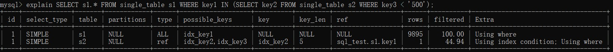
* 优化sql(直接优化为内连接)
    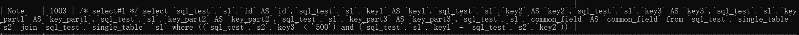

##### DuplicateWeedout execution strategy （重复值消除）

建立临时表，将记录的id作为临时表的主键，在将记录放入结果集之前，将记录主键放入临时表，添加失败则说明该结果集中存在该记录，不进行放入。

```sql
CREATE TABLE tmp (
id PRIMARY KEY
);
```

##### LooseScan execution strategy （松散索引扫描）

```sql
-- key1 索引
SELECT * FROM single_table s1 WHERE key3 IN (SELECT key1 FROM single_table s2 WHERE key1 > 'a' AND key1 < 'b');
```

通过扫描s2表的key1索引获取不重复的数值到s1中查询是否有符合的记录(正常是s1拿数据到s2中查询，该策划采用s2获取不重复数据到s1中查询)。
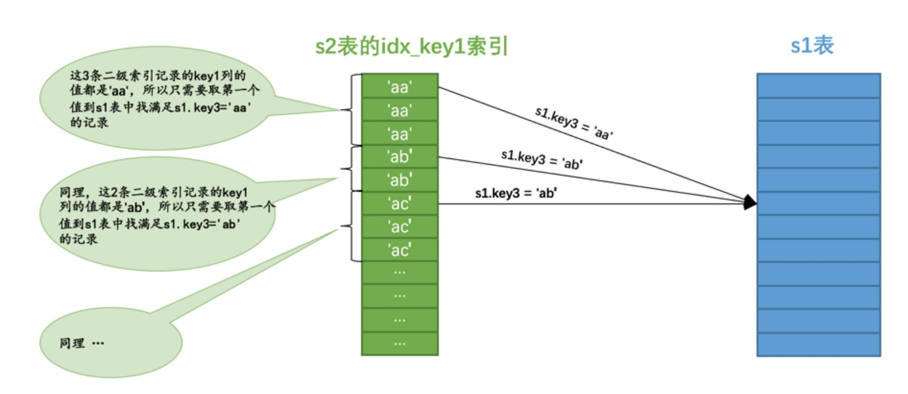

* 执行计划
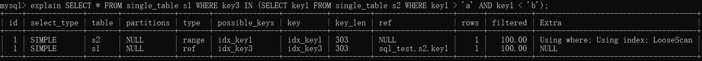
* 优化sql


##### Semi-join Materialization execution strategy

```sql
SELECT * FROM single_table s1 WHERE common_field IN (SELECT common_field FROM single_table s2 WHERE key1 < '1');
```

外层查询common_field字段无索引，子查询需要回表，物化不相关子查询(不重复)，再进行连接。

* 执行计划
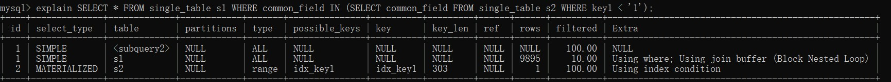

* 优化sql
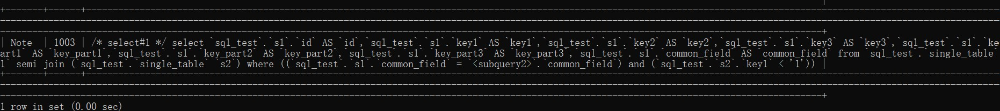

##### FirstMatch execution strategy （首次匹配）

```sql
SELECT * FROM single_table s1 WHERE key3 IN (SELECT common_field FROM single_table s2 WHERE common_field < '1');
```

子查询common_field字段无索引，外层查询key3有索引。外层s2拿一条数据到s1进行匹配，满足条件放入结果集并停止这条数据的匹配进行下一条数据。

* 执行计划
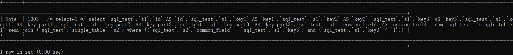

* 优化sql


#### 适用semi优化的情况

1. 该子查询必须是和 IN 语句组成的布尔表达式，并且在外层查询的 WHERE 或者 ON 子句中出现。

```sql
SELECT * FROM s1 
WHERE key1 NOT IN (SELECT common_field FROM s2 WHERE key3 = 'a');

SELECT key1 IN (SELECT common_field FROM s2 WHERE key3 = 'a') FROM s1 ;
```

2. 外层查询也可以有其他的搜索条件，只不过和 IN 子查询的搜索条件必须使用 AND 连接起来。

```sql
SELECT * FROM s1 
WHERE key1 IN (SELECT common_field FROM s2 WHERE key3 = 'a')
OR key2 > 100;
```

3. 该子查询必须是一个单一的查询，不能是由若干查询由 UNION 连接起来的形式。

```sql
SELECT * FROM s1 WHERE key1 IN (
SELECT common_field FROM s2 WHERE key3 = 'a' 
UNION
SELECT common_field FROM s2 WHERE key3 = 'b'
);
```

4. 该子查询不能包含 GROUP BY 或者 HAVING 语句或者聚集函数。

## 分析系统优化方案

* 数据分离：监听业务数据库binlog，拉取数据(架构可以采用一主多从或树状结构(根据数据时效性选择数据库节点分析，实效性要求大层数低))
* 选型：列式存储数据库
* 处理方式：预先计算(物化视图)

转载自《MySQL是怎样运行的：从根儿上理解MySQL》
