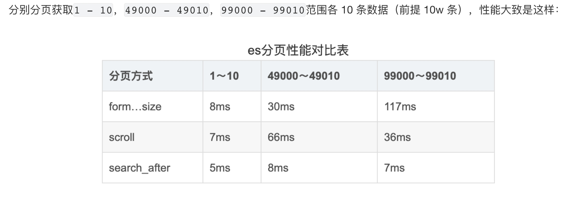

# 优化
## 读优化

### 性能查询方式
* profile

### 优化切入点
* 磁盘/内存
* 分片数
* mapping
* routing
* 旧数据迁移
* 查询方式优化

### 查询方式优化

### 不使用_id做排序、聚合操作
* _id字段不支持列式存储，如果使用_id作为排序、聚合操作，es会使用fielddata机制把_id字段数据加载到内存中构造正排索引，再去处理数据，这份数据存储在内存中且不会被gc回收，随着时间逐渐增大，会触发内存熔断保护机制，导致查询性能大幅下降。
* 如果需要唯一字段作为排序，可以选择业务唯一属性的字段并设置列式存储。

#### 仅查询需要的字段
 
#### terms参数过多
* terms参数个数小于16个，优化为bool+should，通过直接合并倒排索引方式
* terms参数个数大于16个，构建BitSet，这一步是循环操作，很耗时间
* terms参数个数大于16个改写为should+term+minShouldMatch
```es
// 数据量级 A 100 B 200 C 1亿
// 需要先把C的terms中符合条件的docid查询出来，使用的是遍历数组中参数，找出对应posting list，用BitSet结果合并，这个过程非常浪费时间，合并C的过程需要1亿次操作。
GET /test/_search
{
  "query": {
    "bool": {
      "must": [
        {
          "range": {
            "A": {
              "gt": 100
            }
          }
        },
        {
          "term": {
            "B": 1
          }
        },
        {
          "terms": {
            "C": [1, 2, 3, 4, 5, 6, 7, 8]
          }
        }
      ]
    }
  }
}

// 改写后
// es会查出A、B、C中各个参数符合的posting list，然后会计算各个数据集的cost，从小的数据集开始合并数据，这里减少了合并C条件posting list的成本，因为是and的关系，
会以A的数据集为标准，判断A中docid是否存在B和C中，最多需要对比100次。
GET /test/_search
{
  "query": {
    "bool": {
      "must": [
        {
          "range": {
            "A": {
              "gt": 100
            }
          }
        },
        {
          "term": {
            "B": 1
          }
        },
        {
          "bool": {
            "should": [
              { "term": { "C": 1 } },
              { "term": { "C": 2 } },
              { "term": { "C": 3 } },
              { "term": { "C": 4 } },
              { "term": { "C": 5 } },
              { "term": { "C": 6 } },
              { "term": { "C": 7 } },
              { "term": { "C": 8 } }
            ],
            "minimum_should_match": 1
          }
        }
      ]
    }
  }
}
```
[Elasticsearch的TermsQuery慢查询分析和优化](https://developer.aliyun.com/article/780345)
[Terms query slowing down at specific size](https://discuss.elastic.co/t/terms-query-slowing-down-at-specific-size/288005)

#### 不返回精确total_hit
total_hit表示满足搜索条件的文档总数。
* 大数据集上计算准确total_hit需要遍历所有文档。
* es 7.0开始，通过 track_total_hits 参数来控制是否需要精确计算 total_hits。这个参数可以设置为 true、false 或一个数字(计算总数，但只到指定的限制。如果匹配的文档超过这个数字，total_hits 将返回这个数字，并且 relation 将是 gte（表示实际匹配的文档数可能更多）)：

#### 避免使用停用词
a、the等，使用规则过滤掉


#### 异步搜索
提交搜索任务后返回任务id，用户可以查看任务状态，任务完成后读取数据，适用于大规模数据集查询。
* 创建任务
```es
POST /index/_async_search
{
  "query":{
    "match":{
      "field":"value"
    }
  }
}

```

* 查询任务状态
```es
GET /_async_search/status/<id>
```

* 获取查询结果
```es
GET /_async_search/<id>
```

* 删除结果
```es
DELETE /_async_search/<id>
```

#### 不适用_id做聚合/排序
_id没有列存，大数据量很容易oom


#### filter
* 使用query-bool-filter组合取代普通query。query子句用于回答“这个文档与此子句匹配的程度”，会进行相关性的算分；而filter子句用于“这个文档是否匹配这个子句”，不需要相关分算分，还能用缓存获得更好的性能。   
[Query and filter context](https://elastic.co/guide/en/elasticsearch/reference/current/query-filter-context.html)
* 使用filter可以提升性能，也可能搞垮集群
频繁使用的filter结果会被缓存(5次)，如果结果集很大，高并发下缓存频繁逐出，会导致集群负载增大。
可以使用请求中request_cache控制是否缓存结果。

#### 深度分页
##### from+size
数据条数最大值10000

Scroll->适合非实时大量数据查询
```es
/twitter/tweet/_search?scroll=1m
{
    "size": 100,
    "query": {
        "match" : {
            "title" : "elasticsearch"
        }
    }
}


POST /_search?scroll=1m
{
    "scroll_id":"XXXXXXXXXXXXXXXXXXXXXXX I am scroll id XXXXXXXXXXXXXXX"
}


```

需要传入scroll_id，不允许跳页，查询后存储数据doc_id快照，快照不允许修改，有缓存时间，每次请求会刷新，会占用磁盘空间和文件句柄，es中search.max_open_scroll_context设置默认scroll为500个。

update_by_query、delete_by_query会使用scroll

###### 缺点

* 占用资源，scroll数量有限

* 非实时的数据查询

* 不可跳页


##### Scroll 
Sliced->Scroll的并发模式


##### Search After->适合实时大量数据查询

* 需要至少指定一个唯一的不重复字段进行排序(可以是多个字段组合)，这是因为如果字段值有重复，那么同一个排序位置可能对应多个不同的文档，这会导致使用 search_after 时无法准确地定位到“下一页”的起始位置。

* 每次查询需要携带前一个结果中sort字段的值作为条件，每个shard只需要返回size的数据，不需要返回全量数据。

* 性能优于scroll，在查询过程进行过滤，不需要查询全量数据，因此可以实时查询

* 不可跳页

```es
// 首次查询
POST twitter/_search
{
    "size": 10,
    "query": {
        "match" : {
            "title" : "es"
        }
    },
    "sort": [
        {"date": "asc"},
        {"_id": "desc"}
    ]
}

// 返回结果
{
  "hits": {
    "hits": [
      {
        "_id": "1",
        "_source": {
          "title": "News Article 1",
          "publish_date": "2021-01-01"
        },
        "sort": ["2021-01-01", "1"]
      },
      {
        "_id": "2",
        "_source": {
          "title": "News Article 2",
          "publish_date": "2021-01-02"
        },
        "sort": ["2021-01-02", "2"]
      },
      // 更多文档...
      {
        "_id": "5",
        "_source": {
          "title": "News Article 5",
          "publish_date": "2021-01-05"
        },
        "sort": ["2021-01-05", "5"]
      }
    ]
  }
}

// 二次查询
GET twitter/_search
{
    "size": 10,
    "query": {
        "match" : {
            "title" : "es"
        }
    },
    "search_after": ["2021-01-0", "5"],
    "sort": [
        {"date": "asc"},
        {"_id": "desc"}
    ]
}


```


##### 性能对比



所以综上来看，选取哪种方式完全取决于使用场景+量级评估，所以简单做一个总结

* 流量相对较低的列表查询，需要制定页数的，不论带不带搜索条件，可以使用 from + size 的方式进行分页查询

* 流量相对较低的全量数据扫描，无特别页数跳转场景，使用 Scroll 的方式

* 流量相对较高的滚动翻页，无特别页数跳转场景，考虑采用 Search After 的方式

* 对于流量更高的场景，需要更复杂的评估和架构设计，不要假设 ES 的稳定性能符合预期


##### 向前翻页
通过翻转排序方式来实现：正序search_after该页的最后一条数据 id 为下一页，则逆序search_after该页的第一条数据 id 则为上一页。

[京东面试题：ElasticSearch 深度分页解决方案](https://xie.infoq.cn/article/f26cf68a299b246a6ff5bf945)   
[Elasticsearch内核解析 - 查询篇](https://developer.aliyun.com/article/771575)
[Elasticsearch之SearchScroll原理剖析和优化](https://developer.aliyun.com/article/771575)

### routing
如果不设置routing，默认安装doc_id路由，每次请求需要转发所有分片，可以根据业务指定路由规则，查询时直接指定到对应分片。

### mapping
#### numeric(数字类型)->keyword
* 5.0之后，numeric类型字段采取了更适合范围查找的Block K-d Tree，而不是倒排索引，所以如果我们是精确的匹配的话，用keyword效率更加好。
需要range查询的字段还是保持numeric类型，其他numeric的字段都可以设置成keyword来使用倒排索引来提升检索效率。
* 底层存储结构是 BKD Tree 精准term匹配慢的原因：因为数值型字段在5.x里而是以value为序，将docid切分到不同的block里面，查询出来的docid列表不是有序的，需要构造bitSet合并，过程缓慢(如果是倒排索引，存储的是顺序的docid列表，可以利用快表加速合并)
* 使用range快的原因：从ES5.4开始，引入了indexOrDocValuesQuery作为对RangeQuery的优化。这个Query包装了PointRangeQuery和SortedSetDocValuesRangeQuery，并且会根据Rang查询的数据集大小，以及要做的合并操作类型，决定用哪种Query。 如果Range的代价小，可以用来引领合并过程，就走PointRangeQuery，直接构造bitset来进行迭代。 而如果range的代价高，构造bitset太慢，就使用SortedSetDocValuesRangeQuery。 这个Query利用了DocValues这种全局docID序，并包含每个docid对应value的数据结构来做文档的匹配。 当给定一个docid的时候，一次随机磁盘访问就可以定位到该id对应的value，从而可以判断该doc是否match。 因此它非常适合从其他查询条件得到的一个小结果集作为迭代起点，对于每个docid一次调用其内部的matches()函数判断匹配与否。也就是说， 5.4新增的indexOrDocValuesQuery将Range查询过程中的顺序访问任务扔给Block k-d Tree索引，将随机访任务交给doc values。这个优化只针对RangeQuery！对于TermQuery，因为实际的复杂性，还未做类似的优化，也就导致同样的字段，Term和Range Query的性能差异极大。
[number?keyword?傻傻分不清楚](https://www.jianshu.com/p/e9be6740b724)

#### enable&&index
1. enable:false
* nested、object类型可以设置
* 不会存储、索引这些数据，会被过滤掉  
* 不需要这些字段，为什么还要设置字段？
  数据可能先会经过外部系统处理，外部系统依赖这些数据，才会写入es。

2. index:false
* 数据会被存储在_source中，不会建立倒排索引，无法用于搜索、排序、聚合
* 只能作为数据在查询后返回


### 参数
1. 系统参数
#### refresh_interval
refresh刷新间隔，默认1s，在批量导入数据时，会增大提高索引性能。
* 大小，io成本增大

#### translog
同步指每写入完一条数据后，实时 log 信息刷盘。异步指等log堆积到一定数量或等待一段时间后再刷盘。带来的风险是实例故障时，该部分数据可能会丢失。

2. 接口参数
#### max_concurrent_shard_requests
search请求携带参数，用于控制请求可以同时向多少个分片并发查询，默认5.

#### realtime
get、mget请求的参数，标志是否搜索实时数据，true会搜索事务日志中还没有刷盘的数据，返回最新版本，会有性能开销；false不会搜索日志，返回的不是实时数据。