## Go协程调度器

g->goroutine   
m->thread 核心线程  
p->processor   
go的gmp中协程：核心线程=M:N

#### 协程的优势

* 线程是由CPU去调度的，上下文切换需要耗费资源，协程由应用程序调度，一个线程对应多个协程，减少了线程的切换

* 在特定情况下使用线程执行小的任务浪费资源，线程需要占用资源以M为计量单位，协程只需要占用K为单位的资源

* 协程相当于在线程的基础上加大并发量

#### 协程的劣势

* 多线程充分发挥多CPU的好处，但是一个线程上并发多个协程无法利用多CPU

#### 被淘汰的gm调度器

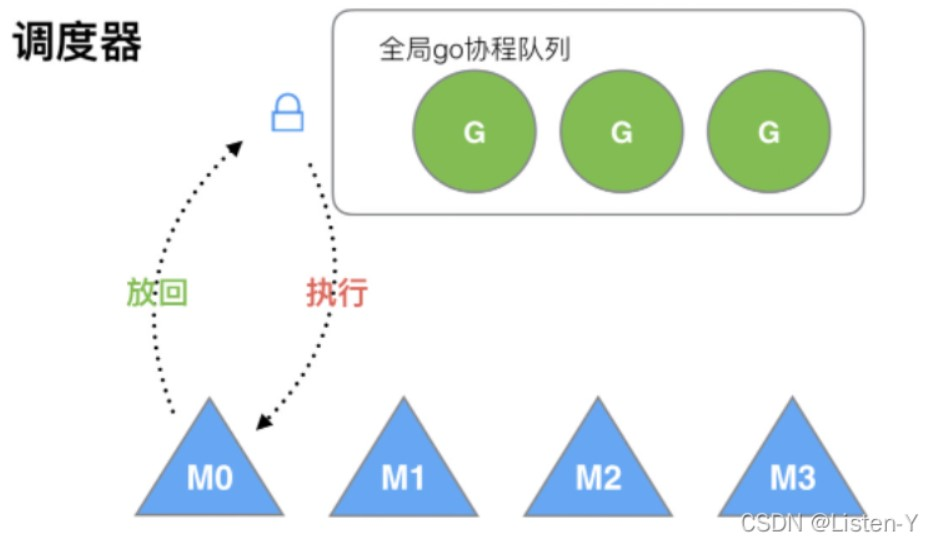

* 多个核心线程中一个全局协程队列中获取协程并执行，涉及到并发安全问题，需要对全局队列加锁

* 创建、调度、销毁都需要竞争锁

* 一个线程上的协程创建的协程需要由另一个线程执行，造成很差相关性(缓存？)，协程创建出来的有相关性，最好在同一个线程上执行

#### gmp调度器

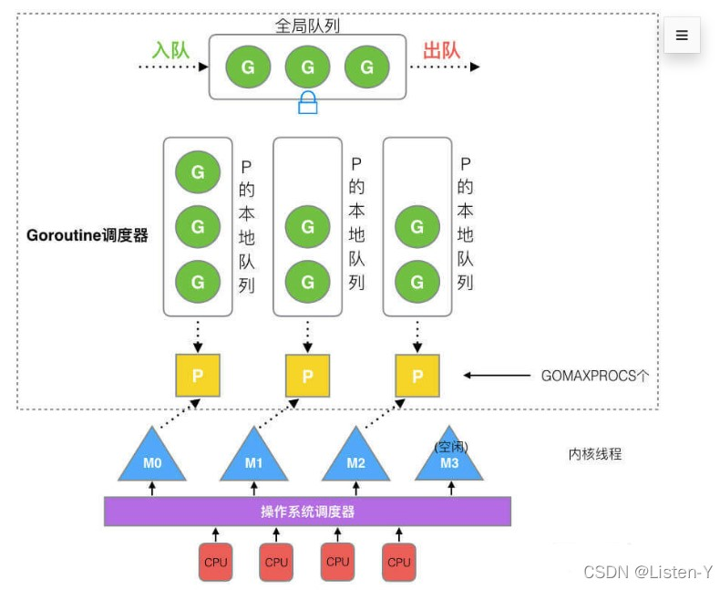
调度过程：

1. 全局队列中包含有等待运行的协程

2. processor中包含有一个本地队列，存放等待运行的线程，数量最多为256个，协程创建子协程时，优先放入线程持有的processor中，当协程数量达到限制后，会将一半数量的协程放入全局队列，当协程数量为0时，会尝试从别的processor中获取一半或者全局队列获取一批协程继续执行

3. 线程在执行协程时必须获取processor，执行本地队列中协程，当协程产生系统调用时，会释放processor，交由其他线程继续执行剩下的协程

#### 增加的processor如何解决历史问题？

* 每个processor中包含一个协程队列，减少了全局队列的资源竞争
* 如果协程创建了子协程，优先会放入同一个processor中的本地队列由同一个线程执行

#### gmp调度的机制

* work stealing
当processor中协程数量为0，会尝试从其他processor或者全局队列中获取
* hand off
当线程执行的协程因为系统调用而产生阻塞时，释放processor由其他线程继续执行
* go中每一个协程只能占用CPU 10ms的时间，超过将回到全局队列中继续等待，防止饥饿
原理：  
    go程序启动时会首先创建一个特殊的内核线程 sysmon，用来监控和管理，其内部是一个循环：

    1. 记录所有 P 的 G 任务的计数 schedtick，schedtick会在每执行一个G任务后递增
        如果检查到 schedtick 一直没有递增，说明这个 P 一直在执行同一个 G 任务，如果超过10ms，就在这个G任务的栈信息里面加一个 tag 标记
    2. 然后这个 G 任务在执行的时候，如果遇到非内联函数调用，就会检查一次这个标记，然后中断自己，把自己加到队列末尾，执行下一个G
    3. 如果没有遇到非内联函数 调用的话，那就会一直执行这个G任务，直到它自己结束；如果是个死循环，并且 GOMAXPROCS=1 的话。那么一直只会只有一个 P 与一个 M，且队列中的其他 G 不会被执行！

#### P 和 M 的个数问题

* P 的数量：

    由启动时环境变量 $GOMAXPROCS 或者是由 runtime 的方法 GOMAXPROCS() 决定。这意味着在程序执行的任意时刻最多只有 $GOMAXPROCS 个 goroutine 在并行执行。

* M 的数量:

    go 语言本身的限制：go 程序启动时，会设置 M 的最大数量，默认 10000. 但是内核很难支持这么多的线程数，所以这个限制可以忽略。
    runtime/debug 中的 SetMaxThreads 函数，设置 M 的最大数量
    一个 M 阻塞了，会创建新的 M。

#### Go 调度器调度场景过程全解析

1. P 拥有 G1，M1 获取 P 后开始运行 G1，G1 使用 go func() 创建了 G2，为了局部性 G2 优先加入到 P1 的本地队列
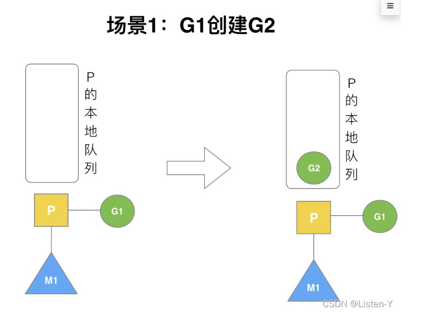

2. G1 运行完成后 (函数：goexit)，M 上运行的 goroutine 切换为 G0，G0 负责调度时协程的切换（函数：schedule）。从 P 的本地队列取 G2，从 G0 切换到 G2，并开始运行 G2 (函数：execute)。实现了线程 M1 的复用。
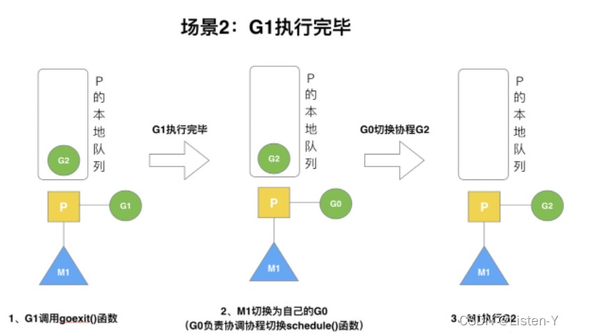

3. 假设每个 P 的本地队列只能存 4 个 G。G2 要创建了 6 个 G，前 4 个 G（G3, G4, G5，G6）已经加入 p1 的本地队列，p1 本地队列满了。
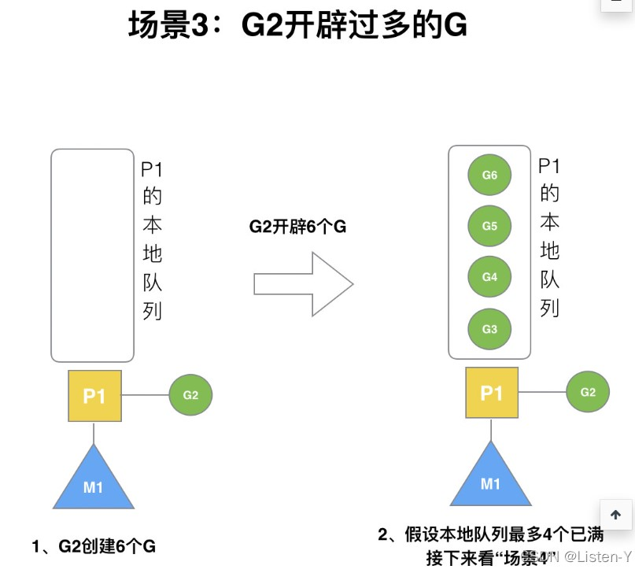

4. G2 在创建 G7 的时候，发现 P1 的本地队列已满，需要执行负载均衡 (把 P1 中本地队列中前一半的 G，还有新创建 G7 转移到全局队列)。实现中并不一定是新的 G7，如果 G7 是 G2 之后就执行的，会被保存在本地队列，利用某个老的 G 替换新 G7 加入全局队列。这些 G 被转移到全局队列时，会被打乱顺序。所以 G3,G4,G7 被转移到全局队列。
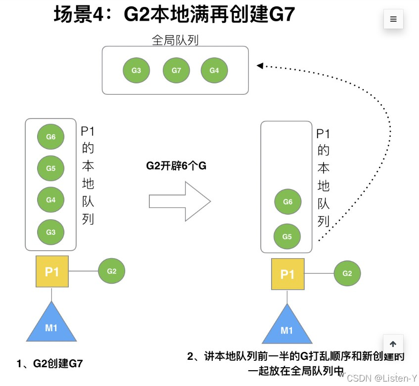

5. G2 创建 G8 时，P1 的本地队列未满，所以 G8 会被加入到 P1 的本地队列。G8 加入到 P1 点本地队列的原因还是因为 P1 此时在与 M1 绑定，而 G2 此时是 M1 在执行。所以 G2 创建的新的 G 会优先放置到自己的 M 绑定的 P 上。
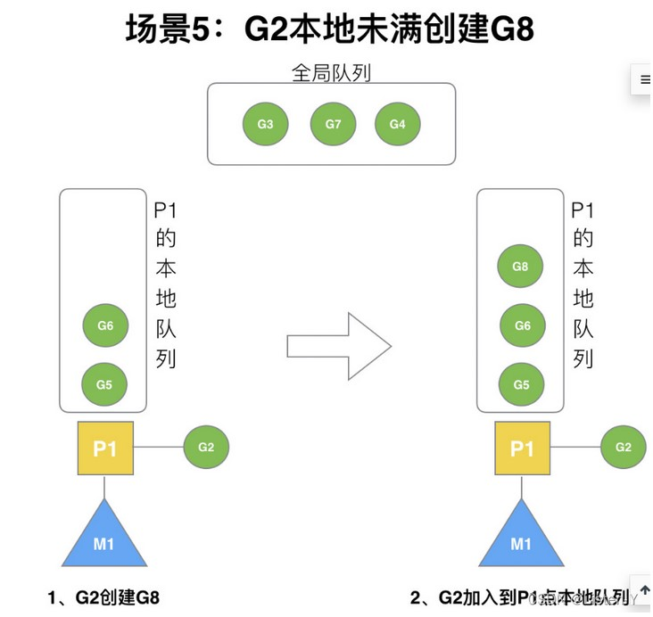

6. 在创建 G 时，运行的 G 会尝试唤醒其他空闲的 P 和 M 组合去执行。假定 G2 唤醒了 M2，M2 绑定了 P2，并运行 G0，但 P2 本地队列没有 G，M2 此时为自旋线程（没有 G 但为运行状态的线程，不断寻找 G）
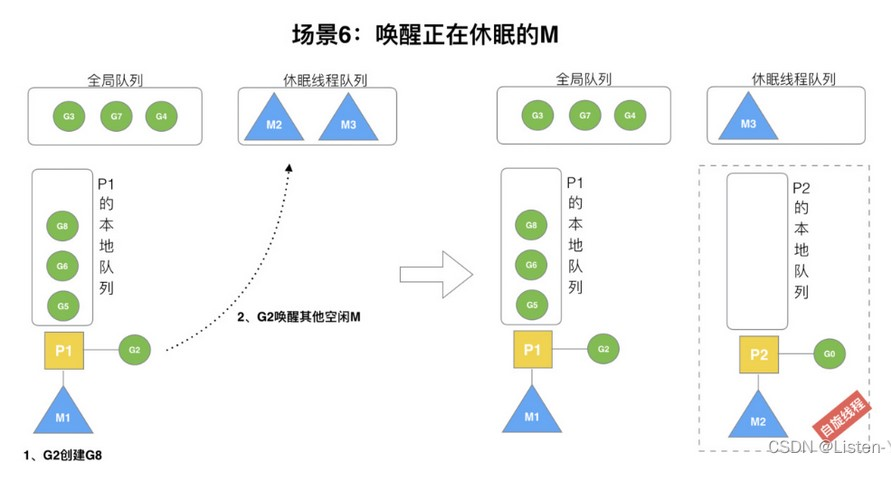

7. 直到G2把G3、G7、G4f放到全局队列 (简称 “GQ”) ，并释放锁后，M2的G0获取到全局队列的锁，把全局队列中的G拉倒自己的本地队列中。取一批 G 放到 P2 的本地队列（函数：findrunnable()）。M2 从全局队列取的 G 数量符合下面的公式：n=min(len(GQ)/GOMAXPROCS + 1, len(GQ/2))
至少从全局队列取 1 个 g，但每次不要从全局队列移动太多的 g 到 p 本地队列，给其他 p 留点。这是从全局队列到 P 本地队列的负载均衡。假定我们场景中一共有 4 个 P（GOMAXPROCS 设置为 4，那么我们允许最多就能用 4 个 P 来供 M 使用）。所以 M2 只从能从全局队列取 1 个 G（即 G3）移动 P2 本地队列，然后完成从 G0 到 G3 的切换，运行 G3。
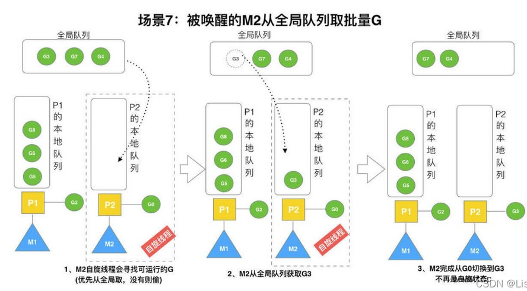

8. 假设 G2 一直在 M1 上运行，经过 2 轮后，M2 已经把 G7、G4 从全局队列获取到了 P2 的本地队列并完成运行，全局队列和 P2 的本地队列都空了，如场景 8 图的左半部分。全局队列已经没有 G，那 m 就要执行 work stealing (偷取)：从其他有 G 的 P 哪里偷取一半 G 过来，放到自己的 P 本地队列。P2 从 P1 的本地队列尾部取一半的 G，本例中一半则只有 1 个 G8，放到 P2 的本地队列并执行。
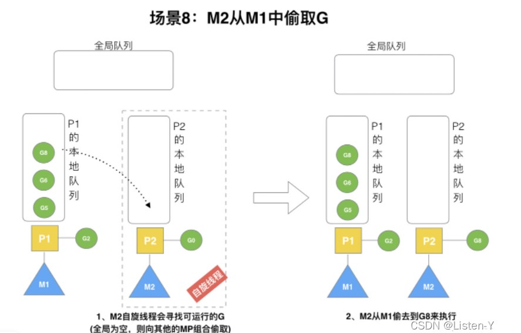

9. G1 本地队列 G5、G6 已经被其他 M 偷走并运行完成，当前 M1 和 M2 分别在运行 G2 和 G8，M3 和 M4 没有 goroutine 可以运行，M3 和 M4 处于自旋状态，它们不断寻找 goroutine。为什么要让 m3 和 m4 自旋，自旋本质是在运行，线程在运行却没有执行 G，就变成了浪费 CPU. 为什么不销毁现场，来节约 CPU 资源。因为创建和销毁 CPU 也会浪费时间，我们希望当有新 goroutine 创建时，立刻能有 M 运行它，如果销毁再新建就增加了时延，降低了效率。当然也考虑了过多的自旋线程是浪费 CPU，所以系统中最多有 GOMAXPROCS 个自旋的线程 (当前例子中的 GOMAXPROCS=4，所以一共 4 个 P)，多余的没事做线程会让他们休眠。（类似java的线程池的核心线程数，是不会进行销毁的，但是多余线程会进行销毁）
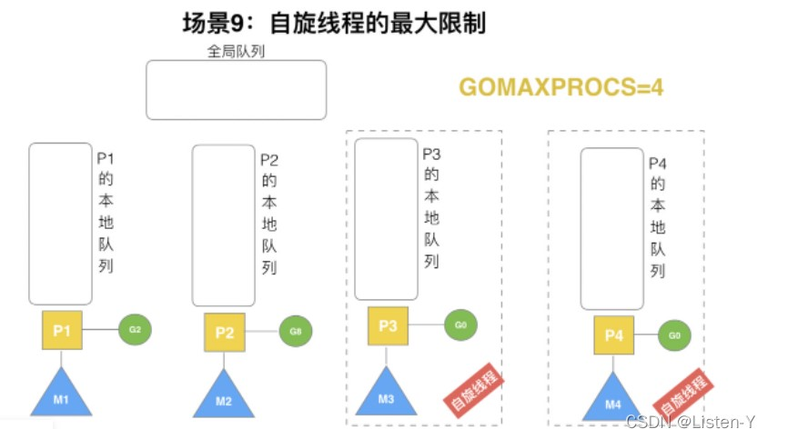
10. 假定当前除了 M3 和 M4 为自旋线程，还有 M5 和 M6 为空闲的线程 (没有得到 P 的绑定，注意我们这里最多就只能够存在 4 个 P，所以 P 的数量应该永远是 M>=P, 大部分都是 M 在抢占需要运行的 P)，G8 创建了 G9，G8 进行了阻塞的系统调用，M2 和 P2 立即解绑，P2 会执行以下判断：如果 P2 本地队列有 G、全局队列有 G 或有空闲的 M，P2 都会立马唤醒 1 个 M 和它绑定，否则 P2 则会加入到空闲 P 列表，等待 M 来获取可用的 p。本场景中，P2 本地队列有 G9，可以和其他空闲的线程 M5 绑定。
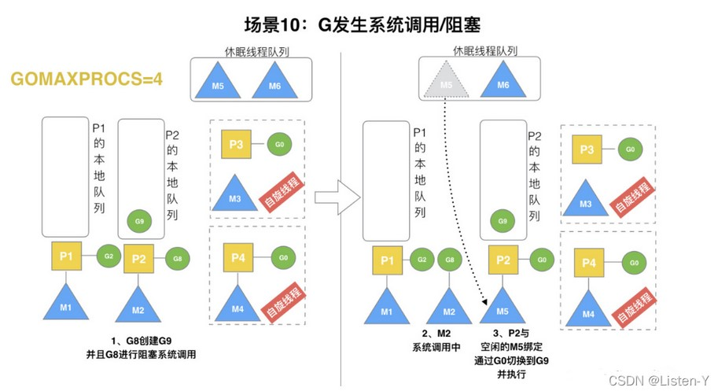

11. G8 创建了 G9，假如 G8 进行了非阻塞系统调用。M2 和 P2 会解绑，但 M2 会记住 P2，然后 G8 和 M2 进入系统调用状态。当 G8 和 M2 退出系统调用时，会尝试获取 P2，如果无法获取，则获取空闲的 P，如果依然没有，G8 会被记为可运行状态，并加入到全局队列，M2 因为没有 P 的绑定而变成休眠状态 (长时间休眠等待 GC 回收销毁)。
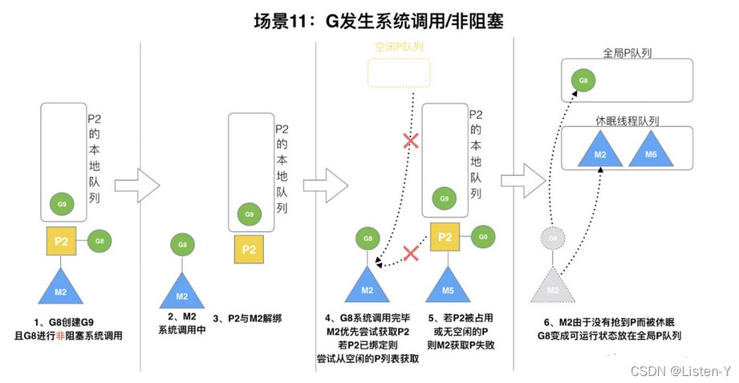

[Golang协程调度原理( G、M、P)](https://www.cnblogs.com/wt645631686/p/13915625.html)
[Go~并发之GMP原理与调度](https://blog.csdn.net/Shangxingya/article/details/124064227)
