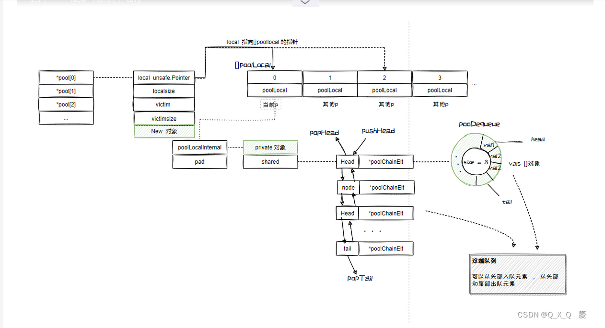

# gopool

## 亮点

* 充分利用GMP架构的特点，同个P中协程执行无资源竞争，每个P独享一个pool，如果找不到再从其他P中获取缓存的数据，减少了并发竞争。
* GC时不会直接回收pool中的数据，作为备份缓存起来，下次GC不再使用才会彻底回收。

[Golang 的 sync.Pool设计思路与原理](https://www.dandelioncloud.cn/article/details/1486295160224075777)
[go源码解读-sync.pool](https://blog.csdn.net/qq_40484416/article/details/130363992)
