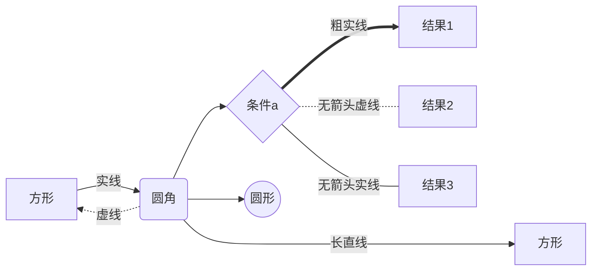

# sync.Map

## 设计思想

* 空间换时间，冗余了一份只读数据(没有增量数据，存量会修改)，提高读效率
* 只读数据double check的思想

## 优劣势

* 适合读多写少的场景，适合作为小型缓存容器使用
* 因为冗余了数据用于无锁读，不合适存放大量数据

## 触发读写数据置换条件

* miss的次数大于等于写数据的大小
* 调用Range方法，读写数据不一致

```mermaid
graph LR
A[方形] 
B(圆角)
C{条件a}
D[结果1]
E[结果2]
F((圆形))
G[方形]
X[结果3]
A --实线--> B
B -.虚线.-> A
B --长直线----> G
B --> C
C ==> |粗实线| D
C -.无箭头虚线.- E
C --无箭头实线--- X
B --> F
```
