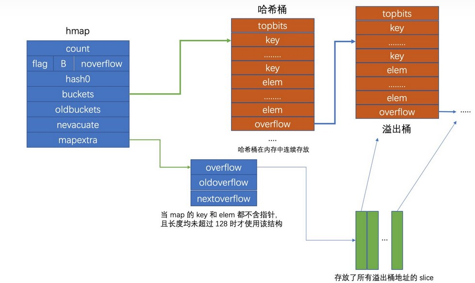
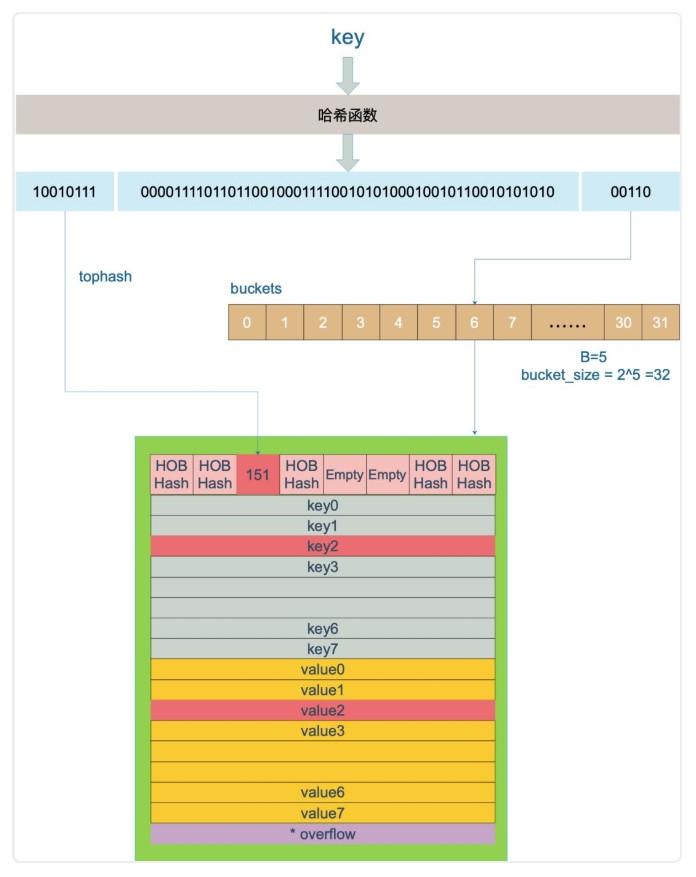
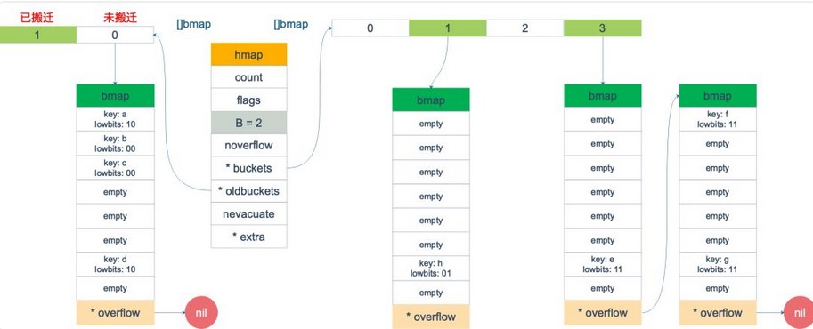
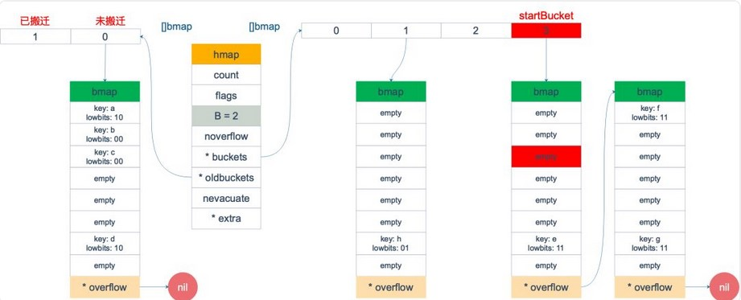
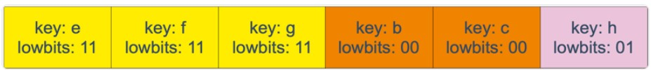
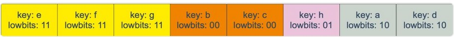
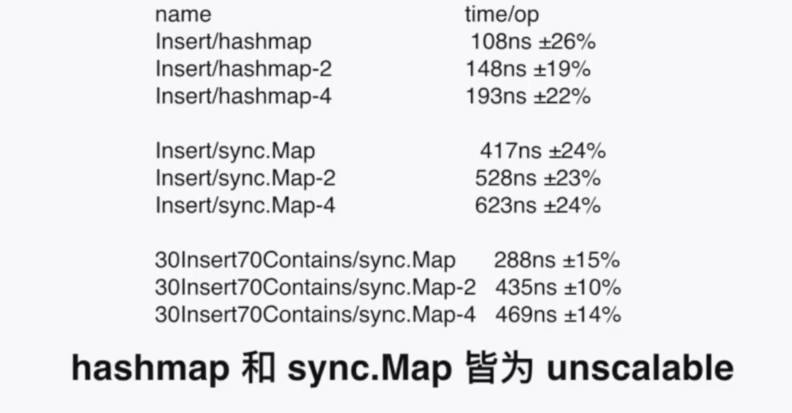

# Map



## 使用说明

## 深拷贝(key+value)

## 底层数据结构

```go
type hmap struct {
 // 数据个数
 count     int // # live cells == size of map.  Must be first (used by len() builtin)
 flags     uint8
 B         uint8  // log_2 桶的数量 = 2^B
 noverflow uint16 // 溢出的桶的近似数
 hash0     uint32 // hash seed

 buckets    unsafe.Pointer // 底层数据数组指针  指向bmap[]
 oldbuckets unsafe.Pointer // 旧的数组指针 扩容时才不为nil
 nevacuate  uintptr        // 扩容进度
 extra *mapextra 
}

//只有在map被标记为不包含指针才会使用该结构
type mapextra struct {
 overflow    *[]*bmap    //溢出指针
 oldoverflow *[]*bmap
 nextOverflow *bmap
}

//源码中只包含一个字段，实际编码完成后会增加更多属性
type bmap struct {
 tophash [bucketCnt]uint8
}

type bmap struct {
   topbits  [8]uint8         //key hash高8位的值，通过比较该值判断是否存在key
   keys     [8]keytype         //key和value分开存放
   values   [8]valuetype
   pad      uintptr
   overflow uintptr         //每个桶只能存放8个数据，超出新建新的桶，该字段指向溢出的桶
}

```

* 当key和value都不包含指针且key和value的大小都小于128字节，会将该map标记为不含指针，在gc回收时不需要扫描整个map(不包含指针，不需要继续向下标记)，因为bmap结构中包含由overflow溢出指针，所以将该字段转移到mapextra结构中存放。
* topbits用于存放key的hash的前8位值

* tophash的特殊值

  ```go
  emptyRest      = 0 // 这个位置是空的，且后续位置没有数据，可以提高遍历的效率
  emptyOne       = 1 // 这个位置是空的
  evacuatedX     = 2 // 扩容过程中 表示该位置的数据迁移到新的桶中相同位置
  evacuatedY     = 3 // 数据迁移到高位
  evacuatedEmpty = 4 // 该位置是空的，迁移完成
  minTopHash     = 5 // tophash的最小正常值
  ```

* 根据 key 的不同类型，编译器还会将查找、插入、删除的函数用更具体的函数替换，以优化效率：
  * mapaccess1_fast32(t *maptype, h*hmap, key uint32) unsafe.Pointer
  * mapaccess2_fast32(t *maptype, h*hmap, key uint32) (unsafe.Pointer, bool)
  * mapaccess1_faststr(t *maptype, h*hmap, ky string) unsafe.Pointer
  * mapaccess2_faststr(t *maptype, h*hmap, ky string) (unsafe.Pointer, bool)

## 扩容

### 扩容条件

* 装载因子=map中元素的个数/map的容量 > 负载因子(默认6.5)
* 溢出桶的数量过多
  map的容量 = 2^B
  * 当 B < 15，溢出桶的数量大于 2^B
  * 当 B >= 15，溢出桶的数量大于 2^15

```go
  //在插入后判断是否需要扩容
 if !h.growing() && (overLoadFactor(h.count+1, h.B) || tooManyOverflowBuckets(h.noverflow, h.B)) {
  hashGrow(t, h)
  //...
 }

  loadFactorDen = 2
  loadFactorNum = 13
  //map中元素的数量大于 bucketCnt => 相当于至少有一个桶放了两个元素的情况下才发起扩容，也就是说已经有hash冲突
  //bucketShift(B) => 1<B
  //  count / bucketShift(B) > 13 / 2
  func overLoadFactor(count int, B uint8) bool {
 return count > bucketCnt && uintptr(count) > loadFactorNum*(bucketShift(B)/loadFactorDen)
}

// B > 15 B = 15 (B&15) = 15
// B <= 15 (B&15) = B
func tooManyOverflowBuckets(noverflow uint16, B uint8) bool {
 if B > 15 {
  B = 15
 }
 return noverflow >= uint16(1)<<(B&15)
}
```

### 扩容过程

扩容采用渐进式的方式，扩容操作只是初始化了新的 bucket 和一些变量，真正的迁移过程平摊到每一次的 插入 和 删除 的操作中，可以减少扩容带来的阻塞。触发不同扩容条件采用不同的策略：

* 装载因子大于负载因子 => B+1
* 溢出桶的数量过多，这种情况下本身存在的元素不多，只是元素分散到各个溢出桶中，查找的效率很低，这种情况下不需要扩展map的容量，需要对元素进行整理，减少溢出桶的数量，提高查找插入的效率 => B不变

```
对于 溢出桶的数量过多 的解决方案，曹大的博客里还提出了一个极端的情况：如果插入 map 的 key 哈希都一样，就会落到同一个 bucket 里，超过 8 个就会产生 overflow bucket，结果也会造成 overflow bucket 数过多。移动元素其实解决不了问题，因为这时整个哈希表已经退化成了一个链表，操作效率变成了 O(n)。
```

```go
  //扩容初始化操作
func hashGrow(t *maptype, h *hmap) {
 bigger := uint8(1)
  //如果不是装载因子大于负载因子，不需要扩容，设置sameSize的标志
 if !overLoadFactor(h.count+1, h.B) {
  bigger = 0
  h.flags |= sameSizeGrow
 }
 oldbuckets := h.buckets
 newbuckets, nextOverflow := makeBucketArray(t, h.B+bigger, nil)

  /*
  段对 flags 一顿操作的代码的意思是：先把 h.flags 中 iterator 和 oldIterator 对应位清 0，然后如果发现 iterator 位为 1，那就把它转接到 oldIterator 位，使得 oldIterator 标志位变成 1。潜台词就是：buckets 现在挂到了 oldBuckets 名下了，对应的标志位也转接过去吧。
  */
 flags := h.flags &^ (iterator | oldIterator)
 if h.flags&iterator != 0 {
  flags |= oldIterator
 }
 h.B += bigger
 h.flags = flags
 h.oldbuckets = oldbuckets
 h.buckets = newbuckets
 h.nevacuate = 0
 h.noverflow = 0

 if h.extra != nil && h.extra.overflow != nil {
  if h.extra.oldoverflow != nil {
   throw("oldoverflow is not nil")
  }
  h.extra.oldoverflow = h.extra.overflow
  h.extra.overflow = nil
 }
 if nextOverflow != nil {
  if h.extra == nil {
   h.extra = new(mapextra)
  }
  h.extra.nextOverflow = nextOverflow
 }
}
```

```go
 if h.growing() {
  growWork(t, h, bucket)
 }
  //一次搬迁两个
  func growWork(t *maptype, h *hmap, bucket uintptr) {
  //搬迁需要操作的bucket
 evacuate(t, h, bucket&h.oldbucketmask())

  //按照扩容进度再搬迁一个
 if h.growing() {
  evacuate(t, h, h.nevacuate)
 }
}

type evacDst struct {
 b *bmap          // 当前操作的bucket
 i int            // 当前插入的cell的位置
 k unsafe.Pointer // 指向下一个要插入的key位置指针
 e unsafe.Pointer // 下一个value要插入的位置指针
}
/*
  oldbucket 扩容的进度 桶的位置
*/
func evacuate(t *maptype, h *hmap, oldbucket uintptr) {
  //定位需要迁移的旧的桶的指针
 b := (*bmap)(add(h.oldbuckets, oldbucket*uintptr(t.bucketsize)))
 newbit := h.noldbuckets()
  //判断该桶是否已经搬迁
 if !evacuated(b) {
  // x -> 元素要搬迁到的low低位
    // y -> 元素要搬迁到的high高位
  var xy [2]evacDst
  x := &xy[0]
    //定位low的bucket
  x.b = (*bmap)(add(h.buckets, oldbucket*uintptr(t.bucketsize)))
  x.k = add(unsafe.Pointer(x.b), dataOffset)
  x.e = add(x.k, bucketCnt*uintptr(t.keysize))
    //如果长度扩展 需要定位high的bucket
  if !h.sameSizeGrow() {
   y := &xy[1]
   y.b = (*bmap)(add(h.buckets, (oldbucket+newbit)*uintptr(t.bucketsize)))
   y.k = add(unsafe.Pointer(y.b), dataOffset)
   y.e = add(y.k, bucketCnt*uintptr(t.keysize))
  }
    //循环桶->溢出桶
  for ; b != nil; b = b.overflow(t) {
      //旧的桶第一个需要迁移的cell
   k := add(unsafe.Pointer(b), dataOffset)
   e := add(k, bucketCnt*uintptr(t.keysize))
      //遍历各个cell
   for i := 0; i < bucketCnt; i, k, e = i+1, add(k, uintptr(t.keysize)), add(e, uintptr(t.elemsize)) {
    top := b.tophash[i]
        //空的cell 标记已迁移
    if isEmpty(top) {
     b.tophash[i] = evacuatedEmpty
     continue
    }
    if top < minTopHash {
     throw("bad map state")
    }
    k2 := k
        //key存放的是指针 拿出指针指向的数据
    if t.indirectkey() {
     k2 = *((*unsafe.Pointer)(k2))
    }
        //标志变量 是否迁移到high位
    var useY uint8
        //是否扩展了长度 没有扩展的话 只是整理数据->useY=0 放在原来的位置
    if !h.sameSizeGrow() {
     hash := t.hasher(k2, uintptr(h.hash0))
           /*
              有一个特殊情况是：有一种 key，每次对它计算 hash，得到的结果都不一样。这个 key 就是 math.NaN() 的结果，当搬迁碰到 math.NaN() 的 key 时，只通过 tophash 的最低位决定分配到 X part 还是 Y part（如果扩容后是原来 buckets 数量的 2 倍）。如果 tophash 的最低位是 0 ，分配到 X part；如果是 1 ，则分配到 Y part。
            */
     if h.flags&iterator != 0 && !t.reflexivekey() && !t.key.equal(k2, k2) {
      useY = top & 1
            //更新tophash
      top = tophash(hash)
     } else {
            //判断扩容后最高一位是否为1 为1说明要迁入high 否则low
      if hash&newbit != 0 {
       useY = 1
      }
     }
    }

    if evacuatedX+1 != evacuatedY || evacuatedX^1 != evacuatedY {
     throw("bad evacuatedN")
    }

    b.tophash[i] = evacuatedX + useY // evacuatedX + 1 == evacuatedY
    dst := &xy[useY]                 // evacuation destination

        //新的桶的数据满了 需要开辟一个新的来存数据
    if dst.i == bucketCnt {
     dst.b = h.newoverflow(t, dst.b)
     dst.i = 0
     dst.k = add(unsafe.Pointer(dst.b), dataOffset)
     dst.e = add(dst.k, bucketCnt*uintptr(t.keysize))
    }
    dst.b.tophash[dst.i&(bucketCnt-1)] = top // mask dst.i as an optimization, to avoid a bounds check
    if t.indirectkey() {
     *(*unsafe.Pointer)(dst.k) = k2 // copy pointer
    } else {
     typedmemmove(t.key, dst.k, k) // copy elem
    }
    if t.indirectelem() {
     *(*unsafe.Pointer)(dst.e) = *(*unsafe.Pointer)(e)
    } else {
     typedmemmove(t.elem, dst.e, e)
    }
    dst.i++
    // These updates might push these pointers past the end of the
    // key or elem arrays.  That's ok, as we have the overflow pointer
    // at the end of the bucket to protect against pointing past the
    // end of the bucket.
    dst.k = add(dst.k, uintptr(t.keysize))
    dst.e = add(dst.e, uintptr(t.elemsize))
   }
  }
  
    // 如果没有协程在使用老的 buckets，就把老 buckets 清除掉，帮助gc
  if h.flags&oldIterator == 0 && t.bucket.ptrdata != 0 {
   b := add(h.oldbuckets, oldbucket*uintptr(t.bucketsize))
      // 只清除bucket 的 key,value 部分，保留 top hash 部分，指示搬迁状态
   ptr := add(b, dataOffset)
   n := uintptr(t.bucketsize) - dataOffset
   memclrHasPointers(ptr, n)
  }
 }
  // 更新搬迁进度
  // 如果此次搬迁的 bucket 等于当前进度
 if oldbucket == h.nevacuate {
  advanceEvacuationMark(h, t, newbit)
 }
}
```

## 查找

若map在扩容，旧的桶迁移搜索新的bucket，没迁移搜索旧的bucket，然后根据hash值定位桶的位置，根据hash的前八位比对tophash，若相同，定位key的位置，调用equals方法比较，相同定位value返回，若不同则继续下一轮比较，若当前节点搜索完毕，则沿着溢出桶向下搜索。

```go
/*
    两种查询模式
    value := map[key]->mapaccess1
    value,ok := map[key]->mapaccess2
*/
func mapaccess1(t *maptype, h *hmap, key unsafe.Pointer) unsafe.Pointer {
  //...
 //并发操作
 if h.flags&hashWriting != 0 {
  throw("concurrent map read and map write")
 }

 //计算hash值
 hash := t.hasher(key, uintptr(h.hash0))
 //掩码 数组的长度-1
 m := bucketMask(h.B)
 //key存放桶的指针
 b := (*bmap)(add(h.buckets, (hash&m)*uintptr(t.bucketsize)))
 //正在扩容 若旧的桶还没迁移，搜索旧的，迁移则搜索新的桶
 if c := h.oldbuckets; c != nil {
  if !h.sameSizeGrow() {
   // 长度/2
   m >>= 1
  }
  //定位旧的桶的位置
  oldb := (*bmap)(add(c, (hash&m)*uintptr(t.bucketsize)))
  //如果旧的桶数据还没迁移
  if !evacuated(oldb) {
   b = oldb
  }
 }
 top := tophash(hash)
bucketloop:
//沿着当前桶查询，查询不出则向溢出桶搜索
 for ; b != nil; b = b.overflow(t) {
  //遍历 tophash 数组
  for i := uintptr(0); i < bucketCnt; i++ {
   if b.tophash[i] != top {
    if b.tophash[i] == emptyRest {
     break bucketloop
    }
    continue
   }
   //若 tophash 相同，根据tophash的位置定位key的位置
   k := add(unsafe.Pointer(b), dataOffset+i*uintptr(t.keysize))
   if t.indirectkey() {
    k = *((*unsafe.Pointer)(k))
   }
   //比较key是否相同
   if t.key.equal(key, k) {
    e := add(unsafe.Pointer(b), dataOffset+bucketCnt*uintptr(t.keysize)+i*uintptr(t.elemsize))
    if t.indirectelem() {
     e = *((*unsafe.Pointer)(e))
    }
    return e
   }
  }
 }
 //查询无结果，返回零值
 return unsafe.Pointer(&zeroVal[0])
}
```

## 插入和修改

插入和修改对应同一个方法，若查询到对应的key会修改value，否则插入新的数据。

* 流程
  1. 检查flags是否并发读写操作
  2. 计算key的hash值
  3. 如果在扩容，检查oldbuckets中key对应位置桶是否迁移，还没迁移搜索旧的桶，若迁移完成搜索新的桶
  4. 计算tophash，沿着当前桶到溢出桶，搜索tophash数组，若有相同的tophash，定位key的位置并比较key是否相同，相同则返回value，不同则继续查找。

```go

func mapassign(t *maptype, h *hmap, key unsafe.Pointer) unsafe.Pointer {
 if h == nil {
 //...
 hash := t.hasher(key, uintptr(h.hash0))

 // 修改标志为写入
 h.flags ^= hashWriting

 if h.buckets == nil {
  h.buckets = newobject(t.bucket)
 }

again:
 bucket := hash & bucketMask(h.B)
 //在扩容 帮忙迁移
 if h.growing() {
  growWork(t, h, bucket)
 }
 //映射位置
 b := (*bmap)(add(h.buckets, bucket*uintptr(t.bucketsize)))
 top := tophash(hash)

 var inserti *uint8           //要插入的cell位置的tophash
 var insertk unsafe.Pointer   //要插入的key的位置
 var elem unsafe.Pointer      //要插入的value的位置
bucketloop:
 for {
  for i := uintptr(0); i < bucketCnt; i++ {
   if b.tophash[i] != top {
    if isEmpty(b.tophash[i]) && inserti == nil {
     inserti = &b.tophash[i]
     insertk = add(unsafe.Pointer(b), dataOffset+i*uintptr(t.keysize))
     elem = add(unsafe.Pointer(b), dataOffset+bucketCnt*uintptr(t.keysize)+i*uintptr(t.elemsize))
    }
    if b.tophash[i] == emptyRest {
     break bucketloop
    }
    continue
   }
   k := add(unsafe.Pointer(b), dataOffset+i*uintptr(t.keysize))
   if t.indirectkey() {
    k = *((*unsafe.Pointer)(k))
   }
   if !t.key.equal(key, k) {
    continue
   }
   // 修改key对应的value
   if t.needkeyupdate() {
    typedmemmove(t.key, k, key)
   }
   elem = add(unsafe.Pointer(b), dataOffset+bucketCnt*uintptr(t.keysize)+i*uintptr(t.elemsize))
   goto done
  }
  ovf := b.overflow(t)
  if ovf == nil {
   break
  }
  b = ovf
 }

 // 在不扩容的情况&&(插入一个元素后超过扩容阈值||溢出桶的数量超过设定值)
 if !h.growing() && (overLoadFactor(h.count+1, h.B) || tooManyOverflowBuckets(h.noverflow, h.B)) {
   //扩容
  hashGrow(t, h)
  goto again // 重新尝试插入
 }

 if inserti == nil {
  // 新建桶
  // 当前bucket和溢出桶全都满了 需要重新申请一个溢出桶链接到最后面
  newb := h.newoverflow(t, b)
  inserti = &newb.tophash[0]
  insertk = add(unsafe.Pointer(newb), dataOffset)
  elem = add(insertk, bucketCnt*uintptr(t.keysize))
 }

 // 拷贝一个数据放到对应位置
 if t.indirectkey() {
  kmem := newobject(t.key)
  *(*unsafe.Pointer)(insertk) = kmem
  insertk = kmem
 }
 if t.indirectelem() {
  vmem := newobject(t.elem)
  *(*unsafe.Pointer)(elem) = vmem
 }
 typedmemmove(t.key, insertk, key)
 *inserti = top
 h.count++

done:
 if h.flags&hashWriting == 0 {
  throw("concurrent map writes")
 }
 //清楚写入标志
 h.flags &^= hashWriting
 if t.indirectelem() {
  elem = *((*unsafe.Pointer)(elem))
 }
 return elem
}
```

## 遍历

正常情况下数据都存在于新的bucket中，但是当map在扩容时，因为采用的是渐进式的机制，所以一部分还没有迁移过来的数据仍在存放在旧的bucket中，需要特殊考虑这种情况，因此在读取每一个bucket时，需要判断旧的bucket对应位置的数据是否已经迁移过来，如果否，还需要判别数据在迁移后去到low还是hign位。

```go
//编写demo探究map遍历过程：
func main() {
 m := make(map[string]string, 0)
 m["1"] = "1"
 for key, value := range m {
  fmt.Println(key + value)
 }
}
//go tool compile -S main.go
//关键指令
//通过mapiterinit初始化，然后不停调用 mapiternext 至没有数据
  0x00cc 00204 (main.go:8)        CALL    runtime.mapiterinit(SB)
  0x0130 00304 (main.go:8)        CALL    runtime.mapiternext(SB)

//遍历的迭代器
type hiter struct {
 key         unsafe.Pointer
 elem        unsafe.Pointer 
 t           *maptype        //map的类型信息 记录了key和value的类型和长度
 h           *hmap           //遍历的bmap
 buckets     unsafe.Pointer // 初始化时指向的bucket
 bptr        *bmap          // 当前遍历到的bucket
 overflow    *[]*bmap       // keeps overflow buckets of hmap.buckets alive
 oldoverflow *[]*bmap       // keeps overflow buckets of hmap.oldbuckets alive
 startBucket uintptr        // 开始桶的位置 用于判断是否结束
 offset      uint8          // 遍历的偏移量 下一个读取cell的索引 startBucket + offset
 wrapped     bool           // 是否是从头(0号cell)开始遍历bucket bucket被设置为0时 wrapped会被设置为 true
 B           uint8
 i           uint8          // 当前遍历的cell位置
 bucket      uintptr        // 当前遍历的bucket
 checkBucket uintptr        // 因为扩容需要检查的bucket，检查低位是否有数据迁移到高位，遍历出这些数据
}

//迭代器初始化
func mapiterinit(t *maptype, h *hmap, it *hiter) {
  //...
 it.t = t
 if h == nil || h.count == 0 {
  return
 }

 if unsafe.Sizeof(hiter{})/goarch.PtrSize != 12 {
  throw("hash_iter size incorrect") // see cmd/compile/internal/reflectdata/reflect.go
 }
 it.h = h

 // grab snapshot of bucket state
 it.B = h.B
 it.buckets = h.buckets
 if t.bucket.ptrdata == 0 {
  // Allocate the current slice and remember pointers to both current and old.
  // This preserves all relevant overflow buckets alive even if
  // the table grows and/or overflow buckets are added to the table
  // while we are iterating.
  h.createOverflow()
  it.overflow = h.extra.overflow
  it.oldoverflow = h.extra.oldoverflow
 }

 // decide where to start
 r := uintptr(fastrand())
 if h.B > 31-bucketCntBits {
  r += uintptr(fastrand()) << 31
 }
 it.startBucket = r & bucketMask(h.B)
 it.offset = uint8(r >> h.B & (bucketCnt - 1))

 // iterator state
 it.bucket = it.startBucket

 // Remember we have an iterator.
 // Can run concurrently with another mapiterinit().
 if old := h.flags; old&(iterator|oldIterator) != iterator|oldIterator {
  atomic.Or8(&h.flags, iterator|oldIterator)
 }

 mapiternext(it)
}

func mapiternext(it *hiter) {
 h := it.h
  //...
 t := it.t
 bucket := it.bucket
 b := it.bptr
 i := it.i
 checkBucket := it.checkBucket

next:
 if b == nil {
    //遍历结束
  if bucket == it.startBucket && it.wrapped {
   it.key = nil
   it.elem = nil
   return
  }
  if h.growing() && it.B == h.B {
   // 在扩容情况下 遍历选择的对象是扩容后的hmap 所以每一个位置上的数据对应旧的hmap中一部分数据
      // 例如:扩容后长度8 3号位置 -> 旧的3号中扩展长度位=0的数据
      //                6号位置 -> 旧的2号中扩展长度位=1的数据
   oldbucket := bucket & it.h.oldbucketmask()
   b = (*bmap)(add(h.oldbuckets, oldbucket*uintptr(t.bucketsize)))
      //旧的hmap对应位置上bucket没有迁移
   if !evacuated(b) {
    checkBucket = bucket
   } else {
        //旧的bucket已经迁移 直接遍历新的bucket即可
    b = (*bmap)(add(it.buckets, bucket*uintptr(t.bucketsize)))
    checkBucket = noCheck
   }
  } else {
   b = (*bmap)(add(it.buckets, bucket*uintptr(t.bucketsize)))
   checkBucket = noCheck
  }
  bucket++
  if bucket == bucketShift(it.B) {
   bucket = 0
   it.wrapped = true
  }
  i = 0
 }
 for ; i < bucketCnt; i++ {
  offi := (i + it.offset) & (bucketCnt - 1)
  if isEmpty(b.tophash[offi]) || b.tophash[offi] == evacuatedEmpty {
   // TODO: emptyRest is hard to use here, as we start iterating
   // in the middle of a bucket. It's feasible, just tricky.
   continue
  }
  k := add(unsafe.Pointer(b), dataOffset+uintptr(offi)*uintptr(t.keysize))
  if t.indirectkey() {
   k = *((*unsafe.Pointer)(k))
  }
  e := add(unsafe.Pointer(b), dataOffset+bucketCnt*uintptr(t.keysize)+uintptr(offi)*uintptr(t.elemsize))
    //在扩容且map的长度扩展的情况下 新的bucket对应的旧的bucket还没有搬迁 
  if checkBucket != noCheck && !h.sameSizeGrow() {
   //t.reflexivekey -> k==k -> true
      //如果 k==k 的情况下
   if t.reflexivekey() || t.key.equal(k, k) {
    hash := t.hasher(k, uintptr(h.hash0))
        //比较cell的数据是否迁移的位置是否和当前遍历的bucket一致
    if hash&bucketMask(it.B) != checkBucket {
     continue
    }
   } else {
        //k !=k (NaNs)
    if checkBucket>>(it.B-1) != uintptr(b.tophash[offi]&1) {
     continue
    }
   }
  }
    //那key和value的操作
    //key != key
  if (b.tophash[offi] != evacuatedX && b.tophash[offi] != evacuatedY) ||
   !(t.reflexivekey() || t.key.equal(k, k)) {
   // This is the golden data, we can return it.
   it.key = k
   if t.indirectelem() {
    e = *((*unsafe.Pointer)(e))
   }
   it.elem = e
  } else {
      //key == key
   rk, re := mapaccessK(t, h, k)
   if rk == nil {
    continue // key has been deleted
   }
   it.key = rk
   it.elem = re
  }
  it.bucket = bucket
  if it.bptr != b { // avoid unnecessary write barrier; see issue 14921
   it.bptr = b
  }
  it.i = i + 1
  it.checkBucket = checkBucket
  return
 }
 b = b.overflow(t)
 i = 0
 goto next
}

```

## 删除

* 流程
  1. flags->写入
  2. 判断是否在扩容，帮助迁移
  3. 计算hash值和tophash值
  4. 沿着当前桶到溢出桶，遍历tophash数组，比对tophash是否相同，相同定位到key比较，若找到key则修改对象的value，跳转done标签；若没有找到key，则记录第一个为空的位置，方便后续插入(若map中存在该key，这一步后完成修改，否则需要插入该key)。
  5. 判断插入数据后是否达到扩容的条件，满足则先进行扩容，再插入
  6. 插入key和value，map的count长度加一
  7. 清除falgs状态

```go
func mapdelete(t *maptype, h *hmap, key unsafe.Pointer) {
  //...
 if h.flags&hashWriting != 0 {
  throw("concurrent map writes")
 }

 hash := t.hasher(key, uintptr(h.hash0))

 // 设置写标志
 h.flags ^= hashWriting

 bucket := hash & bucketMask(h.B)
 //扩容情况下帮助迁移
 if h.growing() {
  growWork(t, h, bucket)
 }
 b := (*bmap)(add(h.buckets, bucket*uintptr(t.bucketsize)))
 bOrig := b
 top := tophash(hash)
  //查询对应的key
search:
 for ; b != nil; b = b.overflow(t) {
  for i := uintptr(0); i < bucketCnt; i++ {
   if b.tophash[i] != top {
    if b.tophash[i] == emptyRest {
     break search
    }
    continue
   }
   k := add(unsafe.Pointer(b), dataOffset+i*uintptr(t.keysize))
   k2 := k
   if t.indirectkey() {
    k2 = *((*unsafe.Pointer)(k2))
   }
   if !t.key.equal(key, k2) {
    continue
   }
   // 清楚key数据
   if t.indirectkey() {
    *(*unsafe.Pointer)(k) = nil
   } else if t.key.ptrdata != 0 {
    memclrHasPointers(k, t.key.size)
   }
   //清楚value数据
   e := add(unsafe.Pointer(b), dataOffset+bucketCnt*uintptr(t.keysize)+i*uintptr(t.elemsize))
   if t.indirectelem() {
    *(*unsafe.Pointer)(e) = nil
   } else if t.elem.ptrdata != 0 {
    memclrHasPointers(e, t.elem.size)
   } else {
    memclrNoHeapPointers(e, t.elem.size)
   }
   //设置tophash为空
   b.tophash[i] = emptyOne
   // 接下来检查后续是否有数据，没有会把当前位置tophash设置为emptyRest，有则是emptyOne
   if i == bucketCnt-1 {
    if b.overflow(t) != nil && b.overflow(t).tophash[0] != emptyRest {
     goto notLast
    }
   } else {
    if b.tophash[i+1] != emptyRest {
     goto notLast
    }
   }
   for {
    b.tophash[i] = emptyRest
    if i == 0 {
     if b == bOrig {
      break // beginning of initial bucket, we're done.
     }
     // Find previous bucket, continue at its last entry.
     c := b
     for b = bOrig; b.overflow(t) != c; b = b.overflow(t) {
     }
     i = bucketCnt - 1
    } else {
     i--
    }
    if b.tophash[i] != emptyOne {
     break
    }
   }
  notLast:
   h.count--

   if h.count == 0 {
    h.hash0 = fastrand()
   }
   break search
  }
 }

 if h.flags&hashWriting == 0 {
  throw("concurrent map writes")
 }
 //清楚写标志
 h.flags &^= hashWriting
}
```

* 流程
  1. 这是flags->写
  2. 扩容->帮助迁移
  3. 计算hash和tophash
  4. 沿着当前桶至溢出桶，查找到key则删除key和value，删除完成后检查后续是否存在数据，存在把当前tophash改为emptyOne，不存在则改为emptyRest，将map的count减一
  5. 清除flags标志

## 遍历

map的遍历是基于迭代器实现的，每次遍历的结果都是不同的，在调用mapiterinit函数时会随机选定起始的桶和桶中偏移量。

```go
package main
import "fmt"
func main() {
    ageMp := make(map[string]int)
    ageMp["qcrao"] = 18
    for name, age := range ageMp {
        fmt.Println(name, age)
    }
}

// ......
0x0124 00292 (test16.go:9)      CALL    runtime.mapiterinit(SB)  //调用mapiterinit初始化迭代器
// ......
0x01fb 00507 (test16.go:9)      CALL    runtime.mapiternext(SB)  //mapiternext判断是否还有下一个数据
0x0200 00512 (test16.go:9)      MOVQ    ""..autotmp_4+160(SP), AX
0x0208 00520 (test16.go:9)      TESTQ   AX, AX
0x020b 00523 (test16.go:9)      JNE     302
// ......


type hiter struct {
 key         unsafe.Pointer 
 elem        unsafe.Pointer 
 t           *maptype
 h           *hmap
 buckets     unsafe.Pointer // bucket ptr at hash_iter initialization time
 bptr        *bmap          // current bucket
 overflow    *[]*bmap       // keeps overflow buckets of hmap.buckets alive
 oldoverflow *[]*bmap       // keeps overflow buckets of hmap.oldbuckets alive
 startBucket uintptr        // 开始的桶
 offset      uint8          // intra-bucket offset to start from during iteration (should be big enough to hold bucketCnt-1)
 wrapped     bool           // already wrapped around from end of bucket array to beginning
 B           uint8
 i           uint8
 bucket      uintptr
 checkBucket uintptr
}
```

* 流程
  1. 初始化迭代器

    ```go
    func mapiterinit(t *maptype, h *hmap, it *hiter) {
    //...
    it.t = t
    if h == nil || h.count == 0 {
      return
    }

    if unsafe.Sizeof(hiter{})/goarch.PtrSize != 12 {
      throw("hash_iter size incorrect") // see cmd/compile/internal/reflectdata/reflect.go
    }
    it.h = h

    // grab snapshot of bucket state
    it.B = h.B
    it.buckets = h.buckets
    if t.bucket.ptrdata == 0 {
      // Allocate the current slice and remember pointers to both current and old.
      // This preserves all relevant overflow buckets alive even if
      // the table grows and/or overflow buckets are added to the table
      // while we are iterating.
      h.createOverflow()
      it.overflow = h.extra.overflow
      it.oldoverflow = h.extra.oldoverflow
    }

    // 随机数，每次遍历的桶的位置，和桶中起始位置都是随机的
    r := uintptr(fastrand())
    if h.B > 31-bucketCntBits {
      r += uintptr(fastrand()) << 31
    }
    it.startBucket = r & bucketMask(h.B)
    it.offset = uint8(r >> h.B & (bucketCnt - 1))

    it.bucket = it.startBucket

    // Remember we have an iterator.
    // Can run concurrently with another mapiterinit().
    if old := h.flags; old&(iterator|oldIterator) != iterator|oldIterator {
      atomic.Or8(&h.flags, iterator|oldIterator)
    }

    mapiternext(it)
    }
    ```

  2. 调用mapiternext判断是否还有元素(这里需要考虑扩容情况下遍历的情况，是按照新的桶序号遍历的，但是可能迁移过程还没有完成，涉及到新老数据的交叉遍历)
  假设我们有下图所示的一个 map，起始时 B = 1，有两个 bucket，后来触发了扩容（这里不要深究扩容条件，只是一个设定），B 变成 2。并且， 1 号 bucket 中的内容搬迁到了新的 bucket， 1号裂变成 1号和 3号；0号 bucket 暂未搬迁。老的 bucket 挂在在 *oldbuckets 指针上面，新的 bucket 则挂在*buckets 指针上面。
  
  这时，我们对此 map 进行遍历。假设经过初始化后，startBucket = 3，offset = 2。于是，遍历的起点将是 3 号 bucket 的 2 号 cell，下面这张图就是开始遍历时的状态：
  
  标红的表示起始位置，bucket 遍历顺序为：3 -> 0 -> 1 -> 2。

  因为 3 号 bucket 对应老的 1 号 bucket，因此先检查老 1 号 bucket 是否已经被搬迁过。判断方法就是：

  ```go
  func evacuated(b *bmap) bool {
     h := b.tophash[0]
     return h > empty && h < minTopHash
  }

  ```

  在本例中，老 1 号 bucket 已经被搬迁过了。所以它的 tophash[0] 值在 (0,4) 范围内，因此只用遍历新的 3 号 bucket。
  继续从上次遍历到的地方往后遍历，从新 3 号 overflow bucket 中找到了元素 f 和 元素 g。
  
  新 3 号 bucket 遍历完之后，回到了新 0 号 bucket。0 号 bucket 对应老的 0 号 bucket，经检查，老 0 号 bucket 并未搬迁，因此对新 0 号 bucket 的遍历就改为遍历老 0 号 bucket。那是不是把老 0 号 bucket 中的所有 key 都取出来呢？

  并没有这么简单，回忆一下，老 0 号 bucket 在搬迁后将裂变成 2 个 bucket：新 0 号、新 2 号。而我们此时正在遍历的只是新 0 号 bucket（注意，遍历都是遍历的 *bucket 指针，也就是所谓的新 buckets）。所以，我们只会取出老 0 号 bucket 中那些在裂变之后，分配到新 0 号 bucket 中的那些 key。
  因此， lowbits == 00 的将进入遍历结果集：
  
  和之前的流程一样，继续遍历新 1 号 bucket，发现老 1 号 bucket 已经搬迁，只用遍历新 1 号 bucket 中现有的元素就可以了。结果集变成：
  
  继续遍历新 2 号 bucket，它来自老 0 号 bucket，因此需要在老 0 号 bucket 中那些会裂变到新 2 号 bucket 中的 key，也就是 lowbit==10 的那些 key。
  这样，遍历结果集变成：
  
  map 遍历的核心在于理解 2 倍扩容时，老 bucket 会分裂到 2 个新 bucket 中去。而遍历操作，会按照新 bucket 的序号顺序进行，碰到老 bucket 未搬迁的情况时，要在老 bucket 中找到将来要搬迁到新 bucket 来的 key。

## 扩容

* 扩容条件

1. 超过装载因子：元素的个数>8&&平均每个桶存放的元素个数>6.5，这种情况下长度扩容为原来的2倍

2. 溢出桶的数量过多：B>15，coun>=2^15; B<15,count>=2^B，这种情况下扩容后长度不变
(主要用于补充第一点。在不停插入和删除操作中，扩容条件不满足1，但是会增加很多溢出桶，在这种情况下扩容长度不变，会把溢出桶中的数据进行移动，减少溢出桶的数量，因此无法解决的情况：插入的数据都映射到同一个桶，溢出桶数量过多扩容无法解决问题，查询依然会退化为链表)

* 扩容机制
为了减少扩容带来的阻塞问题，采用“渐进式”的扩容方式，每次进行修改、删除、插入操作，都会帮助迁移数据，减少大量数据迁移带来的性能问题。

```go
//只是完成扩容过程的准备工作，实际迁移发生在修改删除插入操作中
func hashGrow(t *maptype, h *hmap) {
 // 长度默认扩容2倍
 bigger := uint8(1)
 if !overLoadFactor(h.count+1, h.B) {
   //如果是因为溢出桶太多导致的扩容，长度不变
  bigger = 0
  h.flags |= sameSizeGrow
 }
 oldbuckets := h.buckets
 //初始化新的数组
 newbuckets, nextOverflow := makeBucketArray(t, h.B+bigger, nil)

 flags := h.flags &^ (iterator | oldIterator)
 if h.flags&iterator != 0 {
  flags |= oldIterator
 }

 h.B += bigger
 h.flags = flags
 h.oldbuckets = oldbuckets
 h.buckets = newbuckets
 h.nevacuate = 0
 h.noverflow = 0

 if h.extra != nil && h.extra.overflow != nil {
  if h.extra.oldoverflow != nil {
   throw("oldoverflow is not nil")
  }
  h.extra.oldoverflow = h.extra.overflow
  h.extra.overflow = nil
 }
 if nextOverflow != nil {
  if h.extra == nil {
   h.extra = new(mapextra)
  }
  h.extra.nextOverflow = nextOverflow
 }

}

func growWork(t *maptype, h *hmap, bucket uintptr) {
 // 迁移数据
 evacuate(t, h, bucket&h.oldbucketmask())

 // 如果迁移一次后还没完成，继续迁移
 if h.growing() {
  evacuate(t, h, h.nevacuate)
 }
}

```

* 流程

```go
type evacDst struct {
 b *bmap          // current destination bucket
 i int            // key/elem index into b
 k unsafe.Pointer // pointer to current key storage
 e unsafe.Pointer // pointer to current elem storage
}

func evacuate(t *maptype, h *hmap, oldbucket uintptr) {
  //在老的数组中定位迁移位置的桶
 b := (*bmap)(add(h.oldbuckets, oldbucket*uintptr(t.bucketsize)))
 //获取新的数组长度
 newbit := h.noldbuckets()
 //如果这个位置还没有迁移
 if !evacuated(b) {
  // 计算新的桶和迁移后桶的信息
  var xy [2]evacDst
  x := &xy[0]
  //计算新的桶的信息
  x.b = (*bmap)(add(h.buckets, oldbucket*uintptr(t.bucketsize)))
  x.k = add(unsafe.Pointer(x.b), dataOffset)
  x.e = add(x.k, bucketCnt*uintptr(t.keysize))
  //计算老的桶的信息
  if !h.sameSizeGrow() {
   y := &xy[1]
   y.b = (*bmap)(add(h.buckets, (oldbucket+newbit)*uintptr(t.bucketsize)))
   y.k = add(unsafe.Pointer(y.b), dataOffset)
   y.e = add(y.k, bucketCnt*uintptr(t.keysize))
  }
  // 先遍历桶 再遍历桶中的数据
  for ; b != nil; b = b.overflow(t) {
   k := add(unsafe.Pointer(b), dataOffset)
   e := add(k, bucketCnt*uintptr(t.keysize))
   for i := 0; i < bucketCnt; i, k, e = i+1, add(k, uintptr(t.keysize)), add(e, uintptr(t.elemsize)) {
    top := b.tophash[i]
    if isEmpty(top) {
     b.tophash[i] = evacuatedEmpty
     continue
    }
    if top < minTopHash {
     throw("bad map state")
    }
    k2 := k
    if t.indirectkey() {
     k2 = *((*unsafe.Pointer)(k2))
    }
    var useY uint8
    if !h.sameSizeGrow() {
     hash := t.hasher(k2, uintptr(h.hash0))
      // 对NaNs键进行特殊处理，因为nans每次计算hash都不一样，对于后续存放的位置，用第一位去判断
     if h.flags&iterator != 0 && !t.reflexivekey() && !t.key.equal(k2, k2) {
      useY = top & 1
      top = tophash(hash)
     } else {
       //这里判断数据迁移的位置 如果高为为1，则说明迁移到high位，userY置为1，否则默认0，这里userY对应上述xy数组下标
      if hash&newbit != 0 {
       useY = 1
      }
     }
    }

    if evacuatedX+1 != evacuatedY || evacuatedX^1 != evacuatedY {
     throw("bad evacuatedN")
    }

    b.tophash[i] = evacuatedX + useY // 迁移后修改旧的位置tophash 如果迁移到高为 useY = 1 -> evacuatedX + useY = evacuatedY,否则 useX = 0 -> evacuatedX
    dst := &xy[useY]                 // evacuation destination

    //如果桶已经放满 新建溢出桶
    if dst.i == bucketCnt {
     dst.b = h.newoverflow(t, dst.b)
     dst.i = 0
     dst.k = add(unsafe.Pointer(dst.b), dataOffset)
     dst.e = add(dst.k, bucketCnt*uintptr(t.keysize))
    }
    dst.b.tophash[dst.i&(bucketCnt-1)] = top // 设置tophash
    if t.indirectkey() {
     *(*unsafe.Pointer)(dst.k) = k2 // copy pointer
    } else {
     typedmemmove(t.key, dst.k, k) // copy elem
    }
    if t.indirectelem() {
     *(*unsafe.Pointer)(dst.e) = *(*unsafe.Pointer)(e)
    } else {
     typedmemmove(t.elem, dst.e, e)
    }
    //因为当前位置迁移了数据，所以下一个数据应该放在下一个位置
    dst.i++

    dst.k = add(dst.k, uintptr(t.keysize))
    dst.e = add(dst.e, uintptr(t.elemsize))
   }
  }
  // Unlink the overflow buckets & clear key/elem to help GC.
  if h.flags&oldIterator == 0 && t.bucket.ptrdata != 0 {
   b := add(h.oldbuckets, oldbucket*uintptr(t.bucketsize))
   // Preserve b.tophash because the evacuation
   // state is maintained there.
   ptr := add(b, dataOffset)
   n := uintptr(t.bucketsize) - dataOffset
   memclrHasPointers(ptr, n)
  }
 }

  //更新迁移进度
 if oldbucket == h.nevacuate {
  advanceEvacuationMark(h, t, newbit)
 }
}

func advanceEvacuationMark(h *hmap, t *maptype, newbit uintptr) {
 h.nevacuate++
  //最多向后查询1024个
 stop := h.nevacuate + 1024
 if stop > newbit {
  stop = newbit
 }
 //向后遍历判断是否已经完成迁移 会停在还没有迁移的数据下标
 for h.nevacuate != stop && bucketEvacuated(t, h, h.nevacuate) {
  h.nevacuate++
 }
 //扩容完成 清楚旧的数据
 if h.nevacuate == newbit { 
  h.oldbuckets = nil
  if h.extra != nil {
   h.extra.oldoverflow = nil
  }
  h.flags &^= sameSizeGrow
 }
}
```

## 小点

### 状态位

flag 是一个状态变量，记录map状态。各个状态只有 0 和 1 两种，因此uint8类型可以记录八种不同含义的状态。

```go
 flags     uint8

  iterator     = 1 // 有迭代器使用
 oldIterator  = 2 // 有迭代器使用
 hashWriting  = 4 // map 是否有协程在写操作
 sameSizeGrow = 8 // 扩容是否长度是否增加
```

### 按位置0运算符&^

例如：  
x = 01010011
y = 01010100
z = x &^y
  = 00000011

如果 y bit 位为 1，那么结果 z 对应 bit 位就为 0，否则 z 对应 bit 位就和 x 对应 bit 位的值相同。

### TopHash

tophash是hash值的前八位，作为查找该桶中是否有对应值的索引，前判断tophash是否相同，再定位key进行比较。

```go
 emptyRest      = 0 // 这个cell是空的，且高位没有数据(包括溢出桶)
 emptyOne       = 1 // cell是空的
 evacuatedX     = 2 // key/elem is valid.  Entry has been evacuated to first half of larger table.
 evacuatedY     = 3 // same as above, but evacuated to second half of larger table.
 evacuatedEmpty = 4 // cell是空的，对应的数据搬迁到新的桶中，存在于旧的bucket中
 minTopHash     = 5 // 最小的tophash值，0-5有对应的含义，> 5 表示数据高八位的数值
```

### Math.NaN 和 float 可以作为 key 吗

可以。只要类型支持 == 和 !=，都可以作为 key，value的类型没有限制。
math.NaN() 的含义是 not a number，类型是 float64，两个 NaN 在进行 == 比较时返回的是 false。当它作为 map 的 key，在搬迁的时候，会遇到一个问题：再次计算它的哈希值和它当初插入 map 时的计算出来的哈希值不一样！这样带来的一个后果是，这个 key 是永远不会被 Get 操作获取的！当我使用 m[math.NaN()] 语句的时候，是查不出来结果的。这个 key 只有在遍历整个 map 的时候，才有机会现身。所以，可以向一个 map 插入任意数量的 math.NaN() 作为 key。

```go
const uvnan    = 0x7FF8000000000001
func NaN() float64 { return Float64frombits(uvnan) }
func f64hash(p unsafe.Pointer, h uintptr) uintptr {
 f := *(*float64)(p)
 switch {
 case f == 0:
  return c1 * (c0 ^ h) // +0, -0
 case f != f:
  return c1 * (c0 ^ h ^ uintptr(fastrand())) // any kind of NaN  每次计算hash加入随机值
 default:
  return memhash(p, h, 8)
 }
}
```

### 将key和value分开存放的意义？

* key和value是分开存放的，以key1/key2/.../value1/value2...的形式，好处是可以减少内存的补偿padding，节省内存空间，例如，有这样一个类型的 map：map[int64]int8 ，如果按照 key/value/key/value/... 这样的模式存储，那在每一个 key/value 对之后都要额外 padding 7 个字节；而将所有的 key，value 分别绑定到一起，这种形式 key/key/.../value/value/...，则只需要在最后添加 padding。

### map中提升效率的方式

* 将key和value分开存放，减少内存补偿，提高磁盘读的效率
* 用hash值的前八位作为索引，先比较索引，再具体比较key，减少key之间equals方法的调用
* 根据key的具体类型替换为对应类型定制化方式，提升效率

### map中有减少hash冲突的方式

* 链表法，每一个节点可以存放八个元素，超出部分申请新的节点并链接到后面
* 扩容

### 为什么go中map不使用红黑树提高搜索效率？

提升考虑的方式不同。java采用红黑树的方式提高搜索的效率，go则是在每一个节点中存放八个数据，每次进行搜索都是顺序查询，不像红黑树一样频繁根据引用查找下一个节点。

### map中没有缩容的操作

map没有提供缩容的操作，也就是说map只会不停的增长，不会因为数据变少而减少容量，这就会导致一个问题，当map中存放上百万的数据后，即使删除了数据，map也会占用很大的内存空间。解决办法：

* 定时重建map，将原来的数据copy到新的map中
* 使用指针作为value
  就算map容量非常大，但是指针占用的空间是固定的，可以减少内存损耗。
[Maps and Memory Leaks in Go](https://teivah.medium.com/maps-and-memory-leaks-in-go-a85ebe6e7e69)
[学习了！GoMap 会内存泄露？？](https://mp.weixin.qq.com/s/TcYo3VWpM3uDpya1XXrX3w)

### extra *mapextra 的意义

当map的key/value不包含指针且size小于128byte时，会标记这个map，在gc时不需要扫描bucket，减少gc的压力。
但是bucket中的overflow是一个指针类型，生成函数会将overflow的类型转化为uintptr，而uintptr虽然是地址，但不会被gc认为是指针，指向的数据有被回收的风险。
此时为保证其中的overflow指针指向的数据存活，就用mapextra结构指向了这些buckets，这样bmap有被引用就不会被回收了。

### 根据 key 的不同类型，编译器还会将查找、插入、删除的函数用更具体的函数替换，如何做到？

## Q&A

* 底层进行数据修改都需要调用bulkBarrierPreWrite，写屏障？
* hash0的作用(删除元素会重置)？
* 作为key的类型必须要可以进行比较的，支持==、!=操作，数组可以作为key，slice不行，为啥？

### math.NaN()

math.NaN() 的结果，它的含义是 not a number，类型是 float64。通常用这个值去表示不合理的计算，例如:1/0,sqrt(-1)等，也就是说该值表示一种意义，有多种形式，所以 NaN != NaN，因此在计算hash时的结果也是不同的。
当它作为 map 的 key，在搬迁的时候，会遇到一个问题：再次计算它的哈希值和它当初插入 map 时的计算出来的哈希值不一样！带来的一个后果是，这个 key 是永远不会被 Get 操作获取的！当我使用 m[math.NaN()] 语句的时候，是查不出来结果的。这个 key 只有在遍历整个 map 的时候，才有机会现身。所以，可以向一个 map 插入任意数量的 math.NaN() 作为 key。

```go
    //float64 hash值计算函数
    func f64hash(p unsafe.Pointer, h uintptr) uintptr {

        f := *(*float64)(p)

        switch {

        case f == 0:

            return c1 * (c0 ^ h) // +0, -0
        //表示 NaN
        case f != f:

            return c1 * (c0 ^ h ^ uintptr(fastrand())) //加入随机值计算hash

        default:

            return memhash(p, h, 8)

        }

    }
```

### map无法获取value的地址

3、map的value是无法寻址的,也就是说无法获取map value的地:址。

* 常见的case为:当value是struct类型,其值无法修改(最简单的解解决方法就是value存成*T类型即可);对map[key]取地址时报错。

```go
package main
type T struct {
Id int64
 }
func main(){

var a = map[int64]T{}

a[10].Id = 20

var m map[int]int{1:1}
b := &m[1]
 }

./main.go:9:11: cannot assign to struct field a[10].Id in map
/main.go:11:11: cannot take the address of
```

* 设计成不可寻址是因为map内部的存储位置未必是固定的。当插入时,若数据空间不够,就需要进行扩
容,扩容要重新哈希,此时key被rehash到另外的桶里。另外外,迁移的过程不是一次性,是分批完成,
取key或者value的地址操作过程中,可能发生扩容被迁移。所以不能保证"取地址+update"是原子操
作,这就有可能导致这个地址由于某种原因重新Hash为新地址了,而在返回原来的地址上修改就破坏
了内存安全模型。

### sync.Map VS system.Map+锁

* hashmap+锁、sync.Map都是不可扩展的，不能随着增加资源(cpu)提升性能，无法充分利用多核的优势


* 在读和删场景上的性能是最佳的，sync.Map领先一倍有多。
* 在写入场景上sync.Map的性能非常差，落后原生 map+锁整整有一倍之多。
因此在实际的业务场景中。假设是读多写少的场景，会更建议使用 sync.Map 类型。

  [Go 并发读写 sync.map 的强大之处](https://zhuanlan.zhihu.com/p/413467399)


  
[Go 语言系列5：浮点型](http://www.360doc.com/content/22/0427/15/78746357_1028559896.shtml)
[Go之父说：不懂浮点数不配当码农…](https://mp.weixin.qq.com/s?__biz=MzAxMTA4Njc0OQ==&mid=2651436532&idx=1&sn=6ada5a2c7e7fcbc37c05ba75e1ffc890&scene=19#wechat_redirect)
本文是以下文章的读书笔记：
[Go 语言 map 的底层实现完整剖析](https://zhuanlan.zhihu.com/p/406751292)
[深度解密Go语言之map](https://mp.weixin.qq.com/s/Jq65sSHTX-ucSG8TlI5Zxg)
