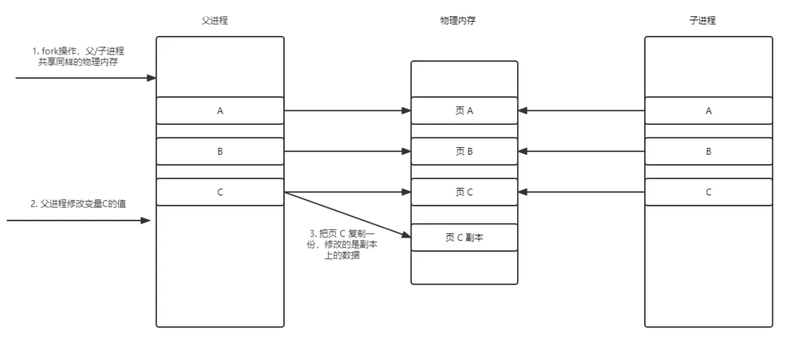

# aof
## aof重写
[Redis AOF重写的实现原理](https://www.jianshu.com/p/f700dbd572a5)   
[redis源码分析之AOF重写](https://blog.csdn.net/qq_32791231/article/details/117623408)

## Q&A
### 为什么aof重写需要记录增量数据？
因为父子进程采用读时共享-写时复制的机制，子进程创建后，虚拟内存会映射到父进程上，读时共享。如果父子进程需要修改数据，会在原来的基础上复制数据进行修改，所以后续的数据修改父子互不可见。子进程只能看见存量的aof数据，对于增量的需要父进程使用管道的方式传输给子进程。
  
