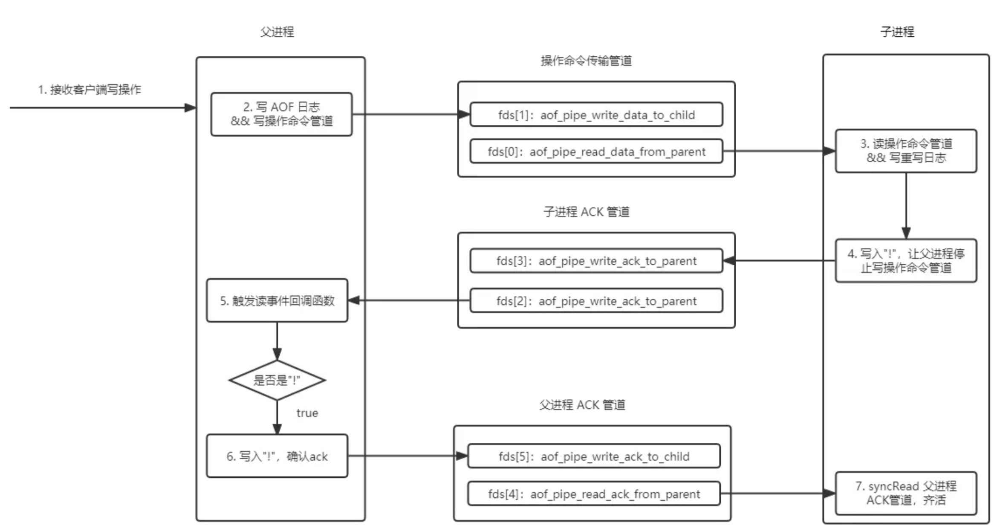

# aof重写

## 重写时机

### 手动触发

手动执行 `rewriteaof` 命令。会根据系统状态进行aof重写，具体有以下三种情况：

* 没有子进程，立即开始重写任务
* 子进程在进行其他任务(rdb生成)，记录aof重写标志，返回
* 已经有子进程在重写，返回重写中

    ```c
    {"bgrewriteaof",bgrewriteaofCommand,1,
        "admin no-script",
        0,NULL,0,0,0,0,0,0},


    void bgrewriteaofCommand(client *c) {
        // 已经在执行aof重写，直接返回
        if (server.child_type == CHILD_TYPE_AOF) {
            addReplyError(c,"Background append only file rewriting already in progress");
        } else if (hasActiveChildProcess()) {
            // 子进程在做其他任务，设置标志位
            server.aof_rewrite_scheduled = 1;
            addReplyStatus(c,"Background append only file rewriting scheduled");
        } else if (rewriteAppendOnlyFileBackground() == C_OK) {
            // 启动aof重写
            addReplyStatus(c,"Background append only file rewriting started");
        } else {
            addReplyError(c,"Can't execute an AOF background rewriting. "
                            "Please check the server logs for more information.");
        }
    }
    ```

### 自动触发

* aof文件大小超过上次重写后百分比(auto-aof-rewrite-percentage)
* aof文件大于阈值(auto-aof-rewrite-min-size)，防止小文件频繁触发重写
在 `serverCron` 方法中定时检查是否需要重写aof。

```c
int serverCron(struct aeEventLoop *eventLoop, long long id, void *clientData) {
    // ...
    // 手动触发重写任务被阻塞，周期性检查标志
    if (!hasActiveChildProcess() &&
        server.aof_rewrite_scheduled)
    {
        rewriteAppendOnlyFileBackground();
    }


    // 如果有子进程，检查子进程是否完成，如果没有，检查是否需要开启rdb或者aof重写
    if (hasActiveChildProcess() || ldbPendingChildren())
    {
        run_with_period(1000) receiveChildInfo();
        checkChildrenDone();
    } else {
        // 检查是否需要开启rdb备份
        for (j = 0; j < server.saveparamslen; j++) {
            // ...
        }

        // 检查是否需要开启aof重写
        if (server.aof_state == AOF_ON &&
            !hasActiveChildProcess() &&
            server.aof_rewrite_perc &&
            server.aof_current_size > server.aof_rewrite_min_size)
        {
            long long base = server.aof_rewrite_base_size ?
                server.aof_rewrite_base_size : 1;
            long long growth = (server.aof_current_size*100/base) - 100;
            if (growth >= server.aof_rewrite_perc) {
                serverLog(LL_NOTICE,"Starting automatic rewriting of AOF on %lld%% growth",growth);
                rewriteAppendOnlyFileBackground();
            }
        }
    }
}
```

## 重写执行流程

重写大致流程是主进程创建子进程用于aof重写，缓冲这个过程中的命令使用管道发给子进程，子进程会遍历数据，按数据类型生成对应的添加命令，并在重写完成后发送命令给主进程停止命令传输，最后把接受到的增量命令写入aof文件。

* rewriteAppendOnlyFileBackground 做aof重写的准备工作：1.创建子进程 2.创建父子进程通信管道

```c
int rewriteAppendOnlyFileBackground(void) {
    pid_t childpid;

    if (hasActiveChildProcess()) return C_ERR;
    // 创建管道
    if (aofCreatePipes() != C_OK) return C_ERR;
    if ((childpid = redisFork(CHILD_TYPE_AOF)) == 0) {
        char tmpfile[256];

        // 子进程
        redisSetProcTitle("redis-aof-rewrite");
        // 设置cpu亲和性
        redisSetCpuAffinity(server.aof_rewrite_cpulist);
        snprintf(tmpfile,256,"temp-rewriteaof-bg-%d.aof", (int) getpid());
        // 数据重写
        if (rewriteAppendOnlyFile(tmpfile) == C_OK) {
            sendChildCowInfo(CHILD_INFO_TYPE_AOF_COW_SIZE, "AOF rewrite");
            exitFromChild(0);
        } else {
            exitFromChild(1);
        }
    } else {
        // 父进程记录标志，在这个期间会提高部分操作的阈值(例如resize、rdb生成)
        if (childpid == -1) {
            serverLog(LL_WARNING,
                "Can't rewrite append only file in background: fork: %s",
                strerror(errno));
            aofClosePipes();
            return C_ERR;
        }
        serverLog(LL_NOTICE,
            "Background append only file rewriting started by pid %ld",(long) childpid);
        server.aof_rewrite_scheduled = 0;
        server.aof_rewrite_time_start = time(NULL);

        server.aof_selected_db = -1;
        return C_OK;
    }
    return C_OK; /* unreached */
}
```

* rewriteAppendOnlyFile 是aof重写任务的主要实现，会根据配置选择aof重写的模式：rdb+aof混合 or 纯aof，再调用对应方法生成aof文件，最后追加增量的命令。

```c
int rewriteAppendOnlyFile(char *filename) {
    rio aof;
    FILE *fp = NULL;
    char tmpfile[256];
    char byte;

    //打开文件
    snprintf(tmpfile,256,"temp-rewriteaof-%d.aof", (int) getpid());
    fp = fopen(tmpfile,"w");
    if (!fp) {
        serverLog(LL_WARNING, "Opening the temp file for AOF rewrite in rewriteAppendOnlyFile(): %s", strerror(errno));
        return C_ERR;
    }

    //接受父进程增量命令缓存，使用sds结构
    server.aof_child_diff = sdsempty();
    rioInitWithFile(&aof,fp);
    // 判断是否开启增量同步，默认32M会触发一次fsync，该配置会在aof重写过程中分次把内存中的数据同步到磁盘，否则会等待aof重写完成后一次性同步到磁盘，数据量大时会有阻塞
    if (server.aof_rewrite_incremental_fsync)
        rioSetAutoSync(&aof,REDIS_AUTOSYNC_BYTES);

    startSaving(RDBFLAGS_AOF_PREAMBLE);

    // aof_use_rdb_preamble表示是否使用rdb+aof混合模式，使用rdb作为数据快照并保存增量命令的方式可以提高重启恢复数据的速度
    if (server.aof_use_rdb_preamble) {
        int error;
        if (rdbSaveRio(&aof,&error,RDBFLAGS_AOF_PREAMBLE,NULL) == C_ERR) {
            errno = error;
            goto werr;
        }
    } else {
        // 是否纯aof模式
        if (rewriteAppendOnlyFileRio(&aof) == C_ERR) goto werr;
    }

    /* Do an initial slow fsync here while the parent is still sending
     * data, in order to make the next final fsync faster. */
    if (fflush(fp) == EOF) goto werr;
    if (fsync(fileno(fp)) == -1) goto werr;

    //到这里说明aof重写完成，需要写入增量的命令，会尝试从管道中尽可能多的读取数据，减少aof文件和现在系统命令差
    int nodata = 0;
    mstime_t start = mstime();
    // 1秒超时或者20次读取，从管道读取数据
    while(mstime()-start < 1000 && nodata < 20) {
        if (aeWait(server.aof_pipe_read_data_from_parent, AE_READABLE, 1) <= 0)
        {
            nodata++;
            continue;
        }
        nodata = 0; /* Start counting from zero, we stop on N *contiguous*
                       timeouts. */
        aofReadDiffFromParent();
    }

    // 子进程发送 ！ 标志通知父进程停止写入增量命令
    if (write(server.aof_pipe_write_ack_to_parent,"!",1) != 1) goto werr;
    if (anetNonBlock(NULL,server.aof_pipe_read_ack_from_parent) != ANET_OK)
        goto werr;
    // 上面发送了停止发送命令的标志，这里设置5s接受父进程的ack回复(!)
    if (syncRead(server.aof_pipe_read_ack_from_parent,&byte,1,5000) != 1 ||
        byte != '!') goto werr;
    serverLog(LL_NOTICE,"Parent agreed to stop sending diffs. Finalizing AOF...");

    /* Read the final diff if any. */
    aofReadDiffFromParent();

    /* Write the received diff to the file. */
    serverLog(LL_NOTICE,
        "Concatenating %.2f MB of AOF diff received from parent.",
        (double) sdslen(server.aof_child_diff) / (1024*1024));

    // 将增量的命令写入aof文件
    size_t bytes_to_write = sdslen(server.aof_child_diff);
    const char *buf = server.aof_child_diff;
    long long cow_updated_time = mstime();
    long long key_count = dbTotalServerKeyCount();
    while (bytes_to_write) {
        /* We write the AOF buffer in chunk of 8MB so that we can check the time in between them */
        size_t chunk_size = bytes_to_write < (8<<20) ? bytes_to_write : (8<<20);

        if (rioWrite(&aof,buf,chunk_size) == 0)
            goto werr;

        bytes_to_write -= chunk_size;
        buf += chunk_size;

        /* Update COW info */
        long long now = mstime();
        if (now - cow_updated_time >= 1000) {
            sendChildInfo(CHILD_INFO_TYPE_CURRENT_INFO, key_count, "AOF rewrite");
            cow_updated_time = now;
        }
    }

    /* Make sure data will not remain on the OS's output buffers */
    if (fflush(fp)) goto werr;
    if (fsync(fileno(fp))) goto werr;
    if (fclose(fp)) { fp = NULL; goto werr; }
    fp = NULL;

    /* Use RENAME to make sure the DB file is changed atomically only
     * if the generate DB file is ok. */
    if (rename(tmpfile,filename) == -1) {
        serverLog(LL_WARNING,"Error moving temp append only file on the final destination: %s", strerror(errno));
        unlink(tmpfile);
        stopSaving(0);
        return C_ERR;
    }
    serverLog(LL_NOTICE,"SYNC append only file rewrite performed");
    stopSaving(1);
    return C_OK;

werr:
    serverLog(LL_WARNING,"Write error writing append only file on disk: %s", strerror(errno));
    if (fp) fclose(fp);
    unlink(tmpfile);
    stopSaving(0);
    return C_ERR;
}
```

* rewriteAppendOnlyFileRio 遍历所有库，根据不同类型生成对应的命令，并定时读取增量命令。

```c
int rewriteAppendOnlyFileRio(rio *aof) {
    dictIterator *di = NULL;
    dictEntry *de;
    size_t processed = 0;
    int j;
    long key_count = 0;
    long long updated_time = 0;

    // 遍历库
    for (j = 0; j < server.dbnum; j++) {
        // 写入select命令切换到对应库
        char selectcmd[] = "*2\r\n$6\r\nSELECT\r\n";
        redisDb *db = server.db+j;
        // 记录库的所有数据用哈希表存储的
        dict *d = db->dict;
        if (dictSize(d) == 0) continue;
        di = dictGetSafeIterator(d);

        /* SELECT the new DB */
        if (rioWrite(aof,selectcmd,sizeof(selectcmd)-1) == 0) goto werr;
        if (rioWriteBulkLongLong(aof,j) == 0) goto werr;

        // 遍历哈希表
        while((de = dictNext(di)) != NULL) {
            sds keystr;
            robj key, *o;
            long long expiretime;

            keystr = dictGetKey(de);
            o = dictGetVal(de);
            initStaticStringObject(key,keystr);

            expiretime = getExpire(db,&key);

            // 根据不同类型调用方法生成命令
            if (o->type == OBJ_STRING) {
                /* Emit a SET command */
                char cmd[]="*3\r\n$3\r\nSET\r\n";
                if (rioWrite(aof,cmd,sizeof(cmd)-1) == 0) goto werr;
                /* Key and value */
                if (rioWriteBulkObject(aof,&key) == 0) goto werr;
                if (rioWriteBulkObject(aof,o) == 0) goto werr;
            } else if (o->type == OBJ_LIST) {
                if (rewriteListObject(aof,&key,o) == 0) goto werr;
            } else if (o->type == OBJ_SET) {
                if (rewriteSetObject(aof,&key,o) == 0) goto werr;
            } else if (o->type == OBJ_ZSET) {
                if (rewriteSortedSetObject(aof,&key,o) == 0) goto werr;
            } else if (o->type == OBJ_HASH) {
                if (rewriteHashObject(aof,&key,o) == 0) goto werr;
            } else if (o->type == OBJ_STREAM) {
                if (rewriteStreamObject(aof,&key,o) == 0) goto werr;
            } else if (o->type == OBJ_MODULE) {
                if (rewriteModuleObject(aof,&key,o) == 0) goto werr;
            } else {
                serverPanic("Unknown object type");
            }
            // 生成数据的过期时间命令
            if (expiretime != -1) {
                char cmd[]="*3\r\n$9\r\nPEXPIREAT\r\n";
                if (rioWrite(aof,cmd,sizeof(cmd)-1) == 0) goto werr;
                if (rioWriteBulkObject(aof,&key) == 0) goto werr;
                if (rioWriteBulkLongLong(aof,expiretime) == 0) goto werr;
            }
            // 重写过程中定时读取父进程发送的增量命令
            if (aof->processed_bytes > processed+AOF_READ_DIFF_INTERVAL_BYTES) {
                processed = aof->processed_bytes;
                aofReadDiffFromParent();
            }

            // 每处理 1024 个键，并且至少每隔 1 秒钟，就向父进程报告当前的重写进度
            if ((key_count++ & 1023) == 0) {
                long long now = mstime();
                if (now - updated_time >= 1000) {
                    sendChildInfo(CHILD_INFO_TYPE_CURRENT_INFO, key_count, "AOF rewrite");
                    updated_time = now;
                }
            }
        }
        dictReleaseIterator(di);
        di = NULL;
    }
    return C_OK;

werr:
    if (di) dictReleaseIterator(di);
    return C_ERR;
}
```

## 父子进程交互过程

因为管道是单向的一写一读，重写过程中涉及到父进程发送增量命令给子进程、子进程发送停止标志给父进程、父进程回复ack给子进程，需要3个管道。


* 创建管道
会在`rewriteAppendOnlyFileBackground`方法中创建管道。

```c
int aofCreatePipes(void) {
    int fds[6] = {-1, -1, -1, -1, -1, -1};
    int j;

    if (pipe(fds) == -1) goto error; /* parent -> children data. */
    if (pipe(fds+2) == -1) goto error; /* children -> parent ack. */
    if (pipe(fds+4) == -1) goto error; /* parent -> children ack. */
    /* Parent -> children data is non blocking. */
    if (anetNonBlock(NULL,fds[0]) != ANET_OK) goto error;
    if (anetNonBlock(NULL,fds[1]) != ANET_OK) goto error;
    if (aeCreateFileEvent(server.el, fds[2], AE_READABLE, aofChildPipeReadable, NULL) == AE_ERR) goto error;

    server.aof_pipe_write_data_to_child = fds[1];
    server.aof_pipe_read_data_from_parent = fds[0];
    server.aof_pipe_write_ack_to_parent = fds[3];
    server.aof_pipe_read_ack_from_child = fds[2];
    server.aof_pipe_write_ack_to_child = fds[5];
    server.aof_pipe_read_ack_from_parent = fds[4];
    server.aof_stop_sending_diff = 0;
    return C_OK;

error:
    serverLog(LL_WARNING,"Error opening /setting AOF rewrite IPC pipes: %s",
        strerror(errno));
    for (j = 0; j < 6; j++) if(fds[j] != -1) close(fds[j]);
    return C_ERR;
}
```

* 父进程写增量命令
redis在执行命令后会调用 `feedAppendOnlyFile` 把命令追加到aof文件后，如果正在进行aof重写，会追加到增量命令缓冲区，后续发送给子进程。

```c
void feedAppendOnlyFile(struct redisCommand *cmd, int dictid, robj **argv, int argc) {
    sds buf = sdsempty();

    // 对于 EXPIRE/PEXPIRE/EXPIREAT/SETEX/PSETEX 命令，带有过期时间且不是具体的时间戳，为了保证准确性，都会转化为 PEXPIREAT/SET and PEXPIREAT，保证数据恢复前后一致
    if (cmd->proc == expireCommand || cmd->proc == pexpireCommand ||
        cmd->proc == expireatCommand) {
        /* Translate EXPIRE/PEXPIRE/EXPIREAT into PEXPIREAT */
        buf = catAppendOnlyExpireAtCommand(buf,cmd,argv[1],argv[2]);
    } else if (cmd->proc == setCommand && argc > 3) {
        robj *pxarg = NULL;
        /* When SET is used with EX/PX argument setGenericCommand propagates them with PX millisecond argument.
        * So since the command arguments are re-written there, we can rely here on the index of PX being 3. */
        if (!strcasecmp(argv[3]->ptr, "px")) {
            pxarg = argv[4];
        }
        /* For AOF we convert SET key value relative time in milliseconds to SET key value absolute time in
        * millisecond. Whenever the condition is true it implies that original SET has been transformed
        * to SET PX with millisecond time argument so we do not need to worry about unit here.*/
        if (pxarg) {
            robj *millisecond = getDecodedObject(pxarg);
            long long when = strtoll(millisecond->ptr,NULL,10);
            when += mstime();

            decrRefCount(millisecond);

            robj *newargs[5];
            newargs[0] = argv[0];
            newargs[1] = argv[1];
            newargs[2] = argv[2];
            newargs[3] = shared.pxat;
            newargs[4] = createStringObjectFromLongLong(when);
            buf = catAppendOnlyGenericCommand(buf,5,newargs);
            decrRefCount(newargs[4]);
        } else {
            buf = catAppendOnlyGenericCommand(buf,argc,argv);
        }
    } else {
        // 普通命令
        buf = catAppendOnlyGenericCommand(buf,argc,argv);
    }

    // 如果开启了aof，需要把命令追加到缓冲区
    if (server.aof_state == AOF_ON)
        server.aof_buf = sdscatlen(server.aof_buf,buf,sdslen(buf));

    // 如果正在进行aof重写，把增量命令追加到重写缓存区，后续发送给子进程
    if (server.child_type == CHILD_TYPE_AOF)
        aofRewriteBufferAppend((unsigned char*)buf,sdslen(buf));

    sdsfree(buf);
}
```

* 追加命令到缓冲区
增量命令缓冲区基本单位是块(10M)，使用链表连接。

    ```c
    void aofRewriteBufferAppend(unsigned char *s, unsigned long len) {
        //aof_rewrite_buf_blocks是存放块的链表
        listNode *ln = listLast(server.aof_rewrite_buf_blocks);
        aofrwblock *block = ln ? ln->value : NULL;

        while(len) {
            // 追加命令
            if (block) {
                unsigned long thislen = (block->free < len) ? block->free : len;
                if (thislen) {  /* The current block is not already full. */
                    memcpy(block->buf+block->used, s, thislen);
                    block->used += thislen;
                    block->free -= thislen;
                    s += thislen;
                    len -= thislen;
                }
            }

            //如果块内存不足，重新申请一个
            if (len) { /* First block to allocate, or need another block. */
                int numblocks;

                block = zmalloc(sizeof(*block));
                block->free = AOF_RW_BUF_BLOCK_SIZE;
                block->used = 0;
                listAddNodeTail(server.aof_rewrite_buf_blocks,block);
            }
        }

        //写完命令后注册一个文件事件写数据到子进程的管道
        if (!server.aof_stop_sending_diff &&
            aeGetFileEvents(server.el,server.aof_pipe_write_data_to_child) == 0)
        {
            aeCreateFileEvent(server.el, server.aof_pipe_write_data_to_child,
                AE_WRITABLE, aofChildWriteDiffData, NULL);
        }
    }
    ```

* 父进程写数据到管道
`aof_pipe_write_data_to_child`事件的回调`aofChildWriteDiffData`，会往管道中写数据并删除已写入的数据。

```c
void aofChildWriteDiffData(aeEventLoop *el, int fd, void *privdata, int mask) {
    listNode *ln;
    aofrwblock *block;
    ssize_t nwritten;

    while(1) {
        ln = listFirst(server.aof_rewrite_buf_blocks);
        block = ln ? ln->value : NULL;
        if (server.aof_stop_sending_diff || !block) {
            aeDeleteFileEvent(server.el,server.aof_pipe_write_data_to_child,
                              AE_WRITABLE);
            return;
        }

        // 往管道写数据
        if (block->used > 0) {
            nwritten = write(server.aof_pipe_write_data_to_child,
                             block->buf,block->used);
            if (nwritten <= 0) return;
            memmove(block->buf,block->buf+nwritten,block->used-nwritten);
            block->used -= nwritten;
            block->free += nwritten;
        }
        // 删除写入的块数据
        if (block->used == 0) listDelNode(server.aof_rewrite_buf_blocks,ln);
    }
}
```

* 子进程读数据
`aof_pipe_read_data_from_parent`事件的回调`aofReadDiffFromParent`，会读取数据放到缓冲区。

```c
ssize_t aofReadDiffFromParent(void) {
    char buf[65536]; /* Default pipe buffer size on most Linux systems. */
    ssize_t nread, total = 0;

    while ((nread =
            read(server.aof_pipe_read_data_from_parent,buf,sizeof(buf))) > 0) {
        server.aof_child_diff = sdscatlen(server.aof_child_diff,buf,nread);
        total += nread;
    }
    return total;
}
```

[Redis AOF重写的实现原理](Redis  AOF重写的实现原理)
[redis源码分析之AOF重写](redis源码分析之AOF重写_redis aof重写过程-CSDN博客)

## Q&A

### 为什么aof重写需要记录增量数据？

因为父子进程采用读时共享-写时复制的机制，子进程创建后，虚拟内存会映射到父进程上，读时共享。如果父子进程需要修改数据，会在原来的基础上复制数据进行修改，所以后续的数据修改父子互不可见。子进程只能看见存量的aof数据，对于增量的需要父进程使用管道的方式传输给子进程。

