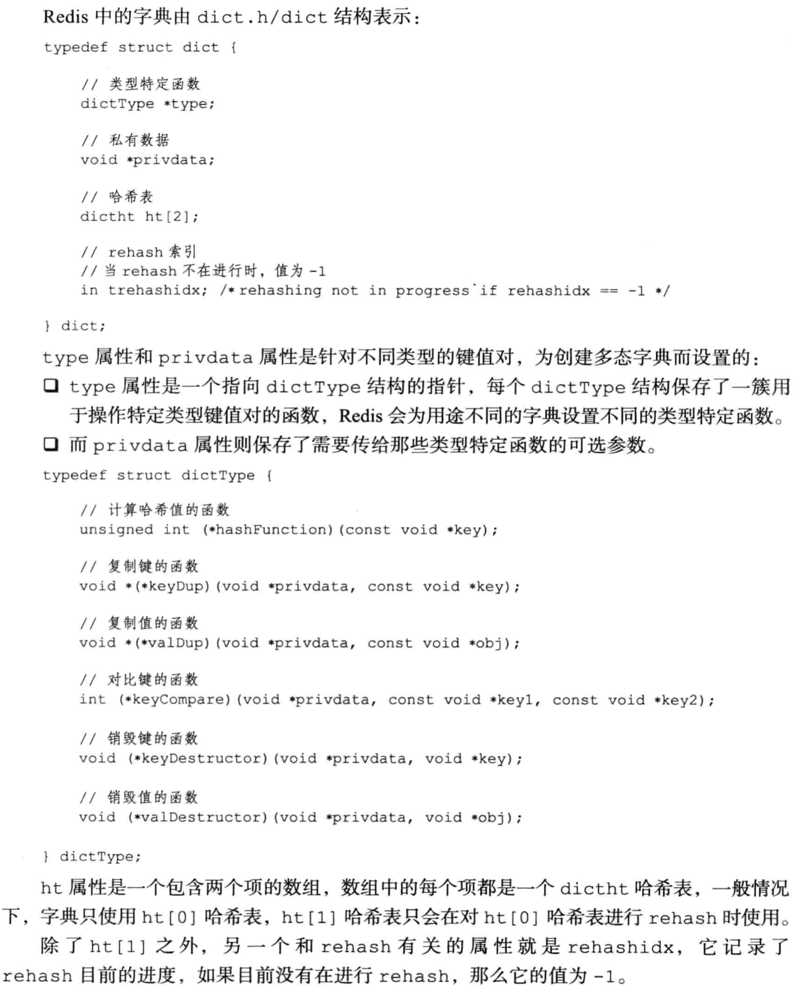
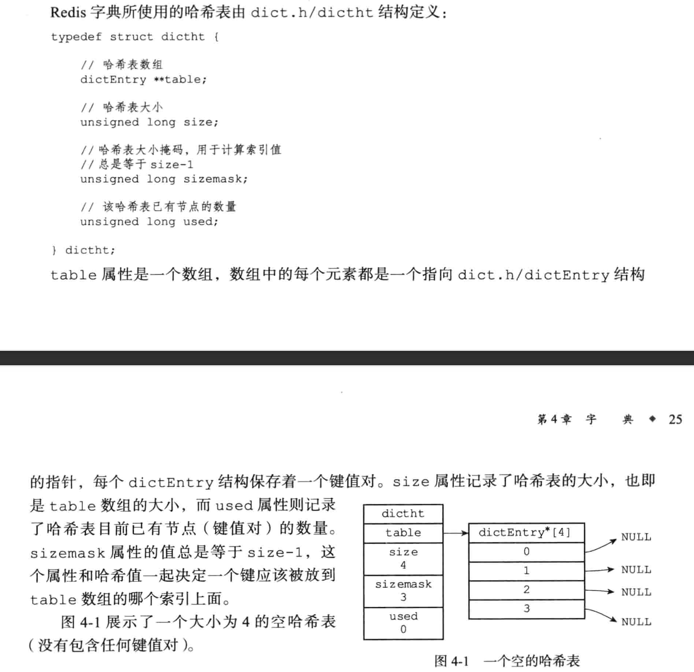
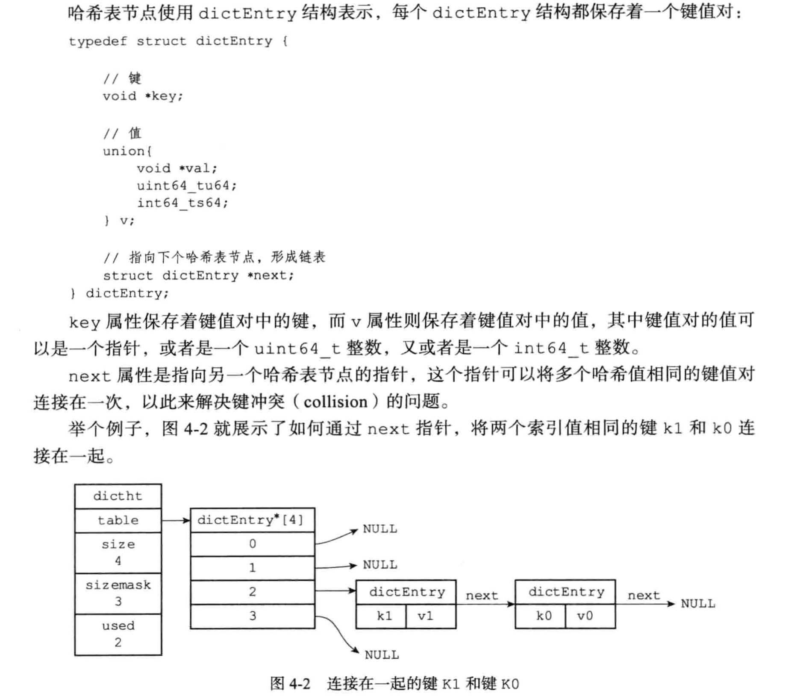

# dict源码

## 结构



  

```c
typedef struct dict {
    dictType *type;
    void *privdata;
    dictht ht[2];
    //数据迁移的位置，没迁移时=-1
    long rehashidx;
    //>0表示停止rehash，该值取之>=0
    int16_t pauserehash; 
} dict;

typedef struct dictType {
    uint64_t (*hashFunction)(const void *key);
    void *(*keyDup)(void *privdata, const void *key);
    void *(*valDup)(void *privdata, const void *obj);
    int (*keyCompare)(void *privdata, const void *key1, const void *key2);
    void (*keyDestructor)(void *privdata, void *key);
    void (*valDestructor)(void *privdata, void *obj);
    //判断扩容
    int (*expandAllowed)(size_t moreMem, double usedRatio);
} dictType;

typedef struct dictht {
    dictEntry **table;
    //数组的内存=sizeof(dictEntry)*数组的长度
    unsigned long size;
    //size-1
    unsigned long sizemask;
    //数据的数量
    unsigned long used;
} dictht;

typedef struct dictEntry {
    void *key;
    union {
        void *val;
        uint64_t u64;
        int64_t s64;
        double d;
    } v;
    struct dictEntry *next;
} dictEntry;
```

## 初始化

创建一个空的dict，不会预分配数组内存。

```c
dict *dictCreate(dictType *type,
        void *privDataPtr)
{
    dict *d = zmalloc(sizeof(*d));

    _dictInit(d,type,privDataPtr);
    return d;
}

int _dictInit(dict *d, dictType *type,
        void *privDataPtr)
{
    _dictReset(&d->ht[0]);
    _dictReset(&d->ht[1]);
    d->type = type;
    d->privdata = privDataPtr;
    d->rehashidx = -1;
    d->pauserehash = 0;
    return DICT_OK;
}

static void _dictReset(dictht *ht)
{
    ht->table = NULL;
    ht->size = 0;
    ht->sizemask = 0;
    ht->used = 0;
}
```

## 添加

只有在dict中不存在该key才会成功，成功返回创建的entry，失败返回NULL，插入前会判断是否需要扩容，如果dict正在扩容，会帮助rehash一个位置。

```c
#define dictSetVal(d, entry, _val_) do { \
    if ((d)->type->valDup) \
        (entry)->v.val = (d)->type->valDup((d)->privdata, _val_); \
    else \
        (entry)->v.val = (_val_); \
} while(0)

//插入数据要求dict中没有相同的key，否则会插入失败 0->插入成功 1->插入失败(可能是已经存在or..)
int dictAdd(dict *d, void *key, void *val)
{
    //若dict中没有该key，创建并返回；若有责返回NULL
    dictEntry *entry = dictAddRaw(d,key,NULL);

    if (!entry) return DICT_ERR;
    dictSetVal(d, entry, val);
    return DICT_OK;
}


#define dictSetKey(d, entry, _key_) do { \
    //key复制函数不为空，复制后设置，否则直接设置
    if ((d)->type->keyDup) \
        (entry)->key = (d)->type->keyDup((d)->privdata, _key_); \
    else \
        (entry)->key = (_key_); \
} while(0)
dictEntry *dictAddRaw(dict *d, void *key, dictEntry **existing)
{
    long index;
    dictEntry *entry;
    dictht *ht;

    //若在rehash，帮忙迁移数据
    if (dictIsRehashing(d)) _dictRehashStep(d);

    /* Get the index of the new element, or -1 if
     * the element already exists. */
    if ((index = _dictKeyIndex(d, key, dictHashKey(d,key), existing)) == -1)
        return NULL;

    //头插法->因为最近加入的数据被访问的几率更大
    ht = dictIsRehashing(d) ? &d->ht[1] : &d->ht[0];
    entry = zmalloc(sizeof(*entry));
    entry->next = ht->table[index];
    ht->table[index] = entry;
    ht->used++;

    //设置key
    dictSetKey(d, entry, key);
    return entry;
}
```

```c
//通过rehashidx值判断是否正在rehash
#define dictIsRehashing(d) ((d)->rehashidx != -1)
//查找d中是否有key的节点，如果有记录在existing中，没有则返回插入的位置
static long _dictKeyIndex(dict *d, const void *key, uint64_t hash, dictEntry **existing)
{
    unsigned long idx, table;
    dictEntry *he;
    if (existing) *existing = NULL;

    //判断是否需要扩容
    if (_dictExpandIfNeeded(d) == DICT_ERR)
        return -1;
    //遍历表0和表1
    for (table = 0; table <= 1; table++) {
        //计算index
        idx = hash & d->ht[table].sizemask;
        //因为采用链地址法，遍历查询是否有该值
        he = d->ht[table].table[idx];
        while(he) {
            if (key==he->key || dictCompareKeys(d, key, he->key)) {
                //查询到有相同key记录existing
                if (existing) *existing = he;
                return -1;
            }
            he = he->next;
        }
        //如果再rehash，需要查找表1，否则直接跳出
        if (!dictIsRehashing(d)) break;
    }
    return idx;
}

//再插入之前判断是否需要进行扩容，需要则扩容，并返回是否成功，不需要直接返回成功 0->成功 1->失败
static int _dictExpandIfNeeded(dict *d)
{
    //正在扩容，直接返回
    if (dictIsRehashing(d)) return DICT_OK;

    //长度为0，扩容
    if (d->ht[0].size == 0) return dictExpand(d, DICT_HT_INITIAL_SIZE);

    //数据的数据大于长度的5倍 && dictTypeExpandAllowed
    if (d->ht[0].used >= d->ht[0].size &&
        (dict_can_resize ||
         d->ht[0].used/d->ht[0].size > dict_force_resize_ratio) &&
        dictTypeExpandAllowed(d))
    {
        return dictExpand(d, d->ht[0].used + 1);
    }
    return DICT_OK;
}

//todo expandAllowed
static int dictTypeExpandAllowed(dict *d) {
    if (d->type->expandAllowed == NULL) return 1;
    return d->type->expandAllowed(
                    _dictNextPower(d->ht[0].used + 1) * sizeof(dictEntry*),
                    (double)d->ht[0].used / d->ht[0].size);
}

#define DICT_HT_INITIAL_SIZE     4
//用于计算dict扩容需要申请的内存长度，申请的长度=第一个大于等于size的2的整数倍
static unsigned long _dictNextPower(unsigned long size)
{
    //最小申请的长度
    unsigned long i = DICT_HT_INITIAL_SIZE;

    if (size >= LONG_MAX) return LONG_MAX + 1LU;
    while(1) {
        if (i >= size)
            return i;
        i *= 2;
    }
}
```

## 替换

```c
int dictReplace(dict *d, void *key, void *val)
{
    dictEntry *entry, *existing, auxentry;

    //尝试添加数据
    entry = dictAddRaw(d,key,&existing);
    //entry不为空，说明添加成功，直接设值
    if (entry) {
        dictSetVal(d, entry, val);
        return 1;
    }

    //添加失败说明已经存在，直接设值并释放原来的数据
    auxentry = *existing;
    dictSetVal(d, existing, val);
    dictFreeVal(d, &auxentry);
    return 0;
}
```

## 删除

```c
int dictDelete(dict *ht, const void *key) {
    return dictGenericDelete(ht,key,0) ? DICT_OK : DICT_ERR;
}

//nofree->0:找到key后断开前后连接且直接释放内存 1:找到key后断开前后连接不释放，返回对应entry
static dictEntry *dictGenericDelete(dict *d, const void *key, int nofree) {
    uint64_t h, idx;
    dictEntry *he, *prevHe;
    int table;

    if (d->ht[0].used == 0 && d->ht[1].used == 0) return NULL;
    //如果正在rehash，帮助迁移
    if (dictIsRehashing(d)) _dictRehashStep(d);
    h = dictHashKey(d, key);
    //迁移的情况下两个字典都需要删除
    for (table = 0; table <= 1; table++) {
        idx = h & d->ht[table].sizemask;
        he = d->ht[table].table[idx];
        prevHe = NULL;
        while(he) {
            if (key==he->key || dictCompareKeys(d, key, he->key)) {
                /* Unlink the element from the list */
                if (prevHe)
                    prevHe->next = he->next;
                else
                    d->ht[table].table[idx] = he->next;
                if (!nofree) {
                    dictFreeKey(d, he);
                    dictFreeVal(d, he);
                    zfree(he);
                }
                d->ht[table].used--;
                return he;
            }
            prevHe = he;
            he = he->next;
        }
        if (!dictIsRehashing(d)) break;
    }
    return NULL; /* not found */
}
```

## 扩缩容

初始化长度为4，每次扩容是原来的2倍。该函数size传入的是dict中数据的个数或者+1，若底层表的长度满足扩容条件时，扩容为原来两倍，若底层长度很大，则会发生缩容，长度为第一个大于数据个数的2的整数倍。

```c
//size->现有节点数量+1
//如果malloc_failed不为空，因为内存申请失败导致扩容失败，malloc_failed会被置为1，否则为0
int _dictExpand(dict *d, unsigned long size, int* malloc_failed)
{
    if (malloc_failed) *malloc_failed = 0;

    //如果已经在扩容或者size溢出，返回错误
    if (dictIsRehashing(d) || d->ht[0].used > size)
        return DICT_ERR;

    dictht n;
    //计算要申请的dict长度
    unsigned long realsize = _dictNextPower(size);

    //检查申请长度是否溢出
    if (realsize < size || realsize * sizeof(dictEntry*) < realsize)
        return DICT_ERR;

    /* Rehashing to the same table size is not useful. */
    if (realsize == d->ht[0].size) return DICT_ERR;

    /* Allocate the new hash table and initialize all pointers to NULL */
    n.size = realsize;
    n.sizemask = realsize-1;
    if (malloc_failed) {
        n.table = ztrycalloc(realsize*sizeof(dictEntry*));
        *malloc_failed = n.table == NULL;
        if (*malloc_failed)
            return DICT_ERR;
    } else
        n.table = zcalloc(realsize*sizeof(dictEntry*));

    n.used = 0;

    //表0为空代表第一次初始化，不需要设置rehashidx，直接返回成功
    if (d->ht[0].table == NULL) {
        d->ht[0] = n;
        return DICT_OK;
    }

    /* Prepare a second hash table for incremental rehashing */
    d->ht[1] = n;
    d->rehashidx = 0;
    return DICT_OK;
}
```

## rehash

```c
static void _dictRehashStep(dict *d) {
    //没有暂停rehash时帮助迁移数据
    if (d->pauserehash == 0) dictRehash(d,1);
}

//n->迁移多少个位置 返回值 1->还需要迁移 0->整体迁移完成
int dictRehash(dict *d, int n) {
    //如果访问了 n*10 个位置都是不需要迁移的，直接返回(防止长时间阻塞)
    int empty_visits = n*10; 
    if (!dictIsRehashing(d)) return 0;

    while(n-- && d->ht[0].used != 0) {
        //de->当前迁移的节点，nextde->记录下一个迁移的节点，防止丢失
        dictEntry *de, *nextde;

        /* Note that rehashidx can't overflow as we are sure there are more
         * elements because ht[0].used != 0 */
        assert(d->ht[0].size > (unsigned long)d->rehashidx);
        //找到需要迁移的位置
        while(d->ht[0].table[d->rehashidx] == NULL) {
            d->rehashidx++;
            if (--empty_visits == 0) return 1;
        }
        de = d->ht[0].table[d->rehashidx];
        //采用的是头插法，所以扩容后数据顺序会倒置
        while(de) {
            uint64_t h;

            nextde = de->next;
            /* Get the index in the new hash table */
            h = dictHashKey(d, de->key) & d->ht[1].sizemask;
            de->next = d->ht[1].table[h];
            d->ht[1].table[h] = de;
            d->ht[0].used--;
            d->ht[1].used++;
            de = nextde;
        }
        d->ht[0].table[d->rehashidx] = NULL;
        d->rehashidx++;
    }

    //判断是否迁移完成
    if (d->ht[0].used == 0) {
        zfree(d->ht[0].table);
        d->ht[0] = d->ht[1];
        _dictReset(&d->ht[1]);
        d->rehashidx = -1;
        return 0;
    }

    /* More to rehash... */
    return 1;
}
```

## 删除字典

* 释放字典
会把dict的内存和底层的数据内存都释放。

```c
void dictRelease(dict *d)
{
    _dictClear(d,&d->ht[0],NULL);
    _dictClear(d,&d->ht[1],NULL);
    zfree(d);
}

int _dictClear(dict *d, dictht *ht, void(callback)(void *)) {
    unsigned long i;

    //释放所有位置上的数据
    for (i = 0; i < ht->size && ht->used > 0; i++) {
        dictEntry *he, *nextHe;
        //释放privdata数据，只会执行一次
        if (callback && (i & 65535) == 0) callback(d->privdata);

        if ((he = ht->table[i]) == NULL) continue;
        while(he) {
            nextHe = he->next;
            dictFreeKey(d, he);
            dictFreeVal(d, he);
            zfree(he);
            ht->used--;
            he = nextHe;
        }
    }
    /* Free the table and the allocated cache structure */
    zfree(ht->table);
    /* Re-initialize the table */
    _dictReset(ht);
    return DICT_OK; /* never fails */
}
```

* 清空
只会释放dict底层占用的数据内存，不会方式dict占用的内存。

```c
void dictEmpty(dict *d, void(callback)(void*)) {
    _dictClear(d,&d->ht[0],callback);
    _dictClear(d,&d->ht[1],callback);
    d->rehashidx = -1;
    d->pauserehash = 0;
}
```

## 查找

```c
dictEntry *dictFind(dict *d, const void *key)
{
    dictEntry *he;
    uint64_t h, idx, table;

    if (dictSize(d) == 0) return NULL; /* dict is empty */
    //帮助rehash
    if (dictIsRehashing(d)) _dictRehashStep(d);
    h = dictHashKey(d, key);
    //如果再rehash，会查找两个表
    for (table = 0; table <= 1; table++) {
        idx = h & d->ht[table].sizemask;
        he = d->ht[table].table[idx];
        while(he) {
            if (key==he->key || dictCompareKeys(d, key, he->key))
                return he;
            he = he->next;
        }
        if (!dictIsRehashing(d)) return NULL;
    }
    return NULL;
}
```

## 遍历

* 迭代器->严格的遍历模式

```c
//迭代器
typedef struct dictIterator {
    dict *d;
    long index;
    int table, safe;
    dictEntry *entry, *nextEntry;
    /* unsafe iterator fingerprint for misuse detection. */
    unsigned long long fingerprint;
} dictIterator;
```

* 创建迭代器
  [Redis源码学习——安全迭代器和非安全迭代器（一）](https://blog.csdn.net/damanchen/article/details/89474695)
  * 不安全迭代器
    safe设置为0，在遍历过程中不允许任何修改(包括rehash)。

    ```c
    dictIterator *dictGetIterator(dict *d)
    {
        dictIterator *iter = zmalloc(sizeof(*iter));

        iter->d = d;
        //访问表的索引
        iter->table = 0;
        //访问数据的索引
        iter->index = -1;
        iter->safe = 0;
        //访问的上一次节点
        iter->entry = NULL;
        //下一个节点
        iter->nextEntry = NULL;
        return iter;
    }
    ```

  * 安全迭代器
      sefe被设置为1，在遍历过程中允许修改，但不允许rehash，因为rehash会使迭代器失效(index等信息)。

    ```c
    dictIterator *dictGetSafeIterator(dict *d) {
        dictIterator *i = dictGetIterator(d);

        i->safe = 1;
        return i;
    }
    ```

* 获取下一个节点

```c
dictEntry *dictNext(dictIterator *iter)
{
    while (1) {
        if (iter->entry == NULL) {
            dictht *ht = &iter->d->ht[iter->table];
            //第一次使用
            if (iter->index == -1 && iter->table == 0) {
                //判断模式 安全迭代器 or 非安全迭代器
                if (iter->safe)
                    dictPauseRehashing(iter->d);
                else
                    //保存当前dict的一个唯一标识符，作为后续比较是否发生变化
                    iter->fingerprint = dictFingerprint(iter->d);
            }
            iter->index++;
            //如果访问位置大于表的长度，有两种情况：1.访问的是0表且在扩容，改变table字段，从1表0位置开始遍历，遍历1表 2.访问的是1表，直接跳出
            if (iter->index >= (long) ht->size) {
                if (dictIsRehashing(iter->d) && iter->table == 0) {
                    iter->table++;
                    iter->index = 0;
                    ht = &iter->d->ht[1];
                } else {
                    break;
                }
            }
            iter->entry = ht->table[iter->index];
        } else {
            iter->entry = iter->nextEntry;
        }
        if (iter->entry) {
            /* We need to save the 'next' here, the iterator user
             * may delete the entry we are returning. */
            iter->nextEntry = iter->entry->next;
            return iter->entry;
        }
    }
    return NULL;
}

//利用dict底层表的指针，表的大小，数据的个数生成一个唯一标识符
unsigned long long dictFingerprint(dict *d) {
    unsigned long long integers[6], hash = 0;
    int j;

    integers[0] = (long) d->ht[0].table;
    integers[1] = d->ht[0].size;
    integers[2] = d->ht[0].used;
    integers[3] = (long) d->ht[1].table;
    integers[4] = d->ht[1].size;
    integers[5] = d->ht[1].used;

    /* We hash N integers by summing every successive integer with the integer
     * hashing of the previous sum. Basically:
     *
     * Result = hash(hash(hash(int1)+int2)+int3) ...
     *
     * This way the same set of integers in a different order will (likely) hash
     * to a different number. */
    for (j = 0; j < 6; j++) {
        hash += integers[j];
        /* For the hashing step we use Tomas Wang's 64 bit integer hash. */
        hash = (~hash) + (hash << 21); // hash = (hash << 21) - hash - 1;
        hash = hash ^ (hash >> 24);
        hash = (hash + (hash << 3)) + (hash << 8); // hash * 265
        hash = hash ^ (hash >> 14);
        hash = (hash + (hash << 2)) + (hash << 4); // hash * 21
        hash = hash ^ (hash >> 28);
        hash = hash + (hash << 31);
    }
    return hash;
}
```

* 销毁迭代器

```c
void dictReleaseIterator(dictIterator *iter)
{
    //满足iter->index == -1 && iter->table == 0说明还没开始遍历，不需要进行下列判断，否则根据safe模式做对应处理
    if (!(iter->index == -1 && iter->table == 0)) {
        if (iter->safe)
            //遍历完成，消除标志位
            dictResumeRehashing(iter->d);
        else
            //比较前后dict唯一标识符，判断在遍历过程中dict是否被修改
            assert(iter->fingerprint == dictFingerprint(iter->d));
    }
    zfree(iter);
}
```

* Scan->不严格的遍历模式，可能会返回重复的key

```c
typedef void (dictScanFunction)(void *privdata, const dictEntry *de);
typedef void (dictScanBucketFunction)(void *privdata, dictEntry **bucketref);

//v->下一个遍历的节点索引 dictScanFunction->节点数据的处理函数(有多少节点执行多少次) dictScanBucketFunction->开始遍历执行函数(一次) 返回值:下一个遍历位置
unsigned long dictScan(dict *d,
                       unsigned long v,
                       dictScanFunction *fn,
                       dictScanBucketFunction* bucketfn,
                       void *privdata)
{
    dictht *t0, *t1;
    const dictEntry *de, *next;
    unsigned long m0, m1;

    if (dictSize(d) == 0) return 0;

    //设置标志位，在遍历过程不允许rehash
    dictPauseRehashing(d);

    //如果没有在rehash
    if (!dictIsRehashing(d)) {
        t0 = &(d->ht[0]);
        m0 = t0->sizemask;

        /* Emit entries at cursor */
        if (bucketfn) bucketfn(privdata, &t0->table[v & m0]);
        de = t0->table[v & m0];
        while (de) {
            next = de->next;
            fn(privdata, de);
            de = next;
        }

        //采用高位顺序访问
        //m0掩码 00011111 ～00011111=11100000 长度32
        //v访问的位置 假设v=5=00000101
        //v |= ~m0 v=11100101 为了从高位顺序访问 需要把高于长度范围(这里是5位)的位置都变为1，下面在倒置后+1才能进位到高位(这里是第五位)
        v |= ~m0;

        //倒置变量->+1->再倒置
        //v=10100111
        v = rev(v);
        //v=10101000
        v++;
        //v=00010101
        v = rev(v);

    } else {
        //下面是rehash中的遍历方式，无论是扩容还是缩容，都让t0的表长度小于t1就行
        t0 = &d->ht[0];
        t1 = &d->ht[1];

        /* Make sure t0 is the smaller and t1 is the bigger table */
        if (t0->size > t1->size) {
            t0 = &d->ht[1];
            t1 = &d->ht[0];
        }

        m0 = t0->sizemask;
        m1 = t1->sizemask;

        //先遍历小表位置的数据
        if (bucketfn) bucketfn(privdata, &t0->table[v & m0]);
        de = t0->table[v & m0];
        while (de) {
            next = de->next;
            fn(privdata, de);
            de = next;
        }

        //然后遍历大表位置的数据，因为小表位置上的数据在rehash后可能散步到大表的多个位置，例如小表长度4，位置01，大表长度16，位置01上的数据可能rehash到大表的0101、1101，所以需要依次遍历
        do {
            /* Emit entries at cursor */
            if (bucketfn) bucketfn(privdata, &t1->table[v & m1]);
            de = t1->table[v & m1];
            while (de) {
                next = de->next;
                fn(privdata, de);
                de = next;
            }

            /* Increment the reverse cursor not covered by the smaller mask.*/
            v |= ~m1;
            v = rev(v);
            v++;
            v = rev(v);

            //遍历完成的标志是大表比小表多的bit都为0 例如 m0=4=00000011 m1=00001111 需要关注多出的两bit是否为0，遍历的顺序是从高位顺序递增的，例如 1011、0111、1111、0000
            //(m0 ^ m1)=00001100
        } while (v & (m0 ^ m1));
    }

    dictResumeRehashing(d);

    return v;
}
```

## Q&A

### 渐进式扩容好处

耗时操作平均分配到每个操作中，防止客户端被长时间阻塞。

### 头插法原因

因为最近插入的数据被访问的几率更大。

### privdata字段的作用

privdata是针对键使用的，记录键的一些元数据，由用户进行管理使用。例如：

```redis
SET key1 "value" prvdata "data"
```

会设置key1的privdata为data，用于记录一些用户需要使用的信息。

### pauserehash字段的作用

标志位，表示暂停rehash操作，在迭代器遍历、scan操作之前需要通过设置该字段来禁止rehash操作。

### 为什么使用MurmurHash2作为哈希算法

1. 速度快
2. 哈希冲突少
3. 分布均匀：哈希结果在数据分布上非常均匀，可以减少数据被集中存储在某些节点上的情况，从而提高Redis的性能和稳定性。
4. 易于实现和使用：实现相对简单，容易理解和使用，适合于大规模的分布式系统。

### 为什么scan采用高位顺序的遍历方式？
因为在遍历map过程中可能会发生扩容，如果采用低位顺序方式，会产生很多重复遍历的数据，采用高位顺序方式，遍历的位置高低散列，可以减少扩容带来的影响

[美团针对Redis Rehash机制的探索和实践](https://tech.meituan.com/2018/07/27/redis-rehash-practice-optimization.html)   
摘抄自《Redis设计与实现》
