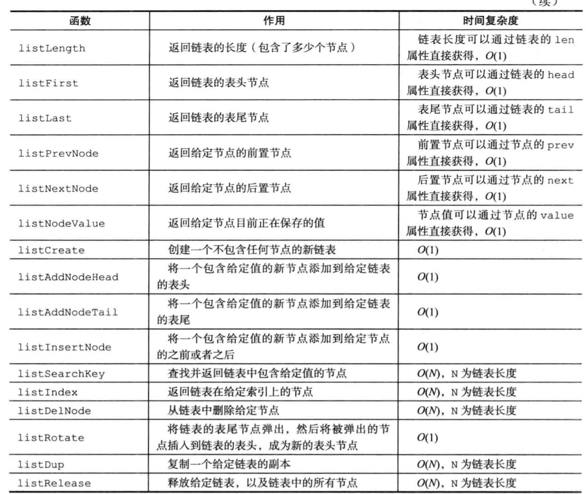

# linkedlist
## 结构
```c
typedef struct listNode {
    struct listNode *prev;
    struct listNode *next;
    void *value;
} listNode;

typedef struct list {
    listNode *head;
    listNode *tail;
    //复制、释放、比较函数
    void *(*dup)(void *ptr);
    void (*free)(void *ptr);
    int (*match)(void *ptr, void *key);
    unsigned long len;
} list;

//从头到尾
#define AL_START_HEAD 0 
//从尾到头
#define AL_START_TAIL 1
//链表迭代器
typedef struct listIter {
    listNode *next;
    //表示方向
    int direction;
} listIter;
```

## 初始化
```c
list *listCreate(void)
{
    struct list *list;

    if ((list = zmalloc(sizeof(*list))) == NULL)
        return NULL;
    list->head = list->tail = NULL;
    list->len = 0;
    list->dup = NULL;
    list->free = NULL;
    list->match = NULL;
    return list;
}
```

## 插入
### 从头部插入
```c
list *listAddNodeHead(list *list, void *value)
{
    listNode *node;

    if ((node = zmalloc(sizeof(*node))) == NULL)
        return NULL;
    node->value = value;
    if (list->len == 0) {
        list->head = list->tail = node;
        node->prev = node->next = NULL;
    } else {
        node->prev = NULL;
        node->next = list->head;
        list->head->prev = node;
        list->head = node;
    }
    list->len++;
    return list;
}
```

### 从尾部插入
```c
list *listAddNodeHead(list *list, void *value)
{
    listNode *node;

    if ((node = zmalloc(sizeof(*node))) == NULL)
        return NULL;
    node->value = value;
    if (list->len == 0) {
        list->head = list->tail = node;
        node->prev = node->next = NULL;
    } else {
        node->prev = NULL;
        node->next = list->head;
        list->head->prev = node;
        list->head = node;
    }
    list->len++;
    return list;
}
```

### 从具体节点位置插入
```c
//after->是否插入节点后面(1:是 0:否)
list *listInsertNode(list *list, listNode *old_node, void *value, int after) {
    listNode *node;

    if ((node = zmalloc(sizeof(*node))) == NULL)
        return NULL;
    node->value = value;
    if (after) {
        node->prev = old_node;
        node->next = old_node->next;
        //如果从节点后面插入，需要检查插入的位置是否是尾部
        if (list->tail == old_node) {
            list->tail = node;
        }
    } else {
        node->next = old_node;
        node->prev = old_node->prev;
        //如果从节点前面插入，需要检查插入的位置是否是头部
        if (list->head == old_node) {
            list->head = node;
        }
    }
    //需要调整插入位置前一个节点的的next指针和后一个节点的prev指针
    if (node->prev != NULL) {
        node->prev->next = node;
    }
    if (node->next != NULL) {
        node->next->prev = node;
    }
    list->len++;
    return list;
}
```

## 删除
### 删除具体节点
```c
void listDelNode(list *list, listNode *node)
{
    if (node->prev)
        node->prev->next = node->next;
    else
        list->head = node->next;
    if (node->next)
        node->next->prev = node->prev;
    else
        list->tail = node->prev;
    //先执行设置的释放函数，再释放内存空间
    if (list->free) list->free(node->value);
    zfree(node);
    list->len--;
}
```

### 清空链表(删除所有节点)
```c
void listEmpty(list *list)
{
    unsigned long len;
    listNode *current, *next;

    current = list->head;
    len = list->len;
    while(len--) {
        next = current->next;
        if (list->free) list->free(current->value);
        zfree(current);
        current = next;
    }
    list->head = list->tail = NULL;
    list->len = 0;
}
```

### 删除整个链表
```c
void listRelease(list *list)
{
    //先清空节点
    listEmpty(list);
    //再释放list的内存，如果直接释放list内存，会导致内存泄漏
    zfree(list);
}
```

## API和复杂度
   
   
