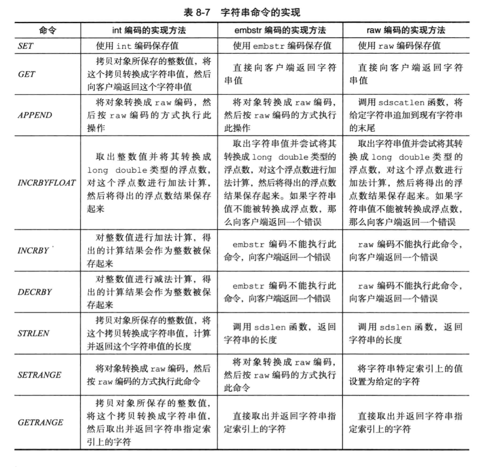
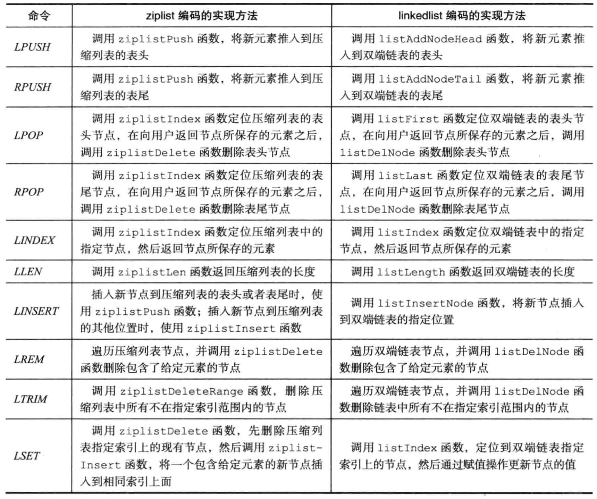
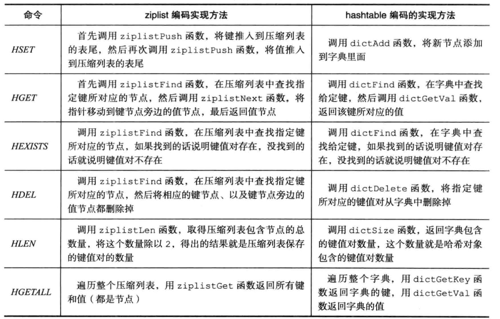
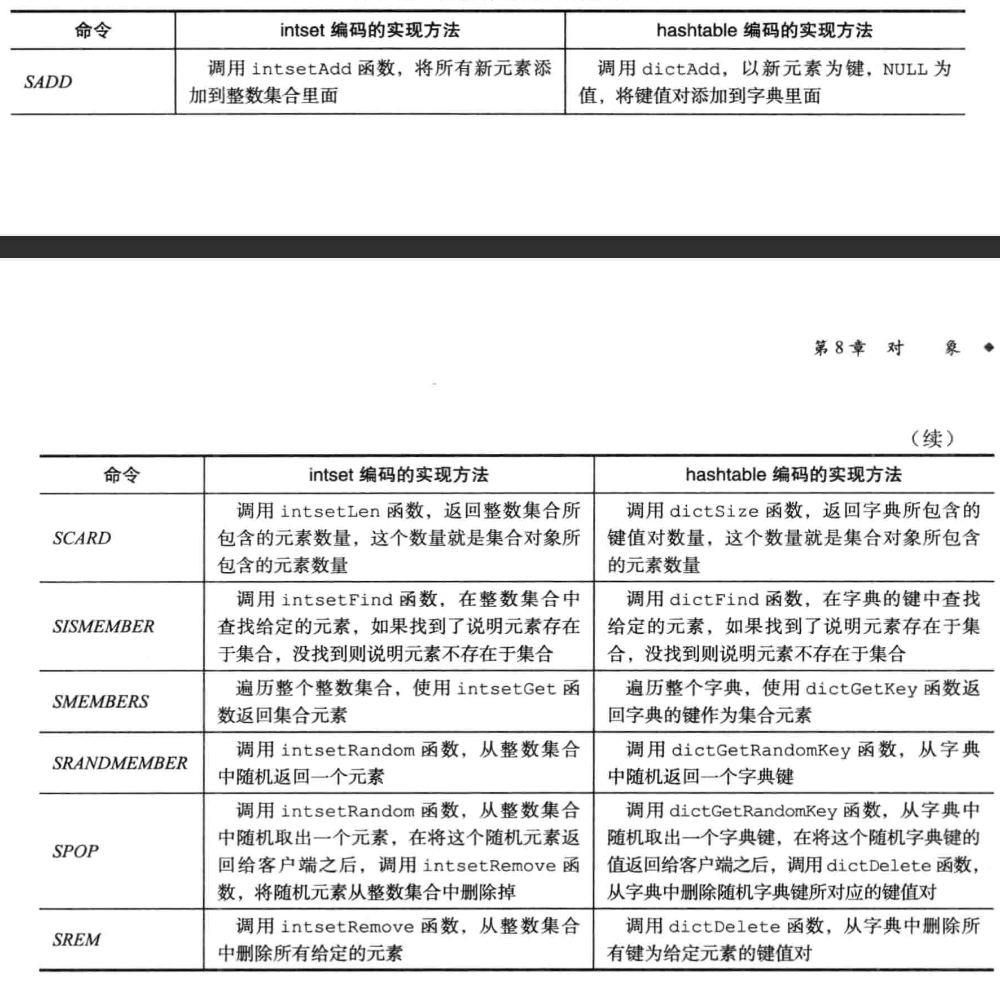
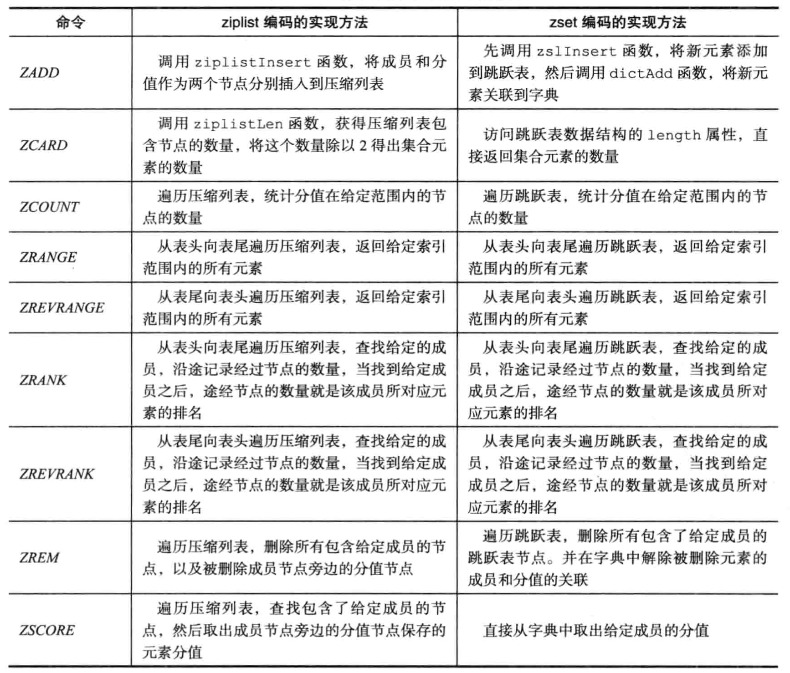
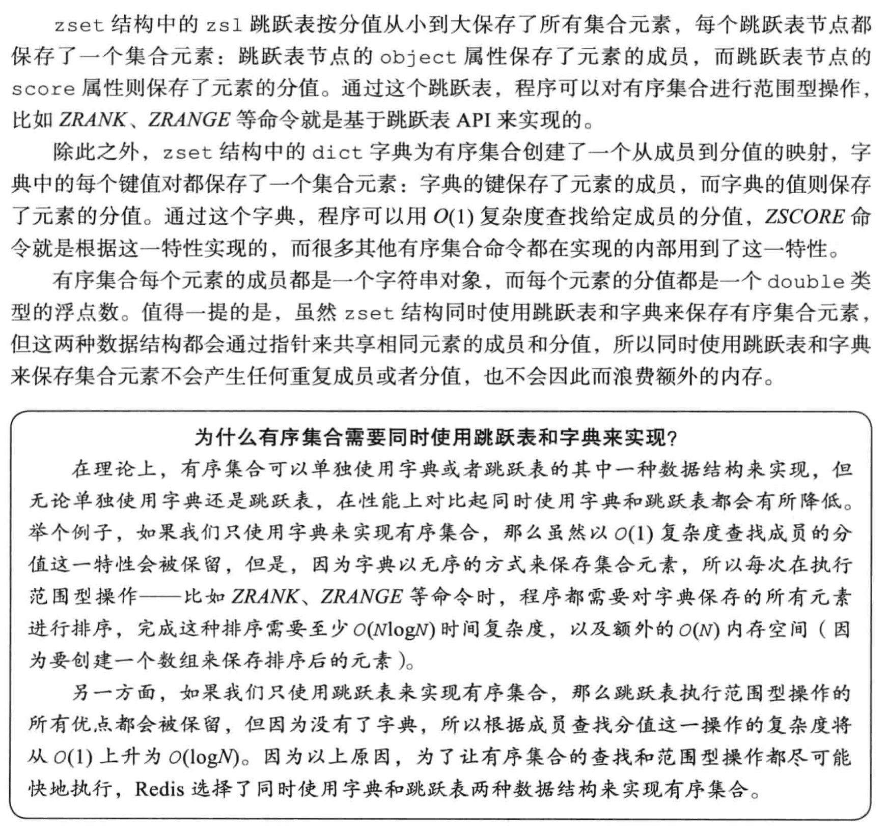

# 对象类型
`redis提供了多种基本数据类型，字符串、字典、链表、跳表、压缩表、整数集合，根据数据的长度、类型等使用不用类型去存储，衍生出字符串对象、列表对象、哈希对象、集合对象、有序集合对象五种对象，用于表示键值数据`

## obj结构
```c
//类型枚举值
#define OBJ_STRING 0    /* String object. */
#define OBJ_LIST 1      /* List object. */
#define OBJ_SET 2       /* Set object. */
#define OBJ_ZSET 3      /* Sorted set object. */
#define OBJ_HASH 4      /* Hash object. */

//编码枚举
#define OBJ_ENCODING_RAW 0     // sds
#define OBJ_ENCODING_INT 1     /* Encoded as integer */
#define OBJ_ENCODING_HT 2      /* Encoded as hash table */
#define OBJ_ENCODING_ZIPMAP 3  /* Encoded as zipmap */
#define OBJ_ENCODING_LINKEDLIST 4 /* No longer used: old list encoding. */
#define OBJ_ENCODING_ZIPLIST 5 /* Encoded as ziplist */
#define OBJ_ENCODING_INTSET 6  /* Encoded as intset */
#define OBJ_ENCODING_SKIPLIST 7  /* Encoded as skiplist */
#define OBJ_ENCODING_EMBSTR 8  //embstr编码的sds
#define OBJ_ENCODING_QUICKLIST 9 /* Encoded as linked list of ziplists */
#define OBJ_ENCODING_STREAM 10 /* Encoded as a radix tree of listpacks */

typedef struct redisObject {
    //对象类型
    unsigned type:4;
    //对象编码-由什么基础数据类型存储
    unsigned encoding:4;
    //对象最后一次被访问的时间
    unsigned lru:LRU_BITS; 
    //引用计数器
    int refcount;
    //指向底层的数据指针
    void *ptr;
} robj;
```

## 内存回收和对象共享
* redis实现了内存回收的机制，使用refcount记录对象被引用的次数，当该值变为0时，会被程序自动回收，增加了对象的复用，减少内存的分配。
* redis初始化时创建了0-9999的整数值，需要时直接使用。

## 字符串对象
### 编码
* OBJ_ENCODING_INT->保存的是整数->使用long类型存储
* OBJ_ENCODING_EMBSTR->字符串<32字节


* OBJ_ENCODING_RAW->字符串>32字节
### 命令



## 列表对象
### 编码
* OBJ_ENCODING_LINKEDLIST->已废弃
* OBJ_ENCODING_ZIPLIST->已废弃
  * 所有字符串长度<`list-max-ziplist-value`64字节
  * 元素个数<`list-max-ziplist-value`512
* OBJ_ENCODING_QUICKLIST
  链表默认实现
### 命令


## 哈希对象
### 编码
* OBJ_ENCODING_ZIPLIST
  * 键值对的数据小于 `hash-max-ziplist-entries`*2(512)
  * 键和值的长度小于 `hash-max-ziplist-value` (62)
* OBJ_ENCODING_HT
### 命令


## 集合对象
### 编码
* OBJ_ENCODING_INTSET
  * 数据都是整数
  * 数据数量小于`set-max-intset-entries`(512)
* OBJ_ENCODING_HT

### 命令


## 有序集合对象
### 编码
* OBJ_ENCODING_ZIPLIST
  使用两个数据项来存储数据，第一个数据项存放数据，第二个数据项存放分值，按分值从小到大。
  * 元素小于 `zset-max-ziplist-entries`
  * 所有成员长度小于 `zset-max-ziplist-value`
* OBJ_ENCODING_SKIPLIST(跳表+哈希表)
  ```c
  typedef struct zset {
    dict *dict;
    zskiplist *zsl;
  } zset;
  ```
### 命令



## Q&A
### 为什么使用跳表+哈希表实现有序集合？



摘抄自《Redis设计与实现》