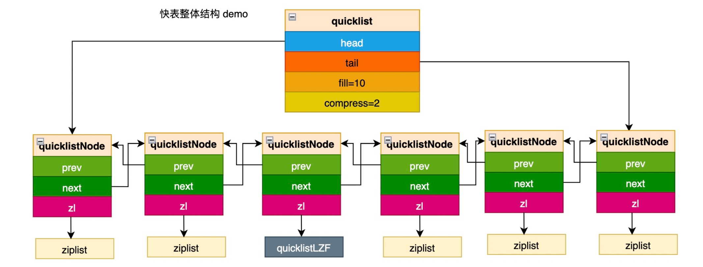

# quicklist



## 结构

```c
typedef struct quicklist {
    quicklistNode *head;
    quicklistNode *tail;
    //数据数量，每个节点ziplist数据的总和
    unsigned long count;        
    //quicklistNode数量
    unsigned long len;  
    /*
        正数->表示ziplist最多包含的数据项，默认16(数量限制)
        负数->表示ziplist的长度不能超过多少(长度限制)
            -1，ziplist 不超过 4k；
            -2，ziplist 不超过 8k；
            -3，ziplist 不超过 16k；
            -4，ziplist 不超过 32k；
            -5，ziplist 不超过 64k；
    */        
    int fill : QL_FILL_BITS;              
    //链表两端有多少节点不需要压缩，因为链表两端操作频繁，不压缩提高效率
    unsigned int compress : QL_COMP_BITS; 
    unsigned int bookmark_count: QL_BM_BITS;
    quicklistBookmark bookmarks[];
} quicklist;

typedef struct quicklistNode {
    struct quicklistNode *prev;
    struct quicklistNode *next;
    //ziplist指针
    unsigned char *zl;
    //ziplist的长度
    unsigned int sz;             /* ziplist size in bytes */
    unsigned int count : 16;     /* count of items in ziplist */
    //编码，1->ziplist，2->使用lzf压缩的ziplist
    unsigned int encoding : 2;  
    unsigned int container : 2;  /* NONE==1 or ZIPLIST==2 */
    unsigned int recompress : 1; //节点是否被临时解压，例如往节点插入数据，需要先解压，操作完成后再压缩
    unsigned int attempted_compress : 1; //测试使用
    unsigned int extra : 10; /* more bits to steal for future usage */
} quicklistNode;
```

```c
//迭代器
typedef struct quicklistIter {
    const quicklist *quicklist;
    quicklistNode *current;
    //指向ziplist中下一个读取数据位置
    unsigned char *zi;
    //遍历数据的偏移量(相对头部)
    long offset;
    //遍历方向
    int direction;
} quicklistIter;

//辅助结构 指向节点中的一个数据项
typedef struct quicklistEntry {
    const quicklist *quicklist;
    quicklistNode *node;
    //指向ziplist中下一个读取数据位置
    unsigned char *zi;
    //如果数据项是字节数组，sz表示数组长度，value数组指针；如果是整数，存放在longval中
    unsigned int sz;
    unsigned char *value;
    long long longval;
    //目标数据项的位置(可能大于0或者小于0)
    int offset;
} quicklistEntry;
```

## 创建quicklist

```c
quicklist *quicklistCreate(void) {
    struct quicklist *quicklist;

    quicklist = zmalloc(sizeof(*quicklist));
    quicklist->head = quicklist->tail = NULL;
    quicklist->len = 0;
    quicklist->count = 0;
    quicklist->compress = 0;
    //默认ziplist长度不超过8k
    quicklist->fill = -2;
    quicklist->bookmark_count = 0;
    return quicklist;
}

quicklist *quicklistNew(int fill, int compress) {
    quicklist *quicklist = quicklistCreate();
    quicklistSetOptions(quicklist, fill, compress);
    return quicklist;
}
```

## 销毁quicklist

```c
void quicklistRelease(quicklist *quicklist) {
    unsigned long len;
    quicklistNode *current, *next;

    current = quicklist->head;
    len = quicklist->len;
    while (len--) {
        next = current->next;
        //释放数据内存
        zfree(current->zl);
        //减去数据数量
        quicklist->count -= current->count;
        //释放节点内存
        zfree(current);
        //节点数量-1
        quicklist->len--;
        current = next;
    }
    quicklistBookmarksClear(quicklist);
    zfree(quicklist);
}

void quicklistBookmarksClear(quicklist *ql) {
    while (ql->bookmark_count)
        zfree(ql->bookmarks[--ql->bookmark_count].name);
    /* NOTE: We do not shrink (realloc) the quick list. main use case for this
     * function is just before releasing the allocation. */
}
```

## 插入数据

### 头部插入

```c
//往头部插入一个数据项 返回值:0->插入已存在的头节点 1->插入新创建的头节点
int quicklistPushHead(quicklist *quicklist, void *value, size_t sz) {
    //记录当前头节点用于最后判断是否新生成了新的头节点
    quicklistNode *orig_head = quicklist->head;
    //判断头节点是否允许插入
    if (likely(
            _quicklistNodeAllowInsert(quicklist->head, quicklist->fill, sz))) {
        //调用ziplist的首端插入方法
        quicklist->head->zl =
            ziplistPush(quicklist->head->zl, value, sz, ZIPLIST_HEAD);
        //更新sz的值
        quicklistNodeUpdateSz(quicklist->head);
    } else {
        //头节点数据满了，创建新的头节点
        quicklistNode *node = quicklistCreateNode();
        node->zl = ziplistPush(ziplistNew(), value, sz, ZIPLIST_HEAD);

        quicklistNodeUpdateSz(node);
        //将新的头节点插入quicklist
        _quicklistInsertNodeBefore(quicklist, quicklist->head, node);
    }
    //更新整个list的数据数量和头节点的数据数量
    quicklist->count++;
    quicklist->head->count++;
    return (orig_head != quicklist->head);
}

REDIS_STATIC int _quicklistNodeAllowInsert(const quicklistNode *node,
                                           const int fill, const size_t sz) {
    if (unlikely(!node))
        return 0;

    int ziplist_overhead;
    //往节点的ziplist插入一个数据项，计算需要多少长度，这里涉及到ziplist的知识
    //需要的长度=previous_entry_length+encoding+sz
    //计算previous_entry_length
    if (sz < 254)
        ziplist_overhead = 1;
    else
        ziplist_overhead = 5;

    //计算encoding
    if (sz < 64)
        ziplist_overhead += 1;
    else if (likely(sz < 16384))
        ziplist_overhead += 2;
    else
        ziplist_overhead += 5;

    //新的长度是否超过配置
    unsigned int new_sz = node->sz + sz + ziplist_overhead;
    if (likely(_quicklistNodeSizeMeetsOptimizationRequirement(new_sz, fill)))
        return 1;
    //到这里说明fill>0，限制的是ziplist中数据项的数量，这里为了安全，虽然用户设置了数量，但是数据的长度已经>8k，也不允许插入，保证ziplist的长度不会过大(fill的配置失效)
    else if (!sizeMeetsSafetyLimit(new_sz))
        return 0;
    else if ((int)node->count < fill)
        return 1;
    else
        return 0;
}

//判断插入后ziplist的长度是否超过设定的值(fill<0)
_quicklistNodeSizeMeetsOptimizationRequirement(const size_t sz,
                                               const int fill) {
    //fill>0，表示数量，直接返回
    if (fill >= 0)
        return 0;

    size_t offset = (-fill) - 1;
    if (offset < (sizeof(optimization_level) / sizeof(*optimization_level))) {
        if (sz <= optimization_level[offset]) {
            return 1;
        } else {
            return 0;
        }
    } else {
        return 0;
    }
}

#define sizeMeetsSafetyLimit(sz) ((sz) <= SIZE_SAFETY_LIMIT)
#define SIZE_SAFETY_LIMIT 8192
```

### 尾部插入

和首部插入原理一致

```c
int quicklistPushTail(quicklist *quicklist, void *value, size_t sz) {
    quicklistNode *orig_tail = quicklist->tail;
    assert(sz < UINT32_MAX); /* TODO: add support for quicklist nodes that are sds encoded (not zipped) */
    if (likely(
            _quicklistNodeAllowInsert(quicklist->tail, quicklist->fill, sz))) {
        quicklist->tail->zl =
            ziplistPush(quicklist->tail->zl, value, sz, ZIPLIST_TAIL);
        quicklistNodeUpdateSz(quicklist->tail);
    } else {
        quicklistNode *node = quicklistCreateNode();
        node->zl = ziplistPush(ziplistNew(), value, sz, ZIPLIST_TAIL);

        quicklistNodeUpdateSz(node);
        _quicklistInsertNodeAfter(quicklist, quicklist->tail, node);
    }
    quicklist->count++;
    quicklist->tail->count++;
    return (orig_tail != quicklist->tail);
}
```

### 在指定位置插入数据

在指定位置插入数据会比在头尾插入复杂，因为需要考虑插入的位置所在的ziplist是否已经满了，满了需要判断插入的是ziplist的位置时中间，那需要将这个节点分为两个；如果插入的是末尾，需要判断目标下一个节点的ziplist是否满了；如果插入的是头部，需要判断上一个节点的ziplist是否满了；再根据不同情况处理。

```c
/*
    在entry(现存)的后面 or 前面(after)插入数据
*/
REDIS_STATIC void _quicklistInsert(quicklist *quicklist, quicklistEntry *entry,
                                   void *value, const size_t sz, int after) {
    /*
        full:entry->node的ziplist是否满了
        full_next:entry->node->next的ziplist是否满了
        full_prev:entry->node->prev的ziplist是否满了
        at_tail:插入目标数据项的后面并且插入最后的位置
        at_head:插入目标数据项的前面并且插入开头的位置
    */
    int full = 0, at_tail = 0, at_head = 0, full_next = 0, full_prev = 0;
    int fill = quicklist->fill;
    quicklistNode *node = entry->node;
    quicklistNode *new_node = NULL;

    //指定插入的节点是空的，创建一个新的节点后直接返回
    if (!node) {
        /* we have no reference node, so let's create only node in the list */
        D("No node given!");
        new_node = quicklistCreateNode();
        new_node->zl = ziplistPush(ziplistNew(), value, sz, ZIPLIST_HEAD);
        __quicklistInsertNode(quicklist, NULL, new_node, after);
        new_node->count++;
        quicklist->count++;
        return;
    }

    //判断指定节点ziplist是否已经满了
    if (!_quicklistNodeAllowInsert(node, fill, sz)) {
        D("Current node is full with count %d with requested fill %lu",
          node->count, fill);
        full = 1;
    }

    //判断插入目标数据项的后面并且插入最后的位置
    if (after && (entry->offset == node->count)) {
        D("At Tail of current ziplist");
        at_tail = 1;
        if (!_quicklistNodeAllowInsert(node->next, fill, sz)) {
            D("Next node is full too.");
            full_next = 1;
        }
    }

    //判断插入目标数据项的前面并且插入开头的位置
    if (!after && (entry->offset == 0)) {
        D("At Head");
        at_head = 1;
        if (!_quicklistNodeAllowInsert(node->prev, fill, sz)) {
            D("Prev node is full too.");
            full_prev = 1;
        }
    }

    //目标节点的ziplist不满，插入的是后面
    if (!full && after) {
        D("Not full, inserting after current position.");
        //解压缩节点数据
        quicklistDecompressNodeForUse(node);
        //查询插入位置的指针
        unsigned char *next = ziplistNext(node->zl, entry->zi);
        //next为空表示插入尾部，否则是插入next位置
        if (next == NULL) {
            node->zl = ziplistPush(node->zl, value, sz, ZIPLIST_TAIL);
        } else {
            node->zl = ziplistInsert(node->zl, next, value, sz);
        }
        node->count++;
        quicklistNodeUpdateSz(node);
        //插入后再压缩节点数据
        quicklistRecompressOnly(quicklist, node);
    } else if (!full && !after) {
        //目标节点的ziplist不满，插入的是前面
        D("Not full, inserting before current position.");
        quicklistDecompressNodeForUse(node);
        node->zl = ziplistInsert(node->zl, entry->zi, value, sz);
        node->count++;
        quicklistNodeUpdateSz(node);
        quicklistRecompressOnly(quicklist, node);
    } else if (full && at_tail && node->next && !full_next && after) {
        //插入的是node节点的尾部并且node->next不是满的，插入node->next的头部
        D("Full and tail, but next isn't full; inserting next node head");
        new_node = node->next;
        quicklistDecompressNodeForUse(new_node);
        new_node->zl = ziplistPush(new_node->zl, value, sz, ZIPLIST_HEAD);
        new_node->count++;
        quicklistNodeUpdateSz(new_node);
        quicklistRecompressOnly(quicklist, new_node);
    } else if (full && at_head && node->prev && !full_prev && !after) {
        //插入的是node节点的头部并且node->prev不是满的，插入node->prev的尾部
        D("Full and head, but prev isn't full, inserting prev node tail");
        new_node = node->prev;
        quicklistDecompressNodeForUse(new_node);
        new_node->zl = ziplistPush(new_node->zl, value, sz, ZIPLIST_TAIL);
        new_node->count++;
        quicklistNodeUpdateSz(new_node);
        quicklistRecompressOnly(quicklist, new_node);
    } else if (full && ((at_tail && node->next && full_next && after) ||
                        (at_head && node->prev && full_prev && !after))) {
        //插入的是node的头部或者尾部并且前后节点都满了，那就创建一个新的节点(包含插入数据)，再插入node的前后位置
        D("\tprovisioning new node...");
        new_node = quicklistCreateNode();
        new_node->zl = ziplistPush(ziplistNew(), value, sz, ZIPLIST_HEAD);
        new_node->count++;
        quicklistNodeUpdateSz(new_node);
        __quicklistInsertNode(quicklist, node, new_node, after);
    } else if (full) {
        //node不满，插入的是中间位置，需要把node分离为两个节点
        /* else, node is full we need to split it. */
        /* covers both after and !after cases */
        D("\tsplitting node...");
        quicklistDecompressNodeForUse(node);
        //分离新的节点
        new_node = _quicklistSplitNode(node, entry->offset, after);
        new_node->zl = ziplistPush(new_node->zl, value, sz,
                                   after ? ZIPLIST_HEAD : ZIPLIST_TAIL);
        new_node->count++;
        quicklistNodeUpdateSz(new_node);
        //将分离出来的节点插入
        __quicklistInsertNode(quicklist, node, new_node, after);
        //尝试合并数据
        _quicklistMergeNodes(quicklist, node);
    }

    quicklist->count++;
}
```

```c
/*
    将node的ziplist按offset位置切分生存两个节点，返回哪一个节点取决于after参数：
    after==1 返回的节点数据包含 [offset+1,end]
    after==0 返回的节点数据包含 [0,offset-1]
*/
//复制node节点，并按照offset删除两个节点的一部分数据
REDIS_STATIC quicklistNode *_quicklistSplitNode(quicklistNode *node, int offset,
                                                int after) {
    size_t zl_sz = node->sz;

    quicklistNode *new_node = quicklistCreateNode();
    new_node->zl = zmalloc(zl_sz);

    /* Copy original ziplist so we can split it */
    memcpy(new_node->zl, node->zl, zl_sz);

    //确定两个节点删除的范围
    int orig_start = after ? offset + 1 : 0;
    int orig_extent = after ? -1 : offset;
    int new_start = after ? 0 : offset;
    int new_extent = after ? offset + 1 : -1;

    D("After %d (%d); ranges: [%d, %d], [%d, %d]", after, offset, orig_start,
      orig_extent, new_start, new_extent);

    node->zl = ziplistDeleteRange(node->zl, orig_start, orig_extent);
    node->count = ziplistLen(node->zl);
    quicklistNodeUpdateSz(node);

    new_node->zl = ziplistDeleteRange(new_node->zl, new_start, new_extent);
    new_node->count = ziplistLen(new_node->zl);
    quicklistNodeUpdateSz(new_node);

    D("After split lengths: orig (%d), new (%d)", node->count, new_node->count);
    return new_node;
}
```

```c
//节点合并操作，将center节点两侧各两个节点进行11合并
REDIS_STATIC void _quicklistMergeNodes(quicklist *quicklist,
                                       quicklistNode *center) {
    int fill = quicklist->fill;
    quicklistNode *prev, *prev_prev, *next, *next_next, *target;
    prev = prev_prev = next = next_next = target = NULL;

    if (center->prev) {
        prev = center->prev;
        if (center->prev->prev)
            prev_prev = center->prev->prev;
    }

    if (center->next) {
        next = center->next;
        if (center->next->next)
            next_next = center->next->next;
    }

    //尝试合并前两个节点
    if (_quicklistNodeAllowMerge(prev, prev_prev, fill)) {
        _quicklistZiplistMerge(quicklist, prev_prev, prev);
        prev_prev = prev = NULL; /* they could have moved, invalidate them. */
    }

    //尝试合并后两个节点
    if (_quicklistNodeAllowMerge(next, next_next, fill)) {
        _quicklistZiplistMerge(quicklist, next, next_next);
        next = next_next = NULL; /* they could have moved, invalidate them. */
    }

    //尝试合并center和前一个节点
    if (_quicklistNodeAllowMerge(center, center->prev, fill)) {
        //center和前一个节点合并后center失效，记录合并后的节点
        target = _quicklistZiplistMerge(quicklist, center->prev, center);
        center = NULL; /* center could have been deleted, invalidate it. */
    } else {
        target = center;
    }

    //target和后一个节点合并
    if (_quicklistNodeAllowMerge(target, target->next, fill)) {
        _quicklistZiplistMerge(quicklist, target, target->next);
    }
}
//判断两个节点是否可以合并
REDIS_STATIC int _quicklistNodeAllowMerge(const quicklistNode *a,
                                          const quicklistNode *b,
                                          const int fill) {
    if (!a || !b)
        return 0;

    //计算合并后ziplist的长度 两个ziplist合并为1个只需要一份head和tail数据->-11
    unsigned int merge_sz = a->sz + b->sz - 11;
    if (likely(_quicklistNodeSizeMeetsOptimizationRequirement(merge_sz, fill)))
        return 1;
    /* when we return 1 above we know that the limit is a size limit (which is
     * safe, see comments next to optimization_level and SIZE_SAFETY_LIMIT) */
    else if (!sizeMeetsSafetyLimit(merge_sz))
        return 0;
    else if ((int)(a->count + b->count) <= fill)
        return 1;
    else
        return 0;
}

REDIS_STATIC quicklistNode *_quicklistZiplistMerge(quicklist *quicklist,
                                                   quicklistNode *a,
                                                   quicklistNode *b) {
    //解压节点数据
    quicklistDecompressNode(a);
    quicklistDecompressNode(b);
    //调用ziplist合并
    if ((ziplistMerge(&a->zl, &b->zl))) {
        //选择要保留的节点
        quicklistNode *keep = NULL, *nokeep = NULL;
        if (!a->zl) {
            nokeep = a;
            keep = b;
        } else if (!b->zl) {
            nokeep = b;
            keep = a;
        }
        keep->count = ziplistLen(keep->zl);
        quicklistNodeUpdateSz(keep);

        nokeep->count = 0;
        __quicklistDelNode(quicklist, nokeep);
        quicklistCompress(quicklist, keep);
        return keep;
    } else {
        /* else, the merge returned NULL and nothing changed. */
        return NULL;
    }
}
```

## 插入节点

```c
REDIS_STATIC void _quicklistInsertNodeBefore(quicklist *quicklist,
                                             quicklistNode *old_node,
                                             quicklistNode *new_node) {
    __quicklistInsertNode(quicklist, old_node, new_node, 0);
}

REDIS_STATIC void _quicklistInsertNodeAfter(quicklist *quicklist,
                                            quicklistNode *old_node,
                                            quicklistNode *new_node) {
    __quicklistInsertNode(quicklist, old_node, new_node, 1);
}
```

```c
//在old_node的前面or后面插入new_node节点 after:1->后面 0->前面
REDIS_STATIC void __quicklistInsertNode(quicklist *quicklist,
                                        quicklistNode *old_node,
                                        quicklistNode *new_node, int after) {
    if (after) {
        new_node->prev = old_node;
        if (old_node) {
            new_node->next = old_node->next;
            if (old_node->next)
                old_node->next->prev = new_node;
            old_node->next = new_node;
        }
        if (quicklist->tail == old_node)
            quicklist->tail = new_node;
    } else {
        new_node->next = old_node;
        if (old_node) {
            new_node->prev = old_node->prev;
            if (old_node->prev)
                old_node->prev->next = new_node;
            old_node->prev = new_node;
        }
        if (quicklist->head == old_node)
            quicklist->head = new_node;
    }
    /* If this insert creates the only element so far, initialize head/tail. */
    if (quicklist->len == 0) {
        quicklist->head = quicklist->tail = new_node;
    }

    /* Update len first, so in __quicklistCompress we know exactly len */
    quicklist->len++;

    //每次插入数据，都要进行压缩操作
    if (old_node)
        quicklistCompress(quicklist, old_node);
}
```

## 查找

### 查找指定位置数据

先找到目标数据项存放的节点，再从ziplist中解析出数据，存放到entry中返回。

```c
//idx:大于等于0，表示正向查找第idx个数据项，0表示head；小于0，表示反向查找第idx个数据项，-1表示tail
//结果存放在entry中
int quicklistIndex(const quicklist *quicklist, const long long idx,
                   quicklistEntry *entry) {
    //指向下一个遍历的节点
    quicklistNode *n;
    //统计遍历过的数据项数量
    unsigned long long accum = 0;
    //遍历节点的个数
    unsigned long long index;
    //正向 or 反向
    int forward = idx < 0 ? 0 : 1; /* < 0 -> reverse, 0+ -> forward */

    initEntry(entry);
    entry->quicklist = quicklist;

    if (!forward) {
        index = (-idx) - 1;
        n = quicklist->tail;
    } else {
        index = idx;
        n = quicklist->head;
    }

    if (index >= quicklist->count)
        return 0;
    //找到目标数据项存在的节点
    while (likely(n)) {
        //如果统计已经遍历的数据项数量大于要查找的，直接跳出
        if ((accum + n->count) > index) {
            break;
        } else {
            accum += n->count;
            n = forward ? n->next : n->prev;
        }
    }

    if (!n)
        return 0;

    entry->node = n;
    if (forward) {
        /* forward = normal head-to-tail offset. */
        entry->offset = index - accum;
    } else {
        /* reverse = need negative offset for tail-to-head, so undo
         * the result of the original if (index < 0) above. */
        entry->offset = (-index) - 1 + accum;
    }
    //对查找出来的节点进行解压缩，因为查找完需要使用数据
    quicklistDecompressNodeForUse(entry->node);
    //解析ziplist目标位置的数据，存放到entry中
    entry->zi = ziplistIndex(entry->node->zl, entry->offset);
    if (!ziplistGet(entry->zi, &entry->value, &entry->sz, &entry->longval))
        assert(0);
    return 1;
}
```

## 数据解压和压缩

### 压缩

需要压缩的两种情况：

* 节点需要修改，先被解压缩，这时候compress=1，操作后需要压缩，这时候会判断compress的值是否为1，直接压缩节点即可
* 插入了新的节点，需要扫描整个quicklist，大致过程：最开始quicklist中节点个数小于compress*2，不需要压缩，直接跳过，当加入第compress*2+1个节点的时候，从左右两端像中间遍历compress次，把节点数据解压缩，停止时forward和reserve指向的节点就是最后加入的节点，需要压缩，随后不停的加入数据，重复上述流程，只需要压缩遍历停止时forward和reserve指向的节点，因为内侧的数据在上一次遍历时候已经压缩了，因为插入节点的位置是任意的，这里还需要额外记录插入的节点是否被遍历到，如果没有，说明位置在内侧，需要被压缩。

```c
#define quicklistCompress(_ql, _node)                                          \
    do {                                                                       \
        //节点被临时解压缩，直接压缩即可，不需要扫描整个quicklist
        if ((_node)->recompress)                                               \
            quicklistCompressNode((_node));                                    \
        else                                                                   \
            //涉及到节点的增删，需要检查整个quicklist
            __quicklistCompress((_ql), (_node));                               \
    } while (0)

#define quicklistCompressNode(_node)                                           \
    do {                                                                       \
        if ((_node) && (_node)->encoding == QUICKLIST_NODE_ENCODING_RAW) {     \
            __quicklistCompressNode((_node));                                  \
        }                                                                      \
    } while (0)
```

```c
#define MIN_COMPRESS_BYTES 48
REDIS_STATIC int __quicklistCompressNode(quicklistNode *node) {
    //如果长度小于设定值，不压缩
    if (node->sz < MIN_COMPRESS_BYTES)
        return 0;

    quicklistLZF *lzf = zmalloc(sizeof(*lzf) + node->sz);

    //如果压缩后的数据长度没有节省8字节以上的长度，就取消压缩
    if (((lzf->sz = lzf_compress(node->zl, node->sz, lzf->compressed,
                                 node->sz)) == 0) ||
        lzf->sz + MIN_COMPRESS_IMPROVE >= node->sz) {
        /* lzf_compress aborts/rejects compression if value not compressable. */
        zfree(lzf);
        return 0;
    }
    lzf = zrealloc(lzf, sizeof(*lzf) + lzf->sz);
    zfree(node->zl);
    node->zl = (unsigned char *)lzf;
    node->encoding = QUICKLIST_NODE_ENCODING_LZF;
    node->recompress = 0;
    return 1;
}
```

```c
REDIS_STATIC void __quicklistCompress(const quicklist *quicklist,
                                      quicklistNode *node) {
    //检查压缩机制是否开启(comparess=0=off)和节点长度是否>comparess*2
    if (!quicklistAllowsCompression(quicklist) ||
        quicklist->len < (unsigned int)(quicklist->compress * 2))
        return;

    //从左右两端像中间遍历comparess个节点，将节点数据解压
    quicklistNode *forward = quicklist->head;
    quicklistNode *reverse = quicklist->tail;
    int depth = 0;
    int in_depth = 0;
    while (depth++ < quicklist->compress) {
        quicklistDecompressNode(forward);
        quicklistDecompressNode(reverse);
        //如果遍历到目标节点，记录
        if (forward == node || reverse == node)
            in_depth = 1;

        if (forward == reverse || forward->next == reverse)
            return;

        forward = forward->next;
        reverse = reverse->prev;
    }
    //如果没有遍历到目标节点，说明在中间，需要压缩
    if (!in_depth)
        quicklistCompressNode(node);

    /* At this point, forward and reverse are one node beyond depth */
    quicklistCompressNode(forward);
    quicklistCompressNode(reverse);
}
```

### 解压

```c
#define quicklistDecompressNode(_node)                                         \
    do {                                                                       \
        if ((_node) && (_node)->encoding == QUICKLIST_NODE_ENCODING_LZF) {     \
            __quicklistDecompressNode((_node));                                \
        }                                                                      \
    } while (0)
```

```c
REDIS_STATIC int __quicklistDecompressNode(quicklistNode *node) {
    void *decompressed = zmalloc(node->sz);
    quicklistLZF *lzf = (quicklistLZF *)node->zl;
    if (lzf_decompress(lzf->compressed, lzf->sz, decompressed, node->sz) == 0) {
        /* Someone requested decompress, but we can't decompress.  Not good. */
        zfree(decompressed);
        return 0;
    }
    zfree(lzf);
    node->zl = decompressed;
    node->encoding = QUICKLIST_NODE_ENCODING_RAW;
    return 1;
}
```

```c
#define quicklistDecompressNodeForUse(_node)                                   \
    do {                                                                       \
        if ((_node) && (_node)->encoding == QUICKLIST_NODE_ENCODING_LZF) {     \
            __quicklistDecompressNode((_node));                                \
            (_node)->recompress = 1;                                           \
        }                                                                      \
    } while (0)
```

## 删除

```c
//删除entry中记录的数据
void quicklistDelEntry(quicklistIter *iter, quicklistEntry *entry) {
    quicklistNode *prev = entry->node->prev;
    quicklistNode *next = entry->node->next;
    //删除zi指向的数据
    int deleted_node = quicklistDelIndex((quicklist *)entry->quicklist,
                                         entry->node, &entry->zi);

    //删除数据项后内存空间被释放，需要把zi置为空
    iter->zi = NULL;

    //删除数据项后节点被删除了(因为数据项个数为0)，需要更新迭代器的信息
    if (deleted_node) {
        if (iter->direction == AL_START_HEAD) {
            iter->current = next;
            iter->offset = 0;
        } else if (iter->direction == AL_START_TAIL) {
            iter->current = prev;
            iter->offset = -1;
        }
    }
    /* else if (!deleted_node), no changes needed.
     * we already reset iter->zi above, and the existing iter->offset
     * doesn't move again because:
     *   - [1, 2, 3] => delete offset 1 => [1, 3]: next element still offset 1
     *   - [1, 2, 3] => delete offset 0 => [2, 3]: next element still offset 0
     *  if we deleted the last element at offet N and now
     *  length of this ziplist is N-1, the next call into
     *  quicklistNext() will jump to the next node. */
}

//返回值:1->节点被删除 0->节点没有被删除
REDIS_STATIC int quicklistDelIndex(quicklist *quicklist, quicklistNode *node,
                                   unsigned char **p) {
    int gone = 0;

    node->zl = ziplistDelete(node->zl, p);
    node->count--;
    //如果节点数据项的个数为0，把节点删除
    if (node->count == 0) {
        gone = 1;
        __quicklistDelNode(quicklist, node);
    } else {
        quicklistNodeUpdateSz(node);
    }
    quicklist->count--;
    /* If we deleted the node, the original node is no longer valid */
    return gone ? 1 : 0;
}
```

## 遍历

快表使用迭代器进行遍历，在使用迭代器遍历过程中，如果插入了新的数据，需要重新获取迭代器；可以使用quicklistDelEntry删除数据。

### 迭代器使用方式

```c
  iter = quicklistGetIterator(quicklist,<direction>);
  quicklistEntry entry;
  while (quicklistNext(iter, &entry)) {
      if (entry.value)
           [[ use entry.value with entry.sz ]]
      else
           [[ use entry.longval ]]
  }
```

### 创建迭代器

```c
//获取迭代器 direction:遍历方向
quicklistIter *quicklistGetIterator(const quicklist *quicklist, int direction) {
    quicklistIter *iter;

    iter = zmalloc(sizeof(*iter));

    if (direction == AL_START_HEAD) {
        iter->current = quicklist->head;
        iter->offset = 0;
    } else if (direction == AL_START_TAIL) {
        iter->current = quicklist->tail;
        iter->offset = -1;
    }

    iter->direction = direction;
    iter->quicklist = quicklist;
    //没有指向任务节点数据
    iter->zi = NULL;

    return iter;
}
```

```c
//创建指定位置的迭代器
quicklistIter *quicklistGetIteratorAtIdx(const quicklist *quicklist,
                                         const int direction,
                                         const long long idx) {
    quicklistEntry entry;
    //查询idx个数据，并把信息记录在entry中
    if (quicklistIndex(quicklist, idx, &entry)) {
        quicklistIter *base = quicklistGetIterator(quicklist, direction);
        base->zi = NULL;
        base->current = entry.node;
        base->offset = entry.offset;
        return base;
    } else {
        return NULL;
    }
}
```

### 移动迭代器

```c
//将迭代器指向的数据信息存储到entry中
int quicklistNext(quicklistIter *iter, quicklistEntry *entry) {
    initEntry(entry);

    entry->quicklist = iter->quicklist;
    entry->node = iter->current;

    if (!iter->current) {
        D("Returning because current node is NULL")
        return 0;
    }

    //移动zi指针的方法，因为遍历方向的不同，所以有两种实现方式，向前 or 向后
    unsigned char *(*nextFn)(unsigned char *, unsigned char *) = NULL;
    //offset的增量，从头部开始遍历>0；从尾部遍历<0
    int offset_update = 0;
    /*
        zi为空的情况：1.初始化 2.节点遍历完成
        处理流程：
        1.如果zi为空，先解压数据并初始化zi，再进行数据提取；
        2.如果zi不为空，因为当前指向的数据已经被遍历过，先把迭代器移动到下一个数据项位置；这时还需要判断zi是否为空，因为当前节点的数据可能遍历完了，把当前节点数据压缩，并移动到下一个节点，把zi置空重新调用quicklistNext走1流程。
    */
    if (!iter->zi) {
        //临时将节点数据解压缩
        quicklistDecompressNodeForUse(iter->current);
        iter->zi = ziplistIndex(iter->current->zl, iter->offset);
    } else {
        //zi不为空，需要移动到下一个数据项
        if (iter->direction == AL_START_HEAD) {
            nextFn = ziplistNext;
            offset_update = 1;
        } else if (iter->direction == AL_START_TAIL) {
            nextFn = ziplistPrev;
            offset_update = -1;
        }
        iter->zi = nextFn(iter->current->zl, iter->zi);
        iter->offset += offset_update;
    }

    entry->zi = iter->zi;
    entry->offset = iter->offset;
    //这里需要判断是否zi为空，因为当前节点数据可能遍历完
    if (iter->zi) {
        /* Populate value from existing ziplist position */
        ziplistGet(entry->zi, &entry->value, &entry->sz, &entry->longval);
        return 1;
    } else {
        //当前数据项遍历完，移动到下一个节点
        quicklistCompress(iter->quicklist, iter->current);
        if (iter->direction == AL_START_HEAD) {
            /* Forward traversal */
            D("Jumping to start of next node");
            iter->current = iter->current->next;
            iter->offset = 0;
        } else if (iter->direction == AL_START_TAIL) {
            /* Reverse traversal */
            D("Jumping to end of previous node");
            iter->current = iter->current->prev;
            iter->offset = -1;
        }
        iter->zi = NULL;
        return quicklistNext(iter, entry);
    }
}
```

### 销毁迭代器

```c
//因为每次遍历都会先解压缩数据，所以销毁迭代器时先把指向的节点数据压缩，然后释放迭代器内存即可
void quicklistReleaseIterator(quicklistIter *iter) {
    if (iter->current)
        quicklistCompress(iter->quicklist, iter->current);

    zfree(iter);
}
```

## Q&A

### 进行节点合并的意义

链表两端的操作多，中间数据使用比较少，合并有利于减少节点数量，使得节点的数据更加紧凑，提高缓存的作用，提高读取效率。

### LZF压缩算法

压缩率不突出，但是压缩和解压缩速度非常快。

[快表是什么](https://github.com/guozhaoxin/redis-src-code/blob/main/objects/quicklist.md)
摘抄自《Redis设计与实现》
