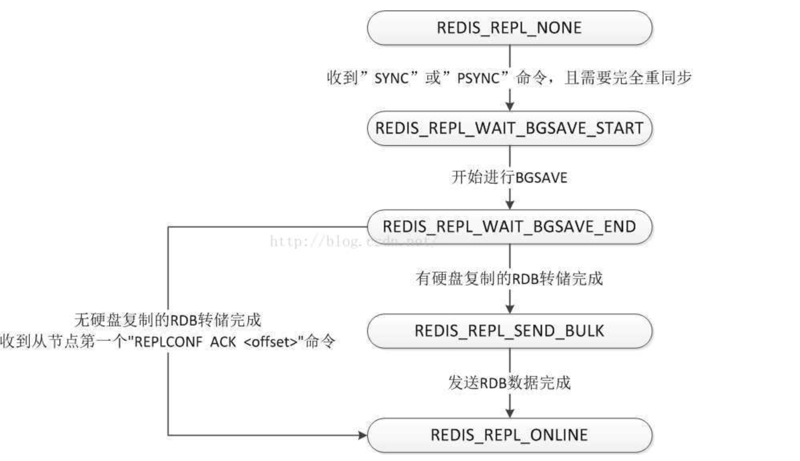

# 主从同步

从库发送 sync/psync 命令后，主库会生成rbd文件后发送给从库，有两种方式，直接使用socket发送或者先在磁盘生成再发送，并记录增量命令，后续发送给从库。从节点状态流转图：
  

## sync和psync命令处理器

```c
//server.c
//sync/psync都是使用同一个处理器，psync会先尝试使用偏移量进行增量同步
struct redisCommand redisCommandTable[] = {
    {"sync",syncCommand,1,
     "admin no-script",
     0,NULL,0,0,0,0,0,0},

    {"psync",syncCommand,-3,
     "admin no-script",
     0,NULL,0,0,0,0,0,0},
}
```

```c
void syncCommand(client *c) {
    //...

    serverLog(LL_NOTICE,"Replica %s asks for synchronization",
        replicationGetSlaveName(c));

    /*
        如果是psync命令，尝试获取客户端的同步偏移量，获取失败直接返回
    */
    if (!strcasecmp(c->argv[0]->ptr,"psync")) {
        long long psync_offset;
        if (getLongLongFromObjectOrReply(c, c->argv[2], &psync_offset, NULL) != C_OK) {
            serverLog(LL_WARNING, "Replica %s asks for synchronization but with a wrong offset",
                      replicationGetSlaveName(c));
            return;
        }
        //判断是否可以采用增量数据同步
        if (masterTryPartialResynchronization(c, psync_offset) == C_OK) {
            server.stat_sync_partial_ok++;
            return; /* No full resync needed, return. */
        } else {
            char *master_replid = c->argv[1]->ptr;

            /* Increment stats for failed PSYNCs, but only if the
             * replid is not "?", as this is used by slaves to force a full
             * resync on purpose when they are not albe to partially
             * resync. */
            if (master_replid[0] != '?') server.stat_sync_partial_err++;
        }
    } else {
        //sync命令，设置标志
        c->flags |= CLIENT_PRE_PSYNC;
    }

    //记录
    server.stat_sync_full++;

    //设置从库的状态为 SLAVE_STATE_WAIT_BGSAVE_START
    c->replstate = SLAVE_STATE_WAIT_BGSAVE_START;
    if (server.repl_disable_tcp_nodelay)
        connDisableTcpNoDelay(c->conn); /* Non critical if it fails. */
    c->repldbfd = -1;
    c->flags |= CLIENT_SLAVE;
    listAddNodeTail(server.slaves,c);

    //如果从库只有一个且记录命令的缓存区是空的，进行初始化操作
    if (listLength(server.slaves) == 1 && server.repl_backlog == NULL) {
        //更新replid、清空replid2、初始化缓存区
        changeReplicationId();
        clearReplicationId2();
        createReplicationBacklog();
        serverLog(LL_NOTICE,"Replication backlog created, my new "
                            "replication IDs are '%s' and '%s'",
                            server.replid, server.replid2);
    }

    //下面根据主库当前的状态去进行全量数据同步
    //case1:正在进行基于磁盘的bgsave，
    if (server.child_type == CHILD_TYPE_RDB &&
        server.rdb_child_type == RDB_CHILD_TYPE_DISK)
    {
        //下面会尝试复用当前正在生成的rdb文件，如果有符合条件的从库，复制增量命令缓存区到当前从库
        client *slave;
        listNode *ln;
        listIter li;

        listRewind(server.slaves,&li);
        //寻找状态为SLAVE_STATE_WAIT_BGSAVE_END的节点->节点正在等待rdb文件生成 
        while((ln = listNext(&li))) {
            slave = ln->value;
            /* If the client needs a buffer of commands, we can't use
             * a replica without replication buffer. */
            if (slave->replstate == SLAVE_STATE_WAIT_BGSAVE_END &&
                (!(slave->flags & CLIENT_REPL_RDBONLY) ||
                 (c->flags & CLIENT_REPL_RDBONLY)))
                break;
        }
        //capa->redis支持的复制能力 有两种 SLAVE_CAPA_EOF->无磁盘复制能力  SLAVE_CAPA_PSYNC2->psync版本
        if (ln && ((c->slave_capa & slave->slave_capa) == slave->slave_capa)) {
            //CLIENT_REPL_RDBONLY这个属性主要是考虑到从库只需要rdb文件，不需要增量的命令缓存区的数据，所以设置了CLIENT_REPL_RDBONLY为1的从库不会复制缓存区
            if (!(c->flags & CLIENT_REPL_RDBONLY)) copyClientOutputBuffer(c,slave);
            //slave->psync_initial_offset是复用的从库的复制偏移量，需要把偏移量发送给当前从库
            replicationSetupSlaveForFullResync(c,slave->psync_initial_offset);
            serverLog(LL_NOTICE,"Waiting for end of BGSAVE for SYNC");
        } else {
            serverLog(LL_NOTICE,"Can't attach the replica to the current BGSAVE. Waiting for next BGSAVE for SYNC");
        }

    //case:2 正在使用socket传输rdb文件，不可以复用
    } else if (server.child_type == CHILD_TYPE_RDB &&
               server.rdb_child_type == RDB_CHILD_TYPE_SOCKET)
    {
        /* There is an RDB child process but it is writing directly to
         * children sockets. We need to wait for the next BGSAVE
         * in order to synchronize. */
        serverLog(LL_NOTICE,"Current BGSAVE has socket target. Waiting for next BGSAVE for SYNC");

    //没有bgsave子进程，如果是使用磁盘的方式，那就设置标志位，等待更多的从库再生成rdb(因为可以复用)，如果是使用无磁盘的能力，立即开始生成rdb
    } else {
        if (server.repl_diskless_sync && (c->slave_capa & SLAVE_CAPA_EOF) &&
            server.repl_diskless_sync_delay)
        {
            /* Diskless replication RDB child is created inside
             * replicationCron() since we want to delay its start a
             * few seconds to wait for more slaves to arrive. */
            serverLog(LL_NOTICE,"Delay next BGSAVE for diskless SYNC");
        } else {
            /* We don't have a BGSAVE in progress, let's start one. Diskless
             * or disk-based mode is determined by replica's capacity. */
            if (!hasActiveChildProcess()) {
                startBgsaveForReplication(c->slave_capa);
            } else {
                serverLog(LL_NOTICE,
                    "No BGSAVE in progress, but another BG operation is active. "
                    "BGSAVE for replication delayed");
            }
        }
    }
    return;
}
```

## 增量同步

会判断是否满足增量同步，如果不满足会使用全量同步，需要满足的条件有：

* 主库和从库复制的数据来源同相同，都来源于当前主库或者来源于同一个被迁移的主库
* 从库同步偏移量的数据还存在主库的命令备份缓存区

```c
int masterTryPartialResynchronization(client *c, long long psync_offset) {
    long long psync_len;
    char *master_replid = c->argv[1]->ptr;
    char buf[128];
    int buflen;

    /*
         replid->当前主库的id
         replid2->之前同步的主库id(从库切换成主库会记录同步主库id)
         master_replid==replid，说明从库复制的数据是当前主库
         master_replid==replid2，当前主库是从库切换的，之前两个从库都是同步的同一个主库
         只有从库复制的主库id和replid或者replid2相同一个且从库同步的偏移量小于当前主库同步之前主库的偏移量，才能进行增量同步，否则全量同步
     */
    if (strcasecmp(master_replid, server.replid) &&
        (strcasecmp(master_replid, server.replid2) ||
         psync_offset > server.second_replid_offset))
    {
        //根据不同情况打印日志
        if (master_replid[0] != '?') {
            if (strcasecmp(master_replid, server.replid) &&
                strcasecmp(master_replid, server.replid2))
            {
                serverLog(LL_NOTICE,"Partial resynchronization not accepted: "
                    "Replication ID mismatch (Replica asked for '%s', my "
                    "replication IDs are '%s' and '%s')",
                    master_replid, server.replid, server.replid2);
            } else {
                serverLog(LL_NOTICE,"Partial resynchronization not accepted: "
                    "Requested offset for second ID was %lld, but I can reply "
                    "up to %lld", psync_offset, server.second_replid_offset);
            }
        } else {
            serverLog(LL_NOTICE,"Full resync requested by replica %s",
                replicationGetSlaveName(c));
        }
        goto need_full_resync;
    }

    //判断命令备份缓冲区从库需要的数据是否被清除
    if (!server.repl_backlog ||
        psync_offset < server.repl_backlog_off ||
        psync_offset > (server.repl_backlog_off + server.repl_backlog_histlen))
    {
        serverLog(LL_NOTICE,
            "Unable to partial resync with replica %s for lack of backlog (Replica request was: %lld).", replicationGetSlaveName(c), psync_offset);
        if (psync_offset > server.master_repl_offset) {
            serverLog(LL_WARNING,
                "Warning: replica %s tried to PSYNC with an offset that is greater than the master replication offset.", replicationGetSlaveName(c));
        }
        goto need_full_resync;
    }

    /*
        到这里说明满足增量同步的要求，记录标志，并发送命令通知从数据库进行增量同步 
    */
    c->flags |= CLIENT_SLAVE;
    c->replstate = SLAVE_STATE_ONLINE;
    c->repl_ack_time = server.unixtime;
    c->repl_put_online_on_ack = 0;
    listAddNodeTail(server.slaves,c);
    //做psync1和psync2的兼容
    if (c->slave_capa & SLAVE_CAPA_PSYNC2) {
        buflen = snprintf(buf,sizeof(buf),"+CONTINUE %s\r\n", server.replid);
    } else {
        buflen = snprintf(buf,sizeof(buf),"+CONTINUE\r\n");
    }
    if (connWrite(c->conn,buf,buflen) != buflen) {
        freeClientAsync(c);
        return C_OK;
    }
    //发送增量数据给从库的客户端缓存区
    psync_len = addReplyReplicationBacklog(c,psync_offset);
    serverLog(LL_NOTICE,
        "Partial resynchronization request from %s accepted. Sending %lld bytes of backlog starting from offset %lld.",
            replicationGetSlaveName(c),
            psync_len, psync_offset);
    /* Note that we don't need to set the selected DB at server.slaveseldb
     * to -1 to force the master to emit SELECT, since the slave already
     * has this state from the previous connection with the master. */

    refreshGoodSlavesCount();

    /* Fire the replica change modules event. */
    moduleFireServerEvent(REDISMODULE_EVENT_REPLICA_CHANGE,
                          REDISMODULE_SUBEVENT_REPLICA_CHANGE_ONLINE,
                          NULL);

    return C_OK; /* The caller can return, no full resync needed. */

need_full_resync:
    /* We need a full resync for some reason... Note that we can't
     * reply to PSYNC right now if a full SYNC is needed. The reply
     * must include the master offset at the time the RDB file we transfer
     * is generated, so we need to delay the reply to that moment. */
    return C_ERR;
}
```

[[redis学习笔记]redis新特性--psync2](https://luoming1224.github.io/2018/11/20/[redis%E5%AD%A6%E4%B9%A0%E7%AC%94%E8%AE%B0]redis4.0%E6%96%B0%E7%89%B9%E6%80%A7-psync2/)

## 全量同步

三种情况：

* 如果有子进程在生成rdb文件，使用的是磁盘模式，尝试复用，否则等待下次
* 如果有子进程在生成rdb文件，使用的是socket模式，等待下次
* 如果没有子进程，当前从库使用的是磁盘能力，为了最大复用rdb文件，等到下一次再进行生成，如果是socket，则立即执行生成

```c
int startBgsaveForReplication(int mincapa) {
    int retval;
    //使用磁盘还是socket
    int socket_target = server.repl_diskless_sync && (mincapa & SLAVE_CAPA_EOF);
    listIter li;
    listNode *ln;

    serverLog(LL_NOTICE,"Starting BGSAVE for SYNC with target: %s",
        socket_target ? "replicas sockets" : "disk");

    rdbSaveInfo rsi, *rsiptr;
    rsiptr = rdbPopulateSaveInfo(&rsi);
    /* Only do rdbSave* when rsiptr is not NULL,
     * otherwise slave will miss repl-stream-db. */
    if (rsiptr) {
        if (socket_target)
            retval = rdbSaveToSlavesSockets(rsiptr);
        else
            retval = rdbSaveBackground(server.rdb_filename,rsiptr);
    } else {
        serverLog(LL_WARNING,"BGSAVE for replication: replication information not available, can't generate the RDB file right now. Try later.");
        retval = C_ERR;
    }

    //rdb文件生成完成，设置标志位
    if (retval == C_OK && !socket_target && server.rdb_del_sync_files)
        RDBGeneratedByReplication = 1;

    //...

    //如果是磁盘模式，需要遍历从库列表，把复制的偏移量发送给状态为SLAVE_STATE_WAIT_BGSAVE_START的从库并把状态改为SLAVE_STATE_WAIT_BGSAVE_END
    if (!socket_target) {
        listRewind(server.slaves,&li);
        while((ln = listNext(&li))) {
            client *slave = ln->value;

            if (slave->replstate == SLAVE_STATE_WAIT_BGSAVE_START) {
                    replicationSetupSlaveForFullResync(slave,
                            getPsyncInitialOffset());
            }
        }
    }

    /* Flush the script cache, since we need that slave differences are
     * accumulated without requiring slaves to match our cached scripts. */
    if (retval == C_OK) replicationScriptCacheFlush();
    return retval;
}
```

## 无磁盘发送rdb

父进程创建和子进程的读写管道，子进程生成rdb数据写入管道，父进程创建文件事件处理管道中的数据，实际上还是主库在发送rdb数据给从库，子进程只负责生成rdb数据。

### 子进程生成rdb

```c
int rdbSaveToSlavesSockets(rdbSaveInfo *rsi) {
    listNode *ln;
    listIter li;
    pid_t childpid;
    int pipefds[2], rdb_pipe_write, safe_to_exit_pipe;

    if (hasActiveChildProcess()) return C_ERR;

   //...

    //收集需要通过socket发送rdb数据的从库，rdbPipeReadHandler文件事件会使用到
    server.rdb_pipe_conns = zmalloc(sizeof(connection *)*listLength(server.slaves));
    server.rdb_pipe_numconns = 0;
    server.rdb_pipe_numconns_writing = 0;
    listRewind(server.slaves,&li);
    while((ln = listNext(&li))) {
        client *slave = ln->value;
        if (slave->replstate == SLAVE_STATE_WAIT_BGSAVE_START) {
            server.rdb_pipe_conns[server.rdb_pipe_numconns++] = slave->conn;
            //主库发送同步的元数据给从库，这里会把从库的状态变为SLAVE_STATE_WAIT_BGSAVE_END
            replicationSetupSlaveForFullResync(slave,getPsyncInitialOffset());
        }
    }

    /* Create the child process. */
    if ((childpid = redisFork(CHILD_TYPE_RDB)) == 0) {
        /* Child */
        int retval, dummy;
        rio rdb;
        //
        rioInitWithFd(&rdb,rdb_pipe_write);

        /* Close the reading part, so that if the parent crashes, the child will
         * get a write error and exit. */
        close(server.rdb_pipe_read);

        redisSetProcTitle("redis-rdb-to-slaves");
        //设置cpu亲和性
        redisSetCpuAffinity(server.bgsave_cpulist);
        //生成rdb数据并写入管道中
        retval = rdbSaveRioWithEOFMark(&rdb,NULL,rsi);
        if (retval == C_OK && rioFlush(&rdb) == 0)
            retval = C_ERR;
        //发送子进程占用的内存信息给父进程
        if (retval == C_OK) {
            sendChildCowInfo(CHILD_INFO_TYPE_RDB_COW_SIZE, "RDB");
        }
        
        //...
        exitFromChild((retval == C_OK) ? 0 : 1);
    } else {
        /* Parent */
        close(safe_to_exit_pipe);
        //如果子进程fork失败，需要遍历从库，把状态改为SLAVE_STATE_WAIT_BGSAVE_START并释放资源
        if (childpid == -1) {
            serverLog(LL_WARNING,"Can't save in background: fork: %s",
                strerror(errno));

            /* Undo the state change. The caller will perform cleanup on
             * all the slaves in BGSAVE_START state, but an early call to
             * replicationSetupSlaveForFullResync() turned it into BGSAVE_END */
            listRewind(server.slaves,&li);
            while((ln = listNext(&li))) {
                client *slave = ln->value;
                if (slave->replstate == SLAVE_STATE_WAIT_BGSAVE_END) {
                    slave->replstate = SLAVE_STATE_WAIT_BGSAVE_START;
                }
            }
            close(rdb_pipe_write);
            close(server.rdb_pipe_read);
            zfree(server.rdb_pipe_conns);
            server.rdb_pipe_conns = NULL;
            server.rdb_pipe_numconns = 0;
            server.rdb_pipe_numconns_writing = 0;
        } else {
            serverLog(LL_NOTICE,"Background RDB transfer started by pid %ld",
                (long) childpid);
            server.rdb_save_time_start = time(NULL);
            server.rdb_child_type = RDB_CHILD_TYPE_SOCKET;
            close(rdb_pipe_write);
            //创建可读文件事件处理子进程写入管道的rdb数据，发送给从库
            if (aeCreateFileEvent(server.el, server.rdb_pipe_read, AE_READABLE, rdbPipeReadHandler,NULL) == AE_ERR) {
                serverPanic("Unrecoverable error creating server.rdb_pipe_read file event.");
            }
        }
        return (childpid == -1) ? C_ERR : C_OK;
    }
    return C_OK; /* Unreached. */
}
```

```c
int rdbSaveRioWithEOFMark(rio *rdb, int *error, rdbSaveInfo *rsi) {
    char eofmark[RDB_EOF_MARK_SIZE];

    startSaving(RDBFLAGS_REPLICATION);
    //rdb文件格式->$EOF:40字节的随机字符串\r\n文件流内容40字节的随机字符串
    getRandomHexChars(eofmark,RDB_EOF_MARK_SIZE);
    if (error) *error = 0;
    if (rioWrite(rdb,"$EOF:",5) == 0) goto werr;
    if (rioWrite(rdb,eofmark,RDB_EOF_MARK_SIZE) == 0) goto werr;
    if (rioWrite(rdb,"\r\n",2) == 0) goto werr;
    //使用磁盘生成rdb文件也会调用这个函数，其实只是数据写入的流不同，磁盘是文件写入流，socket是管道写入流
    if (rdbSaveRio(rdb,error,RDBFLAGS_NONE,rsi) == C_ERR) goto werr;
    if (rioWrite(rdb,eofmark,RDB_EOF_MARK_SIZE) == 0) goto werr;
    stopSaving(1);
    return C_OK;

werr: /* Write error. */
    /* Set 'error' only if not already set by rdbSaveRio() call. */
    if (error && *error == 0) *error = errno;
    stopSaving(0);
    return C_ERR;
}
```

### 父进程监听发送rdb给从库

父进程需要监听管道中的rdb数据，并发送给需要的从库，这个地方处理很有意思，首先会激活`rdbPipeReadHandler`事件，死循环读取管道的数据，并且遍历从库，往从库的连接写入，这里可能会出现数据太大，没办法一次性写入连接，会设置`rdbPipeWriteHandler`事件等待连接可写后继续写入，`rdbPipeReadHandler`会统计需要等待写入连接的数量，并暂时退出，等到所有的等待连接写入完毕后，`rdbPipeWriteHandler`会删除等待写入事件并重新添加`rdbPipeReadHandler`事件继续读取管道数据，循环跑上述流程直到管道数据全部发送。

```c
//监听管道数据的文件事件
void rdbPipeReadHandler(struct aeEventLoop *eventLoop, int fd, void *clientData, int mask) {
    UNUSED(mask);
    UNUSED(clientData);
    UNUSED(eventLoop);
    int i;
    if (!server.rdb_pipe_buff)
        server.rdb_pipe_buff = zmalloc(PROTO_IOBUF_LEN);
    serverAssert(server.rdb_pipe_numconns_writing==0);

    while (1) {
        //读取管道的数据，最大16k
        server.rdb_pipe_bufflen = read(fd, server.rdb_pipe_buff, PROTO_IOBUF_LEN);
        //读取的数据长度小于0报错，释放资源并退出
        if (server.rdb_pipe_bufflen < 0) {
            if (errno == EAGAIN || errno == EWOULDBLOCK)
                return;
            serverLog(LL_WARNING,"Diskless rdb transfer, read error sending DB to replicas: %s", strerror(errno));
            for (i=0; i < server.rdb_pipe_numconns; i++) {
                connection *conn = server.rdb_pipe_conns[i];
                if (!conn)
                    continue;
                client *slave = connGetPrivateData(conn);
                freeClient(slave);
                server.rdb_pipe_conns[i] = NULL;
            }
            killRDBChild();
            return;
        }
        //数据长度为0说明数据读取完成
        if (server.rdb_pipe_bufflen == 0) {
            /* EOF - write end was closed. */
            int stillUp = 0;
            aeDeleteFileEvent(server.el, server.rdb_pipe_read, AE_READABLE);
            for (i=0; i < server.rdb_pipe_numconns; i++)
            {
                connection *conn = server.rdb_pipe_conns[i];
                if (!conn)
                    continue;
                stillUp++;
            }
            serverLog(LL_WARNING,"Diskless rdb transfer, done reading from pipe, %d replicas still up.", stillUp);
            /* Now that the replicas have finished reading, notify the child that it's safe to exit. 
             * When the server detectes the child has exited, it can mark the replica as online, and
             * start streaming the replication buffers. */
            close(server.rdb_child_exit_pipe);
            server.rdb_child_exit_pipe = -1;
            return;
        }

        //到这了说明读取的数据长度大于0，遍历需要从库，发送数据并统计活跃的从库数据
        int stillAlive = 0;
        for (i=0; i < server.rdb_pipe_numconns; i++)
        {
            int nwritten;
            connection *conn = server.rdb_pipe_conns[i];
            if (!conn)
                continue;

            client *slave = connGetPrivateData(conn);
            if ((nwritten = connWrite(conn, server.rdb_pipe_buff, server.rdb_pipe_bufflen)) == -1) {
                if (connGetState(conn) != CONN_STATE_CONNECTED) {
                    serverLog(LL_WARNING,"Diskless rdb transfer, write error sending DB to replica: %s",
                        connGetLastError(conn));
                    freeClient(slave);
                    server.rdb_pipe_conns[i] = NULL;
                    continue;
                }
                /* An error and still in connected state, is equivalent to EAGAIN */
                slave->repldboff = 0;
            } else {
                /* Note: when use diskless replication, 'repldboff' is the offset
                 * of 'rdb_pipe_buff' sent rather than the offset of entire RDB. */
                slave->repldboff = nwritten;
                atomicIncr(server.stat_net_output_bytes, nwritten);
            }
            //如果数据没办法一次性写入连接，那就设置一个写的文件事件监听，事件激活后继续写入
            if (nwritten != server.rdb_pipe_bufflen) {
                slave->repl_last_partial_write = server.unixtime;
                //等待写入的连接数
                server.rdb_pipe_numconns_writing++;
                connSetWriteHandler(conn, rdbPipeWriteHandler);
            }
            stillAlive++;
        }

        if (stillAlive == 0) {
            serverLog(LL_WARNING,"Diskless rdb transfer, last replica dropped, killing fork child.");
            killRDBChild();
        }
        //如果存在连接在等待写入数据(数据量太大)或者没有活跃的连接，直接退出死循环
        if (server.rdb_pipe_numconns_writing || stillAlive == 0) {
            aeDeleteFileEvent(server.el, server.rdb_pipe_read, AE_READABLE);
            break;
        }
    }
}
```

```c
//rdb数据发送给从库连接，由于数据量太大无法一次性写入，这个事件激活后会继续写入
void rdbPipeWriteHandler(struct connection *conn) {
    serverAssert(server.rdb_pipe_bufflen>0);
    client *slave = connGetPrivateData(conn);
    int nwritten;
    if ((nwritten = connWrite(conn, server.rdb_pipe_buff + slave->repldboff,
                              server.rdb_pipe_bufflen - slave->repldboff)) == -1)
    {
        if (connGetState(conn) == CONN_STATE_CONNECTED)
            return; /* equivalent to EAGAIN */
        serverLog(LL_WARNING,"Write error sending DB to replica: %s",
            connGetLastError(conn));
        freeClient(slave);
        return;
    } else {
        slave->repldboff += nwritten;
        atomicIncr(server.stat_net_output_bytes, nwritten);
        if (slave->repldboff < server.rdb_pipe_bufflen) {
            slave->repl_last_partial_write = server.unixtime;
            return; /* more data to write.. */
        }
    }
    //数据全部写入后移出事件
    rdbPipeWriteHandlerConnRemoved(conn);
}

void rdbPipeWriteHandlerConnRemoved(struct connection *conn) {
    if (!connHasWriteHandler(conn))
        return;
    connSetWriteHandler(conn, NULL);
    client *slave = connGetPrivateData(conn);
    slave->repl_last_partial_write = 0;
    server.rdb_pipe_numconns_writing--;
    //如果已经没有等待写入的连接，需要继续设置事件监听子进程管道的rdb数据
    if (server.rdb_pipe_numconns_writing == 0) {
        if (aeCreateFileEvent(server.el, server.rdb_pipe_read, AE_READABLE, rdbPipeReadHandler,NULL) == AE_ERR) {
            serverPanic("Unrecoverable error creating server.rdb_pipe_read file event.");
        }
    }
}
```

## 基于磁盘发送rdb

### 子进程生成rdb文件

```c
int rdbSaveBackground(char *filename, rdbSaveInfo *rsi) {
    pid_t childpid;
    //检查是否有其他子进程在生成rdb或者重写aof
    if (hasActiveChildProcess()) return C_ERR;
    server.dirty_before_bgsave = server.dirty;
    server.lastbgsave_try = time(NULL);

    if ((childpid = redisFork(CHILD_TYPE_RDB)) == 0) {
        int retval;

        /* Child */
        redisSetProcTitle("redis-rdb-bgsave");
        //设置cpu亲和性，主要减少cpu切换带来的成本
        redisSetCpuAffinity(server.bgsave_cpulist);
        retval = rdbSave(filename,rsi);
        //rdb生成完成，子进程发送通知给父进程
        if (retval == C_OK) {
            sendChildCowInfo(CHILD_INFO_TYPE_RDB_COW_SIZE, "RDB");
        }
        exitFromChild((retval == C_OK) ? 0 : 1);
    } else {
        //父进程逻辑
        if (childpid == -1) {
            server.lastbgsave_status = C_ERR;
            serverLog(LL_WARNING,"Can't save in background: fork: %s",
                strerror(errno));
            return C_ERR;
        }
        serverLog(LL_NOTICE,"Background saving started by pid %ld",(long) childpid);
        server.rdb_save_time_start = time(NULL);
        //设置子进程的业务类型
        server.rdb_child_type = RDB_CHILD_TYPE_DISK;
        return C_OK;
    }
    return C_OK; /* unreached */
}
```

```c
int rdbSave(char *filename, rdbSaveInfo *rsi) {
    char tmpfile[256];
    char cwd[MAXPATHLEN]; /* Current working dir path for error messages. */
    FILE *fp = NULL;
    rio rdb;
    int error = 0;
    //写模式打开文件
    snprintf(tmpfile,256,"temp-%d.rdb", (int) getpid());
    fp = fopen(tmpfile,"w");
    if (!fp) {
        char *cwdp = getcwd(cwd,MAXPATHLEN);
        serverLog(LL_WARNING,
            "Failed opening the RDB file %s (in server root dir %s) "
            "for saving: %s",
            filename,
            cwdp ? cwdp : "unknown",
            strerror(errno));
        return C_ERR;
    }

    rioInitWithFile(&rdb,fp);
    //todo
    startSaving(RDBFLAGS_NONE);

    //内存可以逐步持久化到磁盘，缓存满 REDIS_AUTOSYNC_BYTES （32MB），缓存刷新到磁盘。这样将大数据分散开来，减少系统压力，避免一次写盘带来的问题
    if (server.rdb_save_incremental_fsync)
        rioSetAutoSync(&rdb,REDIS_AUTOSYNC_BYTES);
    //生产rdb文件
    if (rdbSaveRio(&rdb,&error,RDBFLAGS_NONE,rsi) == C_ERR) {
        errno = error;
        goto werr;
    }

    //生成完成，关闭资源
    if (fflush(fp)) goto werr;
    if (fsync(fileno(fp))) goto werr;
    if (fclose(fp)) { fp = NULL; goto werr; }
    fp = NULL;
    
    /* Use RENAME to make sure the DB file is changed atomically only
     * if the generate DB file is ok. */
    if (rename(tmpfile,filename) == -1) {
        char *cwdp = getcwd(cwd,MAXPATHLEN);
        serverLog(LL_WARNING,
            "Error moving temp DB file %s on the final "
            "destination %s (in server root dir %s): %s",
            tmpfile,
            filename,
            cwdp ? cwdp : "unknown",
            strerror(errno));
        unlink(tmpfile);
        stopSaving(0);
        return C_ERR;
    }

    serverLog(LL_NOTICE,"DB saved on disk");
    server.dirty = 0;
    server.lastsave = time(NULL);
    server.lastbgsave_status = C_OK;
    //todo
    stopSaving(1);
    return C_OK;

werr:
    serverLog(LL_WARNING,"Write error saving DB on disk: %s", strerror(errno));
    if (fp) fclose(fp);
    unlink(tmpfile);
    stopSaving(0);
    return C_ERR;
}
```

```c
int rdbSaveRio(rio *rdb, int *error, int rdbflags, rdbSaveInfo *rsi) {
    dictIterator *di = NULL;
    dictEntry *de;
    char magic[10];
    uint64_t cksum;
    size_t processed = 0;
    int j;
    long key_count = 0;
    long long info_updated_time = 0;
    char *pname = (rdbflags & RDBFLAGS_AOF_PREAMBLE) ? "AOF rewrite" :  "RDB";

    if (server.rdb_checksum)
        rdb->update_cksum = rioGenericUpdateChecksum;
    snprintf(magic,sizeof(magic),"REDIS%04d",RDB_VERSION);
    if (rdbWriteRaw(rdb,magic,9) == -1) goto werr;
    //这里记录主库的信息(id、offset)到rdb文件，在服务重启、主从切换等场景仍可以拿到从库同步主库的信息，方便进行增量同步
    if (rdbSaveInfoAuxFields(rdb,rdbflags,rsi) == -1) goto werr;
    if (rdbSaveModulesAux(rdb, REDISMODULE_AUX_BEFORE_RDB) == -1) goto werr;

    //遍历每个数据库
    for (j = 0; j < server.dbnum; j++) {
        redisDb *db = server.db+j;
        dict *d = db->dict;
        if (dictSize(d) == 0) continue;
        di = dictGetSafeIterator(d);

        /* Write the SELECT DB opcode */
        if (rdbSaveType(rdb,RDB_OPCODE_SELECTDB) == -1) goto werr;
        if (rdbSaveLen(rdb,j) == -1) goto werr;

        /* Write the RESIZE DB opcode. */
        uint64_t db_size, expires_size;
        db_size = dictSize(db->dict);
        expires_size = dictSize(db->expires);
        //写入redis的元数据
        if (rdbSaveType(rdb,RDB_OPCODE_RESIZEDB) == -1) goto werr;
        if (rdbSaveLen(rdb,db_size) == -1) goto werr;
        if (rdbSaveLen(rdb,expires_size) == -1) goto werr;

        //遍历每个对象数据
        while((de = dictNext(di)) != NULL) {
            sds keystr = dictGetKey(de);
            robj key, *o = dictGetVal(de);
            long long expire;

            initStaticStringObject(key,keystr);
            expire = getExpire(db,&key);
            //将键值对数据写入文件
            if (rdbSaveKeyValuePair(rdb,&key,o,expire) == -1) goto werr;

            /* When this RDB is produced as part of an AOF rewrite, move
             * accumulated diff from parent to child while rewriting in
             * order to have a smaller final write. */
            if (rdbflags & RDBFLAGS_AOF_PREAMBLE &&
                rdb->processed_bytes > processed+AOF_READ_DIFF_INTERVAL_BYTES)
            {
                processed = rdb->processed_bytes;
                aofReadDiffFromParent();
            }

            /* Update child info every 1 second (approximately).
             * in order to avoid calling mstime() on each iteration, we will
             * check the diff every 1024 keys */
            if ((key_count++ & 1023) == 0) {
                long long now = mstime();
                if (now - info_updated_time >= 1000) {
                    sendChildInfo(CHILD_INFO_TYPE_CURRENT_INFO, key_count, pname);
                    info_updated_time = now;
                }
            }
        }
        dictReleaseIterator(di);
        di = NULL; /* So that we don't release it again on error. */
    }

    /* If we are storing the replication information on disk, persist
     * the script cache as well: on successful PSYNC after a restart, we need
     * to be able to process any EVALSHA inside the replication backlog the
     * master will send us. */
    if (rsi && dictSize(server.lua_scripts)) {
        di = dictGetIterator(server.lua_scripts);
        while((de = dictNext(di)) != NULL) {
            robj *body = dictGetVal(de);
            if (rdbSaveAuxField(rdb,"lua",3,body->ptr,sdslen(body->ptr)) == -1)
                goto werr;
        }
        dictReleaseIterator(di);
        di = NULL; /* So that we don't release it again on error. */
    }

    if (rdbSaveModulesAux(rdb, REDISMODULE_AUX_AFTER_RDB) == -1) goto werr;

    //写入rdb文件结束符
    if (rdbSaveType(rdb,RDB_OPCODE_EOF) == -1) goto werr;

    /* CRC64 checksum. It will be zero if checksum computation is disabled, the
     * loading code skips the check in this case. */
    cksum = rdb->cksum;
    memrev64ifbe(&cksum);
    if (rioWrite(rdb,&cksum,8) == 0) goto werr;
    return C_OK;

werr:
    if (error) *error = errno;
    if (di) dictReleaseIterator(di);
    return C_ERR;
}
```

### 父进程处理rdb文件

rdb文件生成后，子进程退出，父进程的server.c/serverCron函数会周期性地调用checkChildrenDone函数检查子进程的状态，并将rdb文件发送给从库，每次最大16k。

```c
void checkChildrenDone(void) {
    //...
 if (pid == -1) {
            serverLog(LL_WARNING,"waitpid() returned an error: %s. "
                "child_type: %s, child_pid = %d",
                strerror(errno),
                strChildType(server.child_type),
                (int) server.child_pid);
        } else if (pid == server.child_pid) {
            //根据子进程执行的任务类型调用不同函数完成后续工作
            if (server.child_type == CHILD_TYPE_RDB) {
                backgroundSaveDoneHandler(exitcode, bysignal);
            } else if (server.child_type == CHILD_TYPE_AOF) {
                backgroundRewriteDoneHandler(exitcode, bysignal);
            } else if (server.child_type == CHILD_TYPE_MODULE) {
                ModuleForkDoneHandler(exitcode, bysignal);
            } else {
                serverPanic("Unknown child type %d for child pid %d", server.child_type, server.child_pid);
                exit(1);
            }
            if (!bysignal && exitcode == 0) receiveChildInfo();
            resetChildState();
        } else {
            if (!ldbRemoveChild(pid)) {
                serverLog(LL_WARNING,
                          "Warning, detected child with unmatched pid: %ld",
                          (long) pid);
            }
        }
    //...
}

void backgroundSaveDoneHandler(int exitcode, int bysignal) {
    int type = server.rdb_child_type;
    //做清理工作
    switch(server.rdb_child_type) {
    case RDB_CHILD_TYPE_DISK:
        backgroundSaveDoneHandlerDisk(exitcode,bysignal);
        break;
    case RDB_CHILD_TYPE_SOCKET:
        backgroundSaveDoneHandlerSocket(exitcode,bysignal);
        break;
    default:
        serverPanic("Unknown RDB child type.");
        break;
    }

    server.rdb_child_type = RDB_CHILD_TYPE_NONE;
    server.rdb_save_time_last = time(NULL)-server.rdb_save_time_start;
    server.rdb_save_time_start = -1;
    //发送rdb文件给从库
    updateSlavesWaitingBgsave((!bysignal && exitcode == 0) ? C_OK : C_ERR, type);
}
```

```c
void updateSlavesWaitingBgsave(int bgsaveerr, int type) {
    listNode *ln;
    listIter li;

    /* Note: there's a chance we got here from within the REPLCONF ACK command
     * so we must avoid using freeClient, otherwise we'll crash on our way up. */

    listRewind(server.slaves,&li);
    while((ln = listNext(&li))) {
        client *slave = ln->value;
        //遍历状态为SLAVE_STATE_WAIT_BGSAVE_END的从库，SLAVE_STATE_WAIT_BGSAVE_END状态表示等待rdb数据传输
        if (slave->replstate == SLAVE_STATE_WAIT_BGSAVE_END) {
            struct redis_stat buf;

            //如果使用的是无磁盘模式，直接更新从库状态即可
            if (type == RDB_CHILD_TYPE_SOCKET) {
                serverLog(LL_NOTICE,
                    "Streamed RDB transfer with replica %s succeeded (socket). Waiting for REPLCONF ACK from slave to enable streaming",
                        replicationGetSlaveName(slave));
                /* Note: we wait for a REPLCONF ACK message from the replica in
                 * order to really put it online (install the write handler
                 * so that the accumulated data can be transferred). However
                 * we change the replication state ASAP, since our slave
                 * is technically online now.
                 *
                 * So things work like that:
                 *
                 * 1. We end trasnferring the RDB file via socket.
                 * 2. The replica is put ONLINE but the write handler
                 *    is not installed.
                 * 3. The replica however goes really online, and pings us
                 *    back via REPLCONF ACK commands.
                 * 4. Now we finally install the write handler, and send
                 *    the buffers accumulated so far to the replica.
                 *
                 * But why we do that? Because the replica, when we stream
                 * the RDB directly via the socket, must detect the RDB
                 * EOF (end of file), that is a special random string at the
                 * end of the RDB (for streamed RDBs we don't know the length
                 * in advance). Detecting such final EOF string is much
                 * simpler and less CPU intensive if no more data is sent
                 * after such final EOF. So we don't want to glue the end of
                 * the RDB trasfer with the start of the other replication
                 * data. */
                slave->replstate = SLAVE_STATE_ONLINE;
                slave->repl_put_online_on_ack = 1;
                slave->repl_ack_time = server.unixtime; /* Timeout otherwise. */
            } else {
                //无磁盘模式，设置文件事件发送rdb给从库
                if ((slave->repldbfd = open(server.rdb_filename,O_RDONLY)) == -1 ||
                    redis_fstat(slave->repldbfd,&buf) == -1) {
                    freeClientAsync(slave);
                    serverLog(LL_WARNING,"SYNC failed. Can't open/stat DB after BGSAVE: %s", strerror(errno));
                    continue;
                }
                slave->repldboff = 0;
                slave->repldbsize = buf.st_size;
                slave->replstate = SLAVE_STATE_SEND_BULK;
                slave->replpreamble = sdscatprintf(sdsempty(),"$%lld\r\n",
                    (unsigned long long) slave->repldbsize);

                connSetWriteHandler(slave->conn,NULL);
                if (connSetWriteHandler(slave->conn,sendBulkToSlave) == C_ERR) {
                    freeClientAsync(slave);
                    continue;
                }
            }
        }
    }
}
```

```c
void sendBulkToSlave(connection *conn) {
    client *slave = connGetPrivateData(conn);
    char buf[PROTO_IOBUF_LEN];
    ssize_t nwritten, buflen;

    //先发送rdb的文件长度给从库，格式为"$<length>\r\n"
    if (slave->replpreamble) {
        nwritten = connWrite(conn,slave->replpreamble,sdslen(slave->replpreamble));
        if (nwritten == -1) {
            serverLog(LL_VERBOSE,
                "Write error sending RDB preamble to replica: %s",
                connGetLastError(conn));
            freeClient(slave);
            return;
        }
        atomicIncr(server.stat_net_output_bytes, nwritten);
        sdsrange(slave->replpreamble,nwritten,-1);
        if (sdslen(slave->replpreamble) == 0) {
            sdsfree(slave->replpreamble);
            slave->replpreamble = NULL;
            /* fall through sending data. */
        } else {
            return;
        }
    }

    /* If the preamble was already transferred, send the RDB bulk data. */
    lseek(slave->repldbfd,slave->repldboff,SEEK_SET);
    //每次最多读取16k的数据，分批次发送
    buflen = read(slave->repldbfd,buf,PROTO_IOBUF_LEN);
    if (buflen <= 0) {
        serverLog(LL_WARNING,"Read error sending DB to replica: %s",
            (buflen == 0) ? "premature EOF" : strerror(errno));
        freeClient(slave);
        return;
    }
    if ((nwritten = connWrite(conn,buf,buflen)) == -1) {
        if (connGetState(conn) != CONN_STATE_CONNECTED) {
            serverLog(LL_WARNING,"Write error sending DB to replica: %s",
                connGetLastError(conn));
            freeClient(slave);
        }
        return;
    }
    slave->repldboff += nwritten;
    atomicIncr(server.stat_net_output_bytes, nwritten);
    //发送完成
    if (slave->repldboff == slave->repldbsize) {
        close(slave->repldbfd);
        slave->repldbfd = -1;
        connSetWriteHandler(slave->conn,NULL);
        //将从库的状态设置为上线
        putSlaveOnline(slave);
    }
}
```

## 发送增量命令

主库在生成rdb文件过程中，会为从库缓存增量的命令，在从库加载完rdb文件后发送给从库，缓存的时机是在server.c/call函数的propagate函数中完成的，数据不是立即发送的，而是先写入从库客户端的缓存区。

```c
void propagate(struct redisCommand *cmd, int dbid, robj **argv, int argc,
               int flags)
{
    //...

    //保存命令到aof文件
    if (server.aof_state != AOF_OFF && flags & PROPAGATE_AOF)
        feedAppendOnlyFile(cmd,dbid,argv,argc);
    //为从节点缓存命令
    if (flags & PROPAGATE_REPL)
        replicationFeedSlaves(server.slaves,dbid,argv,argc);
}
```

```c
void replicationFeedSlaves(list *slaves, int dictid, robj **argv, int argc) {
    listNode *ln;
    listIter li;
    int j, len;
    char llstr[LONG_STR_SIZE];

    //...

    //目标数据不同，发送select命令
    if (server.slaveseldb != dictid) {
        robj *selectcmd;

        /* For a few DBs we have pre-computed SELECT command. */
        if (dictid >= 0 && dictid < PROTO_SHARED_SELECT_CMDS) {
            selectcmd = shared.select[dictid];
        } else {
            int dictid_len;

            dictid_len = ll2string(llstr,sizeof(llstr),dictid);
            selectcmd = createObject(OBJ_STRING,
                sdscatprintf(sdsempty(),
                "*2\r\n$6\r\nSELECT\r\n$%d\r\n%s\r\n",
                dictid_len, llstr));
        }

        /* Add the SELECT command into the backlog. */
        if (server.repl_backlog) feedReplicationBacklogWithObject(selectcmd);

        /* Send it to slaves. */
        listRewind(slaves,&li);
        while((ln = listNext(&li))) {
            client *slave = ln->value;

            if (!canFeedReplicaReplBuffer(slave)) continue;
            addReply(slave,selectcmd);
        }

        if (dictid < 0 || dictid >= PROTO_SHARED_SELECT_CMDS)
            decrRefCount(selectcmd);
    }
    server.slaveseldb = dictid;

    //开启了增量同步的命令缓存机制，需要把命令写入该缓存
    if (server.repl_backlog) {
        char aux[LONG_STR_SIZE+3];

        /* Add the multi bulk reply length. */
        aux[0] = '*';
        len = ll2string(aux+1,sizeof(aux)-1,argc);
        aux[len+1] = '\r';
        aux[len+2] = '\n';
        feedReplicationBacklog(aux,len+3);

        for (j = 0; j < argc; j++) {
            long objlen = stringObjectLen(argv[j]);

            /* We need to feed the buffer with the object as a bulk reply
             * not just as a plain string, so create the $..CRLF payload len
             * and add the final CRLF */
            aux[0] = '$';
            len = ll2string(aux+1,sizeof(aux)-1,objlen);
            aux[len+1] = '\r';
            aux[len+2] = '\n';
            feedReplicationBacklog(aux,len+3);
            feedReplicationBacklogWithObject(argv[j]);
            feedReplicationBacklog(aux+len+1,2);
        }
    }

    //遍历从库，写入从库的增量命令缓存(只有状态不为SLAVE_STATE_WAIT_BGSAVE_START)
    listRewind(slaves,&li);
    while((ln = listNext(&li))) {
        client *slave = ln->value;

        if (!canFeedReplicaReplBuffer(slave)) continue;

        /* Feed slaves that are waiting for the initial SYNC (so these commands
         * are queued in the output buffer until the initial SYNC completes),
         * or are already in sync with the master. */

        /* Add the multi bulk length. */
        addReplyArrayLen(slave,argc);

        /* Finally any additional argument that was not stored inside the
         * static buffer if any (from j to argc). */
        for (j = 0; j < argc; j++)
            addReplyBulk(slave,argv[j]);
    }
}
```

## Q&A

### 主从同步亮点

* 优先使用增量同步
* 复用rdb文件，一份rdb文件服务多个从库，提高效率

### 磁盘 VS socket

* 磁盘耗费空间，但是多个从库同步可以复用同一个rdb文件，在redis启动时主从同步效率较高
* socket一次只能同步一个从库，但是不需要耗费很大的空间，在redis数据很大时效率较高

### cpu亲和性

开启子进程后会设置cpu亲和性，可以降低切换处理器的成本。
[Linux中CPU亲和性（affinity）](https://zhuanlan.zhihu.com/p/38541212)

### 父进程缓存的增量命令会和子进程生成的rdb文件有冲突吗？

不会，因为父子进程机制是Copy On Write，读是共享的，写时会复制一份数据进行变更，也就是说，父进程创建出子进程后，子进程看到的数据就是不会因为父进程的写入而变化的。

### 主库增量命令发送给从库的时机

### 无磁盘和有磁盘复制怎么选择

* server.repl_diskless_sync
* 从服务器是否支持处理EOF标记(无磁盘复制完成后会发送EOF作为结束标志)

[Redis源码解析：16Resis主从复制之主节点的完全重同步流程](https://www.cnblogs.com/gqtcgq/p/7247054.html)
[Redis主从同步源码浅析-Master端](http://chenzhenianqing.com/articles/943.html)
[Redis 6.0 源码阅读笔记(10)-主从复制 Master 节点流程分析](https://blog.csdn.net/weixin_45505313/article/details/109388636)
