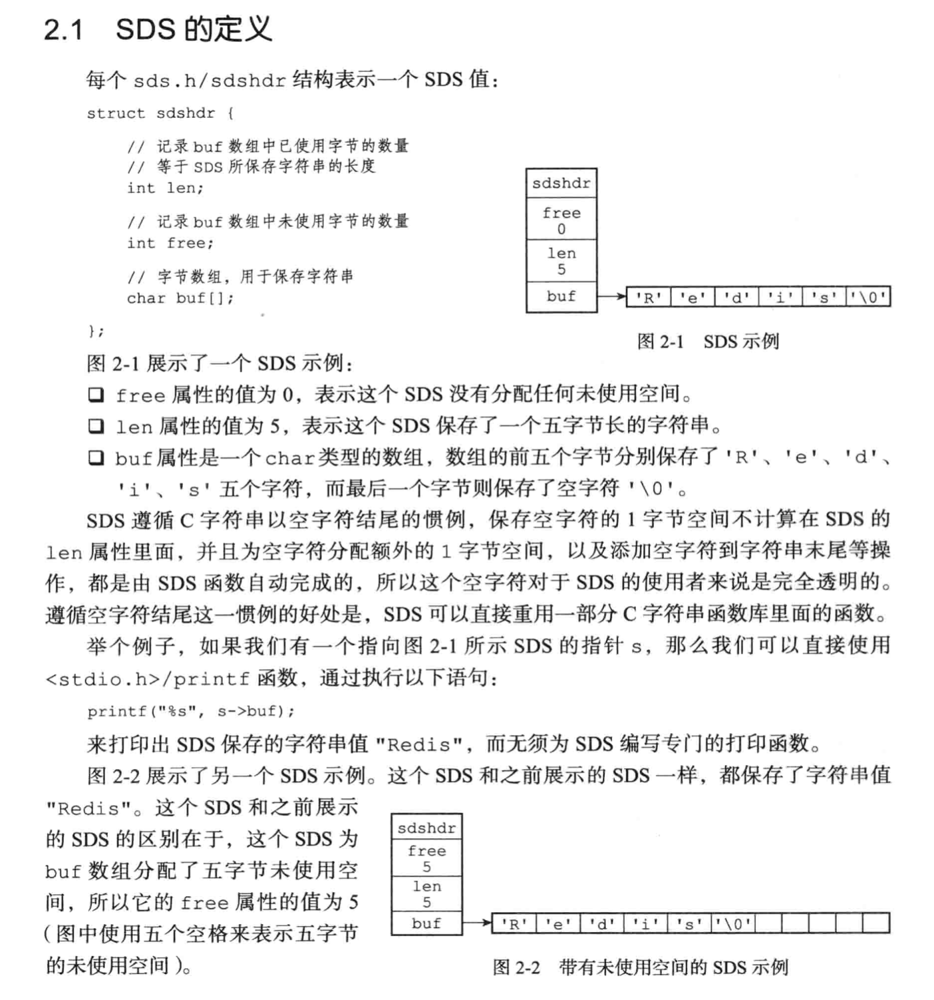
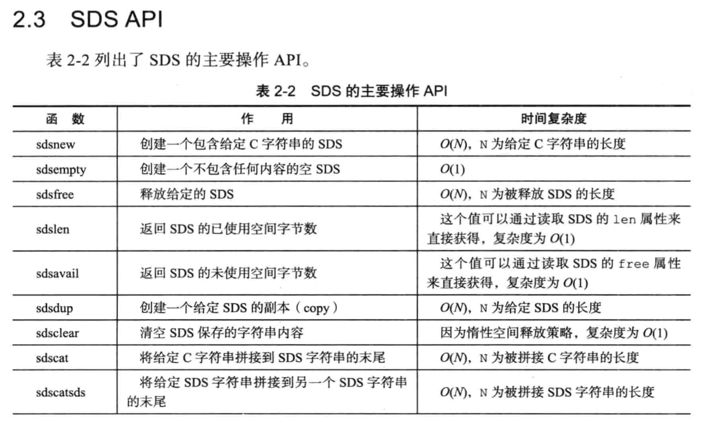
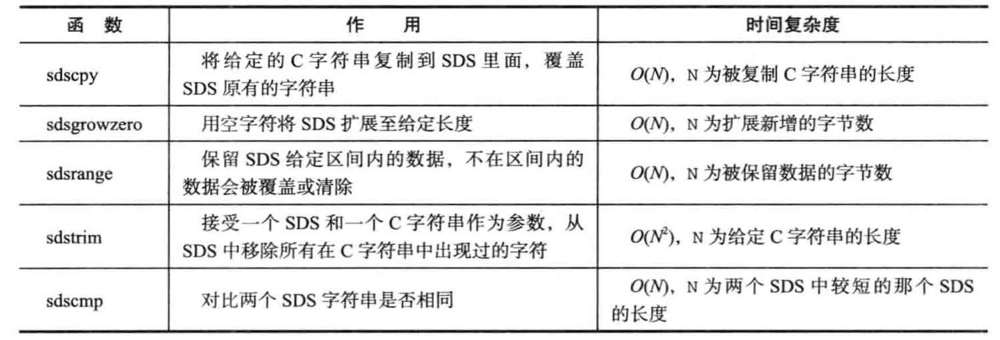
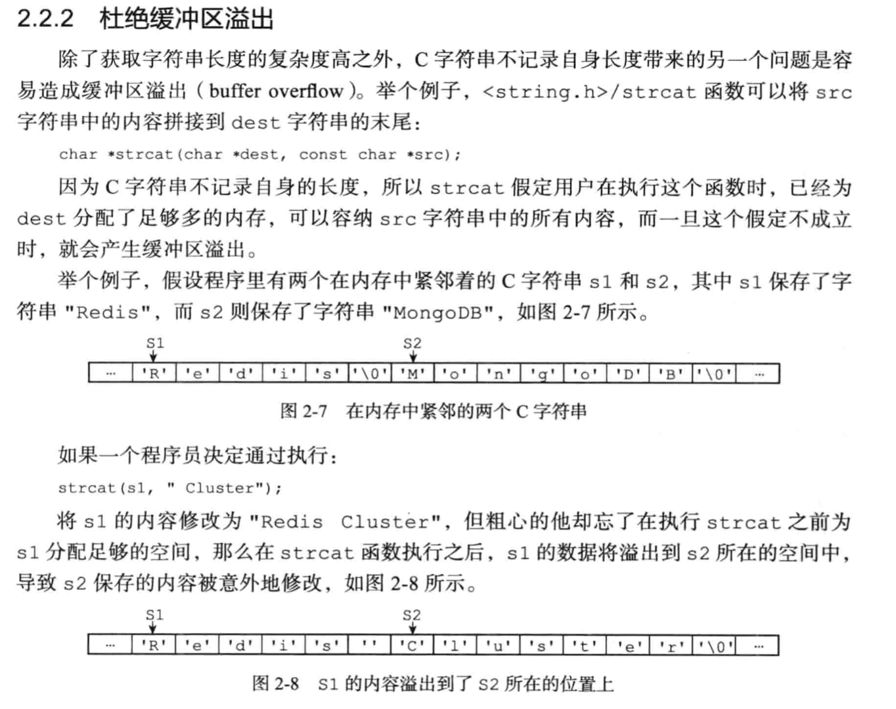

# SDS(Simple Dynamic String)字符串

## 结构
### 2.x版本
   

### 6.x
由于在数据很小的情况下，使用int数据类型记录长度信息会浪费内存空间，因此在3.x起版本，根据数据长度使用不同类型记录长度信息。
```c
//数据小于16时使用
struct __attribute__ ((__packed__)) sdshdr5 {
    unsigned char flags; /* 低三位记录头部类型，高五位记录长度 */
    char buf[];
};
struct __attribute__ ((__packed__)) sdshdr8 {
    uint8_t len; //使用的长度
    uint8_t alloc; //使用+未使用的长度
    unsigned char flags; /* 低三位记录头部类型，高五位不使用 */
    char buf[];
};
struct __attribute__ ((__packed__)) sdshdr16 {
    uint16_t len; /* used */
    uint16_t alloc; /* excluding the header and null terminator */
    unsigned char flags; /* 低三位记录头部类型，高五位不使用 */
    char buf[];
};
struct __attribute__ ((__packed__)) sdshdr32 {
    uint32_t len; /* used */
    uint32_t alloc; /* excluding the header and null terminator */
    unsigned char flags; /* 低三位记录头部类型，高五位不使用 */
    char buf[];
};
struct __attribute__ ((__packed__)) sdshdr64 {
    uint64_t len; /* used */
    uint64_t alloc; /* excluding the header and null terminator */
    unsigned char flags; /* 低三位记录头部类型，高五位不使用 */
    char buf[];
};
```

## 初始化
```c
#define SDS_TYPE_BITS 3
sds _sdsnewlen(const void *init, size_t initlen, int trymalloc) {
    //sds指针
    void *sh;
    sds s;
    //根据初始化长度返回长度类型
    char type = sdsReqType(initlen);
    /* 如果初始化的字符串是空字符串，使用1字节去记录长度，方便后续的增加操作 */
    if (type == SDS_TYPE_5 && initlen == 0) type = SDS_TYPE_8;
    //根据初始化长度类型获取头部的长度
    int hdrlen = sdsHdrSize(type);
    //flags指针
    unsigned char *fp; 
    size_t usable;

    assert(initlen + hdrlen + 1 > initlen); /* Catch size_t overflow */
    //尝试分配内存 usable->分配的内存可用长度
    //s_trymalloc_usable->尝试分配内存，失败返回NULL，s_malloc_usable->失败抛异常
    sh = trymalloc?
        s_trymalloc_usable(hdrlen+initlen+1, &usable) :
        s_malloc_usable(hdrlen+initlen+1, &usable);
    if (sh == NULL) return NULL;
    if (init==SDS_NOINIT)
        init = NULL;
    else if (!init)
        //初始化char[]为0
        memset(sh, 0, hdrlen+initlen+1);
    //buf的指针
    s = (char*)sh+hdrlen;
    fp = ((unsigned char*)s)-1;
    //申请的buf长度
    usable = usable-hdrlen-1;
    if (usable > sdsTypeMaxSize(type))
        usable = sdsTypeMaxSize(type);
    switch(type) {
        //根据不用长度类型设置 参数
        case SDS_TYPE_5: {
            //高五位记录长度 SDS_TYPE_BITS->3
            *fp = type | (initlen << SDS_TYPE_BITS);
            break;
        }
        case SDS_TYPE_8: {
            SDS_HDR_VAR(8,s);
            sh->len = initlen;
            sh->alloc = usable;
            *fp = type;
            break;
        }
        case SDS_TYPE_16: {
            SDS_HDR_VAR(16,s);
            sh->len = initlen;
            sh->alloc = usable;
            *fp = type;
            break;
        }
        case SDS_TYPE_32: {
            SDS_HDR_VAR(32,s);
            sh->len = initlen;
            sh->alloc = usable;
            *fp = type;
            break;
        }
        case SDS_TYPE_64: {
            SDS_HDR_VAR(64,s);
            sh->len = initlen;
            sh->alloc = usable;
            *fp = type;
            break;
        }
    }
    //复制数据到buf[]
    if (initlen && init)
        memcpy(s, init, initlen);
    //设置尾端 '\0' 标志
    s[initlen] = '\0';
    //sds返回的是指向buf[]的指针，便于使用C字符串
    return s;
}
```
```c
//根据初始化长度返回长度类型：1.小于16 2.小于一字节 3.小于两字节 4.小于4字节 5.小于8字节
static inline char sdsReqType(size_t string_size) {
    if (string_size < 1<<5)
        return SDS_TYPE_5;
    if (string_size < 1<<8)
        return SDS_TYPE_8;
    if (string_size < 1<<16)
        return SDS_TYPE_16;
//根据编译系统判断加入对应下列代码
/*  LONG_MAX->long int LLONG_MAX->long long int
    1、32位编译系统中:
    long 占4字节 int 占4字节 long int 占4字节
    2、64位编译系统中:
    long 占8字节 int 占4字节 long int 占8字节
    3、32位和64位编译系统中
    long long int 在32位和64位编译系统中，都占8字节
    LONG_MAX == LLONG_MAX 为true，说明64位，否则32位。
*/
#if (LONG_MAX == LLONG_MAX)
    if (string_size < 1ll<<32)
        return SDS_TYPE_32;
    return SDS_TYPE_64;
#else
    return SDS_TYPE_32;
#endif
}

//返回头部长度
static inline int sdsHdrSize(char type) {
    switch(type&SDS_TYPE_MASK) {
        case SDS_TYPE_5:
            return sizeof(struct sdshdr5);
        case SDS_TYPE_8:
            return sizeof(struct sdshdr8);
        case SDS_TYPE_16:
            return sizeof(struct sdshdr16);
        case SDS_TYPE_32:
            return sizeof(struct sdshdr32);
        case SDS_TYPE_64:
            return sizeof(struct sdshdr64);
    }
    return 0;
}
```

## 销毁
```c
void sdsfree(sds s) {
    if (s == NULL) return;
    //s指向的是buf[]，这里移动到首部位置 s[-1]->flag的位置 通过flag的低三位判断长度的类型
    //s_free函数是对各种不同库释放内存方法的一个封装
    s_free((char*)s-sdsHdrSize(s[-1]));
}

static inline int sdsHdrSize(char type) {
    //SDS_TYPE_MASK->00000111
    switch(type&SDS_TYPE_MASK) {
        case SDS_TYPE_5:
            return sizeof(struct sdshdr5);
        case SDS_TYPE_8:
            return sizeof(struct sdshdr8);
        case SDS_TYPE_16:
            return sizeof(struct sdshdr16);
        case SDS_TYPE_32:
            return sizeof(struct sdshdr32);
        case SDS_TYPE_64:
            return sizeof(struct sdshdr64);
    }
    return 0;
}
```

## 扩容
```c
//len是扩容后的长度 本次增量长度=len-curlen
sds sdsgrowzero(sds s, size_t len) {
    size_t curlen = sdslen(s);
    //如果扩容的长度小于数据本身，直接返回
    if (len <= curlen) return s;
    s = sdsMakeRoomFor(s,len-curlen);
    if (s == NULL) return NULL;

    //扩容的部分设置为0，防止脏数据
    memset(s+curlen,0,(len-curlen+1)); 
    sdssetlen(s, len);
    return s;
}
```
```c
#define SDS_MAX_PREALLOC (1024*1024)
sds sdsMakeRoomFor(sds s, size_t addlen) {
    void *sh, *newsh;
    //buf[]还未使用的长度
    size_t avail = sdsavail(s);
    size_t len, newlen, reqlen;
    //数据长度的类型，扩容后可能需要升级类型
    char type, oldtype = s[-1] & SDS_TYPE_MASK;
    int hdrlen;
    size_t usable;

    //如果空闲长度大于要扩容长度，说明容量够用，直接返回
    if (avail >= addlen) return s;

    len = sdslen(s);
    //指向头部的指针
    sh = (char*)s-sdsHdrSize(oldtype);
    //reqlen和newlen长度是 使用长度+本次扩容的长度，而不是 使用长度+未使用长度+本次扩容的长度
    reqlen = newlen = (len+addlen);
    assert(newlen > len);   
    //长度小于1mb，扩容两倍，大于1mb，扩容1mb SDS_MAX_PREALLOC=1024*1024
    if (newlen < SDS_MAX_PREALLOC)
        newlen *= 2;
    else
        newlen += SDS_MAX_PREALLOC;

    type = sdsReqType(newlen);

    /* Don't use type 5: the user is appending to the string and type 5 is
     * not able to remember empty space, so sdsMakeRoomFor() must be called
     * at every appending operation. */
    if (type == SDS_TYPE_5) type = SDS_TYPE_8;

    hdrlen = sdsHdrSize(type);
    assert(hdrlen + newlen + 1 > reqlen); 
    //判断是否需要升级首部的数据类型
    if (oldtype==type) {
        //首部不需要升级，尝试在原有内存上扩容
        newsh = s_realloc_usable(sh, hdrlen+newlen+1, &usable);
        if (newsh == NULL) return NULL;
        s = (char*)newsh+hdrlen;
    } else {
        //首部需要升级
        //申请新的内存
        newsh = s_malloc_usable(hdrlen+newlen+1, &usable);
        if (newsh == NULL) return NULL;
        //复制数据
        memcpy((char*)newsh+hdrlen, s, len+1);
        //释放原来的sds
        s_free(sh);
        s = (char*)newsh+hdrlen;
        s[-1] = type;
        sdssetlen(s, len);
    }
    usable = usable-hdrlen-1;
    if (usable > sdsTypeMaxSize(type))
        usable = sdsTypeMaxSize(type);
    //设置alloc字段
    sdssetalloc(s, usable);
    return s;
}

static inline size_t sdsavail(const sds s) {
    unsigned char flags = s[-1];
    switch(flags&SDS_TYPE_MASK) {
        case SDS_TYPE_5: {
            return 0;
        }
        case SDS_TYPE_8: {
            SDS_HDR_VAR(8,s);
            return sh->alloc - sh->len;
        }
        case SDS_TYPE_16: {
            SDS_HDR_VAR(16,s);
            return sh->alloc - sh->len;
        }
        case SDS_TYPE_32: {
            SDS_HDR_VAR(32,s);
            return sh->alloc - sh->len;
        }
        case SDS_TYPE_64: {
            SDS_HDR_VAR(64,s);
            return sh->alloc - sh->len;
        }
    }
    return 0;
}

```
```c
#define SDS_HDR(T,s) (
    (struct sdshdr##T *)(
        (s)-(sizeof(struct sdshdr##T))
        )
    )
//设置sds的长度 newlen->新的长度
static inline void sdssetlen(sds s, size_t newlen) {
    unsigned char flags = s[-1];
    switch(flags&SDS_TYPE_MASK) {
        case SDS_TYPE_5:
            {
                //高五位设置长度
                unsigned char *fp = ((unsigned char*)s)-1;
                *fp = SDS_TYPE_5 | (newlen << SDS_TYPE_BITS);
            }
            break;
        case SDS_TYPE_8:
            //将s指针移动到首部设置len字段
            SDS_HDR(8,s)->len = newlen;
            break;
        case SDS_TYPE_16:
            SDS_HDR(16,s)->len = newlen;
            break;
        case SDS_TYPE_32:
            SDS_HDR(32,s)->len = newlen;
            break;
        case SDS_TYPE_64:
            SDS_HDR(64,s)->len = newlen;
            break;
    }
}
```

## 修改数据
### 追加
```c
sds sdscat(sds s, const char *t) {
    return sdscatlen(s, t, strlen(t));
}

sds sdscatlen(sds s, const void *t, size_t len) {
    size_t curlen = sdslen(s);
    //判断是否需要扩容
    s = sdsMakeRoomFor(s,len);
    if (s == NULL) return NULL;
    //复制追加的数据
    memcpy(s+curlen, t, len);
    sdssetlen(s, curlen+len);
    s[curlen+len] = '\0';
    return s;
}
```
### 覆盖
```c
sds sdscpy(sds s, const char *t) {
    return sdscpylen(s, t, strlen(t));
}
sds sdscpylen(sds s, const char *t, size_t len) {
    if (sdsalloc(s) < len) {
        s = sdsMakeRoomFor(s,len-sdslen(s));
        if (s == NULL) return NULL;
    }
    memcpy(s, t, len);
    s[len] = '\0';
    sdssetlen(s, len);
    return s;
}
```

## API和复杂度
   
   

## Q&A 
### SDS 和 C字符串的区别
* C字符串不记录长度造成的风险   
  * 获取长度复杂度 O(N)
  * 缓存区溢出
    
  * 每次对字符串进行增删操作都需要申请内存分配。
* C字符串每次增删都需要重新神奇内存，SDS采用预分配和惰性删除解决频繁申请内存问题。
* C字符串只能存储文本数据，SDS可以存放文本、二进制数据(记录数据长度用于计算数据的边界)。
* SDS兼容了部分C字符串的函数。

### 为什么3.x起取消了sdshdr的内存对齐机制？
* 节省内存空间
* 方便flags变量的读取
* 首部结构体顺序自对齐，和内存排列不同的只是尾部没有进行填充，会影响buf[]的读取(buf[]大部分需要多次读取，影响较小)。   
[内存对齐和Redis的sds采用紧凑排列](https://juejin.cn/post/6922352059517779976)


[面试杀手锏：Redis源码之SDS](https://www.51cto.com/article/700992.html)   
摘抄自《Redis设计与实现》