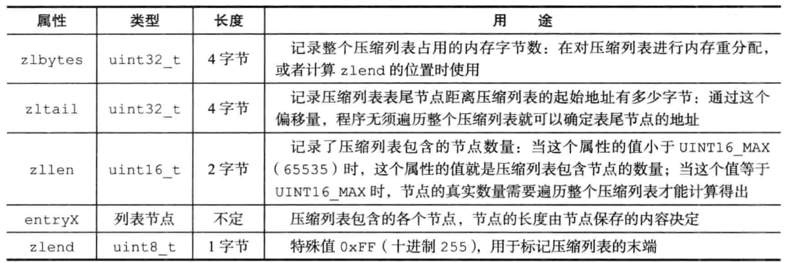
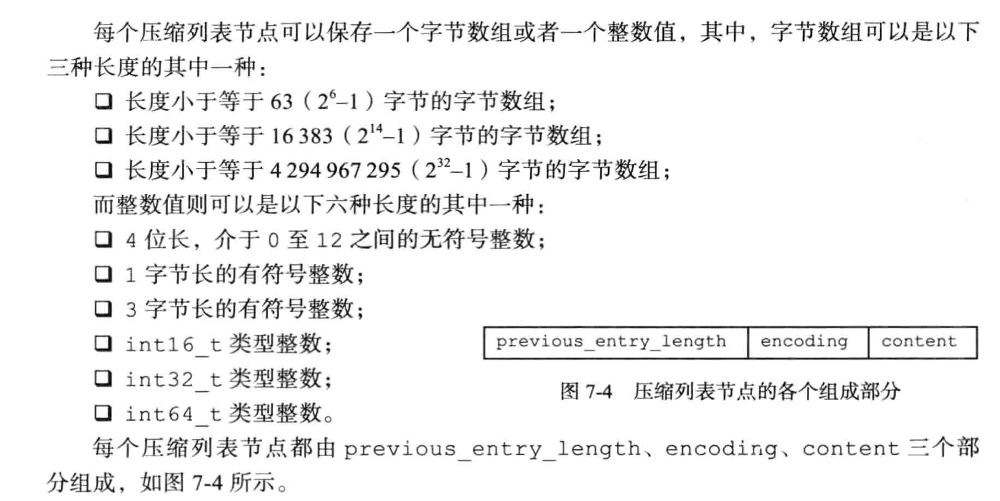
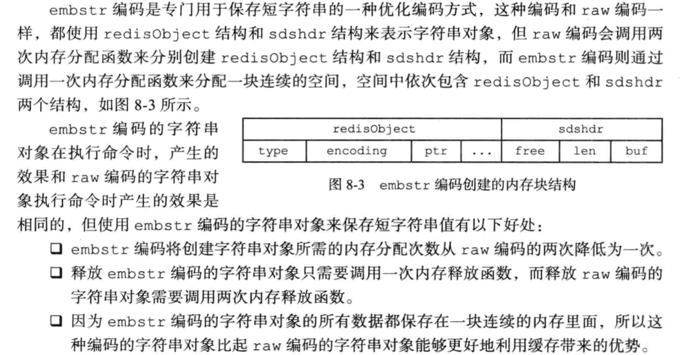
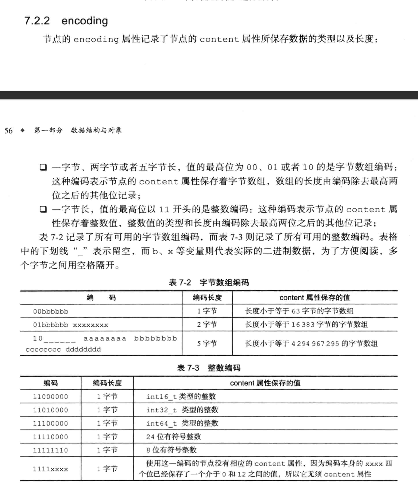
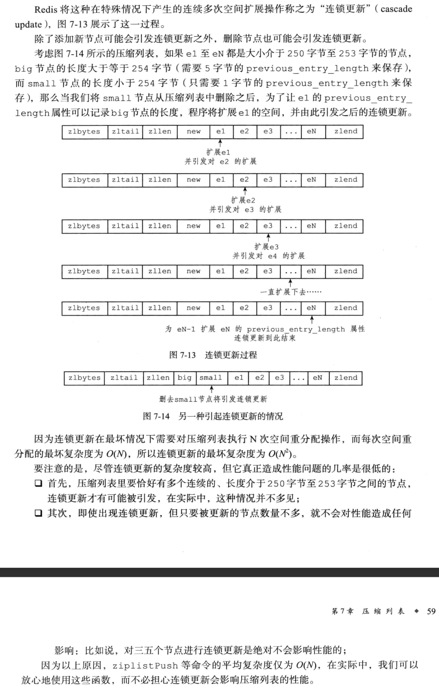

# ziplist源码
>* ziplist是为了解决小数据使用quicklist浪费内存的问题(节点指针占用空间远远大于数据)  
>* ziplist没有预容量，每次增删都设计内存重新分配   
>* 有小概率会有连锁操作的风险

## 构成







## 连锁更新


## 初始化->压缩的字符串
源代码巧妙利用了define，用带有语义的变量代替冗杂的指针操作，大大提高了代码的可读性。通过指针位移操作，设置不用参数。
```c
//大小端转换 使用小端
#if (BYTE_ORDER == LITTLE_ENDIAN)
//...
#define intrev64ifbe(v) (v)
#else
//...
#define intrev64ifbe(v) intrev64(v)
#endif

//zlbytes+zltail+zllen字段长度
#define ZIPLIST_HEADER_SIZE     (sizeof(uint32_t)*2+sizeof(uint16_t))

//zlend字段长度
#define ZIPLIST_END_SIZE        (sizeof(uint8_t))

//转化zl指针指向zlbytes参数
#define ZIPLIST_BYTES(zl)       (*((uint32_t*)(zl)))

//转化zl指针指向zltail参数
#define ZIPLIST_TAIL_OFFSET(zl) (*((uint32_t*)((zl)+sizeof(uint32_t))))

//转化zl指针指向zllen参数
#define ZIPLIST_LENGTH(zl)      (*((uint16_t*)((zl)+sizeof(uint32_t)*2)))

//结束标志
#define ZIP_END 255        

unsigned char *ziplistNew(void) {
    unsigned int bytes = ZIPLIST_HEADER_SIZE+ZIPLIST_END_SIZE;
    unsigned char *zl = zmalloc(bytes);
    //设置zlbytes参数
    ZIPLIST_BYTES(zl) = intrev32ifbe(bytes);
    //设置zltail参数
    ZIPLIST_TAIL_OFFSET(zl) = intrev32ifbe(ZIPLIST_HEADER_SIZE);
    //设置zllen参数
    ZIPLIST_LENGTH(zl) = 0;
    //设置zlend参数
    zl[bytes-1] = ZIP_END;
    return zl;
}
```

## 获取
```c
//用于方便ziplist操作的结构体
typedef struct zlentry {
    unsigned int prevrawlensize; //前一个数据的长度需要用多少字节表示 1 或者 5 字节
    unsigned int prevrawlen;     //前一个数据字节数
    unsigned int lensize;        //数据长度 1 2 5
    unsigned int len;            //数据的长度需要用多少字节表示
    unsigned int headersize;     //头部占用的长度 prevrawlensize+lensize->也就是元数据占用的字节数
    unsigned char encoding;      //数据的类型 整形 or 字节数组
    unsigned char *p;            //数据指针，指向previous_entry_length
} zlentry;

//获取指针p指向的数据，若是字节数组，则将数组的指针存入sstr，长度存入slen，若是整数，则存入sval。
//p为空 || p指向尾端，返回0，否则返回1
unsigned int ziplistGet(unsigned char *p, unsigned char **sstr, unsigned int *slen, long long *sval) {
    zlentry entry;
    if (p == NULL || p[0] == ZIP_END) return 0;
    if (sstr) *sstr = NULL;

    //解析数据
    zipEntry(p, &entry); 
    //字节数组
    if (ZIP_IS_STR(entry.encoding)) {
        if (sstr) {
            *slen = entry.len;
            //移动*sstr指针到数据开始的位置
            *sstr = p+entry.headersize;
        }
    } else {
        if (sval) {
            //将整形数据存入sval中
            *sval = zipLoadInteger(p+entry.headersize,entry.encoding);
        }
    }
    return 1;
}

//判断长度用1还是5字节表示 如果是5 首字节为254
#define ZIP_DECODE_PREVLENSIZE(ptr, prevlensize) do {                          \
    if ((ptr)[0] < ZIP_BIG_PREVLEN) {                                          \
        (prevlensize) = 1;                                                     \
    } else {                                                                   \
        (prevlensize) = 5;                                                     \
    }                                                                          \
} while(0)

#define ZIP_DECODE_PREVLEN(ptr, prevlensize, prevlen) do {                     \
    ZIP_DECODE_PREVLENSIZE(ptr, prevlensize);                                  \
    if ((prevlensize) == 1) {                                                  \
        (prevlen) = (ptr)[0];                                                  \
    } else { /* prevlensize == 5，因为ptr是char数组，char占用1个字节，分别取1、2、3、4字节上的数值向右移动0、8、16、24相加还原出长度 */                                            
        (prevlen) = ((ptr)[4] << 24) |                                         \
                    ((ptr)[3] << 16) |                                         \
                    ((ptr)[2] <<  8) |                                         \
                    ((ptr)[1]);                                                \
    }                                                                          \
} while(0)

#define ZIP_STR_MASK 0xc0 //11000000
//解析数据的类型
#define ZIP_ENTRY_ENCODING(ptr, encoding) do {  \
    (encoding) = ((ptr)[0]); \
    //字节数据的编码只需要获取前两位即可
    if ((encoding) < ZIP_STR_MASK) (encoding) &= ZIP_STR_MASK; \
} while(0)

//解析数据占用的字节数
#define ZIP_DECODE_LENGTH(ptr, encoding, lensize, len) do {                    \
    //字节数组
    if ((encoding) < ZIP_STR_MASK) {                                           \
        if ((encoding) == ZIP_STR_06B) {                                       \
            (lensize) = 1;                                                     \
            (len) = (ptr)[0] & 0x3f;                                           \
        } else if ((encoding) == ZIP_STR_14B) {                                \
            (lensize) = 2;                                                     \
            (len) = (((ptr)[0] & 0x3f) << 8) | (ptr)[1];                       \
        } else if ((encoding) == ZIP_STR_32B) {                                \
            (lensize) = 5;                                                     \
            (len) = ((uint32_t)(ptr)[1] << 24) |                               \
                    ((uint32_t)(ptr)[2] << 16) |                               \
                    ((uint32_t)(ptr)[3] <<  8) |                               \
                    ((uint32_t)(ptr)[4]);                                      \
        } else {                                                               \
            (lensize) = 0; /* bad encoding, should be covered by a previous */ \
            (len) = 0;     /* ZIP_ASSERT_ENCODING / zipEncodingLenSize, or  */ \
                           /* match the lensize after this macro with 0.    */ \
        }                                                                      \
    } else {                                                                   \
        //整形数据
        (lensize) = 1;                                                         \
        if ((encoding) == ZIP_INT_8B)  (len) = 1;                              \
        else if ((encoding) == ZIP_INT_16B) (len) = 2;                         \
        else if ((encoding) == ZIP_INT_24B) (len) = 3;                         \
        else if ((encoding) == ZIP_INT_32B) (len) = 4;                         \
        else if ((encoding) == ZIP_INT_64B) (len) = 8;                         \
        else if (encoding >= ZIP_INT_IMM_MIN && encoding <= ZIP_INT_IMM_MAX)   \
            (len) = 0; /* 4 bit immediate */                                   \
        else                                                                   \
            (lensize) = (len) = 0; /* bad encoding */                          \
    }                                                                          \
} while(0)                                                                        \

static inline void zipEntry(unsigned char *p, zlentry *e) {
    ZIP_DECODE_PREVLEN(p, e->prevrawlensize, e->prevrawlen);
    ZIP_ENTRY_ENCODING(p + e->prevrawlensize, e->encoding);
    ZIP_DECODE_LENGTH(p + e->prevrawlensize, e->encoding, e->lensize, e->len);
    assert(e->lensize != 0); /* check that encoding was valid. */
    e->headersize = e->prevrawlensize + e->lensize;
    e->p = p;
}

```


[Redis源码分析（四）—— ziplist的设计与实现](https://blog.csdn.net/pcj_888/article/details/122227334)   
摘抄自《Redis设计与实现》