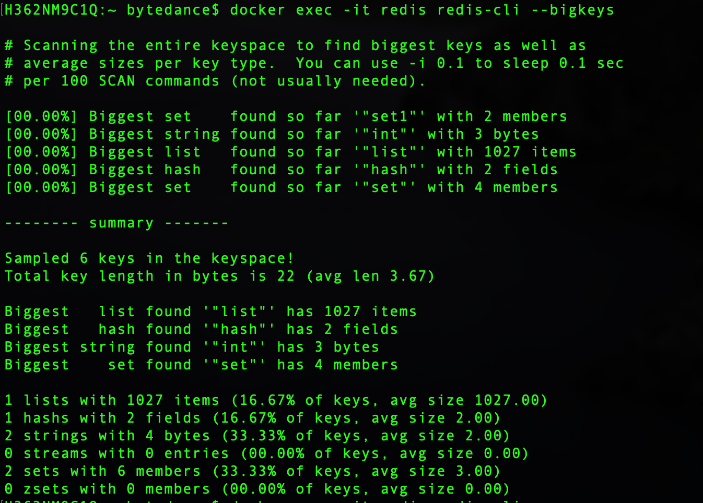

# Redis

## 事务
[Redis事务详解](https://blog.csdn.net/weixin_43888891/article/details/125925199)

## cpu暴涨
排查方向：业务/redis内部问题
### 业务
* big/hot key
* 连接数

### 内部问题
* aof重写
* 主从同步
* rdb文件
* 过期key清理

### Redis Cluster集群最多只有16384(2的14次方)个槽
因为集群元信息使用gossip协议，同步需要携带数据复杂槽节点信息，槽数据为16384时需要携带2k的数据，如果集群节点非常多，很消耗带宽，通过不建议集群节点超过1000个。   
[为什么Redis集群有16384个槽](https://www.cnblogs.com/rjzheng/p/11430592.html)

## 大key/热key治理
### 大key治理
#### 标准
* string->10kb
* 其他->个数大于5000或者数据大于10MB


#### 拆分

拆成多个副本，写入有影响，需要保证数据一致性。一般拆分后需要key记录拆分的元信息，拆分数量，版本等。

* string
用一个key记录拆分的数量+数据版本，更新缓存时元数据+数据版本+1，获取时先获取元数据key，再构造数据key集合，获取数据，对比版本，一致可以使用，不一致不可以使用，回源并更新缓存。
例如：原数据 msg:1=123456，要求不能超过3个字符，拆分成两个key，元数据：msg:meta:1=2,1 数据 msg:data:1:1:=1,123 msg:data:1:2=2,456
* Set
拆分需要考虑重复的问题，可以借助hash或者业务逻辑的拆分。
  * 拆分为2个key，相同数据hash到一个key，元数据：set:meta=2，拿到元数据的数据数量hash判断应该放入哪个key
  * 根据业务逻辑拆分，维度可以是时间、用户id等，例如value中存在时间戳，可以根据时间拆分，元数据存放具体的key，set:meta=[key_starttime_endtime,…]，写入时根据开始和结束时间构造，再判断key是否存在，存在写入，不存在创建。


#### 压缩
压缩能带来3-10倍，耗时只在微秒级别。常用压缩算法，Snappy、LZ4、ZSTD、GZIP，压缩效率依次增大，耗时也增大，ZSTD性价比高，


### 热key治理

#### 读多写少

* 业务拆分
避免内聚性不高的数据在同一个结构里
* 副本
分散到不同redis实例上，访问带随机数
* localcache+signleflight
每次访问缓存在本地并设置几秒的缓存，读取时优先获取本地缓存，缓存缺失再从redis获取，搭配singleflight防止缓存穿透。
* localcache+timer
将redis数据缓存到本地，定时进行数据拉取。

#### 写多读少
* 拆分
像计数器，把数据分为多个副本，写时随机获取副本，读时获取所有副本累加。缺点是获取副本可能会超时，两次获取数据副本累加后值不同。
* localcache
在本地缓存数据，定时同步到redis上，视具体情况分析。像计数器，可以在本地缓存存量和增量数据，写时操作增量，定期把增量数据累加到redis上，并定期中redis拉取存量数据，读取时计算增量+存量。


### 优化指标
* P99时延，毫秒

* 内存

* qps

* key大小

* cpu尖刺

## keys 和 scan 的优缺点

### keys

* 没有限制返回数量，在搜索结果很大时会造成阻塞

### scan

* scan命令提供了limit参数，可以控制每次返回结果的最大条数。
* 返回结果有可能重复

## scan遍历顺序

```redis
127.0.0.1:6379> keys *
1) "db_number"
2) "key1"
3) "myKey"
127.0.0.1:6379> scan 0 MATCH * COUNT 1
1) "2" 
2) 1) "db_number"
127.0.0.1:6379> scan 2 MATCH * COUNT 1
1) "1"
2) 1) "myKey"
127.0.0.1:6379> scan 1 MATCH * COUNT 1
1) "3"
2) 1) "key1"
127.0.0.1:6379> scan 3 MATCH * COUNT 1
1) "0"
2) (empty list or set)
```

我们的Redis中有3个key，我们每次只遍历一个一维数组中的元素。如上所示，SCAN命令的遍历顺序是

0->2->1->3

这个顺序看起来有些奇怪。我们把它转换成二进制就好理解一些了。

00->10->01->11

```c
v = rev(v);
v++;
v = rev(v);
```

意思是，将游标倒置，加一后，再倒置，也就是我们所说的“高位加1”的操作。

这里大家可能会有疑问了，为什么要使用这样的顺序进行遍历，而不是用正常的0、1、2……这样的顺序呢，这是因为需要考虑遍历时发生字典扩容与缩容的情况（不得不佩服开发者考虑问题的全面性）。

我们来看一下在SCAN遍历过程中，发生扩容时，遍历会如何进行。加入我们原始的数组有4个元素，也就是索引有两位，这时需要把它扩充成3位，并进行rehash。


原来挂接在xx下的所有元素被分配到0xx和1xx下。在上图中，当我们即将遍历10时，dict进行了rehash，这时，scan命令会从010开始遍历，而000和100（原00下挂接的元素）不会再被重复遍历。

再来看看缩容的情况。假设dict从3位缩容到2位，当即将遍历110时，dict发生了缩容，这时scan会遍历10。这时010下挂接的元素会被重复遍历，但010之前的元素都不会被重复遍历了。所以，缩容时还是可能会有些重复元素出现的。

## redis的rehash过程  

rehash是一个比较复杂的过程，为了不阻塞Redis的进程，它采用了一种渐进式的rehash的机制。

```redis
/* 字典 */
typedef struct dict {
    // 类型特定函数
    dictType *type;
    // 私有数据
    void *privdata;
    // 哈希表
    dictht ht[2];
    // rehash 索引
    // 当 rehash 不在进行时，值为 -1
    int rehashidx; /* rehashing not in progress if rehashidx == -1 */
    // 目前正在运行的安全迭代器的数量
    int iterators; /* number of iterators currently running */
} dict;
```

在Redis的字典结构中，有两个hash表，一个新表，一个旧表。在rehash的过程中，redis将旧表中的元素逐步迁移到新表中.

通过注释我们就能了解到，rehash的过程是以bucket为基本单位进行迁移的。所谓的bucket其实就是我们前面所提到的一维数组的元素。每次迁移一个列表。下面来解释一下这段代码。

首先判断一下是否在进行rehash，如果是，则继续进行；否则直接返回。
接着就是分n步开始进行渐进式rehash。同时还判断是否还有剩余元素，以保证安全性。
在进行rehash之前，首先判断要迁移的bucket是否越界。
然后跳过空的bucket，这里有一个empty_visits变量，表示最大可访问的空bucket的数量，这一变量主要是为了保证不过多的阻塞Redis。
接下来就是元素的迁移，将当前bucket的全部元素进行rehash，并且更新两张表中元素的数量。
每次迁移完一个bucket，需要将旧表中的bucket指向NULL。
最后判断一下是否全部迁移完成，如果是，则收回空间，重置rehash索引，否则告诉调用方，仍有数据未迁移。

转载自<https://zhuanlan.zhihu.com/p/46353221>

## 跳表 VS 红黑树

* 两者搜索复杂度一致，跳表实现复杂度小，容易调试、扩展
* 在增删数据时，红黑树平衡过程中调整幅度大，跳表幅度小，只需要调整前后指针即可
  [面试：为啥 redis 使用跳表(skiplist)而不是使用 red-black](https://juejin.cn/post/6893072817206591496)

## redis提升性能优化措施

### aof重写

* 使用 rdb+aof混合模式，提升恢复数据速度
* aof重写文件定时刷盘，减少一次性刷盘阻塞

### sds

* 使用不同数据类型记录sds的元数据(使用长度、未使用程度)
* 预分配，懒释放
* 字符串对象OBJ_ENCODING_EMBSTR类型，把字符串对象和指向的数据sds内存分配在一起(充分利用缓存)
* 不使用内存对齐机制
* 根据字符串的长度细分不同类型，减少长度变量类型长度

### 数据放在首部位置
1. dict新插入数据
2. ziplist新加入数据

### ziplist编码
多个数据合并为一个节点

### hash渐进式扩容

### 多线程处理io和异步任务

### 主从同步复用rdb文件

### quicklist节点使用ziplist存放数据，中间节点压缩数据

### inset编码升级

### 共享对象

把常用的对象创建出来，多次复用。

### 设置cpu亲和性

redis为常见的操作设置了固定的cpu列表，防止切换cpu带来的性能损耗。

```c
    char *server_cpulist; /* cpu affinity list of redis server main/io thread. */
    char *bio_cpulist; /* cpu affinity list of bio thread. */
    char *aof_rewrite_cpulist; /* cpu affinity list of aof rewrite process. */
    char *bgsave_cpulist; /* cpu affinity list of bgsave process. */
```

### 位域定义方法

将一个类型切分为多个部分，每个部分可以定义一个变量。

```c
typedef struct redisObject {
    //unsigned占用4字节，type、encoding、lru三个变量只需要一个unsigned类型长度
    unsigned type:4; //数据类型，4个bits
    unsigned encoding:4; //编码类型，4个bits
    unsigned lru:24;  //LRU时间，LRU_BITS为24个bits
    int refcount; //redisObject的引用计数，4个字节
    void *ptr; //指向值的指针，8个字节
} robj;
```

### 过期key扫描

* 扫描过期key的任务中，设置了每次循环扫描的数据个数，但是字典中可能大部分槽是空的，所以扫描个数达到设定值，可能需要遍历非常多的槽，所以加入了槽数据的限制，默认是数据个数的20倍
* 分为快速清除和慢速清除模式，慢速清除会限制使用cpu资源，防止占用过多资源

## 查找BigKeys和HotKeys

### redis-cli --bigkeys/--hotkeys(不建议)

* 缺点
  * 指标单一，不可定制化
  * 只统计了各个类型的top1 bigkey(指标不一定合理，例如list是通过数据个数衡量大小)



### debug object `<key_name>`

查看key的信息，通过**serializedlength**指标评估key大小

### 中间件监控

使用scan+类型len的方式实时监控数据长度。

* [DataFlux](https://baike.baidu.com/item/DataFlux/49761821)

## 检查/修复持久化文件

### redis-check-aof <-fix> `<fileName>`

查找第一个格式错误的命令，并把后续命令全部删除。

### redis-check-dump `<fileName>`

无法修复rdb文件，因为rdb会经过压缩。

## Fork耗时优化(子进程需要复制父进程内存页表)

* 使用物理机或者高效支持fork操作的虚拟技术
* 控制redis单实例的内存大小，fork耗时和内存量成正比，建议在10g以内
* 放宽rewriteaof的触发条件，建议auto-aof-rewrite-percentage 100%

## localcache热点发现方案

### 中心热点发现

将请求聚合到中心节点统计再下发热点。

#### 特点

* 更准确
* 实现复杂、延时高

#### 应用场景

* 流量逐渐增多，用缓冲时间做热点统计和下发，例如直播

#### 业界实现

* [有赞 TMC](https://mp.weixin.qq.com/s?__biz=MzAxOTY5MDMxNA==&mid=2455759090&idx=1&sn=f9f0b49d7c1916672f9d4f63dab0c2b6&chksm=8c686ed7bb1fe7c1446838941ff1bdb5d0bd8738aa43c22d456cf9736e3068eb13a29f908403&scene=21#wechat_redirect)
* 字节 SmartCache
* [京东](https://my.oschina.net/1Gk2fdm43/blog/4331985)

### 单机热点发现

在单实例统计并缓存数据。

#### 特点

* 延时短、实时性高
* 不准确，没法做全局统计

#### 应用场景

* 突发流量，发现热点后即使做缓存，例如秒杀场景

#### 业界实现

* 字节 bytecache

## setex vs setnx

都属于原子操作，是set key value和expire key seconds两个命令合并。差别在于setex如果key存在会覆盖，setnx则不做任何操作，返回对应状态。

## redis缓存淘汰策略

### lru和lfu

* lru是最近最少使用，根据数据被使用的时间最排序，适用于短时间内用户可能再次访问数据的场景，例如用户多次进入同一页面，数据库缓存(查询的数据短时间会被再次访问)等
* lfu最近最不经常使用，根据数据使用频次做排序，适用于长时间内多次被访问的热点数据，即使短时间不访问也不被淘汰，例如热点新闻、文章等

## Redis的容量和性能评估

* 容量->业务所需字节数+20-30%冗余
* 性能->4core16G实例，4个组成的集群qps达到70-80w

## memcached vs redis

* 数据类型：memcached提供简单key-value存储，类型只有字符串，redis提供多种数据类型
* redis的功能丰富，提供了集群模式(主从、分片)、事务、发布订阅等
* 数据持久化：memcached没有数据持久化功能，redis提供了rdb+aof
* 性能：memcached在多核的机器上速度高于redis(单线程)

## 研发如何优化redis内存

* 选择合适数据类型
* 根据业务场景key是否可以设置为不过期
key非常多的场景可以使用不过期+MQ策略，使用MQ延时删除数据
* 根据redis数据类型的底层实现精简存入的数据，选择最优的底层数据结构
