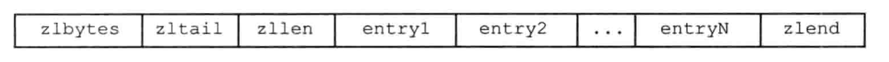

# ziplist源码
>* ziplist是为了解决小数据使用quicklist浪费内存的问题(节点指针占用空间远远大于数据)  
>* ziplist没有预容量，每次增删都设计内存重新分配   
>* 有小概率会有连锁操作的风险

## 构成

[Redis源码分析（四）—— ziplist的设计与实现](https://blog.csdn.net/pcj_888/article/details/122227334)   
《Redis设计与实现》