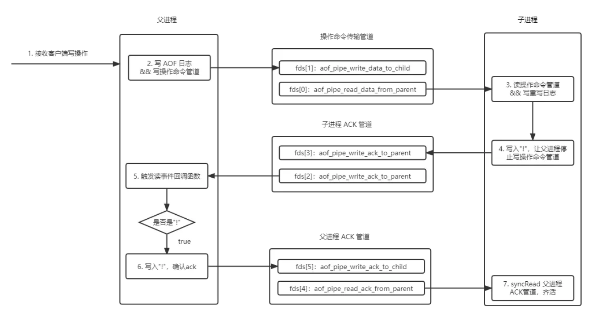

# 时间事件和文件事件

redis中有两种事件，一种是和客户端的读写交互，称为文件事件；一种是redis自身需要在特定时间执行事件，例如扫描过期key、备份rdb、重写aof等任务，称为时间事件。

## 文件事件

redis提供了四种文件事件的处理方式，select、poll、epoll，kqueue，根据系统的支持，选择效率最高的方式。redis对这四种io多路复用封装了简单的api，屏蔽了底层的差异。

```c
#ifdef HAVE_EVPORT
#include "ae_evport.c"
#else
    #ifdef HAVE_EPOLL
    #include "ae_epoll.c"
    #else
        #ifdef HAVE_KQUEUE
        #include "ae_kqueue.c"
        #else
        #include "ae_select.c"
        #endif
    #endif
#endif
//文件事件结构
typedef struct aeFileEvent {
    //AE_(READABLE|READABLE|BARRIER) READABLE 可读事件 READABLE 可写事件 todo BARRIER
    int mask; 
    //读事件处理器
    aeFileProc *rfileProc;
    //写事件处理器
    aeFileProc *wfileProc;
    //todo
    void *clientData;
} aeFileEvent;

//创建文件事件
static int aeApiCreate(aeEventLoop *eventLoop)
//释放文件事件
static void aeApiFree(aeEventLoop *eventLoop)
//添加事件处理器
static int aeApiAddEvent(aeEventLoop *eventLoop, int fd, int mask)
//删除事件处理器
static void aeApiDelEvent(aeEventLoop *eventLoop, int fd, int delmask)
//检查活跃事件
static int aeApiPoll(aeEventLoop *eventLoop, struct timeval *tvp)
//api的实现方式
static char *aeApiName(void)
```

### 四种io多路复用

#### epoll

## 时间事件

```c
//时间事件
typedef struct aeTimeEvent {
    //唯一标识符
    long long id;
    //事件到达时间
    monotime when;
    //事件处理函数
    aeTimeProc *timeProc;
    //事件结束后释放资源函数
    aeEventFinalizerProc *finalizerProc;
    //私有数据
    void *clientData;
    //双向指针
    struct aeTimeEvent *prev;
    struct aeTimeEvent *next;
    int refcount; /* refcount to prevent timer events from being
  		   * freed in recursive time event calls. */
} aeTimeEvent;
```

## 轮询结构

```c
typedef struct aeEventLoop {
    //最大文件事件id
    int maxfd;   
    //最大的文件数量
    int setsize; 
    //下一个时间事件
    long long timeEventNextId;
    //文件事件链表
    aeFileEvent *events; 
    //激活的文件事件
    aeFiredEvent *fired; 
    //时间时间链表
    aeTimeEvent *timeEventHead;
    //是否停止轮询，停止后退出程序
    int stop;
    //记录io多路复用的信息，其实就是每种模型的aeApiState结构
    void *apidata; 
    aeBeforeSleepProc *beforesleep;
    aeBeforeSleepProc *aftersleep;
    int flags;
} aeEventLoop;

typedef struct aeFiredEvent {
    int fd;
    int mask;
} aeFiredEvent;
```

## 处理流程

程序启动后会创建轮询对象，初始化文件事件的io处理模型，初始化文件事件和时间事件，最后死循环轮询，检查是否有活跃的连接。

```c
int main(int argc, char **argv) {
    //...
    //初始化事件
    initServer();
    //...
  
    //死循环处理事件
    aeMain(server.el);
    aeDeleteEventLoop(server.el);
}
```

### 初始化

```c
//server.c
void initServer(void) {
    //....
    //创建轮询对象 CONFIG_FDSET_INCR 128 maxclients默认10000
    server.el = aeCreateEventLoop(server.maxclients+CONFIG_FDSET_INCR);

    //...

    //创建时间事件
  if (aeCreateTimeEvent(server.el, 1, serverCron, NULL, NULL) == AE_ERR) {
        serverPanic("Can't create event loop timers.");
        exit(1);
    }

    //...

    //创建文件事件
    if (aeCreateFileEvent(server.el, server.module_blocked_pipe[0], AE_READABLE,
        moduleBlockedClientPipeReadable,NULL) == AE_ERR) {
            serverPanic(
                "Error registering the readable event for the module "
                "blocked clients subsystem.");
    }

    /* Register before and after sleep handlers (note this needs to be done
     * before loading persistence since it is used by processEventsWhileBlocked. */
    aeSetBeforeSleepProc(server.el,beforeSleep);
    aeSetAfterSleepProc(server.el,afterSleep);
}

aeEventLoop *aeCreateEventLoop(int setsize) {
    aeEventLoop *eventLoop;
    int i;

    monotonicInit();    /* just in case the calling app didn't initialize */

    if ((eventLoop = zmalloc(sizeof(*eventLoop))) == NULL) goto err;
    eventLoop->events = zmalloc(sizeof(aeFileEvent)*setsize);
    eventLoop->fired = zmalloc(sizeof(aeFiredEvent)*setsize);
    if (eventLoop->events == NULL || eventLoop->fired == NULL) goto err;
    eventLoop->setsize = setsize;
    eventLoop->timeEventHead = NULL;
    eventLoop->timeEventNextId = 0;
    eventLoop->stop = 0;
    eventLoop->maxfd = -1;
    eventLoop->beforesleep = NULL;
    eventLoop->aftersleep = NULL;
    eventLoop->flags = 0;
    if (aeApiCreate(eventLoop) == -1) goto err;
    /* Events with mask == AE_NONE are not set. So let's initialize the
     * vector with it. */
    for (i = 0; i < setsize; i++)
        eventLoop->events[i].mask = AE_NONE;
    return eventLoop;

err:
    if (eventLoop) {
        zfree(eventLoop->events);
        zfree(eventLoop->fired);
        zfree(eventLoop);
    }
    return NULL;
}
```

```c
long long aeCreateTimeEvent(aeEventLoop *eventLoop, long long milliseconds,
        aeTimeProc *proc, void *clientData,
        aeEventFinalizerProc *finalizerProc)
{
    //获取唯一标识符
    long long id = eventLoop->timeEventNextId++;
    aeTimeEvent *te;

    te = zmalloc(sizeof(*te));
    if (te == NULL) return AE_ERR;
    te->id = id;
    te->when = getMonotonicUs() + milliseconds * 1000;
    te->timeProc = proc;
    te->finalizerProc = finalizerProc;
    te->clientData = clientData;
    te->prev = NULL;
    te->next = eventLoop->timeEventHead;
    te->refcount = 0;
    //放入链表
    if (te->next)
        te->next->prev = te;
    eventLoop->timeEventHead = te;
    return id;
}

int aeCreateFileEvent(aeEventLoop *eventLoop, int fd, int mask,
        aeFileProc *proc, void *clientData)
{
    if (fd >= eventLoop->setsize) {
        errno = ERANGE;
        return AE_ERR;
    }
    aeFileEvent *fe = &eventLoop->events[fd];

    if (aeApiAddEvent(eventLoop, fd, mask) == -1)
        return AE_ERR;
    fe->mask |= mask;
    if (mask & AE_READABLE) fe->rfileProc = proc;
    if (mask & AE_WRITABLE) fe->wfileProc = proc;
    fe->clientData = clientData;
    if (fd > eventLoop->maxfd)
        eventLoop->maxfd = fd;
    return AE_OK;
}
```

### 处理事件

```c
void aeMain(aeEventLoop *eventLoop) {
    eventLoop->stop = 0;
    while (!eventLoop->stop) {
        //处理文件和时间事件
        aeProcessEvents(eventLoop, AE_ALL_EVENTS|
                                   AE_CALL_BEFORE_SLEEP|
                                   AE_CALL_AFTER_SLEEP);
    }
}
```

```c
int aeProcessEvents(aeEventLoop *eventLoop, int flags)
{
    int processed = 0, numevents;

    //处理文件事件
    if (eventLoop->maxfd != -1 ||
        ((flags & AE_TIME_EVENTS) && !(flags & AE_DONT_WAIT))) {
        //先计算检测是否有活跃事件方法的超时时间
        int j;
        struct timeval tv, *tvp;
        int64_t usUntilTimer = -1;
        /*
            如果没有时间事件或者设置了不等待 AE_DONT_WAIT 标志，则aeApiPoll方法的超时时间为0，检测是否有活跃事件后直接返回。
            否则，遍历时间事件，找出最早需要执行的事件时间，和当前时间取时间差，作为aeApiPoll超时时间(小于0设置为0)。
        */
        if (flags & AE_TIME_EVENTS && !(flags & AE_DONT_WAIT))
            usUntilTimer = usUntilEarliestTimer(eventLoop);

        if (usUntilTimer >= 0) {
            tv.tv_sec = usUntilTimer / 1000000;
            tv.tv_usec = usUntilTimer % 1000000;
            tvp = &tv;
        } else {
            /* If we have to check for events but need to return
             * ASAP because of AE_DONT_WAIT we need to set the timeout
             * to zero */
            if (flags & AE_DONT_WAIT) {
                tv.tv_sec = tv.tv_usec = 0;
                tvp = &tv;
            } else {
                /* Otherwise we can block */
                tvp = NULL; /* wait forever */
            }
        }

        if (eventLoop->flags & AE_DONT_WAIT) {
            tv.tv_sec = tv.tv_usec = 0;
            tvp = &tv;
        }

        //前置回调
        if (eventLoop->beforesleep != NULL && flags & AE_CALL_BEFORE_SLEEP)
            eventLoop->beforesleep(eventLoop);

        //调用io多路复用api检查活跃连接
        numevents = aeApiPoll(eventLoop, tvp);

        //后置回调
        if (eventLoop->aftersleep != NULL && flags & AE_CALL_AFTER_SLEEP)
            eventLoop->aftersleep(eventLoop);
        //处理活跃连接
        for (j = 0; j < numevents; j++) {
            aeFileEvent *fe = &eventLoop->events[eventLoop->fired[j].fd];
            int mask = eventLoop->fired[j].mask;
            int fd = eventLoop->fired[j].fd;
            int fired = 0; 

            /*
                正常情况下，为了更快回复客户端，先处理读事件，再处理写事件。
                在特殊情况下，需要读写反转，mask的标志会带上 AE_BARRIER。
            */
            /* Normally we execute the readable event first, and the writable
             * event later. This is useful as sometimes we may be able
             * to serve the reply of a query immediately after processing the
             * query.
             *
             * However if AE_BARRIER is set in the mask, our application is
             * asking us to do the reverse: never fire the writable event
             * after the readable. In such a case, we invert the calls.
             * This is useful when, for instance, we want to do things
             * in the beforeSleep() hook, like fsyncing a file to disk,
             * before replying to a client. */
            int invert = fe->mask & AE_BARRIER;

            //先处理读事件
            if (!invert && fe->mask & mask & AE_READABLE) {
                fe->rfileProc(eventLoop,fd,fe->clientData,mask);
                fired++;
                fe = &eventLoop->events[fd]; /* Refresh in case of resize. */
            }

            //再处理写事件
            if (fe->mask & mask & AE_WRITABLE) {
                if (!fired || fe->wfileProc != fe->rfileProc) {
                    fe->wfileProc(eventLoop,fd,fe->clientData,mask);
                    fired++;
                }
            }

            //在读写反转的情况，上述处理读事件的流程被跳过，需要再次判断
            if (invert) {
                fe = &eventLoop->events[fd]; 
                if ((fe->mask & mask & AE_READABLE) &&
                    (!fired || fe->wfileProc != fe->rfileProc))
                {
                    fe->rfileProc(eventLoop,fd,fe->clientData,mask);
                    fired++;
                }
            }

            processed++;
        }
    }
    //处理时间事件
    if (flags & AE_TIME_EVENTS)
        processed += processTimeEvents(eventLoop);

    return processed;
}

//遍历时间事件，找出最早需要执行的事件时间，和当前时间取时间差，作为aeApiPoll超时时间(小于0设置为0)。
static int64_t usUntilEarliestTimer(aeEventLoop *eventLoop) {
    aeTimeEvent *te = eventLoop->timeEventHead;
    if (te == NULL) return -1;

    aeTimeEvent *earliest = NULL;
    while (te) {
        if (!earliest || te->when < earliest->when)
            earliest = te;
        te = te->next;
    }

    monotime now = getMonotonicUs();
    return (now >= earliest->when) ? 0 : earliest->when - now;
}
```

```c
static int processTimeEvents(aeEventLoop *eventLoop) {
    int processed = 0;
    aeTimeEvent *te;
    long long maxId;

    te = eventLoop->timeEventHead;
    maxId = eventLoop->timeEventNextId-1;
    monotime now = getMonotonicUs();
    while(te) {
        long long id;

        //删除废弃的事件
        if (te->id == AE_DELETED_EVENT_ID) {
            aeTimeEvent *next = te->next;
            //引用计数器不为0，说明还有其他指针引用，不能释放内存
            if (te->refcount) {
                te = next;
                continue;
            }
            if (te->prev)
                te->prev->next = te->next;
            else
                eventLoop->timeEventHead = te->next;
            if (te->next)
                te->next->prev = te->prev;
            if (te->finalizerProc) {
                te->finalizerProc(eventLoop, te->clientData);
                now = getMonotonicUs();
            }
            zfree(te);
            te = next;
            continue;
        }

        /* Make sure we don't process time events created by time events in
         * this iteration. Note that this check is currently useless: we always
         * add new timers on the head, however if we change the implementation
         * detail, this check may be useful again: we keep it here for future
         * defense. */
        if (te->id > maxId) {
            te = te->next;
            continue;
        }
        //如果到了执行的时间
        if (te->when <= now) {
            int retval;

            id = te->id;
            te->refcount++;
            //执行处理函数
            retval = te->timeProc(eventLoop, id, te->clientData);
            te->refcount--;
            processed++;
            now = getMonotonicUs();
            //更新下一次执行的时间，如果是一次性事件，则标记删除
            if (retval != AE_NOMORE) {
                te->when = now + retval * 1000;
            } else {
                te->id = AE_DELETED_EVENT_ID;
            }
        }
        te = te->next;
    }
    return processed;
}
```

## redis中的文件事件

### aof重写



#### 父进程写增量数据

```c
//aof.c
void aofRewriteBufferAppend(unsigned char *s, unsigned long len) {
    //增量数据存放在server.aof_rewrite_buf_blocks列表
    listNode *ln = listLast(server.aof_rewrite_buf_blocks);
    aofrwblock *block = ln ? ln->value : NULL;

    while(len) {
        //如果block存在
        if (block) {
            //如果空闲内存大于追加数据长度，返回len，表示当前block可以容纳数据，否则返回空闲长度，后续在新建block存放
            unsigned long thislen = (block->free < len) ? block->free : len;
            if (thislen) {  
                memcpy(block->buf+block->used, s, thislen);
                block->used += thislen;
                block->free -= thislen;
                s += thislen;
                len -= thislen;
            }
        }
        //不为0说明block大小不够，需要新建新的block
        if (len) { /* First block to allocate, or need another block. */
            int numblocks;

            block = zmalloc(sizeof(*block));
            block->free = AOF_RW_BUF_BLOCK_SIZE;
            block->used = 0;
            listAddNodeTail(server.aof_rewrite_buf_blocks,block);

            /* Log every time we cross more 10 or 100 blocks, respectively
             * as a notice or warning. */
            numblocks = listLength(server.aof_rewrite_buf_blocks);
            if (((numblocks+1) % 10) == 0) {
                int level = ((numblocks+1) % 100) == 0 ? LL_WARNING :
                                                         LL_NOTICE;
                serverLog(level,"Background AOF buffer size: %lu MB",
                    aofRewriteBufferSize()/(1024*1024));
            }
        }
    }

    //如果找不到父进程没有写入子进程管道的事件，创建一个
    if (!server.aof_stop_sending_diff &&
        aeGetFileEvents(server.el,server.aof_pipe_write_data_to_child) == 0)
    {
        aeCreateFileEvent(server.el, server.aof_pipe_write_data_to_child,
            AE_WRITABLE, aofChildWriteDiffData, NULL);
    }
}
```

#### 监听子进程ack消息

```c
//aof.c
int aofCreatePipes(void) {
    //创建三个管道
    int fds[6] = {-1, -1, -1, -1, -1, -1};
    int j;
    //pipe->创建管道，返回两个fd，第一个读，第二个写
    if (pipe(fds) == -1) goto error; /* parent -> children data. */
    if (pipe(fds+2) == -1) goto error; /* children -> parent ack. */
    if (pipe(fds+4) == -1) goto error; /* parent -> children ack. */
    /* Parent -> children data is non blocking. */
    if (anetNonBlock(NULL,fds[0]) != ANET_OK) goto error;
    if (anetNonBlock(NULL,fds[1]) != ANET_OK) goto error;
    //创建可读文件事件监听子进程
    if (aeCreateFileEvent(server.el, fds[2], AE_READABLE, aofChildPipeReadable, NULL) == AE_ERR) goto error;

    server.aof_pipe_write_data_to_child = fds[1];
    server.aof_pipe_read_data_from_parent = fds[0];
    server.aof_pipe_write_ack_to_parent = fds[3];
    server.aof_pipe_read_ack_from_child = fds[2];
    server.aof_pipe_write_ack_to_child = fds[5];
    server.aof_pipe_read_ack_from_parent = fds[4];
    server.aof_stop_sending_diff = 0;
    return C_OK;

error:
    serverLog(LL_WARNING,"Error opening /setting AOF rewrite IPC pipes: %s",
        strerror(errno));
    for (j = 0; j < 6; j++) if(fds[j] != -1) close(fds[j]);
    return C_ERR;
}
```

[Redis 的一个文件描述符泄露 Bug](https://blog.wxh.me/post/2017/03/redis-file-descriptors-leak-bug/)

### rdb主从同步

#### socket模式下监听子进程的rdb数据

socket模式下，rdb由子进程生成，通过管道发送给父进程，父进程创建文件事件监听并发送给从库。

```c
//rdb.c
//rdbPipeReadHandler->rdbPipeWriteHandler->rdbPipeReadHandler
int rdbSaveToSlavesSockets(rdbSaveInfo *rsi) {
    //...

    if ((childpid = redisFork(CHILD_TYPE_RDB)) == 0) {
        //... 子进程生成rdb
    } else {
        /* Parent */
        close(safe_to_exit_pipe);
        if (childpid == -1) {
            //子进程报错
        } else {
            serverLog(LL_NOTICE,"Background RDB transfer started by pid %ld",
                (long) childpid);
            server.rdb_save_time_start = time(NULL);
            server.rdb_child_type = RDB_CHILD_TYPE_SOCKET;
            close(rdb_pipe_write); 
            //增加事件监听管道数据
            if (aeCreateFileEvent(server.el, server.rdb_pipe_read, AE_READABLE, rdbPipeReadHandler,NULL) == AE_ERR) {
                serverPanic("Unrecoverable error creating server.rdb_pipe_read file event.");
            }
        }
        return (childpid == -1) ? C_ERR : C_OK;
    }
    return C_OK; /* Unreached. */
}
//replication.c
void rdbPipeWriteHandlerConnRemoved(struct connection *conn) {
    if (!connHasWriteHandler(conn))
        return;
    connSetWriteHandler(conn, NULL);
    client *slave = connGetPrivateData(conn);
    slave->repl_last_partial_write = 0;
    server.rdb_pipe_numconns_writing--;
    /* if there are no more writes for now for this conn, or write error: */
    if (server.rdb_pipe_numconns_writing == 0) {
        if (aeCreateFileEvent(server.el, server.rdb_pipe_read, AE_READABLE, rdbPipeReadHandler,NULL) == AE_ERR) {
            serverPanic("Unrecoverable error creating server.rdb_pipe_read file event.");
        }
    }
}
```

## redis中的时间事件

### serverCron

每秒执行10次，主要的工作有：

* 随机访问key触发过期
* watch机制
* 更新统计数据
* rdb/aof
* 处理客户端的状态，超时等
* 触发字典resize

```c
void tryResizeHashTables(int dbid) {
    if (htNeedsResize(server.db[dbid].dict))
        dictResize(server.db[dbid].dict);
    if (htNeedsResize(server.db[dbid].expires))
        dictResize(server.db[dbid].expires);
}
```

```c
    if (aeCreateTimeEvent(server.el, 1, serverCron, NULL, NULL) == AE_ERR) {
        serverPanic("Can't create event loop timers.");
        exit(1);
    }
```

### evictionTimeProc

每次处理命令后都会检查当前使用内存是否超过设定值，超过会进行数据驱逐机制，驱逐函数执行时间超过设定值，会创建立即执行的时间事件(间隔时间为0)。

```c
  if (elapsedUs(evictionTimer) > eviction_time_limit_us) {
                    // We still need to free memory - start eviction timer proc
                    if (!isEvictionProcRunning) {
                        isEvictionProcRunning = 1;
                        aeCreateTimeEvent(server.el, 0,
                                evictionTimeProc, NULL, NULL);
                    }
                    break;
    }
```

## Q&A

### 什么情况下会产生AE_BARRIER事件？

[【Redis源码系列】Redis6.0事件机制详解](https://juejin.cn/post/6986639765210660871#heading-6)
