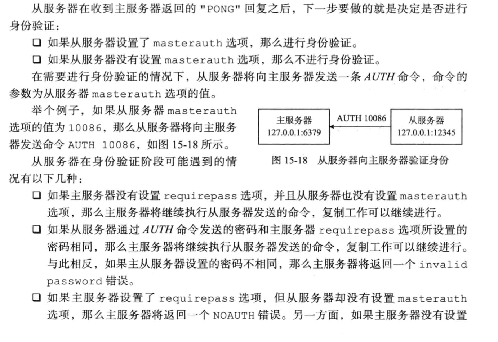
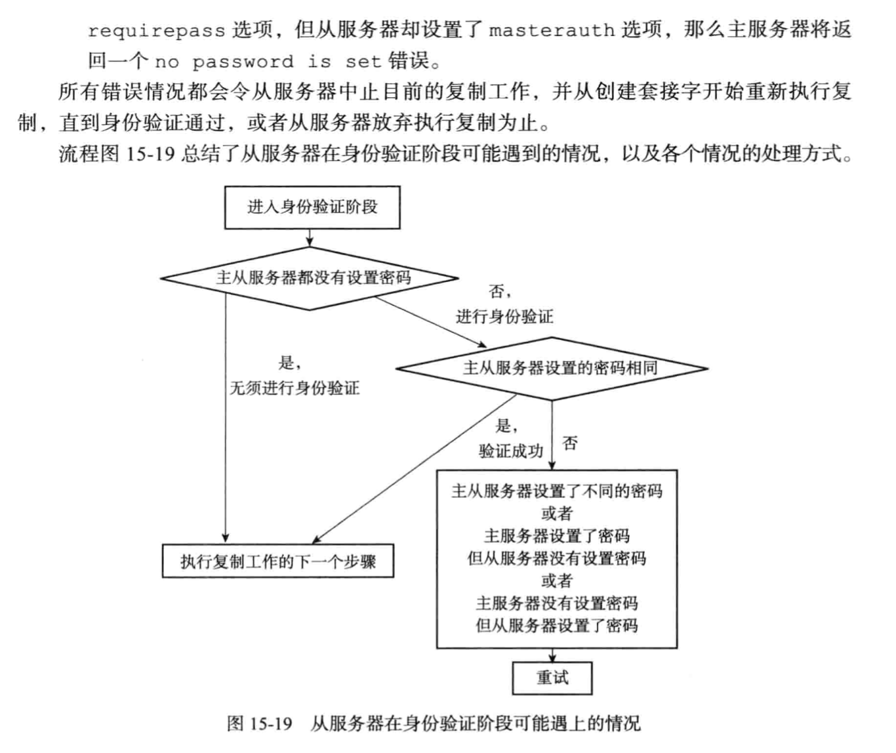
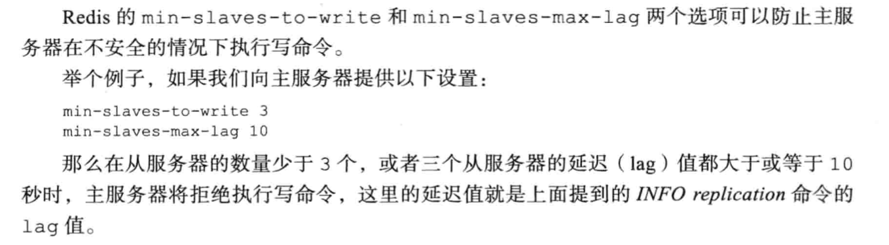
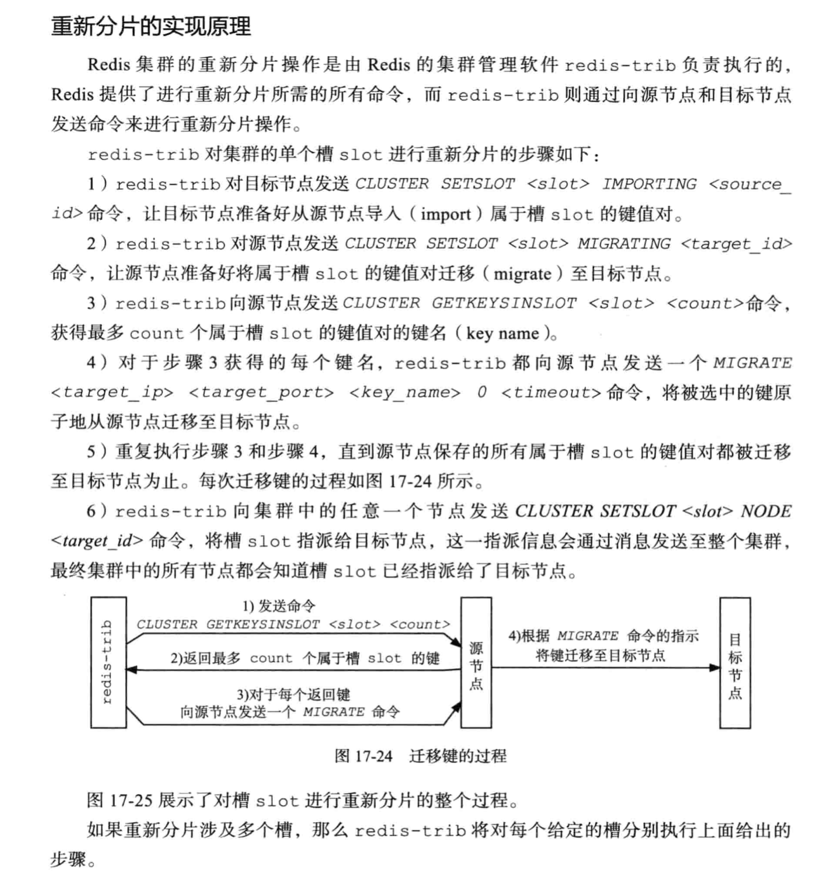
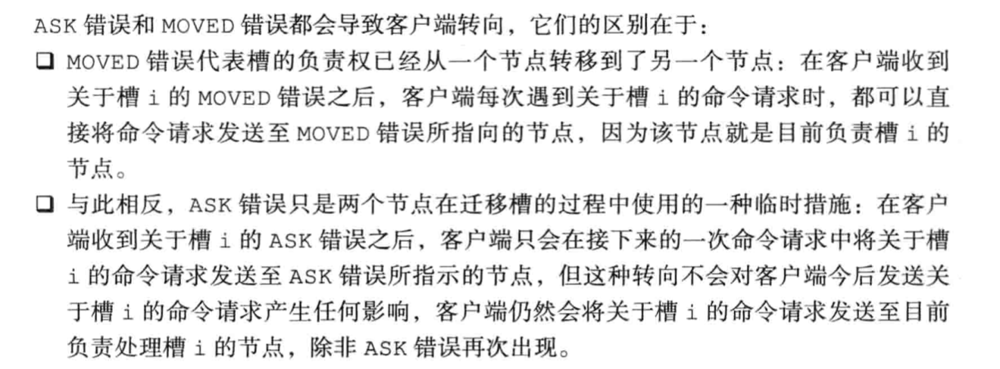
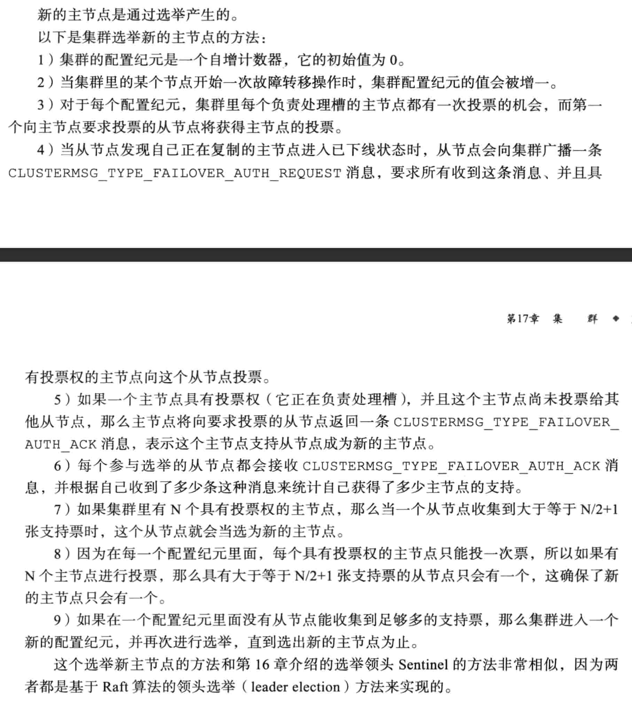

# 集群模式
## 主从复制
### 主从复制过程
* 设置主服务器的ip和port   
从客户端发送slaveof命令给从服务器，服务器记录信息，返回OK。
* 从服务器和主服务器建立socket连接
* 从服务器发送PONG命令
用于检测主从连接通信是否正常
* 主从身份验证

  

* 从服务器设置同步端口号
```redis
replconf listening-port port
```
* 从服务器发送psync请求同步数据

### 主从心跳检测
#### 作用
* 检测主从服务器网络连接状态
* 辅助实现 min-slaves 功能


* 检测命令丢失并重新发送

## 哨兵模式

## 集群模式
### 重新分片原理


### ASK错误和MOVE错误的区别


### 集群从服务器选举过程


摘抄自《Redis设计与实现》