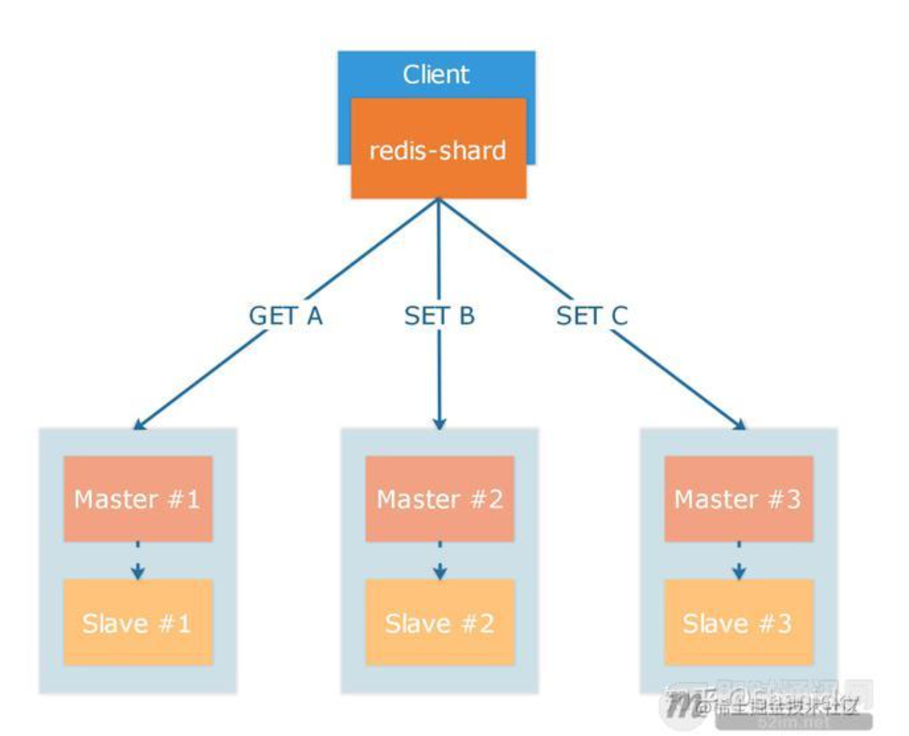
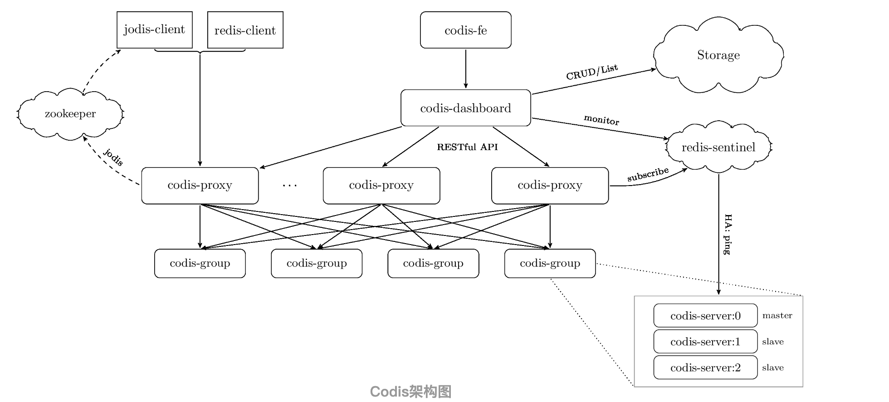
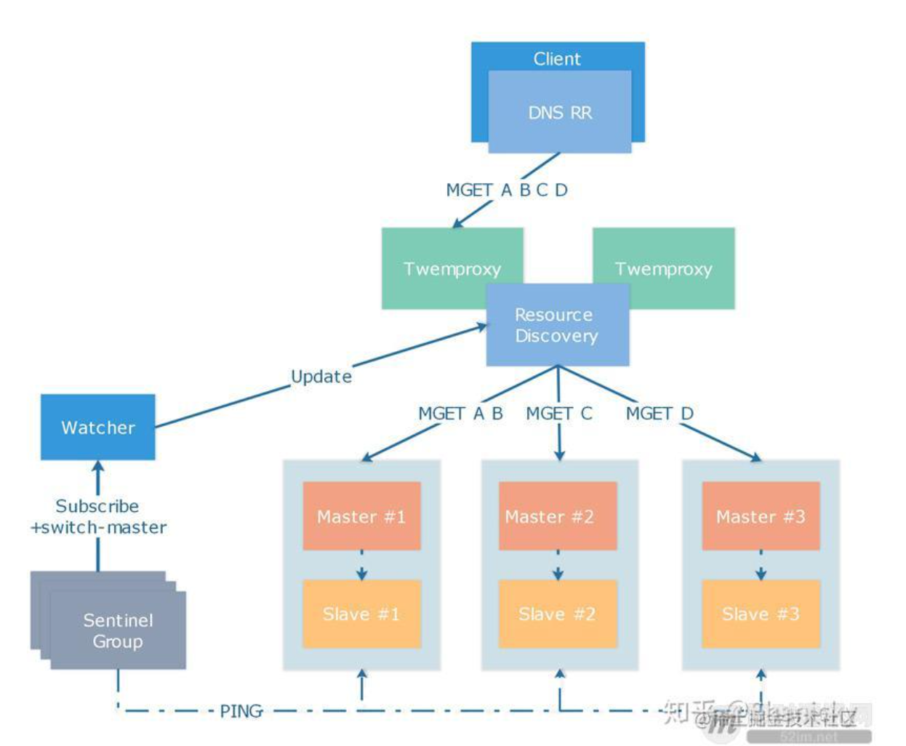

# 集群模式

## 主从复制

### 主从复制过程

* 设置主服务器的ip和port
从客户端发送slaveof命令给从服务器，服务器记录信息，返回OK。
* 从服务器和主服务器建立socket连接
* 从服务器发送PONG命令
用于检测主从连接通信是否正常
* 主从身份验证

  

* 从服务器设置同步端口号

```redis
replconf listening-port port
```

* 从服务器发送psync请求同步数据

### 主从心跳检测

#### 作用

* 检测主从服务器网络连接状态
* 辅助实现 min-slaves 功能


* 检测命令丢失并重新发送

## 哨兵模式

## 集群模式

### 重新分片原理


### ASK错误和MOVE错误的区别

#### Move错误

发生在数据迁移完成后，提示客户端应该去迁移后的节点拿数据，客户端收到错误后会更新集群信息，下次请求到新的节点上。

#### ASK错误

吧
发生在数据迁移过程中，部分数据已经迁移到新节点，表示这个数据已经被迁移到新的节点，本次请求应该到新节点查询，客户端收到错误后不会更新集群信息，本次请求回到新的节点上获取，下次请求还是会打到正在迁移的节点上去。

### 集群从服务器选举过程


摘抄自《Redis设计与实现》

## 实践

### 客户端分片


[zhihu/redis-shard](https://github.com/zhihu/redis-shard)

#### 优点

* 简单，没有中间价，没有官方集群的 MOVED/ASK 转向
* 自定义分片算法

#### 缺点

* 客户端sdk维护问题(各个语言、升级成本高)
* 无法同时操作多个key，需要搭配hash tag使用
* 扩容困难

### Redis Cluster(smart client和去中心化)

redis自带的集群机制，虚拟slot的分片方式，gossip协议同步集群信息。

#### 优点

* 简便、不需要额外的中间件
* 客户端直连redis性能高

#### 缺点

* 扩容数据迁移机制有block问题
* 使用gossip协议，集群节点数量多会有流量负载问题
* 高可用的机制不够灵活，只能依靠增加从节点数量
* 分片机制和数据处理逻辑耦合，不利于运营操作
* 客户端维护成本高，升级版本、扩容集群等
[7.5为什么没有使用官方 Redis 集群方案](https://juejin.cn/post/6844903681016463367)

### Codis(Redis Cluster的改良版)

redis cluster的改良版，虚拟slot的分片方式，使用zk/etcd+proxy作为路由管理。


#### 优点

* 基于哨兵机制实现proxy和redis实例故障自动恢复
* 平滑扩容，异步迁移数据，大key分批，小key打包，仅影响正在迁移key的写操作
* 提供可视化管理页面

#### 缺点

* 内置3.x版本redis，目前codis不再维护
* [部分命令不支持](https://github.com/CodisLabs/codis/blob/release3.2/doc/unsupported_cmds.md)

[Redis集群化方案对比：Codis、Twemproxy、Redis Cluster](http://kaito-kidd.com/2020/07/07/redis-cluster-codis-twemproxy/)
[深入浅出百亿请求高可用Redis(codis)分布式集群揭秘](https://www.51cto.com/article/595255.html)

### 使用Twemproxy管理集群

由 Twitter 开源的 Twemproxy

* 具有如下优点：
        1）性能很好且足够稳定，自建内存池实现 Buffer 复用，代码质量很高；
        2）支持 fnv1a_64、murmur、md5 等多种哈希算法；
        3）支持一致性哈希（ketama），取模哈希（modula）和随机（random）三种分布式算法。
* 但是缺点也很明显：
        1）单核模型造成性能瓶颈；
        2）传统扩容模式仅支持停机扩容

结合 Twemproxy 的特性根据业务场景搭建集群，通常情况下，可分为存储和缓存两种类型，存储不允许数据丢失，对数据的完整性要求比较高，缓存可以接受少量数据丢失，对高可用要求较高。

#### 存储

* 取模哈希key分片
* 多个主从redis实例+哨兵模式保证高可用
* key逐出策略noeviction，内存使用超过阙值报错，保证数据完整性
* twemproxy不设置auto_eject_hosts，不剔除redis节点防止数据丢失


##### 特点

redis节点宕机从节点备用，出现问题不会进行节点剔除，会重试连接，保证数据完整性。

#### 缓存

* 一致性哈希key分片
* 多个主redis实例
* twemproxy设置auto_eject_hosts，剔除redis节点保证可用性

##### 特点

节点出现问题后剔除，一致性哈希算法key重新分配到其他节点，保证高可用。

##### 注意

* 分片应该尽可能小，防止节点宕机重分配对新节点的压力和防止雪崩和击穿问题
* 故障节点重连后应该重启清楚脏数据
* server_retry_timeout 和 server_failure_limit 需要仔细敲定确认，知乎使用 10min 和 3 次作为配置，即连接失败 3 次后剔除节点，10 分钟后重新进行连接

### 缺点

#### 单点问题

twemproxy作为集群代理有单点问题，常见三种解决方式：

* 客户端负载均衡(可满足大部分场景)
* LVS
* DNS
把Twemproxy的ip加入dns列表，通过域名访问，每次随机返回ip

[从单机到2000万 QPS 并发的 Redis 高性能缓存实践之路 7.4](https://juejin.cn/post/6844903681016463367)
[15 如何深入理解、应用及扩展 Twemproxy？](https://learn.lianglianglee.com/%E4%B8%93%E6%A0%8F/300%E5%88%86%E9%92%9F%E5%90%83%E9%80%8F%E5%88%86%E5%B8%83%E5%BC%8F%E7%BC%93%E5%AD%98-%E5%AE%8C/15%20%E5%A6%82%E4%BD%95%E6%B7%B1%E5%85%A5%E7%90%86%E8%A7%A3%E3%80%81%E5%BA%94%E7%94%A8%E5%8F%8A%E6%89%A9%E5%B1%95%20Twemproxy%EF%BC%9F.md)
[Twemproxy调研总结](https://blog.csdn.net/houjixin/article/details/52101001)

#### 无法平滑扩容

扩容需要对数据重新分片，重启Twemproxy

#### 无法动态伸缩

Twemproxy只能监控节点的状态，做剔除和重连，无法动态伸缩节点数量，每次伸缩节点都要手动迁移数据和重起Twemproxy

## Q&A

### 扩容问题

[知乎Redis实例的扩容实践](https://juejin.cn/post/6844903681016463367)
