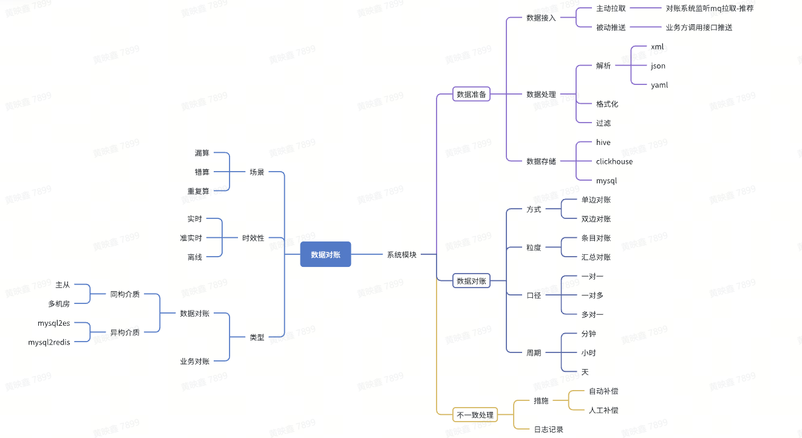

# 数据对账

 

## 数据对账必要性
分布式系统中一个流程中对多个系统的操作由于不同原因导致的数据错算、漏算、重复算等问题。

## 对账目的
* 发现问题
* 数据补偿
自动/人工补偿

## 对账流程分析
### 数据准备
#### 数据接入
* 拉取
业务方写入mq，对账系统消费消息完成数据导入
* 推送
业务方调用对账系统提供的接口，对账系统接受数据并存储

通常采用拉取的方式，mq可以控制消费速度和重新消费，防止数据丢失。

### 数据对账
#### 方式
对账两种方式：单边对账和双边对账
* 单边对账
以一方数据为准，校对另一方数据。
* 双边对账
以双方数据为准，分别校对，例如支付系统中调用第三方做支付，支付系统中订单和第三方交易流水应该严格一对一，任何一方出现缺失都需要补偿操作。

#### 粒度
从对账的颗粒度上划分分为两种，粗粒度总数对账和细粒度的明细对账，实际应用过程中推荐一起使用，粗粒度的对账发现问题再进行细颗粒度对账。
* 总数对账
从数据的条数或汇总指标做对比，不做具体条目比较，成本小。
* 明细对账
对数据做详细比对，精确到一行、某个字段等，成本大。

#### 口径
两个数据集间对账口径，常见的有一对一、一对多、多对一等。

#### 周期
数据对账的周期，需要根据数据存储的介质、数据量大小、业务容忍度等进行考虑，分为：分钟级、小时级、天级等。

### 不一致处理
对账发现的问题记录日志，在处理日志前会进行二次核对，防止误报，再根据日志等级做不同补偿措施，主要有两种：自动补偿和人工补偿。
