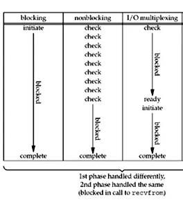
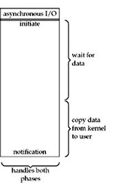
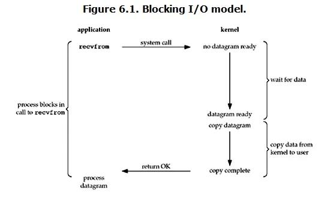
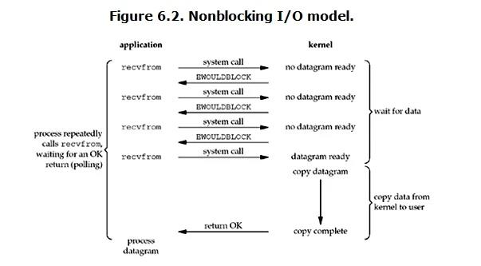
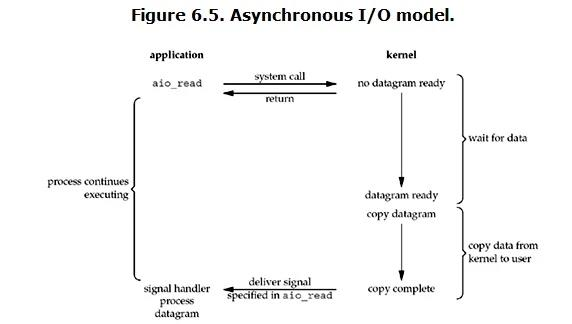

## IO类型


### IO的执行过程
一次IO，需要等待数据被拷贝到操作系统内核的缓冲区(本地IO或者远程IO)，然后才会从操作系统内核的缓冲区拷贝到应用程序的地址空间。所以说，当一个read操作发生时，它会经历两个阶段：
1. 等待数据准备 (Waiting for the data to be ready)
2. 将数据从内核拷贝到进程中 (Copying the data from the kernel to the process)
   正式因为这两个阶段，linux系统产生了下面五种网络模式的方案。
- 阻塞 I/O（blocking IO）
- 非阻塞 I/O（nonblocking IO）
- I/O 多路复用（ IO multiplexing）
- 信号驱动 I/O（ signal driven IO）
- 异步 I/O（asynchronous IO）

### 阻塞IO
   
用户调用IO，从数据拷贝到内核，再到内核拷贝到用户空间，整个进程都是阻塞的状态，不能做其他操作。

### 非阻塞IO
   
进程发出IO时，若数据还没有准备好，不会阻塞进程而是返回一个信息，并通过轮询的方式查看数据是否准备好，``数据准备阶段到不会阻塞进程，但是当数据准备好要拷贝到用户空间时会
阻塞进程，所以非阻塞只是准备数据不阻塞而不是整个IO过程不阻塞``

#### 异步IO
     
进程发起IO后可以立即做其他事情，系统处理完所有事情后会发一个通知给进程告知IO完成。

### 同步IO和异步IO的判别
```english
- A synchronous I/O operation causes the requesting process to be blocked until that I/O operation completes;
- An asynchronous I/O operation does not cause the requesting process to be blocked;
```
区别在于：进程是否因为IO被阻塞过
* 同步IO:阻塞IO、非阻塞IO、多路复用IO
* 异步IO：
* 同步IO和异步IO的区别就在于： 数据拷贝的时候进程是否阻塞

* 阻塞IO和非阻塞IO的区别就在于： 应用程序的调用是否立即返回 


### IO多路复用
select，poll，epoll都是IO多路复用的机制。I/O多路复用就是通过一种机制，一个进程可以监视多个描述符，一旦某个描述符就绪（一般是读就绪或者写就绪），能够通知程序进行相应的读写操作。
* 相较于非阻塞IO，IO多路复用是将多个描述符复制到内核中轮询，避免了用户态和内核态的切换

### select
调用select系统调用，阻塞进程，进程切换为内核态，轮询文件描述符，当有一个或多个描述符就绪或者超时则返回。
1. 缺点
    1. 数组传递描述符，可监听的文件描述符的数量有限
    2. 无法辨别就绪的描述符，每次轮询都需要遍历所有描述符，复杂度为O(n)

### poll
* poll和select本质上没有区别，poll对文件描述符数量没有限制，原因是描述符在用数组传递到内核后转化为链表的形式
* poll 水平触发的特点，如果就绪的文件描述符在报告后没有处理，下一次会再次报告


### epoll(select和poll的改进)
epoll给文件描述符设置回调函数，当描述符就绪时，自动调用回调函数处理，性能提升至O(1)，相较于select和poll有很大性能提升，
* select 只支持水平触发，epoll 支持水平触发和边缘触发。

* 水平触发（LT，Level Trigger）：当文件描述符就绪时，会触发通知，如果用户程序没有一次性把数据读/写完，下次还会发出可读/可写信号进行通知。

* 边缘触发（ET，Edge Trigger）：仅当描述符从未就绪变为就绪时，通知一次，之后不会再通知。   
  边缘触发的意义：
* 边缘触发效率更高，减少了事件被重复触发的次数，函数不会返回大量用户程序可能不需要的文件描述符。

epoll如何提升效率的：
* epoll 给每个文件描述符注册回调函数，当描述符就绪时，自动执行函数加入到就绪队列，系统只需要查看就绪队列就能判断是否有就绪描述符，并不需要遍历

### 适用场景
当连接数较多并且有很多的不活跃连接时，epoll 的效率比其它两者高很多。当连接数较少并且都十分活跃的情况下，由于 epoll 需要很多回调，因此性能可能低于其它两者。


https://segmentfault.com/a/1190000003063859
https://imageslr.com/2020/02/27/select-poll-epoll.html
