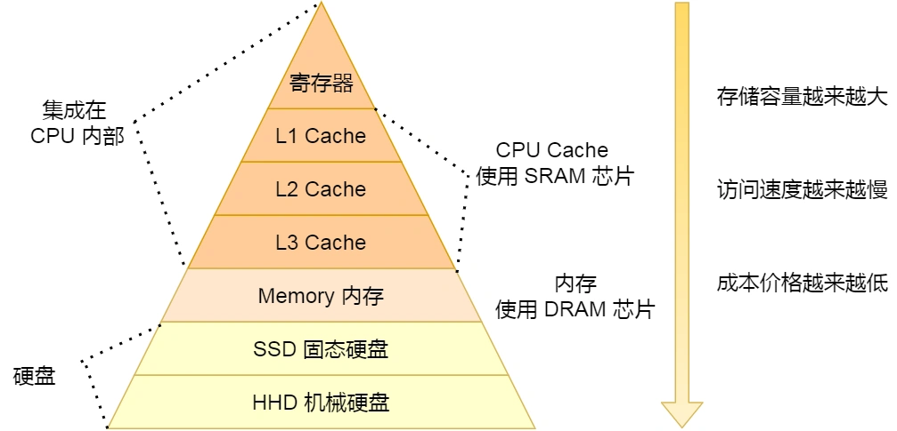

# 操作系统

## 外部碎片和内部碎片
* 外部碎片：还没有分配的内存由于太小无法满足分配的要求，无法被充分利用
* 内部碎片：分配出去的内存没有被使用，系统无法利用，只有等到进程释放(解决方式：内存交换，把进程交换到磁盘并且重新读入内存分配连续空间)
* 外部碎片产生的场景：内存分段分配
* 内部碎片：内存单一连续分配、内存固定分区分配、内存分页分配
* 外部内部碎片：内存动态分区分配

## 执行任务用多线程还是多进程
### 多线程
* 好处：1. 上下文切换代价小(需要大量计算) 2. 创建代价小(需要频繁创建销毁) 3. 同步机制完善(任务需要通信)
* 应用场景：
i. 进程多线程处理任务，提高用户体验

### 多进程
* 好处：1. 进程互不影响(任务独立) 2. 进程有独立的资源(任务要求内存等资源比较大)3. 进程更加稳定，一个进程的崩溃不会影响其他进程(一个线程崩溃会导致整个进程崩溃) 
* 应用场景：
i. chrome浏览器也是多进程方式。 （原因：①可能存在一些网页不符合编程规范，容易崩溃，采用多进程一个网页崩溃不会影响其他网页；而采用多线程会。②网页之间互相隔离，保证安全，不必担心某个网页中的恶意代码会取得存放在其他网页中的敏感信息。）
ii. redis也可以归类到“多进程单线程”模型（平时工作是单个进程，涉及到耗时操作如持久化或aof重写时会用到多个进程）
https://blog.csdn.net/weixin_39731083/article/details/82015830

## 进程创建过程
* 为新进程分配一个唯一的进程标识号，并申请一个空白的 PCB，PCB 是有限的，若申请失败则创建失败；
* 为进程分配资源，此处如果资源不足，进程就会进入等待状态，以等待资源；
* 初始化 PCB；
* 进程插入到就绪队列，等待被调度运行；

## 线程的种类
* 用户线程：存在与进程中，由进程管理，内核对进程中的线程没有感知，内核把用户线程的行为当作是进程行为进行处理，用户线程的创建、销毁等都不需要经过系统调用，每个进程维护一个线程表记录用户线程信息，通过改变堆栈指针和程序计数器实现线程切换，用户线程只能在一个cpu上进行并发   
* 内核线程：存在内核中，内核保存一个线程控制块，实现对线程创建、销毁等的管理，可以实现多cpu的并行操作

# java创建的线程是用户线程还是内核线程
取决于os，jvm只是调用操作系统创建线程的接口，比如windows和linux就是内核线程

## 系统可以创建最大连接
操作系统有三个级别的文件描述符限制连接的数量，系统最大文件描述符，用户最大文件描述符，进程最大文件描述符。
* 系统最大文件描述符：所有用户
* 用户最大文件描述符：单个用户
* 进程最大文件描述符：单个进程

## linux页面缓存 Page Cache
页面缓存是内核的内存区域，主要用于缓存数据页，用于减少磁盘io，更新数据时直接修改缓存，将写入的页标记为 dirty，采用刷脏策略持久化数据到磁盘，读数据时首先读取缓存，如果未命中，再去外部存储读取，并且将读取来的数据也加入缓存。
* 更新策略 

    1. Write Through（写穿）：向用户层提供特定接口，应用程序可主动调用接口来保证文件一致性；

    2. Write back（写回）：系统中存在定期任务（表现形式为内核线程），周期性地同步文件系统中文件脏数据块(默认)；
http://www.elecfans.com/d/1718693.html

## 进程互斥和同步
* 互斥：临界区只允许一个进程可以进入
* 同步：进程之间需要按照某种次序去执行
1. 信号量  
用一个整形变量协调进程间的关系，有三种操作，初始化、P、V
* P:整形-1，若整形小于0，进程阻塞
* V:整形+1，若整形大于等于0，阻塞的进程执行
* 缺点：多个进程协调代码可读性差，维护难度高，很难保证每一个操作不出现错误

2. 管程(synchronized)
* 管理共享资源以及对共享资源的操作
* 管程能够保证同一时刻只有一个进程访问与操作共享资源。在临界区被占用时，其他试图进入临界区的线程都将等待。等到满足条件再被唤醒

## 线程互斥和同步
1、临界区：通过对多线程的串行化来访问公共资源或一段代码，速度快，适合控制数据访问。在任意时刻只允许一个线程对共享资源进行访问，如果有多个线程试图访问公共资源，那么在有一个线程进入后，其他试图访问公共资源的线程将被挂起，并一直等到进入临界区的线程离开，临界区在被释放后，其他线程才可以抢占。
2、互斥量：采用互斥对象机制。 只有拥有互斥对象的线程才有访问公共资源的权限，因为互斥对象只有一个，所以能保证公共资源不会同时被多个线程访问。互斥不仅能实现同一应用程序的公共资源安全共享，还能实现不同应用程序的公共资源安全共享
3、信号量：它允许多个线程在同一时刻访问同一资源，但是需要限制在同一时刻访问此资源的最大线程数目
4、事 件： 通过通知操作的方式来保持线程的同步，还可以方便实现对多个线程的优先级比较的操作
https://www.jianshu.com/p/8e34fa6e54a8

## 进程上下文切换为什么比线程慢得多？
* 进程切换需要保存运行上下文环境，页表寄存器，程序计数器，堆栈信息等，需要更改虚拟地址空间，刷新快表。
* 线程共享的进程的虚拟内存，堆等数据，在切换的时候只需要变更少量数据就可以执行(程序计数器、栈信息等)

## 存储器的层次关系
      
### 固态硬盘比机械硬盘快的原因
由于实现原理不同带来的差异  
* 机械硬盘是通过移动机械的磁头在不同位置读写，需要经历磁头的寻道延迟和磁盘的旋转延迟，都需要时间，且这两个延迟优化已经达到上限。
* 固体硬盘内部有多个闪存，读写时可以并行，在主控的指挥下，通过电学信号的传输完成对闪存芯片(闪存的基本单元)的读写操作，依赖的是电学信号。

[存储器的层次结构](https://xiaolincoding.com/os/1_hardware/storage.html#%E5%AD%98%E5%82%A8%E5%99%A8%E7%9A%84%E5%B1%82%E6%AC%A1%E5%85%B3%E7%B3%BB)   
[固态硬盘和机械硬盘的区别](https://www.cnblogs.com/ricklz/p/16415763.html)

## 内存对齐
### 对齐原因:
* 平台原因(移植原因): 不同硬件存储和读取能力不同，某些硬件只能在特定位置读取特定的的数据。
* 性能原因:读取内存不对齐的数据可能需要两个读周期。
[一连三问 !!! 什么是内存对齐?内存对齐的原因是什么?内存对齐的好处是什么?](https://blog.csdn.net/HUAERBUSHI521/article/details/118086725)   
[关于内存对齐，看我](https://juejin.cn/post/6870162226032934926)