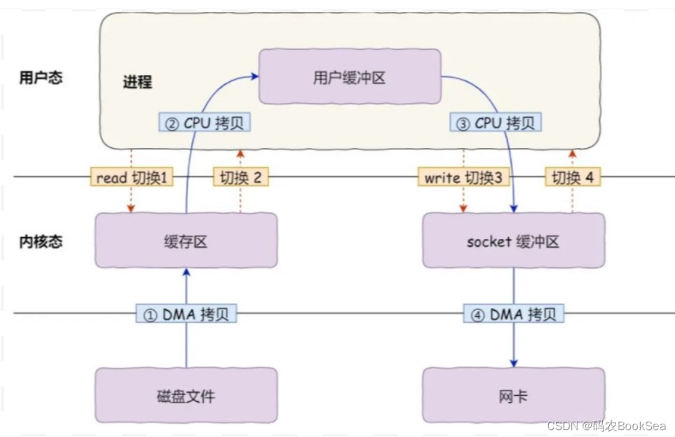
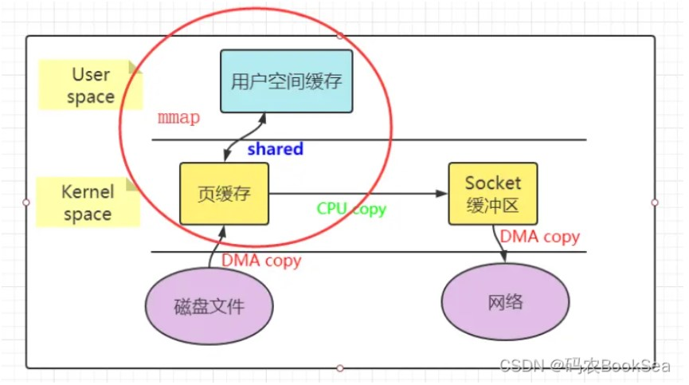
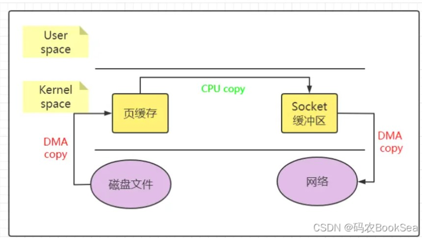
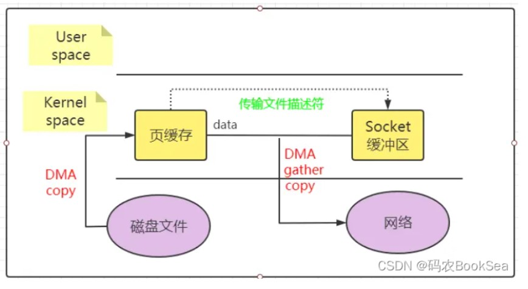

## 零拷贝

#### 文件读取过程
直接内存访问(Direct Memory Access)技术(在进行磁盘读取的时候不需要占用CPU资源)
* 具体过程：

    1. 用户进程 read 方法，向操作系统发出 I/O 请求，请求读取数据到自己的内存缓冲区中，进程进入阻塞状态
    2. 操作系统收到请求后，进一步将 I/O 请求发送 DMA, DMA 将磁盘的数据拷贝存放到内核中缓冲区
    3. 当 DMA 读取了足够多的数据，就会发送中断信号给 CPU； CPU 收到 DMA的信号，知道数据已经准备好，于是将数据从内核拷贝到用户空间，系统调用返回


* 存在问题
        
    1. 四次内核态用户态切换 (read、write)
    2. 4 次数据拷贝，两次 DMA 的拷贝，两次CPU 拷贝的，

    i.磁盘->内核的缓冲区， DMA 搬运的。
    ii.内核缓冲区->用户的缓冲区，CPU 完成的。
    iii.用户的缓冲区->内核的 socket 的缓冲区 CPU 搬运的。
    iv.内核的 socket 缓冲区->网卡的缓冲区, DMA 搬运的。


### 解决问题：1.减少用户态和内核态的切换次数 2.减少内存拷贝 => 零拷贝

#### mmap + write(4切换+3拷贝)
       
* 利用虚拟内存的原理，将用户缓冲区和内核缓冲区映射为同一内存，数据读取到内核缓冲区后，应用程序进行写入操作时，直接把内核的Read Buffer的数据复制到Socket Buffer
* 缺点：上下文的切换还是4次并没有减少，这是因为还是要应用程序发起write操作。
* 优势：减少了一次 CPU 复制)

#### sendfile(2切换+3拷贝)
      
* 可以实现读取了文件数据后复制到对应的socket缓存的功能，用户程序不需要进行 write 调用
* 缺点：只能实现 文件数据 到 socket的 单项 传输
* 优势：在 mmap+write 的基础上减少了两次内核态用户态的切换(write)

#### DMA(硬件支持)+sendfile(2切换+2拷贝)
    
* 利用DMA硬件支持，不需要将内核缓冲区的数据复制到 socket 缓存区，只需要传递 数据描述信息(文件描述符、地址偏移量) 给 socket，socket 借助 DMA 直接读取数据复制到 网络
* 优势：减少了一次CPU拷贝，只剩下必须的 硬件拷贝
* 缺点：需要硬件支持

#### Splice
* 和sendfile的原理相似
* 优势：可以实现 文件到文件的传输，不需要硬件支持
* 基于管道缓冲区机制实现，所以至少要有一个管道描述符


#### 零拷贝的应用场景
* 适合小数据场景，不适合 上G 的数据传输，内核采用Page Cache加快磁盘的读取，如果数据过大，导致内核缓存占满，无法发挥热点缓存的作用


转载自：https://blog.csdn.net/bookssea/article/details/123617747   
https://blog.csdn.net/weixin_42096901/article/details/103017044

### IO的类型
#### 缓存io
大部分io都是缓存io，通过内核中的Page Cache去加快磁盘的访问速度

#### 直接io
直接io不经过内核的Page Cache，用户程序自定义了数据的缓存，数据可以直接从磁盘拷贝到用户内存，减少了一次CPU数据拷贝
* open() 系统调用打开文件时，指定 O_DIRECT 标志，就是使用直接I/O来对文件进行读写操作。
```java
int open(const char *pathname, int flags, ... /*, mode_t mode */ );
```
https://blog.csdn.net/qq_40989769/article/details/110645449

### 文件传输解决方案
* 小数据量->零拷贝
* 大数据量(1G以上)->异步io(大文件不阻塞)+直接io

https://mp.weixin.qq.com/s/thaNfAUY_1e_WMILuqfF-g