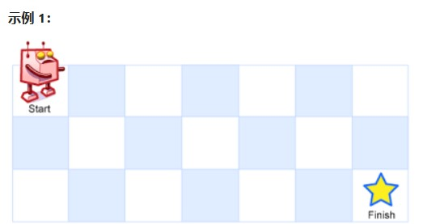

一个机器人位于一个 m x n 网格的左上角 （起始点在下图中标记为 “Start” ）。

机器人每次只能向下或者向右移动一步。机器人试图达到网格的右下角（在下图中标记为 “Finish” ）。

问总共有多少条不同的路径？

 

示例 1：

输入：m = 3, n = 7
输出：28

示例 2：

输入：m = 3, n = 2
输出：3
解释：
从左上角开始，总共有 3 条路径可以到达右下角。
1. 向右 -> 向下 -> 向下
2. 向下 -> 向下 -> 向右
3. 向下 -> 向右 -> 向下

示例 3：

输入：m = 7, n = 3
输出：28

示例 4：

输入：m = 3, n = 3
输出：6

 

提示：

    1 <= m, n <= 100
    题目数据保证答案小于等于 2 * 109


* 解法一：本质求二叉树子叶节点个数(迭代)  
```java
class Solution {
    public class Data{
        public int mm;
        public int nn;
        public Data(int mm,int nn){this.mm=mm;this.nn=nn;}
    }
    public int uniquePaths(int m, int n) {
        int count=1;
        LinkedList<Data> list=new LinkedList<>();
        list.add(new Data(m,1));
        while(!list.isEmpty()){
            Data data=list.pollFirst();
            int m1=data.mm;
            int n1=data.nn;
            if(m1!=1&&n1!=n){
            count++;
            list.add(new Data(m1-1,n1));
            list.add(new Data(m1,1+n1));
            }
        }
        return count;
    }

}


```


来源：力扣（LeetCode）
链接：https://leetcode-cn.com/problems/unique-paths
著作权归领扣网络所有。商业转载请联系官方授权，非商业转载请注明出处。