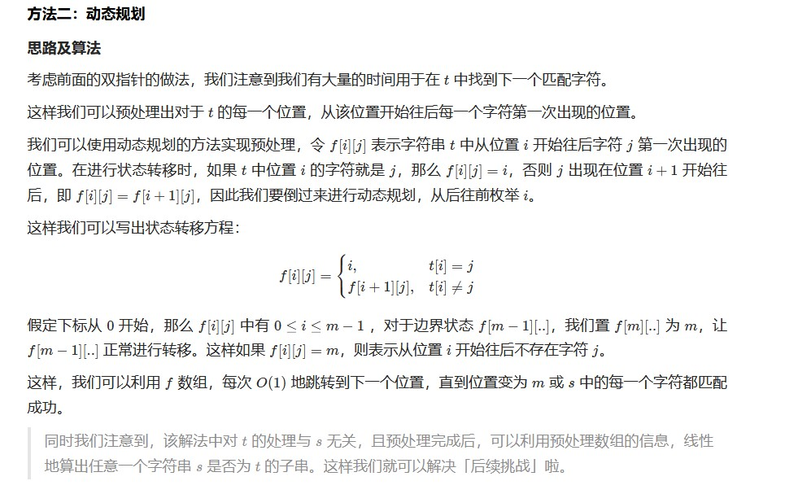
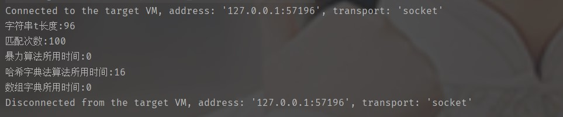
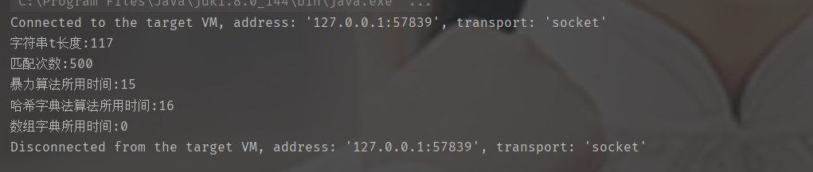
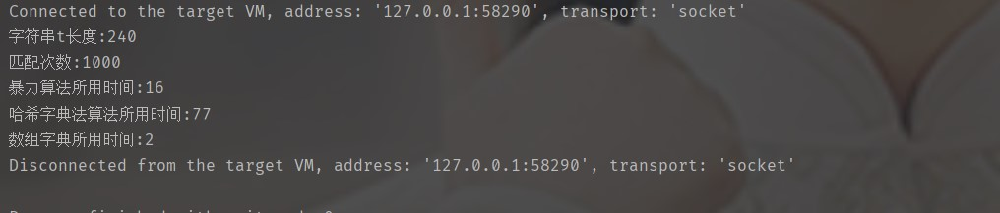
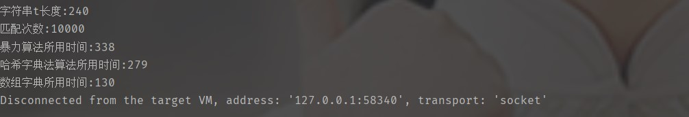
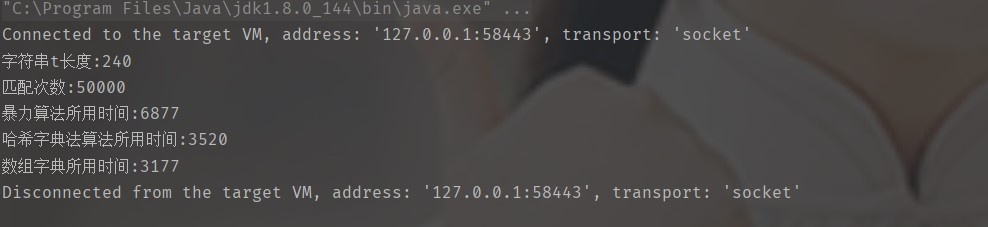
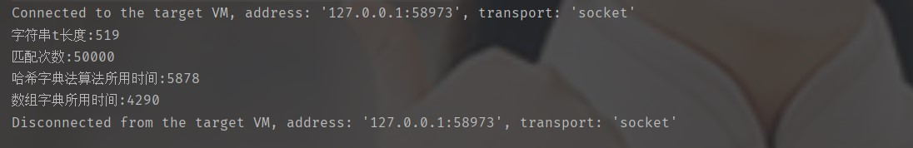

给定字符串 s 和 t ，判断 s 是否为 t 的子序列。

字符串的一个子序列是原始字符串删除一些（也可以不删除）字符而不改变剩余字符相对位置形成的新字符串。（例如，"ace"是"abcde"的一个子序列，而"aec"不是）。

进阶：

如果有大量输入的 S，称作 S1, S2, ... , Sk 其中 k >= 10亿，你需要依次检查它们是否为 T 的子序列。在这种情况下，你会怎样改变代码？

致谢：

特别感谢 @pbrother 添加此问题并且创建所有测试用例。

 

示例 1：

输入：s = "abc", t = "ahbgdc"
输出：true

示例 2：

输入：s = "axc", t = "ahbgdc"
输出：false

 

提示：

    0 <= s.length <= 100
    0 <= t.length <= 10^4
    两个字符串都只由小写字符组成。

* 解法一:暴力求解
```java
//暴力算法 时间复杂度 O(n) 空间复杂度 O(n)
    public boolean isSubsequence(String s, String t) {
        if(s.length() == 0)
            return true;
        char[] ss = s.toCharArray();
        char[] tt = t.toCharArray();
        int ssi = 0;
        for(int i=0;i<tt.length;i++){
            if(tt[i] == ss[ssi])
                ssi++;
            if(ssi == ss.length)
                break;
        }
        if(ssi != ss.length)
            return false;
        return true;
    }
```


* 解法二:字典法
可以应对多次子序列判断,因为要做数据预处理，所以时间和空间消耗很大
```java
//每一次匹配都需要遍历一次t字符串 若有10忆字符串需要匹配 10亿次
    // 能不能提高匹配的速度 ->哈希 将t字符串做成hash字典让字符串去查询
    //时间复杂度 O(n) n为s的长度
    public boolean isSubsequence1(String s,String t){
        HashMap<String,String> map = new HashMap<>();
        for(int i=0;i<t.length();i++){
            String tar = String.valueOf(t.charAt(i));  //key
            String str = map.get(tar);            //value
            if(str != null){
                map.put(tar,str+","+i);
            }else
                map.put(tar,String.valueOf(i));
        }

        int lastIndex = -1;
        for(int i=0;i<s.length();i++){
            String k = String.valueOf(s.charAt(i));
            String v = map.get(k);
            if(v == null)
                return false;
            else{
                //查询是否在laseIndex 后面存在字符k
                String[] res = v.split(",");
                int j=0;
                for(;j<res.length;j++){
                    if(Integer.parseInt(res[j]) > lastIndex)
                    {
                        lastIndex = Integer.parseInt(res[j]);
                        break;
                    }
                }

                if(j == res.length)
                    return false;
            }
        }
        return true;
    }
```


* 解法三:动态规划法   

```java
class Solution {
    public boolean isSubsequence(String s, String t) {
        int n = s.length(), m = t.length();

        int[][] f = new int[m + 1][26];
        for (int i = 0; i < 26; i++) {
            f[m][i] = m;
        }

        for (int i = m - 1; i >= 0; i--) {
            for (int j = 0; j < 26; j++) {
                if (t.charAt(i) == j + 'a')
                    f[i][j] = i;
                else
                    f[i][j] = f[i + 1][j];
            }
        }
        int add = 0;
        for (int i = 0; i < n; i++) {
            if (f[add][s.charAt(i) - 'a'] == m) {
                return false;
            }
            add = f[add][s.charAt(i) - 'a'] + 1;
        }
        return true;
    }
}

```

* 优化后的算法在多次匹配子序列的情况下效率如何  
```java
import java.util.*;

public class Main {
    static HashMap<String,String> map = new HashMap<>();
    static String t ="skdjlfloiwfghsvsrtetrvrwruytuiurtrwbrtyrioipoipnmbnmqweqwasddxzcfdserwuhcbasmfuyripuytrepzkyrtyfdgdgdttrrybrtbyrttevsrtvseryrttrbyrvwrtesrvseryvjdbmzcvkjghaiueropaduhfasbvclalsdfhrpauhdffbnvkajhdflhaehkdjhsfkasndf";
    static int[][] f;


    //哈希字典法
    public static boolean isSubsequence(String s,String t){
        int lastIndex = -1;
        for(int i=0;i<s.length();i++){
            String k = String.valueOf(s.charAt(i));
            String v = map.get(k);
            if(v == null)
                return false;
            else{
                //查询是否在laseIndex 后面存在字符k
                String[] res = v.split(",");
                int j=0;
                for(;j<res.length;j++){
                    if(Integer.parseInt(res[j]) > lastIndex)
                    {
                        lastIndex = j;
                        break;
                    }
                }

                if(j == res.length)
                    return false;
            }
        }
        return true;
    }

    //暴力算法
    public static boolean isSubsequence1(String s, String t) {
        if(s.length() == 0)
            return true;
        char[] ss = s.toCharArray();
        char[] tt = t.toCharArray();
        int ssi = 0;
        for(int i=0;i<tt.length;i++){
            if(tt[i] == ss[ssi])
                ssi++;
            if(ssi == ss.length)
                break;
        }
        if(ssi != ss.length)
            return false;
        return true;
    }

    //数组字典
    public static boolean isSubsequence2(String s, String t) {
        int n = s.length(), m = t.length();

        int add = 0;
        for (int i = 0; i < n; i++) {
            if (f[add][s.charAt(i) - 'a'] == m) {
                return false;
            }
            add = f[add][s.charAt(i) - 'a'] + 1;
        }
        return true;
    }


    public static void main(String[] args) {
        //初始化字典
        for(int i=0;i<t.length();i++){
            String tar = String.valueOf(t.charAt(i));  //key
            String str = map.get(tar);            //value
            if(str != null){
                map.put(tar,str+","+i);
            }else
                map.put(tar,String.valueOf(i));
        }
        int m = t.length();
        f = new int[m + 1][26];
        for (int i = 0; i < 26; i++) {
            f[m][i] = m;
        }

        for (int i = m - 1; i >= 0; i--) {
            for (int j = 0; j < 26; j++) {
                if (t.charAt(i) == j + 'a')
                    f[i][j] = i;
                else
                    f[i][j] = f[i + 1][j];
            }
        }

        //构造测试数据
        Random random = new Random();
        List<String> list = new LinkedList<>();
        final int dataLength = 100;
        for (int i = 0; i < dataLength; i++) {
            StringBuilder tar = new StringBuilder();
            for (int j = 0; j < random.nextInt(t.length()); j++)
                tar.append(t.charAt(random.nextInt(t.length())));
            list.add(tar.toString());
        }

        long begin = System.currentTimeMillis();
        for (int i = 0; i < dataLength; i++) {
            isSubsequence1(list.get(i), t);
        }
        long end = System.currentTimeMillis();
        System.out.println("暴力算法所用时间:" + (end - begin));

        begin = System.currentTimeMillis();
        for (int i = 0; i < dataLength; i++) {
            isSubsequence(list.get(i), t);
        }
        end = System.currentTimeMillis();
        System.out.println("哈希字典法算法所用时间:" + (end - begin));

        begin = System.currentTimeMillis();
        for (int i = 0; i < dataLength; i++) {
            isSubsequence2(list.get(i), t);
        }
        end = System.currentTimeMillis();
        System.out.println("数组字典所用时间:" + (end - begin));
    }
}


```

实验结果：  
* 暴力求解算法在t字符串很短或者匹配此数不大时表现良好  

 

* 当匹配次数上升时，暴力算法和数组字典开始产生差异   




* 哈希字典法算法表现都很差，可能是当t太长时，需要记录的位置太多，每次都需要去遍历res数组做判断，当匹配次数万级时，效率开始比暴力算法高




* 当匹配次数达到十万时，暴力算法效率明显下降，哈希字典法算法和数组字典效率相当，单独比较这两种，发现数组字典的空间使用复杂度随着t字符串的长度增加而增加，t字符串的长度也影响哈希字典法算法的效率，比较在字符串增大的情况下，两种算法的效率.   

