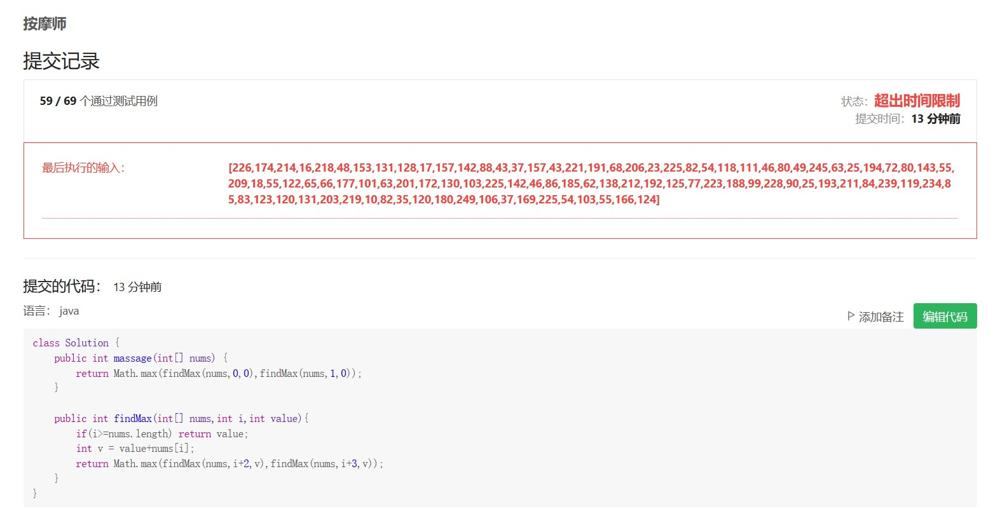
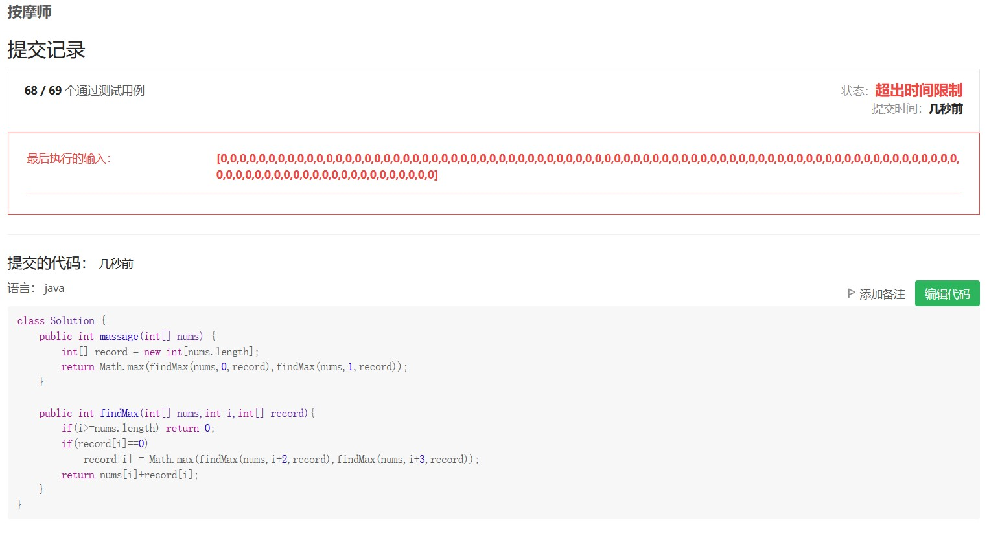

一个有名的按摩师会收到源源不断的预约请求，每个预约都可以选择接或不接。在每次预约服务之间要有休息时间，因此她不能接受相邻的预约。给定一个预约请求序列，替按摩师找到最优的预约集合（总预约时间最长），返回总的分钟数。

注意：本题相对原题稍作改动

 

示例 1：

输入： [1,2,3,1]
输出： 4
解释： 选择 1 号预约和 3 号预约，总时长 = 1 + 3 = 4。

示例 2：

输入： [2,7,9,3,1]
输出： 12
解释： 选择 1 号预约、 3 号预约和 5 号预约，总时长 = 2 + 9 + 1 = 12。

示例 3：

输入： [2,1,4,5,3,1,1,3]
输出： 12
解释： 选择 1 号预约、 3 号预约、 5 号预约和 8 号预约，总时长 = 2 + 4 + 3 + 3 = 12。

* 子问题重叠

解法一:动态规划
* 没有优化


* 备忘录优化

```java
class Solution {
    public int massage(int[] nums) {
        int[] record = new int[nums.length];
        for(int i=0;i<record.length;i++)
            record[i] = -1;
        return Math.max(findMax(nums,0,record),findMax(nums,1,record));
    }

    public int findMax(int[] nums,int i,int[] record){
        if(i>=nums.length) return 0;
        if(record[i]==-1) 
            record[i] = Math.max(findMax(nums,i+2,record),findMax(nums,i+3,record));
        return nums[i]+record[i];
    }
}
```


* 发现leetcode在测试中会加入没有意义的用例，例如

在使用备忘录时应该注意初始化的值

来源：力扣（LeetCode）
链接：https://leetcode-cn.com/problems/the-masseuse-lcci
著作权归领扣网络所有。商业转载请联系官方授权，非商业转载请注明出处。