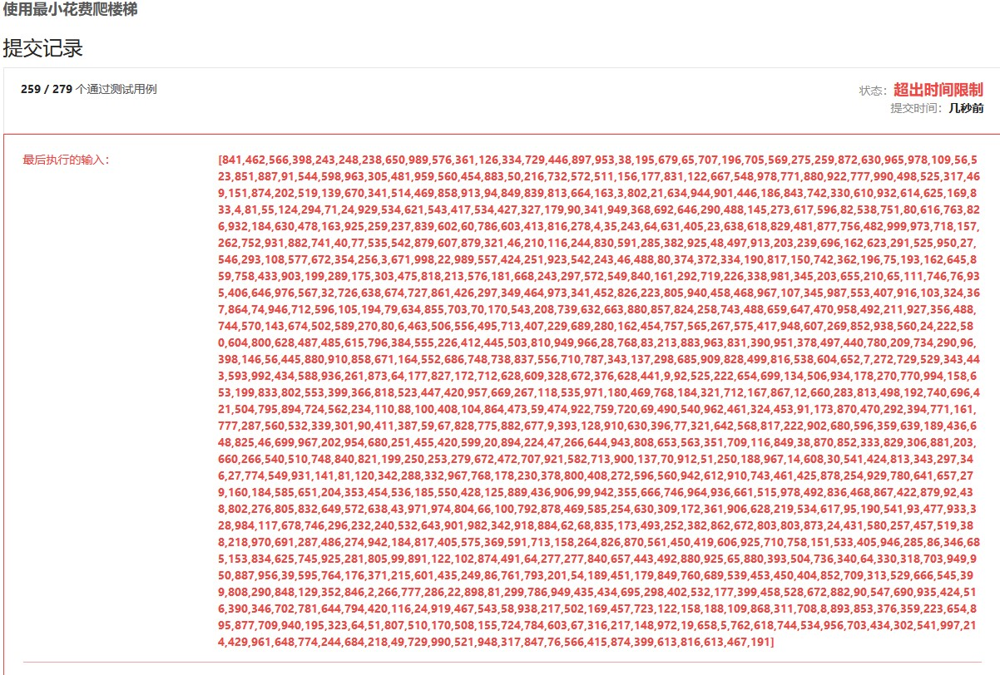

数组的每个下标作为一个阶梯，第 i 个阶梯对应着一个非负数的体力花费值 cost[i]（下标从 0 开始）。

每当你爬上一个阶梯你都要花费对应的体力值，一旦支付了相应的体力值，你就可以选择向上爬一个阶梯或者爬两个阶梯。

请你找出达到楼层顶部的最低花费。在开始时，你可以选择从下标为 0 或 1 的元素作为初始阶梯。

 

示例 1：

输入：cost = [10, 15, 20]
输出：15
解释：最低花费是从 cost[1] 开始，然后走两步即可到阶梯顶，一共花费 15 。

 示例 2：

输入：cost = [1, 100, 1, 1, 1, 100, 1, 1, 100, 1]
输出：6
解释：最低花费方式是从 cost[0] 开始，逐个经过那些 1 ，跳过 cost[3] ，一共花费 6 。

 

提示：

    cost 的长度范围是 [2, 1000]。
    cost[i] 将会是一个整型数据，范围为 [0, 999] 。


* 解法一:动态规划(自底向上 迭代)
```java
  //动态规划(自底向上) fn=min(fn-1,fn-2)+costn
    //时间复杂度 O(n) 空间复杂度 O(n)
    public int minCostClimbingStairs1(int[] cost) {
        int[] record = new int[cost.length];
        record[0] = cost[0];
        record[1] = cost[1];
        for(int i=2;i<cost.length;i++){
            record[i] = Math.min(record[i-1],record[i-2])+cost[i];
        }
        return Math.min(record[cost.length-1],record[cost.length-2]);
    }
```
  
优化空间复杂度  
```java
 //这里最后的状态只和前两个状态相关，优化空间复杂度O(1)
         public int minCostClimbingStairs(int[] cost) {
        int first=cost[0],next=cost[1];
        for(int i=2;i<cost.length;i++){
            int value = Math.min(first,next)+cost[i];
            first=next;
            next=value;
        }
        return Math.min(first,next);
    }
```


* 解法二:动态规划(自顶向下 递归)
```java
//超时
 public int minCostClimbingStairs(int[] cost) {
        return Math.min(findMin(cost,0),findMin(cost,1));
    }

    public int findMin(int[] cost,int i){
        if(i>=cost.length) return 0;
        return Math.min(findMin(cost,i+1),findMin(cost,i+2))+cost[i];
    }
```


用备忘录优化后能通过所有用例

```java
public int minCostClimbingStairs(int[] cost) {
        int[] record = new int[cost.length];
        return Math.min(findMin(record,cost,0),findMin(record,cost,1));
    }

    public int findMin(int[] record,int[] cost,int i){
        if(i>=cost.length) return 0;
        if(record[i] != 0) return record[i];
        else
            return record[i] = Math.min(findMin(record,cost,i+1),findMin(record,cost,i+2))+cost[i];
    }

```


来源：力扣（LeetCode）
链接：https://leetcode-cn.com/problems/min-cost-climbing-stairs
著作权归领扣网络所有。商业转载请联系官方授权，非商业转载请注明出处。