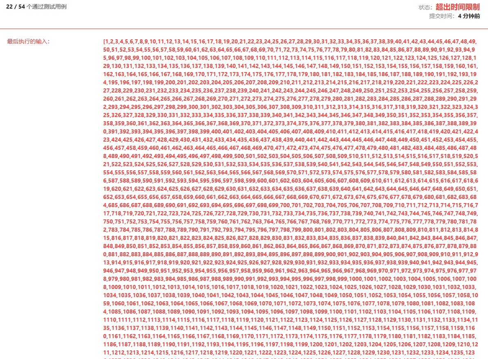
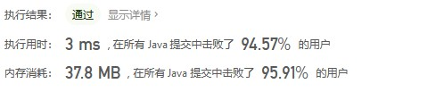

给你一个整数数组 nums ，找到其中最长严格递增子序列的长度。

子序列是由数组派生而来的序列，删除（或不删除）数组中的元素而不改变其余元素的顺序。例如，[3,6,2,7] 是数组 [0,3,1,6,2,2,7] 的子序列。
 

示例 1：

输入：nums = [10,9,2,5,3,7,101,18]
输出：4
解释：最长递增子序列是 [2,3,7,101]，因此长度为 4 。

示例 2：

输入：nums = [0,1,0,3,2,3]
输出：4

示例 3：

输入：nums = [7,7,7,7,7,7,7]
输出：1

 

提示：

    1 <= nums.length <= 2500
    -104 <= nums[i] <= 104


* 解法一:动态规划(自顶向下递归)  
```java
class Solution {
    //动态规划 超出时间限制 需要进行备忘录优化
    //思路 选取一个位置为头元素+子问题(最长子序列)  寻找子问题的最长子序列需要满足 元素比头元素大
    public int lengthOfLIS(int[] nums) {
        int maxLength = 0;
        for(int i=0;i<nums.length;i++){
            int m = findMax(nums,i)+1;
            if(maxLength<m)
                maxLength = m;
        }
        return maxLength;
    }

    //寻找元素为i时最长子序列
    public int findMax(int[] nums,int i){
        if(i == nums.length-1) return 0;
        int value = nums[i];  
        int max = 0;
        for(int j=i+1;j<nums.length;j++){
            if(nums[j] > value){
                int maxj = findMax(nums,j)+1;
                if(maxj>max)
                    max = maxj;
            }
        }
        return max;
    }
}
```


有重叠子问题，优化后能通过测试用例，但是复杂度高
时间复杂度 O(n*n) 空间复杂度 O(n)
```java
class Solution {
    //动态规划 超出时间限制 需要进行备忘录优化
    //思路 选取一个位置为头元素+子问题(最长子序列)  寻找子问题的最长子序列需要满足 元素比头元素大
    public int lengthOfLIS(int[] nums) {
        int maxLength = 0;
        int[] record = new int[nums.length];
        for(int i=0;i<nums.length;i++){
            int m = findMax(record,nums,i)+1;
            if(maxLength<m)
                maxLength = m;
        }
        return maxLength;
    }

    //寻找元素为i时最长子序列
    public int findMax(int[] record,int[] nums,int i){
        if(i == nums.length-1) return 0;
        if(record[i] != 0) return record[i];
        int value = nums[i];  
        int max = 0;
        for(int j=i+1;j<nums.length;j++){
            if(nums[j] > value){
                int maxj = findMax(record,nums,j)+1;
                if(maxj>max)
                    max = maxj;
            }
        }
        record[i] = max;
        return max;
    }
}
```


* 解法二:动态规划(自底向上迭代)
```java
class Solution {

    public int lengthOfLIS(int[] nums) {
        int maxLength = 0;
        int[] record = new int[nums.length];
        for(int i=0;i<nums.length;i++){
            record[i] = findMax(record,nums,i);
            if(maxLength<record[i])
                maxLength = record[i];
        }
        return maxLength;
    }

   
    public int findMax(int[] record,int[] nums,int i){
        int n = 1;
        int v = nums[i];
        for(int j=i-1;j>=0;j--){
            if(nums[j]<v&&n<=record[j]){
                n = record[j]+1;
            }
        }
        return n;
    }
}
```


* 解法三:贪心算法+二分查找   
时间复杂度 O(nlogn) 空间复杂度 O(n)
```java
class Solution {
    //贪心算法+二分查询
    //record数组用于存长度为i的最小数字S
    public int lengthOfLIS(int[] nums) {
        int len=1;
        int[] record = new int[nums.length + 1];
        record[1] = nums[0];
        for(int i=1;i<nums.length;i++){
            if(record[len] < nums[i]){
                record[++len] = nums[i];
            }else{
                int index = findMax(record,nums[i],1,len);
                record[index] = nums[i];
            }
        }
        return len;
    }

   //二分查找
    public int findMax(int[] record,int num,int left,int right){
        if(right < left) return left;
        int mid = (left + right)/2;
        if(record[mid] > num)
            return findMax(record,num,left,mid-1);
        if(record[mid] < num)
            return findMax(record,num,mid+1,right);
        return mid;
    }
}
```


来源：力扣（LeetCode）
链接：https://leetcode-cn.com/problems/longest-increasing-subsequence
著作权归领扣网络所有。商业转载请联系官方授权，非商业转载请注明出处。