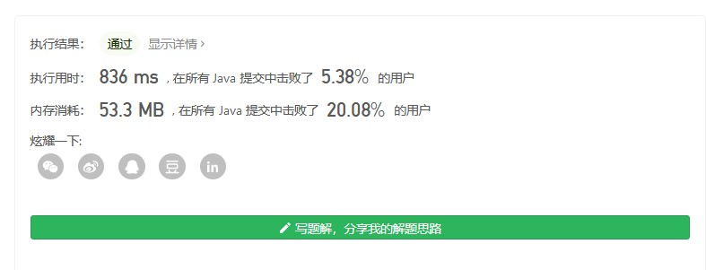
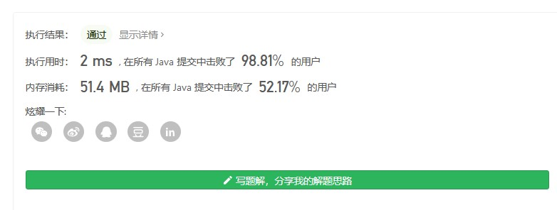

给定一个数组 prices ，它的第 i 个元素 prices[i] 表示一支给定股票第 i 天的价格。

你只能选择 某一天 买入这只股票，并选择在 未来的某一个不同的日子 卖出该股票。设计一个算法来计算你所能获取的最大利润。

返回你可以从这笔交易中获取的最大利润。如果你不能获取任何利润，返回 0 。

 

示例 1：

输入：[7,1,5,3,6,4]
输出：5
解释：在第 2 天（股票价格 = 1）的时候买入，在第 5 天（股票价格 = 6）的时候卖出，最大利润 = 6-1 = 5 。
     注意利润不能是 7-1 = 6, 因为卖出价格需要大于买入价格；同时，你不能在买入前卖出股票。

示例 2：

输入：prices = [7,6,4,3,1]
输出：0
解释：在这种情况下, 没有交易完成, 所以最大利润为 0。

 

提示：

    1 <= prices.length <= 105
    0 <= prices[i] <= 104

* 解法一:暴力法
```java
//暴力求解 超时 时间复杂度O(n*n) 空间复杂度O(1)
    public static int maxValue(int[] prices){
        int max = 0;
        for(int i=0;i<prices.length-1;i++){
            int m = prices[i];
            int s = prices[i+1];
            for(int j=i+1;j<prices.length;j++){
                if(prices[j] > s){
                    s = prices[j];
                }
            }
        if(max < s - m){
            max = s-m;
        }
        }
        return max;
    }
```

* 解法二:动态规划  
思路:计算出每一天买入后能收获最大利润，再求出最大值(最大利润=max(选取每一天能获得最大利润=max(选取售价最高的卖出)))
```java

//优化穷解法，做备忘录 时间复杂度 最坏 O(n*n) 最好O(n)
//                    空间复杂度 最坏 O(n)  最好O(1)
public static int maxValue1(int[] p){
    int m = 0;
    List<Integer> r = new ArrayList<>();
    for(int i=0;i<p.length-1;i++){
         if(p[i] == 0){
             boolean flag = true;
             for(int j=i+1;j<p.length;j++)
                if(p[j] != 0)
                    flag = false;
            if(flag)
                break;
         }
            
        m = Math.max(m,calMaxValue(i,p,r));
    }
        
    return m;
}

//计算i天买入可获得最高利润
//i不能为最后一天
//record 用于记录 选取第i天买入应该在第i天后哪一天卖出才能收获最大利润天j(也就是说记录的是数组中i位置后的最大数) 若在i后任意位置买入 最大售价可能还是为j
//超出时间限制
public static int calMaxValue(int i,int[] p,List<Integer> record){
    int m = p[i];

    for(int z=0;z<record.size();z++){
        if(i<record.get(z)){
            return p[record.get(z)] - m;
        }
    }

    int s = i+1;
    for(int j=i+1;j<p.length;j++){
        if(p[s]<p[j])
            s = j;
    }
    //找出i天买入后出售的最大利润时间，记录备忘录
    record.add(s);
    return p[s] - m;
}

```

在用动态规划时发现会超时,经过查看测试用例发现，传入的数据只有一部分是有效的，数组末尾都是用0作为填充，所以在计算过程中去判定是否应该继续计算  

增加一下判断防止无效计算
```java
if(p[i] == 0){
             boolean flag = true;
             for(int j=i+1;j<p.length;j++)
                if(p[j] != 0)
                    flag = false;
            if(flag)
                break;
         }
```


做了上述优化后发现代码可以AC，但是效率非常低  



* 解法三(官方给的)

```java
//非常巧妙  时间复杂度O(n) 空间复杂度O(1)
public int maxProfit(int prices[]) {
        int minprice = Integer.MAX_VALUE;
        int maxprofit = 0;
        for (int i = 0; i < prices.length; i++) {
            if (prices[i] < minprice) {
                minprice = prices[i];
            } else if (prices[i] - minprice > maxprofit) {
                maxprofit = prices[i] - minprice;
            }
        }
        return maxprofit;
    }

作者：LeetCode-Solution
链接：https://leetcode-cn.com/problems/best-time-to-buy-and-sell-stock/solution/121-mai-mai-gu-piao-de-zui-jia-shi-ji-by-leetcode-/
来源：力扣（LeetCode）
著作权归作者所有。商业转载请联系作者获得授权，非商业转载请注明出处。
```



