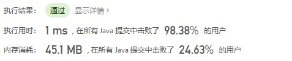
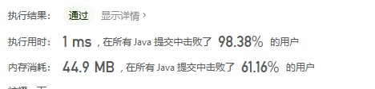
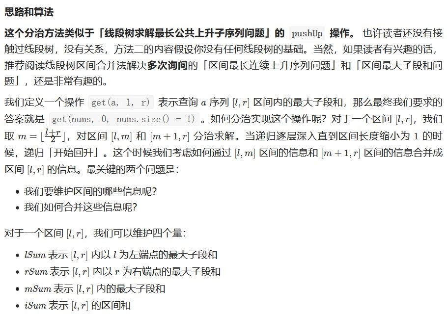
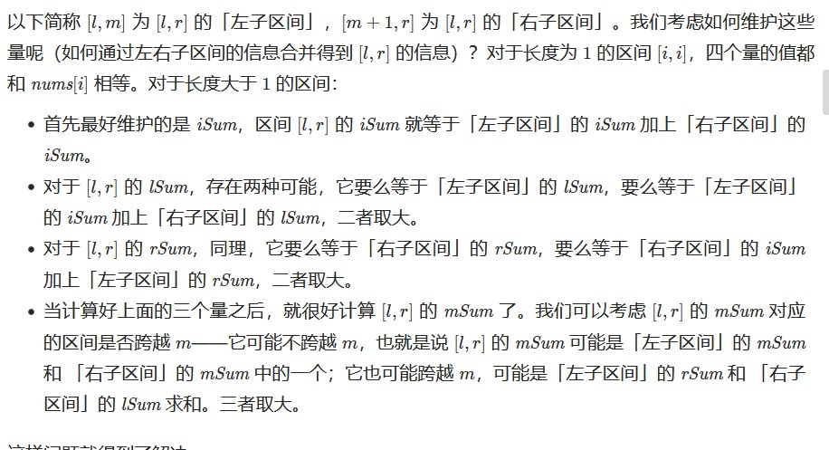
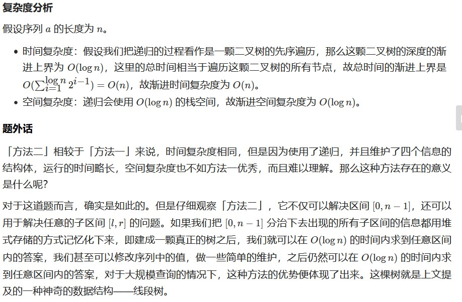
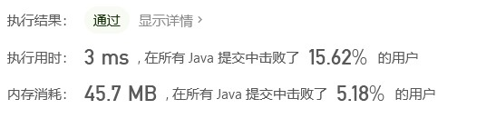

输入一个整型数组，数组中的一个或连续多个整数组成一个子数组。求所有子数组的和的最大值。

要求时间复杂度为O(n)。

 

示例1:

输入: nums = [-2,1,-3,4,-1,2,1,-5,4]
输出: 6
解释: 连续子数组 [4,-1,2,1] 的和最大，为 6。

 

提示：

    1 <= arr.length <= 10^5
    -100 <= arr[i] <= 100

* 解法一  
```java
//空间O(1) 时间O(n)
//本质上也是动态规划，只是优化了空间复杂度
public int maxSubArray(int[] nums) {
        int max = Integer.MIN_VALUE;
        int sum = 0;
        for(int i=0;i<nums.length;i++){
            sum+=nums[i];
            if(sum>max){
                max=sum;
            }
            if(sum<0){
                sum=0;
            }
        }
        return max;
    }
```


* 解法二:动态规划  
迭代
```java
     public int maxSubArray(int[] nums) {
        int[] record = new int[nums.length];
        record[0] = nums[0];
        int max=nums[0];
        for(int i=1;i<nums.length;i++){
            int value = Math.max(nums[i],nums[i]+record[i-1]);
            if(value>max)
                max = value;
            record[i]=value;
        }
        return max;
    }
```


递归  
```java
 public int maxSubArray(int[] nums) {
        int[] record = new int[nums.length];
        int max = Integer.MIN_VALUE;
        for(int i=0;i<nums.length;i++){
            max = Math.max(max,maxValue(record,nums,i));
        }
        return max;
    }

    public int maxValue(int[] record,int[] nums,int i){
        if(i == nums.length -1) return nums[i];
        if(record[i] != 0) return record[i];
        int value = maxValue(record,nums,i+1)+nums[i];
        record[i] = Math.max(nums[i],value);
        return record[i];

    }
```

* 解法三:分治  
  

    

```java
class Solution {
    public int maxSubArray1(int[] nums) {
        
        return getInfo(nums,0,nums.length).mSum;
    }

    public class Status {
        public int lSum, rSum, mSum, iSum;

        public Status(int lSum, int rSum, int mSum, int iSum) {
            this.lSum = lSum;
            this.rSum = rSum;
            this.mSum = mSum;
            this.iSum = iSum;
        }
    }

    public int maxSubArray(int[] nums) {
        return getInfo(nums, 0, nums.length - 1).mSum;
    }

    public Status getInfo(int[] a, int l, int r) {
        if (l == r) {
            return new Status(a[l], a[l], a[l], a[l]);
        }
        int m = (l + r) >> 1;
        Status lSub = getInfo(a, l, m);
        Status rSub = getInfo(a, m + 1, r);
        return pushUp(lSub, rSub);
    }

    public Status pushUp(Status l, Status r) {
        int iSum = l.iSum + r.iSum;
        int lSum = Math.max(l.lSum, l.iSum + r.lSum);
        int rSum = Math.max(r.rSum, r.iSum + l.rSum);
        int mSum = Math.max(Math.max(l.mSum, r.mSum), l.rSum + r.lSum);
        return new Status(lSum, rSum, mSum, iSum);
    }
}

```




来源：力扣（LeetCode）
链接：https://leetcode-cn.com/problems/lian-xu-zi-shu-zu-de-zui-da-he-lcof
著作权归领扣网络所有。商业转载请联系官方授权，非商业转载请注明出处。