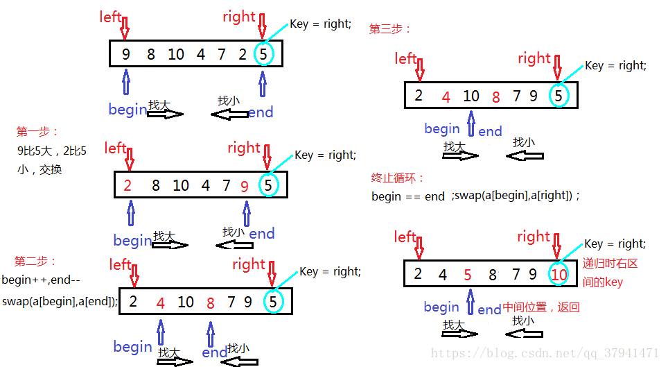
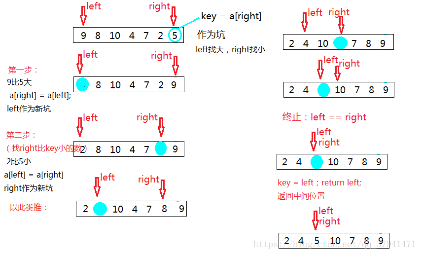

### 排序算法

1. 分类   
十种常见排序算法可以分为两大类：

    非线性时间比较类排序：通过比较来决定元素间的相对次序，由于其时间复杂度不能突破O(nlogn)，因此称为非线性时间比较类排序。

    线性时间非比较类排序：不通过比较来决定元素间的相对次序，它可以突破基于比较排序的时间下界，以线性时间运行，因此称为线性时间非比较类排序。   


2. 各算法指标  


3. 相关概念

    * 稳定：如果a原本在b前面且a=b，排序之后a仍然在b的前面。
    * 不稳定：如果a原本在b的前面且a=b，排序之后 a 可能会出现在 b 的后面。
    * 时间复杂度：对排序数据的总的操作次数。反映当n变化时，操作次数呈现什么规律。
    * 空间复杂度：是指算法在计算机内执行时所需存储空间的度量，它也是数据规模n的函数。
    * 内部排序：所有排序操作都在内存中完成。本文主要介绍的是内部排序。
    * 外部排序：待排序记录的数量很大，以致于内存不能一次容纳全部记录，所以在排序过程中需要对外存进行访问的排序过程。


4. 冒泡算法      
a.基本思想
冒泡排序是一种简单的排序算法。它重复地走访过要排序的数列，一次比较两个元素，如果它们的顺序错误就把它们交换过来。走访数列的工作是重复地进行直到没有再需要交换，也就是说该数列已经排序完成。这个算法的名字由来是因为每趟比较将当前数列未排序部分的最大的元素“沉”到数列末端，而小的元素会经由交换慢慢“浮”到数列的顶端。


b.算法描述  
1）比较相邻的元素。如果前一个比后一个大，就交换它们两个；  
2）对每一对相邻元素作同样的工作，从开始第一对到结尾的最后一对，这样在最后的元素应该会是最大的数；  
3）针对所有的元素重复以上的步骤，除了最后一个；  
4）重复步骤1~3，直到排序完成。为了优化算法，可以设立一个布尔标识，每趟排序开始前设为false，如果该趟排序发生了交换就置为true，如果一趟排序结束标识仍为false表示该趟排序没有发生交换，即数组已经有序，可以提前结束排序。
c.代码实现  
```java
public static void main(String[] args)
    {
        //升序
        //添加标志位flag，若在一个循环中没有交换则说明已经是排序完成跳出循环
        int[] array = {53,34,78,66,12,36};
        for(int i = 0; i < array.length - 1; i++)
        {
            boolean flag = true;
            for(int j = 0; j < array.length - i - 1; j++)
            {
                if(array[j] > array[j+1])
                {
                    int temp = array[j];
                    array[j] = array[j+1];
                    array[j+1] = temp;
                    flag = false;
                }
            }
            if(flag)
                break;
        }
        for(int z = 0; z < array.length; z++)
            System.out.println(array[z]);
    }

```
d.时间复杂度   
冒泡排序平均时间复杂度为O(n2)，最好时间复杂度为O(n)，最坏时间复杂度为O(n2)。  
最好情况：如果待排序元素本来是正序的，那么一趟冒泡排序就可以完成排序工作，比较和移动元素的次数分别是 (n - 1) 和 0，因此最好情况的时间复杂度为O(n)。  
最坏情况：如果待排序元素本来是逆序的，需要进行 (n - 1) 趟排序，所需比较和移动次数分别为 n * (n - 1) / 2和 3 * n * (n-1) / 2。因此最坏情况下的时间复杂度为O(n2)。  

e. 空间复杂度   
冒泡排序使用了常数空间，空间复杂度为O(1)

f. 稳定性   
当 array[j] == array[j+1] 的时候，我们不交换 array[i] 和 array[j]，所以冒泡排序是稳定的。

g. 算法拓展   
鸡尾酒排序，又称定向冒泡排序、搅拌排序等，是对冒泡排序的改进。在把最大的数往后面冒泡的同时，把最小的数也往前面冒泡，同时收缩无序区的左右边界，有序区在序列左右逐渐累积。  

h. 改进思路：在把最大的数往后面冒泡的同时，把最小的数也往前面冒泡，同时收缩无序区的左右边界，有序区在序列左右逐渐累积。 

```java
 public static void main(String[] args)
    {
        //升序
        //冒泡算法改进，在一次循环中，将最大和最小元素找出来一次放到最后和最前
        int[] array = {53,34,78,66,12,36};
        int right = array.length - 1;
        int left = 0;
        while(left < right)
        {
            //找出最大的元素并放到最后
            for(int i = left; i < right; i++)
            {
                if(array[i] > array[i + 1])
                {
                    int temp = array[i];
                    array[i] = array[i + 1];
                    array[i + 1] = temp;
                }
            }
            right--;

            //找出最小元素并依次放到最前面
            for(int j = right; j > left; j--)
            {
                if(array[j] < array[j - 1])
                {
                    int temp = array[j];
                    array[j] = array[j - 1];
                    array[j - 1] = temp;
                }
            }
            left++;
        }
        for(int z = 0; z < array.length; z++)
            System.out.println(array[z]);
    }
```

鸡尾酒排序是稳定的。它的平均时间复杂度为O(n2)，最好情况是待排序列原先就是正序的，时间复杂度为O(n)，最坏情况是待排序列原先是逆序的，时间复杂度为O(n2)。空间复杂度为O(1)。

5. 简单选择排序   
a.基本思想   
简单选择排序(Selection-sort)是一种简单直观的排序算法。它的工作原理：首先在未排序序列中找到最小（大）元素，存放到排序序列的起始位置，然后，再从剩余未排序元素中继续寻找最小（大）元素，然后放到已排序序列的末尾。以此类推，直到所有元素均排序完毕。  

b.算法描述   
n个记录的简单选择排序可经过(n-1)趟简单选择排序得到有序结果。具体算法描述如下：   
1）初始状态：无序区为R[1..n]，有序区为空；   
2）第i趟排序(i=1,2,3…n-1)开始时，当前有序区和无序区分别为R[1..i-1]和R[i..n]。该趟排序从当前无序区中选出关键字最小的记录 R[k]，将它与无序区的第1个记录R交换，使R[1..i]和R[i+1..n]分别变为记录个数增加1个的新有序区和记录个数减少1个的新无序区；
3）(n-1)趟结束，数组有序化了。  

c.代码实现
```java
public static void main(String[] args)
    {
        //升序
        int[] array = {53,34,78,66,12,36};
        for(int i = 0; i < array.length - 1; i++)
        {
            int max_index = i;
            for(int j = i + 1; j < array.length; j++)
             {
                 if(array[j] < array[max_index])
                     max_index = j;
             }

            int temp = array[max_index];
            array[max_index] = array[i];
            array[i] = temp;

        }
        for(int z = 0; z < array.length; z++)
            System.out.println(array[z]);
    }
```

d. 时间复杂度   
简单选择排序平均时间复杂度为O(n2)，最好时间复杂度为O(n2)，最坏时间复杂度为O(n2)。   
最好情况：如果待排序元素本来是正序的，则移动元素次数为 0，但需要进行 n * (n - 1) / 2 次比较。   
最坏情况：如果待排序元素中第一个元素最大，其余元素从小到大排列，则仍然需要进行 n * (n - 1) / 2 次比较，且每趟排序都需要移动 3 次元素，即移动元素的次数为3 * (n - 1)次。   
需要注意的是，简单选择排序过程中需要进行的比较次数与初始状态下待排序元素的排列情况无关。

e. 空间复杂度  
简单选择排序使用了常数空间，空间复杂度为O(1)

f.稳定性   
简单选择排序不稳定，比如序列 2、4、2、1，我们知道第一趟排序第 1 个元素 2 会和 1 交换，那么原序列中 2 个 2 的相对前后顺序就被破坏了，所以简单选择排序不是一个稳定的排序算法。


6. 直接插入排序  
a.基本思想  
直接插入排序（Insertion-Sort）的算法描述是一种简单直观的排序算法。它的工作原理是通过构建有序序列，对于未排序数据，在已排序序列中从后向前扫描，找到相应位置并插入。

b. 算法描述  
一般来说，直接插入排序都采用in-place（原地算法）在数组上实现。具体算法描述如下：  
1）从第一个元素开始，该元素可以认为已经被排序；  
2）取出下一个元素，在已经排序的元素序列中从后向前扫描；  
3）如果该元素（已排序）大于新元素，将该元素移到下一位置；  
4）重复步骤3，直到找到已排序的元素小于或者等于新元素的位置；  
5）将新元素插入到该位置后；  
6）重复步骤2~5。

c. 代码实现 
```java
public static void main(String[] args)
    {
        //升序
        int[] array = {53,34,78,66,12,36};
        for(int i = 0; i < array.length; i++)
        {
            int j = i;
            //判断索引是否合理 && 这个数值是否比前一个数字大
            while(j - 1 >= 0 && array[j] < array[j - 1]){
                int temp = array[j];
                array[j] = array[j - 1];
                array[j - 1] = temp;
                j--;
            }
        }

        for(int z = 0; z < array.length; z++)
            System.out.println(array[z]);
    }
```
d. 时间复杂度   
直接插入排序平均时间复杂度为O(n2)，最好时间复杂度为O(n)，最坏时间复杂度为O(n2)。   
最好情况：如果待排序元素本来是正序的，比较和移动元素的次数分别是 (n - 1) 和 0，因此最好情况的时间复杂度为O(n)。   
最坏情况：如果待排序元素本来是逆序的，需要进行 (n - 1) 趟排序，所需比较和移动次数分别为 n * (n - 1) / 2和 n * (n - 1) / 2。因此最坏情况下的时间复杂度为O(n2)。

e. 空间复杂度   
直接插入排序使用了常数空间，空间复杂度为O(1)
 
f. 稳定性  
直接插入排序是稳定的。

g. 算法拓展   
在直接插入排序中，待插入的元素总是在有序区线性查找合适的插入位置，没有利用有序的优势，考虑使用二分查找搜索插入位置进行优化，即二分插入排序。

代码实现   
```java
public static void main(String[] args)
    {
        //升序
        int[] array = {53,34,78,66,12,36};
        for(int i = 1; i < array.length; i++)
        {
            int value = array[i];
            //二分查找方法的右左中索引
            int left = 0;
            int right = i - 1;
            while(left <= right)
            {
                //此数为前面有序数中最大且小于 array[i]的数
                int mid = (right + left) / 2;
                if(array[mid] < value)
                    left = mid + 1;
                else
                    right = mid - 1;
            }
            //当上面循环停止时，right=left,此时value插入位置应为right或者left的下一个位置
            //使得left为value插入的位置
            right = right + 1;
            //移动数据
            for(int j = i; j > right; j--)
            {
                array[j] = array[j - 1];
            }
            array[right] = value;
        }

        for(int z = 0; z < array.length; z++)
            System.out.println(array[z]);
        
    }
```

7. 希尔排序(直接插入算法的改进)  
a.  基本思想
1959年Shell发明，第一个突破O(n2)的排序算法，是直接插入排序的改进版。它与直接插入排序的不同之处在于，它会优先比较距离较远的元素。希尔排序又叫缩小增量排序。   

b. 算法描述   
先将整个待排元素序列分割成 gap 个增量为 gap 的子序列（每个子序列由位置相差为 gap 的元素组成，整个序列正好分割成 gap 个子序列，每个序列中有 n / gap 个元素）分别进行直接插入排序，然后缩减增量为之前的一半再进行排序，待 gap == 1时，希尔排序就变成了直接插入排序。因为此时序列已经基本有序，直接插入排序在元素基本有序的情况下（接近最好情况），效率是很高的。gap初始值一般取 len / 2。   
直接插入算法可以看成是增量为0的希尔排序算法  

c. 代码实现  
```java
public static int[] ShellSort(int[] array) {
        int len = array.length;
        if(len == 0)
            return array;
        int current, gap = len / 2;
        while (gap > 0) {
            for (int i = gap; i < len; i++) {
                current = array[i];
                int preIndex = i - gap;
                while (preIndex >= 0 && array[preIndex] > current) {
                    array[preIndex + gap] = array[preIndex];
                    preIndex -= gap;
                }
                array[preIndex + gap] = current;
            }
            gap /= 2;
        }
        return array;
    }
```
d. 时间复杂度   
希尔排序平均时间复杂度为O(nlogn)，最好时间复杂度为O(nlog2n)，最坏时间复杂度为O(nlog2n)。希尔排序的时间复杂度与增量序列的选取有关。


e. 空间复杂度  
希尔排序使用了常数空间，空间复杂度为O(1)

f. 稳定性   
由于相同的元素可能在各自的序列中插入排序，最后其稳定性就会被打乱，比如序列 2、4、1、2，所以希尔排序是不稳定的。


8. 并归排序   
a. 基本思想   
归并排序是建立在归并操作上的一种有效的排序算法。该算法是采用分治法（Divide and Conquer）的一个非常典型的应用。将已有序的子序列合并，得到完全有序的序列；即先使每个子序列有序，再使子序列段间有序。若将两个有序表合并成一个有序表，称为2-路归并。

b. 算法描述   
1）把长度为 n 的输入序列分成两个长度为 n / 2 的子序列；   
2）对这两个子序列分别采用归并排序；   
3）将两个排序好的子序列合并成一个最终的排序序列。

c. 代码实现
```java
/**
     * 归并排序
     *
     * @param array
     * @return
     */
    public static int[] MergeSort(int[] array) {
        if (array.length < 2) return array;
        int mid = array.length / 2;
        int[] left = Arrays.copyOfRange(array, 0, mid);
        int[] right = Arrays.copyOfRange(array, mid, array.length);
        return merge(MergeSort(left), MergeSort(right));
    }
    /**
     * 归并排序——将两段有序数组结合成一个有序数组
     *
     * @param left
     * @param right
     * @return
     */
    public static int[] merge(int[] left, int[] right) {
       int[] result = new int[left.length + right.length];
       int i = 0,j = 0,k = 0;
       while (i < left.length && j < right.length) {
            if (left[i] <= right[j]) {
                result[k++] = left[i++];
            } else {
                result[k++] = right[j++];
            }
        }
        while (i < left.length) {
            result[k++] = left[i++];
        }
        while (j < right.length) {
            result[k++] = right[j++];
        }
        return result;
    }
```
d. 时间复杂度  
归并排序平均时间复杂度为O(nlogn)，最好时间复杂度为O(nlogn)，最坏时间复杂度为O(nlogn)。
归并排序的形式就是一棵二叉树，它需要遍历的次数就是二叉树的深度，而根据完全二叉树的可以得出它在任何情况下时间复杂度均是O(nlogn)。

e. 空间复杂度  
归并排序空间复杂度为O(n)


9. 快速排序   
a. 基本思想
快速排序的基本思想：通过一趟排序将待排记录分隔成独立的两部分，其中一部分记录的关键字均比另一部分的关键字小，则可分别对这两部分记录继续进行排序，以达到整个序列有序。   

b. 算法描述   
快速排序使用分治法来把一个数列分为两个子数列。具体算法描述如下：
1）从数列中挑出一个元素，称为 “基准”（pivot）；   
2）重新排序数列，所有比基准值小的元素放在基准前面，所有比基准值大的元素放在基准的后面（相同的数可以到任一边），该基准就处于数列的中间位置。这称为分区（partition）操作；   
3）递归地（recursive）对小于基准值元素的子数列和大于基准值元素的子数列进行快速排序。  

c.  代码实现   
快速排序最核心的步骤就是partition操作，即从待排序的数列中选出一个数作为基准，将所有比基准值小的元素放在基准前面，所有比基准值大的元素放在基准的后面（相同的数可以到任一边），该基准就处于数列的中间位置。   partition函数返回基准的位置，然后就可以对基准位置的左右子序列递归地进行同样的快排操作，从而使整个序列有序。   

下面我们来介绍partition操作的两种实现方法：左右指针法 和 挖坑法。

方法一：左右指针法   
基本思路：   
1．将数组的最后一个数 right 作为基准数 key。   
2．分区过程：从数组的首元素 begin 开始向后找比 key 大的数（begin 找大）；end 开始向前找比 key 小的数（end 找小）；找到后交换两者（swap），直到 begin >= end 终止遍历。最后将 begin（此时begin == end）和最后一个数交换（ 这个时候 end 不是最后一个位置），即 key 作为中间数（左区间都是比key小的数，右区间都是比key大的数）   

3．再对左右区间重复第二步，直到各区间只有一个数。   

```java
/**
 * partition操作
 * @param array
 * @param left 数列左边界
 * @param right 数列右边界
 * @return
 */
public static int partition(int[] array,int left,int right) {
        int begin = left;
        int end = right;
        int key = right;

        while( begin < end ) {
            //begin找大
            while(begin < end && array[begin] <= array[key])
                begin++;
            //end找小
            while(begin < end && array[end] >= array[key])
                end--;
            swap(array,begin,end);
        }
        swap(array,begin,right);
        return begin;   //返回基准位置
    }
 
/**
 * 交换数组内两个元素
 * @param array
 * @param i
 * @param j
 */
public static void swap(int[] array, int i, int j) {
    int temp = array[i];
    array[i] = array[j];
    array[j] = temp;
}
```

方法二：挖坑法   
基本思路：   
1.定义两个指针 left 指向起始位置，right 指向最后一个元素的位置，然后指定一个基准 key（right），作为坑。   
2.left 寻找比基准（key）大的数字，找到后将 left 的数据赋给 right，left 成为一个坑，然后 right 寻找比基数（key）小的数字，找到将 right 的数据赋给 left，right 成为一个新坑，循环这个过程，直到 begin 指针与 end指针相遇，然后将 key 填入那个坑（最终：key的左边都是比key小的数，key的右边都是比key大的数），然后进行递归操作。   

```java
/**
 * partition操作
 * @param array
 * @param left 数列左边界
 * @param right 数列右边界
 * @return
 */
public static int partition(int[] array,int left,int right) {
        int key = array[right];//初始坑
        while(left < right) {
            //left找大
            while(left < right && array[left] <= key )
                left++;
            array[right] = array[left];//赋值，然后left作为新坑
            //right找小
            while(left <right && array[right] >= key)
                right--;
            array[left] = array[right];//right作为新坑
        }
        array[left] = key;
       /*将key赋值给left和right的相遇点，
        保持key的左边都是比key小的数，key的右边都是比key大的数*/
        return left;//最终返回基准
    }
```
实现了partition操作，我们就可以递归地进行快速排序了

```java
 /**
 * 快速排序方法
 * @param array
 * @param left 数列左边界
 * @param right 数列右边界
 * @return
 */
public static void Quicksort(int array[], int left, int right) {
        if(left < right){
            int pos = partition(array, left, right);
            Quicksort(array, left, pos - 1);
            Quicksort(array, pos + 1, right);
        }
    }


```

d. 代码优化     
我们之前选择基准的策略都是固定基准，即固定地选择序列的右边界值作为基准，但如果在待排序列几乎有序的情况下，选择的固定基准将是序列的最大（小）值，快排的性能不好（因为每趟排序后，左右两个子序列规模相差悬殊，大的那部分最后时间复杂度很可能会达到O(n2)）。

下面提供几种常用的快排优化：
优化一：随机基准   
每次随机选取基准值，而不是固定选取左或右边界值。将随机选取的基准值和右边界值进行交换，然后就回到了之前的解法。
只需要在 partition 函数前增加如下操作即可：  

```java
int random = (int) (left + Math.random() * (right - left + 1));
//随机选择 left ~ right 之间的一个位置作为基准
swap(array, random, right);
//把基准值交换到右边界
```
优化二：三数取中法   
基本思想：   
取第一个数，最后一个数，第（N/2）个数即中间数，三个数中数值中间的那个数作为基准值。   
举个例子，对于int[] array = { 2，5，4，9，3，6，8，7，1，0}，2、3、0分别是第一个数，第（N/2）个是数以及最后一个数，三个数中3最大，0最小，2在中间，所以取2为基准值。
实现getMid函数即可：

```java
/**
     * 三数取中，返回array[left]、array[mid]、array[right]三者的中间者下标作为基准
     * @param array
     * @param left
     * @param right
     * @return
     */
public static int getMid(int[] array,int left,int right) {
        int mid = left + ((right - left) >> 1);
        int a = array[left];
        int b = array[mid];
        int c = array[right];
        if ((b <= a && a <= c) || (c <= a && a <= b)) { //a为中间值
            return left;
        }
        if ((a <= b && b <= c) || (c <= b && b <= a)) { //b为中间值
            return mid;
        }
        if ((a <= c && c <= b) || (b <= c && c <= a)) { //c为中间值
            return right;
        }
        return left;
    }
```
优化三：当待排序序列的长度分割到一定大小后，使用插入排序
在子序列比较小的时候，直接插入排序性能较好，因为对于有序的序列，插排可以达到O(n)的复杂度，如果序列比较小，使用插排效率要比快排高。
实现方式也很简单，快排是在子序列元素个数为 1 时才停止递归，我们可以设置一个阈值n，假设为5，则大于5个元素，子序列继续递归，否则选用插排。
此时QuickSort()函数如下：

```java
public static void Quicksort(int array[], int left, int right) {
        if(right - left > 5){
            int pos = partition(array, left, right);
            Quicksort(array, left, pos - 1);
            Quicksort(array, pos + 1, right);
        }else{
            insertionSort(array);
        }
    }
```
这种优化非常实用。
实测发现当待排序列为 [100000,99999,99998,...,3,2,1] 时，不加插入优化的快排由于递归次数过多甚至抛出了 java.lang.StackOverflowError！
实验发现阈值的选择也很关键.


优化四：三路划分   
如果待排序列中重复元素过多，也会大大影响排序的性能，这是因为大量相同元素参与快排时，左右序列规模相差极大，快排将退化为冒泡排序，时间复杂度接近O(n2)。这时候，如果采用三路划分，则会很好的避免这个问题。
三路划分的思想是利用 partition 函数将待排序列划分为三部分：第一部分小于基准v，第二部分等于基准v，第三部分大于基准v。这样在递归排序区间的时候，我们就不必再对第二部分元素均相等的区间进行快排了，这在待排序列存在大量相同元素的情况下能大大提高快排效率。

来看下面的三路划分示意图：


说明：红色部分为小于基准v的序列，绿色部分为等于基准v的序列，白色部分由于还未被 cur 指针遍历到，属于大小未知的部分，蓝色部分为大于基准v的序列。
left 指针为整个待排区间的左边界，right 指针为整个待排区间的右边界。less 指针指向红色部分的最后一个数（即小于v的最右位置），more 指针指向蓝色部分的第一个数（即大于v的最左位置）。cur 指针指向白色部分（未知部分）的第一个数，即下一个要判断大小的位置。

算法思路：
1）由于最初红色和蓝色区域没有元素，初始化 less = left - 1，more = right + 1，cur = left。整个区间为未知部分（白色）。
2）如果当前 array[cur] < v，则 swap(array,++less,cur++)，即把红色区域向右扩大一格（less指针后移），把 array[cur] 交换到该位置，cur 指针前移判断下一个数。
3）如果当前 array[cur] = v，则不必交换，直接 cur++
4）如果当前 array[cur] > v，则 swap(array,--more,cur)，即把蓝色区域向左扩大一格（more指针前移），把 array[cur] 交换到该位置。特别注意！此时cur指针不能前移，这是因为交换到cur位置的元素来自未知区域，还需要进一步判断array[cur]。

利用三路划分，我们就可以递归地进行三路快排了！并且可以愉快地避开所有重复元素区间。

代码实现：

```java
public static int[] partition(int[] array,int left,int right){
        int v = array[right]; //选择右边界为基准
        int less = left - 1; // < v 部分的最后一个数
        int more = right + 1; // > v 部分的第一个数
        int cur = left;
        while(cur < more){
            if(array[cur] < v){
                swap(array,++less,cur++);
            }else if(array[cur] > v){
                swap(array,--more,cur);
            }else{
                cur++;
            }
        }
        return new int[]{less + 1,more - 1};  //返回的是 = v 区域的左右下标
}

public static void Quicksort(int array[], int left, int right) {
        if (left < right) {
            int[] p = partition(array,left,right);
            Quicksort(array,left,p[0] - 1); //避开重复元素区间
            Quicksort(array,p[1] + 1,right);
        }
}
```

三路划分可以解决经典的荷兰国旗问题，具体见 leetcode 75

解法如下：
```java
class Solution {
    // 方法一：使用计数排序解决，但需要两趟扫描,不符合要求
    /*public void sortColors(int[] nums) {
        int[] count = new int[3];
        for(int i = 0; i < nums.length; i++)
            count[nums[i]]++;
        int k = 0;
        for(int i = 0; i < 3; i++){
            for(int j = 0; j < count[i]; j++){
                nums[k++] = i;
            }
        }
    }*/
    // 方法二：使用快速排序的三路划分，时间复杂度为O(n),空间复杂度为O(1)
    public void sortColors(int[] nums) {
        int len = nums.length;
        if(len == 0)
            return;
        int less = -1;
        int more = len;
        int cur = 0;
        while(cur < more){
            if(nums[cur] == 0){
                swap(nums,++less,cur++);
            }else if(nums[cur] == 2){
                swap(nums,--more,cur);
            }else{
                cur++;
            }
        }
    }
    
    public static void swap(int[] array,int i,int j){
        int temp = array[i];
        array[i] = array[j];
        array[j] = temp;
    }

}
```
e. 时间复杂度   
快速排序平均时间复杂度为O(nlogn)，最好时间复杂度为O(nlogn)，最坏时间复杂度为O(n2)。
最好情况：基准选择得当，partition函数每次恰好能均分序列，其递归树的深度就为logn，时间复杂度为O(nlogn)。
最坏情况：选择了最大或者最小数字作为基准，每次划分只能将序列分为一个元素与其他元素两部分，此时快速排序退化为冒泡排序，如果用树画出来，得到的将会是一棵单斜树，即所有的结点只有左（右）结点的树，树的深度为 n，时间复杂度为O(n2)。

f.空间复杂度   
快速排序的空间复杂度主要考虑递归时使用的栈空间。
在最好情况下，即partition函数每次恰好能均分序列，空间复杂度为O(logn)；在最坏情况下，即退化为冒泡排序，空间复杂度为O(n)。平均空间复杂度为O(logn)。

g. 稳定性   
快速排序是不稳定的

h.  算法拓展  
快速选择算法   
快速选择算法用于求解 Kth Element 问题（无序数组第K大元素），使用快速排序的 partition() 进行实现。   
快速排序的 partition() 方法会返回一个整数 j 使得 a[left..j-1] 小于等于 a[j]，且 a[j+1..right] 大于等于 a[j]。   
此时 a[j] 就是数组的第 j 小的元素，我们可以转换一下题意，第 k 大的元素就是第 nums.size() - k 小的元素。   
找到 Kth Element 之后，再遍历一次数组，所有大于等于 Kth Element 的元素都是 TopK Elements。   
时间复杂度 O(N)，空间复杂度 O(1)。   

还可以使用小根堆求解此问题，时间复杂度 O(NlogK)，空间复杂度 O(K)。具体见：leetcode 215
  
解法如下：
```java
class Solution {
private:
    int partition(vector<int>& array,int left,int right) {
        int key = array[right]; //初始坑
        while(left < right) {
            //left找大
            while(left < right && array[left] <= key )
                left++;
            array[right] = array[left]; //赋值，然后left作为新坑
            //right找小
            while(left <right && array[right] >= key)
                right--;
            array[left] = array[right]; //right作为新坑
        }
        array[left] = key;
       /*将key赋值给left和right的相遇点，
        保持key的左边都是比key小的数，key的右边都是比key大的数*/
        return left;//最终返回基准
    }

public:
    
    /*方法1：堆。用于求解 TopK Elements 问题，通过维护一个大小为 K 的小根堆，
    堆中的元素就是TopK Elements。堆顶元素就是 Kth Element。如果是第K小的元素
    就建立大根堆。时间复杂度 O(NlogK)，空间复杂度 O(K)。*/
   /* int findKthLargest(vector<int>& nums, int k) {
        int n = nums.size();
        priority_queue<int,vector<int>,greater<int>> q; 
        for(int i = 0;i < n;i++){
                q.push(nums[i]);
                if(q.size() > k) 
                    q.pop();
        }
        return q.top();
    }*/
    
    /*方法2:快速选择。用于求解 Kth Element 问题，使用快速排序的 partition() 进行实现。
    快速排序的 partition() 方法会返回一个整数 j 使得 a[left..j-1] 小于等于 a[j]，
    且 a[j+1..right] 大于等于 a[j]，此时 a[j] 就是数组的第 j 小的元素，
    我们可以转换一下题意，第 k 大的元素就是第 nums.size() - k 小的元素。
    找到 Kth Element 之后，再遍历一次数组，所有大于等于 Kth Element 的元素都是
    TopK Elements。时间复杂度 O(N)，空间复杂度 O(1)*/
   int findKthLargest(vector<int>& nums, int k) {
    k = nums.size() - k;
    int left = 0, right = nums.size() - 1;
    while (left < right) {
        int j = partition(nums, left, right);
        if (j == k) { //选择的基准等于目标，跳出循环
            break;
        } else if (j < k) { //选择的基准小于目标，在右侧子序列中继续选择
            left = j + 1; 
        } else { //选择的基准大于目标，在左侧子序列中继续选择
            right = j - 1; 
        }
      }
        return nums[k];
    }
};
```
拓展：Arrays.sort() 和 Collections.sort() 原理，Collections.sort() 底层调用的是 Arrays.sort()。Arrays.sort() 原理见 剖析JDK8中Arrays.sort底层原理及其排序算法的选择

10. 堆排序（Heap Sort）   
  
a.基本思想   
堆排序是一种树形选择排序方法，它利用了堆这种数据结构。在排序的过程中，将array[0，...，n-1]看成是一颗完全二叉树的顺序存储结构，利用完全二叉树中双亲结点和孩子结点之间的关系，在当前无序区中选择关键字最大（最小）的元素。
 
b. 概念   
堆：堆是一种完全二叉树，且满足所有父节点的值均大于等于（或小于等于）其子节点的值。   
大根堆（最大堆）：满足所有父节点的值均大于等于其子节点的值的堆称为大根堆，堆顶元素是堆中元素的最大值。   
小根堆（最小堆）：满足所有父节点的值均小于等于其子节点的值的堆称为小根堆，堆顶元素是堆中元素的最小值。   
堆的顺序存储结构：使用顺序数据结构（数组）存储堆，表示方法为：
1.数组按层序遍历的顺序存放完全二叉树的结点，下标为 0 处为堆顶，下标为 len - 1 处为堆尾。   
2.结点 i 如果存在左孩子（下标不超过 len - 1 就存在），左孩子的下标为（2 * i + 1）；如果存在右孩子，右孩子的下标为（2 * i + 2）。结点 i 的父结点下标为 (i - 1) / 2 (下标为 0 的结点除外，它没有父结点)。最后一个非叶子结点即为堆尾元素的父结点，下标为 (len - 1 - 1) / 2 = (len - 2) / 2。  

c.算法描述   
1）将初始待排序关键字序列(R1,R2….Rn)构建成大顶堆，此堆为初始的无序区；   
2）将堆顶元素R[1]与最后一个元素R[n]交换，此时得到新的无序区(R1,R2,……Rn-1)和新的有序区(Rn),且满足R[1,2…n-1]<=R[n]；  
3）由于交换后新的堆顶R[1]可能违反堆的性质，因此需要对当前无序区(R1,R2,……Rn-1)调整为新堆，然后再次将R[1]与无序区最后一个元素交换，得到新的无序区(R1,R2….Rn-2)和新的有序区(Rn-1,Rn)。不断重复此过程直到有序区的元素个数为（n-1），则整个排序过程完成。

d. 动图演示


e. 代码实现

```java
//声明全局变量，用于记录数组array的长度；
static int len;
/**
 * 堆排序算法
 * @param array
 * @return
 */
public static int[] HeapSort(int[] array) {
        len = array.length;
        if (len == 0) return array;
        //1.构建一个大根堆
        buildMaxHeap(array);
        //2.循环将堆顶（最大值）与堆尾交换，删除堆尾元素，然后重新调整大根堆
        while (len > 0) {
            swap(array, 0, len - 1);
            len--; //原先的堆尾进入有序区，删除堆尾元素
            adjustHeap(array, 0); //重新调整大根堆
        }
        return array;
 }

 /**
   * 自顶向下调整以 i 为根的堆为大根堆
   * @param array
   * @param i
   */
public static void adjustHeap(int[] array, int i) {
        int maxIndex = i;
        //如果有左子树，且左子树大于父节点，则将最大指针指向左子树
        if (2 * i + 1 < len && array[2 * i + 1] > array[maxIndex])
            maxIndex = 2 * i + 1;
        //如果有右子树，且右子树大于父节点，则将最大指针指向右子树
        if (2 * i + 2 < len && array[2 * i + 2] > array[maxIndex])
            maxIndex = 2 * i + 2;
        //如果父节点不是最大值，则将父节点与最大值交换，并且递归调整与父节点交换的位置。
        if (maxIndex != i) {
            swap(array, maxIndex, i);
            adjustHeap(array, maxIndex);
        }
 }

 /**
  * 自底向上构建初始大根堆
  * @param array
  */
 public static void buildMaxHeap(int[] array) {
        //从最后一个非叶子节点开始自底向上构造大根堆
        for (int i = (len - 2) / 2; i >= 0; i--) { 
            adjustHeap(array, i);
        }
 }
```
拓展：   
1）插入元素：只需要把待插入的元素放置在堆尾，然后 len++ 把其纳入堆，然后调用 adjustHeap 函数重新调整堆即可。   
2）删除堆顶元素：只需要把堆顶元素交换到堆尾，然后 len-- 把其移出堆，然后调用 adjustHeap 函数重新调整堆即可。  

f.时间复杂度   
堆排序平均时间复杂度为O(nlogn)，最好时间复杂度为O(nlogn)，最坏时间复杂度为O(nlogn)。   
堆排序的形式就是一棵二叉树，它需要遍历的次数就是二叉树的深度，而根据完全二叉树的可以得出它在任何情况下时间复杂度均是O(nlogn)。

g.空间复杂度   
堆排序使用了常数空间，空间复杂度为O(1)。

h. 稳定性    
堆排序是不稳定的。

11. 计数排序（Counting Sort）  
 
a. 基本思想   
计数排序不是基于比较的排序算法，其核心在于将输入的数据值转化为键存储在额外开辟的数组空间中。 作为一种线性时间复杂度的排序，计数排序要求输入的数据必须是有确定范围的整数。

b. 算法描述   
1）找出待排序的数组中最大和最小的元素；    
2）统计数组中每个值为 i 的元素出现的次数，存入数组C的第i项；   
3）对所有的计数累加（从C中的第一个元素开始，每一项和前一项相加）；  
4）反向填充目标数组：将每个元素 i 放在新数组的第C(i)项，每放一个元素就将C(i)减去1。

c. 动图演示  
 


d. 代码实现

```java
/**
     * 计数排序
     *
     * @param array
     * @return
     */
    public static int[] CountingSort(int[] array) {
        if (array.length == 0) return array;
        int bias, min = Integer.MAX_VALUE, max = Integer.MIN_VALUE;
        for (int i = 0; i < array.length; i++) {
            max = Math.max(max, array[i]);
            min = Math.min(min, array[i]);
        }
       //计算偏移量，将 min ~ max 映射到 bucket 数组的 0 ~ (max - min) 位置上
        bias = -min; 
        int[] bucket = new int[max - min + 1];
        Arrays.fill(bucket, 0);
        for (int i = 0; i < array.length; i++) {
            bucket[array[i] + bias]++;
        }
        int index = 0, i = 0;
        while (index < array.length) {
            if (bucket[i] != 0) {
                array[index] = i - bias;
                bucket[i]--;
                index++;
            } else
                i++;
        }
        return array;
    }
```
e. 时间复杂度  
计数排序平均时间复杂度为O(n + k)，最好时间复杂度为O(n + k)，最坏时间复杂度为O(n + k)。n 为遍历一趟数组计数过程的复杂度，k 为遍历一趟桶取出元素过程的复杂度。

f.空间复杂度  
计数排序空间复杂度为O(k)，k为桶数组的长度。
  
g.稳定性   
计数排序是稳定的。

12. 桶排序（Bucket Sort）  

a. 基本思想   
桶排序与计数排序很相似，不过现在的桶不单计数，是实实在在地放入元素。按照映射函数将数据分配到不同的桶里，每个桶内元素再分别排序（可能使用别的排序算法），最后拼接各个桶中排好序的数据。映射函数人为设计，但要保证桶 i 中的数均小于桶 j （i < j）中的数，即必须桶间必须有序，桶内可以无序，可以考虑按照数的区间范围划分桶。下面代码的桶映射函数为：(i - min) / arr.length。

b. 算法描述  
1）设置一个定量的数组当作空桶；   
2）遍历输入数据，并且把数据一个一个放到对应的桶里去；   
3）对每个不是空的桶的桶内元素进行排序（可以使用直接插入排序等）；  
4）从不是空的桶里把排好序的数据拼接起来。  

c. 动图演示  


d. 代码实现
```java
public static int[] bucketSort(int[] array){
    int max = Integer.MIN_VALUE;
    int min = Integer.MAX_VALUE;
    for(int i = 0; i < array.length; i++){
        max = Math.max(max, array[i]);
        min = Math.min(min, array[i]);
    }
    
    /*桶映射函数：自己设计，要保证桶 i 的数均小于桶 j （i < j）的数，
      即必须桶间必须有序，桶内可以无序。这里桶映射函数为：(i - min) / arr.length*/
    int bucketNum = (max - min) / array.length + 1;
    ArrayList<ArrayList<Integer>> bucketArr = new ArrayList<>(bucketNum);
    for(int i = 0; i < bucketNum; i++){
        bucketArr.add(new ArrayList<Integer>());
    }
    
    //将每个元素放入桶
    for(int i = 0; i < array.length; i++){
        int num = (array[i] - min) / (array.length);
        bucketArr.get(num).add(array[i]);
    }
    
    //对每个桶进行排序
    for(int i = 0; i < bucketArr.size(); i++){
        Collections.sort(bucketArr.get(i));
    }
    
   int k = 0;
   for(int i = 0; i < bucketArr.size(); i++){
      for(int j = 0;j < bucketArr.get(i).size();j++) {
           array[k++] = bucketArr.get(i).get(j);
      }
  }
  return array;
}
```
e. 时间复杂度   
桶排序平均时间复杂度为O(n + k)，最好时间复杂度为O(n + k)，最坏时间复杂度为O(n2)。

f.空间复杂度   
桶排序空间复杂度为O(n + k)。

g.稳定性   
桶排序是稳定的。

13. 基数排序（Radix Sort）  

a.基本思想  
基数排序是按照低位先排序，然后收集；再按照高位排序，然后再收集；依次类推，直到最高位。有时候有些属性是有优先级顺序的，先按低优先级排序，再按高优先级排序。最后的次序就是高优先级高的在前，高优先级相同的低优先级高的在前。

b.算法描述   
1）取得数组中的最大数，并取得位数；   
2）array 为原始数组，从最低位开始取每个位组成 radix 数组；   

    对 radix 进行计数排序（利用计数排序适用于小范围数的特点）；

c.动图演示


d. 代码实现
```java
    /**
     * 基数排序
     * @param array
     * @return
     */
public static int[] RadixSort(int[] array) {
     if (array == null || array.length < 2)
        return array;
        // 1.先算出最大数的位数；
    int max = Integer.MIN_VALUE;
    for (int i = 0; i < array.length; i++) {
            max = Math.max(max, array[i]);
    }
    int maxDigit = 0;
    while (max != 0) {
            max /= 10;
            maxDigit++;
    }
    int div = 1;
    ArrayList<ArrayList<Integer>> bucketList = new ArrayList<ArrayList<Integer>>();
    for (int i = 0; i < 10; i++)
        bucketList.add(new ArrayList<Integer>());
        //2.进行maxDigit趟分配
    for (int i = 0; i < maxDigit; i++,div *= 10) {
            for (int j = 0; j < array.length; j++) {
                int num = (array[j] / div) % 10;
                bucketList.get(num).add(array[j]);
            }
        //3.收集
            int index = 0;
            for (int j = 0; j < bucketList.size(); j++) {
                for (int k = 0; k < bucketList.get(j).size(); k++)
                    array[index++] = bucketList.get(j).get(k);
                bucketList.get(j).clear();
            }
   }
   return array;
}
```
e.时间复杂度   
基数排序平均时间复杂度为O(n * k)，最好时间复杂度为O(n * k)，最坏时间复杂度为O(n * k)。

f.空间复杂度  
基数排序空间复杂度为O(n + k)。

g.稳定性    
基数排序是稳定的。


15. 各排序算法应用场景及选择

1）若 n 较小（如n ≤ 50）时，可采用直接插入或简单选择排序。  
2）若元素初始状态基本有序（正序），直接插入、冒泡或快速排序为宜。   
3）若 n 较大，则应采用时间复杂度为O(nlogn)的排序方法：快速排序、堆排序或归并排序。  
快速排序是目前基于比较的内部排序中被认为是最好的方法，当待排序的关键字是随机分布时，快速排序的平均时间最短。  
堆排序所需的辅助空间少于快速排序，并且不会出现快速排序可能出现的最坏情况。这两种排序都是不稳定的。  
若要求排序稳定，则可选用归并排序。但本文介绍的从单个记录起进行两两归并的归并排序算法并不值得提倡，通常可以将它和直接插入排序结合在一起使用。先利用直接插入排序求得较长的有序数列，然后再两两归并之。因为直接插入排序是稳定的，所以改进后的归并排序仍是稳定的。   
4）当范围已知，且空间不是很重要的情况下可以考虑使用桶排序。

摘抄自https://www.cnblogs.com/xkzhangsanx/p/11001174.html,如有侵权，请及时联系删除！