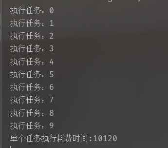
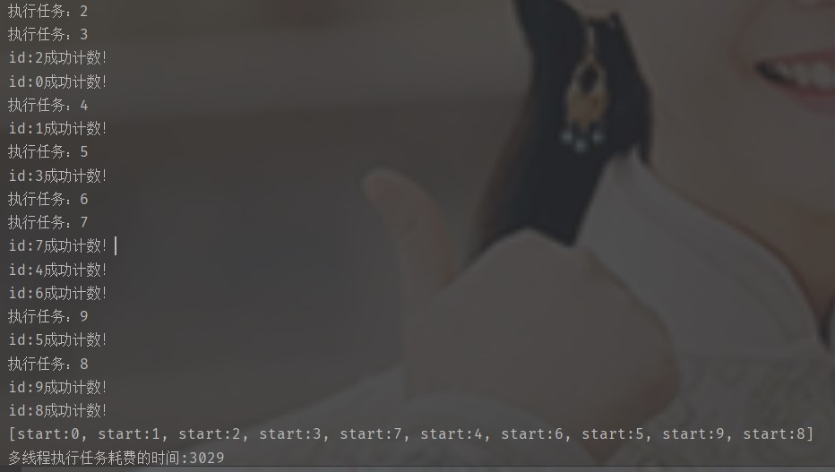
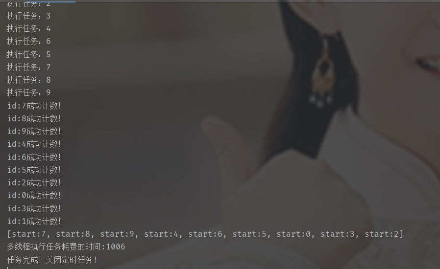
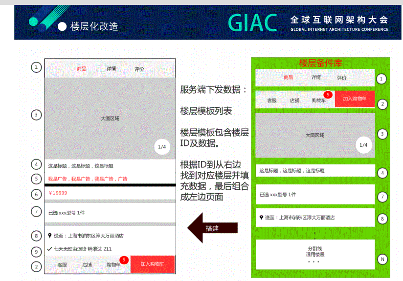

# 场景题  

## 大任务切分小任务多线程执行

* 把需要执行比较久的任务切分为小任务，各自任务的联系不紧密，执行完成后返回结果统一处理，加快响应速度。
* 例如需要统计过去一年的成绩的平均分各项指标，一年中考试次数非常多，如果直接统计需要的时间特别久，则可以分为 月 为单位去切分为小任务分别统计最后再进行汇总。

* 利用线程池并发执行多个任务
* 问题

1. 如何得知任务全部完成？
采用 juc 包中的 CountDownLatch 类去做计数器，当任务执行完成后会减一，统计的线程在任务为执行完成执行处于阻塞状态，等待全部完成后在运行。

2. 如果执行任务的线程挂了，那一直处于等待的状态怎么办？
提供补偿机制，后台执行一个定时任务，定时去检测哪些任务没有完成，发现则新建线程去执行任务(定时线程池+任务id)

3. 补偿机制导致重复执行相同的任务导致总任务提前完成怎么办?
这里涉及到一问题：一个任务只能累加一次，不能重复类加，所以可以利用任务的唯一id，在技术的时候去判断这个任务是否已经计数，采用的是继承技术类 CountDownLatch 重写 countDown 方法，用 HashSet 记录计数过的任务。

```java

public class CountDownLatchExtension<T> extends CountDownLatch {
    public CountDownLatchExtension(int count) {
        super(count);
    }

    private HashSet<T> set = new HashSet<>();
    /**
     * 在技术之前加上标识，防止一个任务多次计数
     */
    public void countDown(T id) {
        if(set.add(id)){
            System.out.println("id:" + id + "成功计数！");
            super.countDown();
        }else{
            System.out.println("id：" + id + "重复计数！");
        }
    }

    public void reset(){
        set.clear();
    }
}

```

```java

public class ThreadPoolTask {
    //用于存放任务执行返回结果
    public static final ArrayBlockingQueue<String> result = new ArrayBlockingQueue<String>(20);
    //计数器，用于统计任务完成的个数，作为结束的标记
    public static final CountDownLatchExtension<Integer> count = new CountDownLatchExtension<>(10);
    public static final ExecutorService executorService = new ThreadPoolExecutor(11,15,10, TimeUnit.SECONDS,new ArrayBlockingQueue<>(10));
    //定时任务线程池，用于故障的补偿
    public static final ScheduledExecutorService timeService = Executors.newScheduledThreadPool(5);


    public static void main(String[] args) throws ExecutionException, InterruptedException {
        executorService.execute(new PrintResult());
        timeService.scheduleAtFixedRate(new TimeTask(),1,5,TimeUnit.SECONDS);
        //原本有10个任务  这里只执行8个，剩下两个定时任务会作为补偿
        for(int i=0;i<8;i++){
            executorService.execute(new Task1(i));
        }
    }

    static class TimeTask implements Runnable{
        @Override
        public void run() {
            System.out.println("执行定时任务！！！");
            for(int i=0;i<10;i++){
                String key = "start:" + i;
                if (!result.contains(key))
                {
                    executorService.execute(new Task1(i));
                    System.out.println("补充任务" + i);
                }
            }
        }
    }

    //执行完成后，汇总结果
    static class PrintResult implements Runnable{
        @Override
        public void run() {
            long start = System.currentTimeMillis();
            try {
                //需要等待任务完成
                count.await();
            } catch (InterruptedException e) {
                e.printStackTrace();
            }
            System.out.println(result);
            System.out.println("多线程执行任务耗费的时间:" + (System.currentTimeMillis() - start));
            System.out.println("任务完成！关闭定时任务!");
            timeService.shutdown();
        }
    }

    static class Task1 implements Runnable{
        //任务的唯一标识符
        private int id;
        public Task1(int id){
            this.id = id;
        }
        @Override
        public void run(){
            System.out.println("执行任务：" + id);
            try {
                //休眠模拟逻辑处理
                Thread.sleep(1000);
                //任务执行完成后计数
                count.countDown(id);
            } catch (InterruptedException e) {
                e.printStackTrace();
            }
            result.add("start:" + id);
        }
    }
}
```

* 单个任务排队串行执行

```java
public class SingleTask {
    public static final ExecutorService service = new ThreadPoolExecutor(1,1,10, TimeUnit.SECONDS, new LinkedBlockingDeque<>());

    public static void main(String[] args) throws ExecutionException, InterruptedException {
        long start = System.currentTimeMillis();
        for(int i=0;i<10;i++){
            Future<Integer> result = service.submit(new Task1(i));
            //Future等待返回值是阻塞的
            result.get();
        }
        System.out.println("单个任务执行耗费时间:" + (System.currentTimeMillis() - start));
    }

    static class Task1 implements Callable<Integer>{
        private int id;
        public Task1(int id){
            this.id = id;
        }

        @Override
        public Integer call() throws Exception {
            System.out.println("执行任务：" + id);
            try {
                //休眠模拟逻辑处理
                Thread.sleep(1000);
            } catch (InterruptedException e) {
                e.printStackTrace();
            }
            return id;
        }
    }
}

```

* 效率的提升

1. 串行的方式消耗的时间大抵上等于每个任务的累加
 

2. 多线程并发执行收到线程池线程个数设置的影响(不考虑线程意外挂的风险)  

* 线程数 5  
 
* 线程数达到任务个数，可以接近每个任务耗费的时间
 

## 排查系统负载高原因

负载高->系统中活跃和不可中断进程平均数

### cpu使用率高

通过top命令查找占用CPU最高的进程PID；
通过top -Hp PID查找占用CPU最高的线程TID;
通过vmstat -n 1从系统角度查看cpu使用情况
打印调用栈信息分析

#### 现象、原因和解决办法

* 空闲cpu低，系统占用cpu比例大于用户占用cpu，cpu资源不足，扩容
* cpu使用率很高，集中在部分代码，排查是否有死循环，优化代码
* cpu使用低，load高->存在不可中断睡眠状态进程，例如硬件设备、文件IO操作完成等，阻塞了其他进程，等待执行任务越来越多，只能恢复依赖资源或重启解决
  * 通过ps -axjf命令查看是否存在D进程
  * 通过top命令查看CPU等待IO时间，即%wa；
  * 通过iostat -dx -m 1 10查看磁盘IO情况->指标含义
  * 通过sar -n DEV 1 10查看网络IO情况；

#### 现象、原因和解决办法

* 磁盘容量小，扩大磁盘
* 内存不足，扩大内存
* 优化程序io
[Linux系统中负载较高问题排查思路与解决方法](https://www.cnblogs.com/zhongguiyao/p/14101822.html)
[监控工具pprof](https://studygolang.com/articles/35913?fr=sidebar)

## 简单热点行更新优化

### 架构优化

[高并发库存秒杀场景，阿里巴巴数据库是这样应对的](https://zhuanlan.zhihu.com/p/134012175?utm_source=wechat_session&utm_medium=social&utm_oi=34821250220032)

### 数据库底层优化

#### 降低行锁冲突

* 热点更新性能瓶颈在于需要对数据加行锁，且锁必须等待事务完成后再释放

* 事务执行过程中binlog和redo写成本

##### 解决方案

* redo日志批量提交，丢失了怎么办？
* sql相同热点批量提交+自动提交事务语法
对于带有热点更新标识的SQL进入数据库后，数据库内部维护一个hash表，对于更新相同数据的SQL会放在hash表中的某一个队列中。一段时间后，针对这个队列中的SQL进行合并处理。
这种方案的优势非常明显：
只需进行一次二级索引和主键索引的扫描
只需获取一次这行数据的写锁，基本没有锁冲突
即使执行了多个update任务，但只有一次真正的数据更新操作、一次写redolog和binlog
要求：update操作必须放在事务最后，update成功后事物默认提交(因为数据库会合并sql操作，如果update成功了，但是事务后续操作失败了，回滚会存在问题)
* 行锁提前释放，记录redo逻辑日志，+1，-1，不记录undo日志，通过回放redo日志回滚事务
* 锁设置优先级，等待一定时间后主动kill其他优先级低的锁(c端业务优先级大于b端业务)

#### 上线效果 秒杀优化

##### 字节bytedndb

64c机器，256客户端并发
单行更新11.8wqps，11.8wtps
多行更新29.3wqps，
电商秒杀场景(SQL复杂)12.8wpqs，6.4wtps
带事务块秒杀8.6wqps，2.8wtps(insert+update)

##### 阿里PolarDB

32c
单行更新8wqps
多行更新12wqps，
[阿里热点行优化](https://help.aliyun.com/zh/polardb/polardb-for-mysql/user-guide/hot-row-optimization)

## 系统架构

[Redis内存优化-怎么用缓存支持千亿级数据](https://weikeqin.com/2023/06/24/redis-memory-optimization/#3-2-3-%E5%93%88%E5%B8%8C%E8%A1%A8-dict)

## 京东商品详情页面优化
* 接口协议从面向业务转为面向UI(页面静态化->数据静态化+页面模块形式)，减少前端迭代成本(不需要部署上线)，页面展示内容可配置，方便做AB实验。
 
[京东商品详情页技术实现](https://blog.csdn.net/hunci/article/details/50424760)
[京东App商详架构演进及实践](https://max.book118.com/html/2020/1018/8105112004003007.shtm)